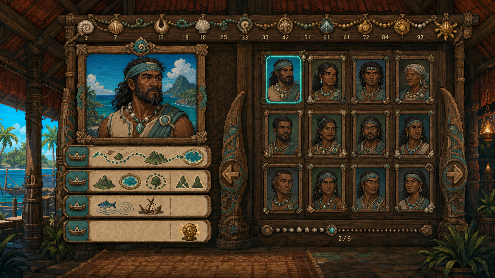
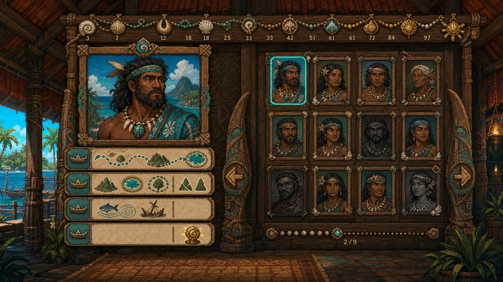
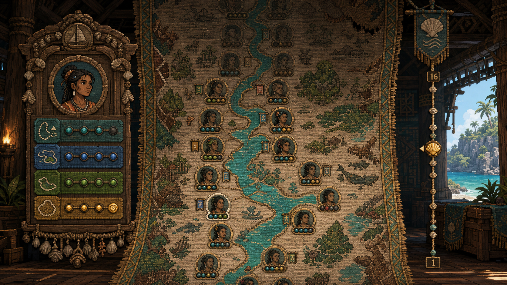
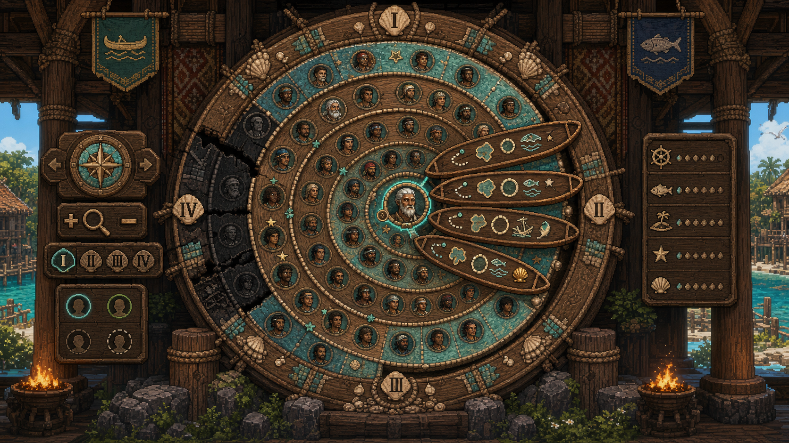
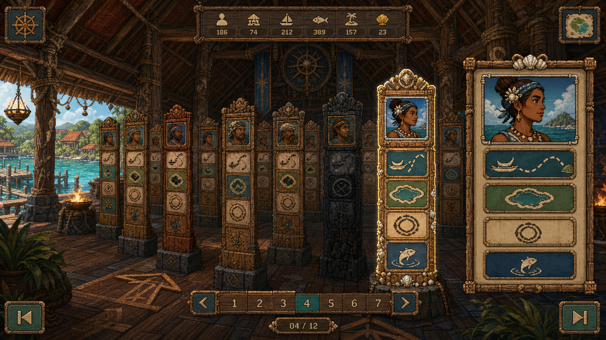

# Great Hall graphical concepts

These images are reference-only concept art for a graphical Great Hall. They do
not define runtime assets, navigator identity, gameplay state, or achievement
authority. Production art must enter the reviewed asset pipeline separately.

The concepts use `assets-src/gr1/home-island-source.png` and
`concept_art/wayfinders exploration ui concept sheet.png` as visual references.
The magenta source background is not part of the intended art direction.

The complete reference-art set for the eight implementation-backed
infographics is indexed in [infographics/README.md](infographics/README.md).

## Gallery

### A — Ancestor Wall (selected refined base)

This refinement replaces recognizable feathered styling from the first
generation with Wayfinders-specific sailcloth, shell, rope, sea-glass, timber,
and abstract navigation ornament. It is the visual base for the milestone
plan.

#### Initial A exploration (retained)

A fixed era wall presents twelve navigator portraits at once. Selecting a
portrait opens one larger likeness and four voyage bands. Canoe-prow arrows and
a knotted era track page through a large lineage without creating a nested
scroll region.

The composition was selected because it gives navigator portraits, voyage
symbols, loss state, and era navigation equal visual weight while remaining
practical for keyboard, pointer, responsive, and screen-reader presentation.
The initial image is retained to document the complete exploration and the
cultural-direction correction.

### B — Woven River of Generations

A continuous woven river makes chronology and accumulated age especially
clear. A scrub cord supports coarse jumps through a long lineage. Its main risk
is that individual portraits and voyage achievements become small, and smooth
scrolling through a very long tapestry is harder to make accessible.

The selected direction borrows this concept's fading, repairs, patina, and
knotted era-position cues.

### C — Spiral of Generations

A zoomable shell-inlaid spiral provides a memorable overview of many
generations. The selected navigator's four voyages fan out as canoe plaques.
The chronology is less immediately scannable, pointer targets shrink toward
the centre, and responsive and keyboard behavior would be comparatively
complex.

### D — Hall of Memorial Posts

Portrait posts create the strongest sense of physically walking through
history. Era alcoves bound the number of visible posts. The approach consumes
more screen space and risks turning a chronicle into spatial navigation.

The selected direction borrows this concept's material states: fresh paint for
the active navigator, warm patina for completed tenures, blackened cracks for
loss, and shell repair after a later wreck report confirms the navigator's
fate.

## Decision summary

| Criterion | A: wall | B: river | C: spiral | D: posts |
| --- | ---: | ---: | ---: | ---: |
| Navigator-picture readability | 5 | 4 | 3 | 5 |
| Four-voyage readability | 5 | 3 | 4 | 5 |
| Deep-lineage navigation | 5 | 4 | 3 | 4 |
| Minimal-text communication | 5 | 5 | 5 | 5 |
| Responsive and accessible implementation | 5 | 3 | 2 | 3 |
| Home-island fit and sense of history | 5 | 5 | 5 | 5 |

Scores use a five-point relative scale for this design decision, not an
implementation acceptance metric.

The milestone plan and full decision rationale are in
`docs/Wayfinders_Great_Hall_Presentation_Milestone.md`. The exact built-in image
generation prompts are retained in `PROMPTS.md`.
