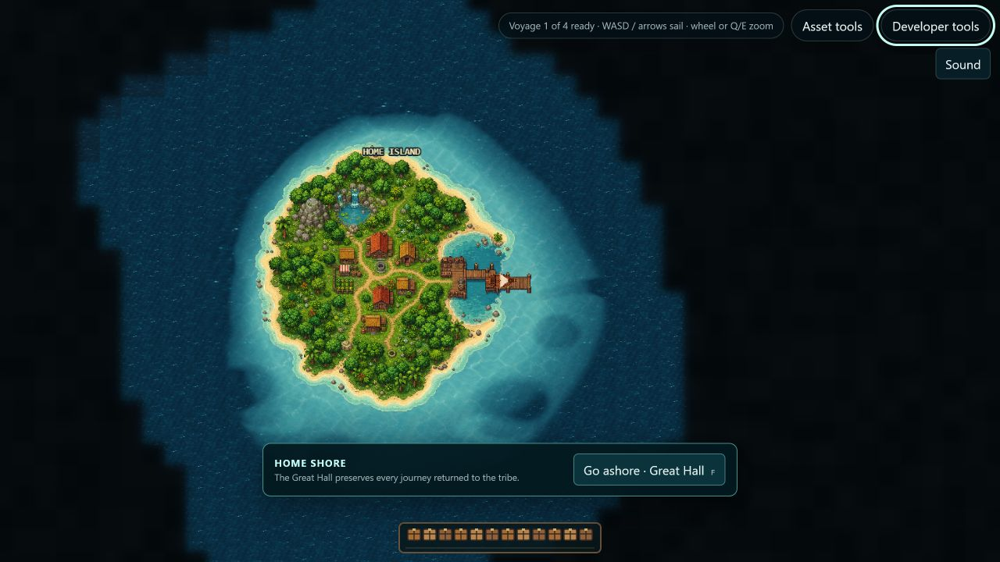
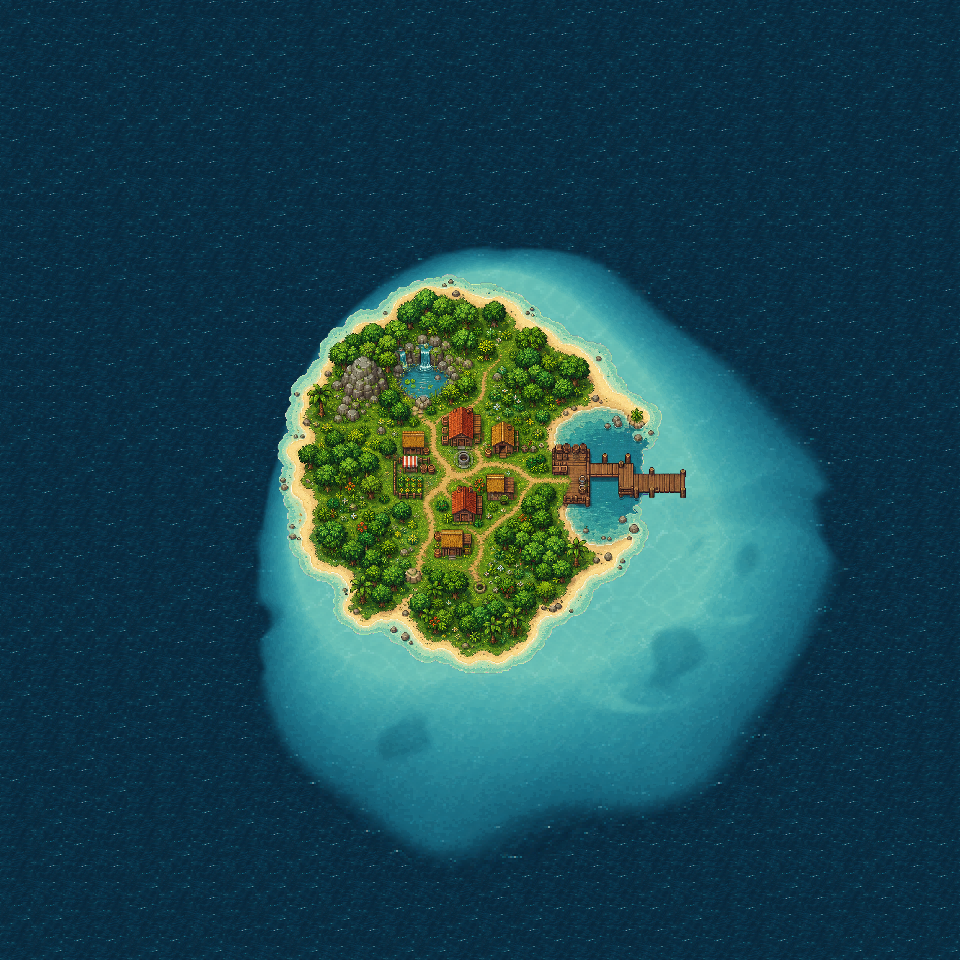
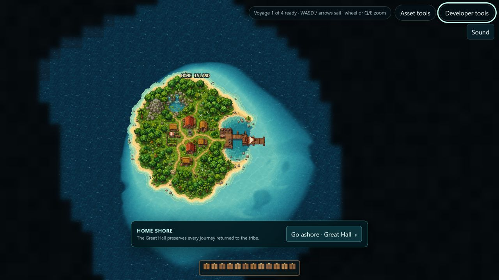
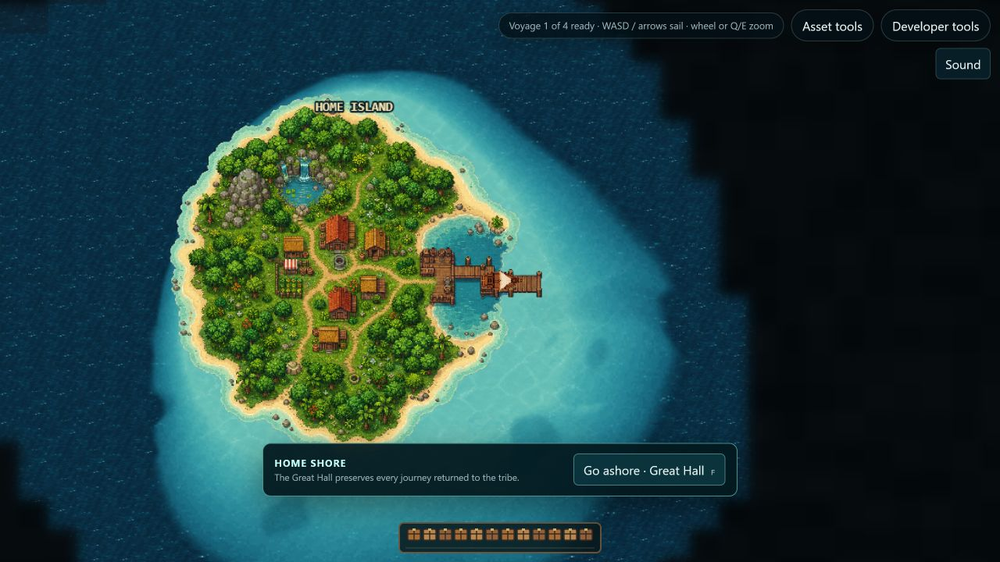

# Home-island shoreline comparison

This Home-only generated-water handoff is retained as superseded comparison
evidence. The current authored-composite implementation and seed `129` runtime
acceptance are documented in the
[`island-system-study` runtime comparison](../island-system-study/runtime/README.md).

All game captures use seed `13371` at the home dock with navigation guidance,
return guidance, and cloud atmosphere disabled. The screenshots preserve the
normal in-game fog of war and interface.

## Selected concept

The concept established the visual hierarchy: narrow water off the exposed
northwest shore; a broad, lobed bank through the east and south; a winding
harbor channel; and detached darker and lighter shelf features.

## First implementation checkpoint

This pass removed the square tile halo and introduced a continuous multi-stage
depth ramp. Comparison with the concept showed that a circular coverage fallback
still made the result read as a soft spotlight, so it was retained as evidence
but not accepted as final.

## Superseded Home-only implementation checkpoint

This deterministic package preview uses the same generated handoff frames as
the game, but removes fog and interface occlusion so the narrow northwest edge,
broad east/south bank, broken substrate, and complete outer blend can be
inspected together.

This prior pass let the generated authored bathymetry own both color and
silhouette. It
matches the deep-water color before its narrow outer alpha feather, shifts the
shelf southeast, keeps the rocky northwest reach tight, and uses broken reef,
sandbar, and channel features instead of a coastline-following band. The
deterministic build report in
[`../../assets-src/gr1/water/runtime/build-report.json`](../../assets-src/gr1/water/runtime/build-report.json)
records the generated transition checks.
