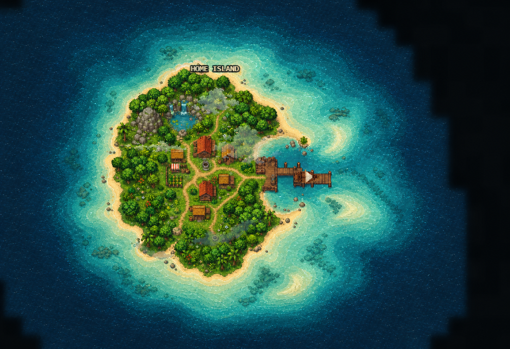
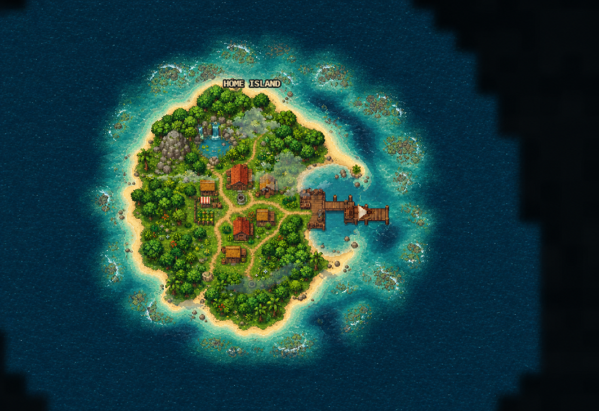
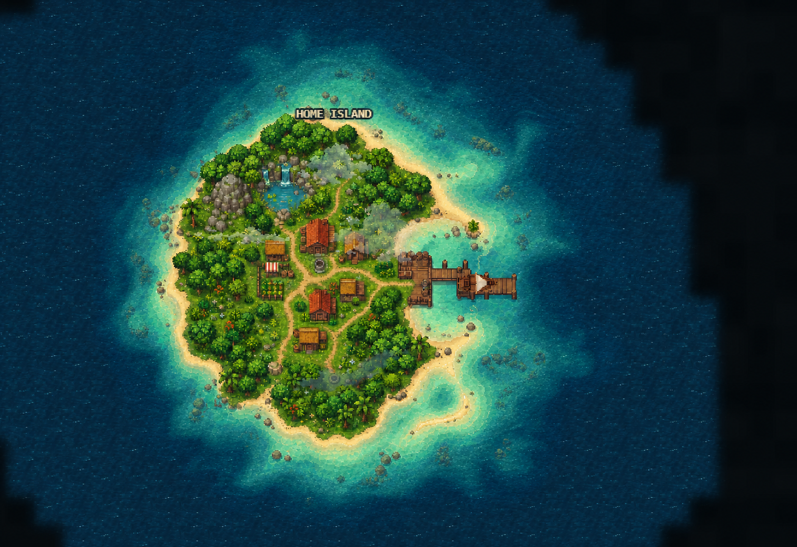

# Home-island shoreline concepts

These images are reference-only concept art for improving the home-island
deep-to-coastal water transition. They do not define terrain, collision,
navigation, or runtime asset authority.

The Home-only generated-water handoff documented here is superseded as runtime
direction. Current production islands use externally authored
`island-composite` images that carry land and their irregular water apron to a
deep-sea-coloured alpha fade; generated water remains the fallback outside the
claim and for procedural islands. Current live acceptance is recorded in the
[`island-system-study` runtime comparison](../island-system-study/runtime/README.md).

`reference-current-game.png` is the supplied before image. The three concepts
were generated with the built-in image-generation tool by changing only the
water around that composition. The exact prompts are retained in `PROMPTS.md`.

## Selected direction: A — Bahamian sand shelf

This direction is selected because it best combines a gradual color ramp with
an island-scale bathymetric shape that does not simply trace the coast. Its
broad sandy southern and eastern shelf, narrow exposed headlands, detached
sandbars and reef patches, and darker harbor channel give the water a coherent
geographic story while keeping the home island dominant.

The implementation target is the structure and transition quality, not a
pixel-for-pixel copy:

- at least five perceptible stages from seafoam through aqua and turquoise to
  blue-teal and deep navy;
- at least three-to-one variation between the broadest and narrowest shallow
  reaches;
- a darker, sinuous channel connecting the east harbor to open water;
- detached sand/reef patches that break any enclosing ring;
- continuous wave detail across depth zones; and
- no tile, chunk, axis-aligned opacity, or continuous contour boundary.

The retained superseded in-game comparison is documented in
[`COMPARISON.md`](COMPARISON.md). It remains useful evidence for why the selected
direction's asymmetric shelf and painted features moved into each island
composite instead of a Home-specific generated-water handoff.

## Retained explorations

### B — Broken fringing-reef lagoon

The broken reef and deep-water passes have a strong physical story, but the
outer reef is visually assertive enough to compete with the island and risks
replacing one obvious ring with another.

### C — Cove-led patchwork

The patchwork is the least uniform and has the strongest local variation, but
it weakens the cozy turquoise framing at the default map scale. Its hooked
sandbar and deep-water fingers remain useful secondary cues for direction A.

## Decision summary

| Criterion | A: sand shelf | B: reef lagoon | C: patchwork |
| --- | ---: | ---: | ---: |
| Gradual depth read | 5 | 4 | 4 |
| Non-uniform shelf silhouette | 5 | 4 | 5 |
| Home-island visual focus | 5 | 3 | 4 |
| Harbor/channel legibility | 5 | 4 | 4 |
| Fit with current water package | 5 | 3 | 4 |

Scores use a five-point relative scale for this design decision, not a runtime
acceptance metric.

## Visual references

The concepts use real bathymetric structure as inspiration rather than reusing
source-photo pixels:

- [NASA: Great Exuma Island](https://earthobservatory.nasa.gov/images/86651/great-exuma-island-bahamas) — dark tidal channels through a light sand shelf.
- [NASA: Little Bahama Bank](https://earthobservatory.nasa.gov/images/89060/little-bahama-bank) — swept sand forms and a broad protected bank.
- [NASA: Tidal Flats and Channels, Long Island](https://earthobservatory.nasa.gov/images/48159/tidal-flats-and-channels-long-island-bahamas) — branching deep-water channels through pale shallows.
- [NASA: Lagoons and Reefs of New Caledonia](https://science.nasa.gov/earth/earth-observatory/lagoons-and-reefs-of-new-caledonia-8948/) — progressive aquamarine-to-deep-blue depth cues.
- [NOAA Benthic Habitat Viewer](https://products.coastalscience.noaa.gov/bhv/) — patch reefs, scattered coral/rock in sand, and sand-channel morphology.
