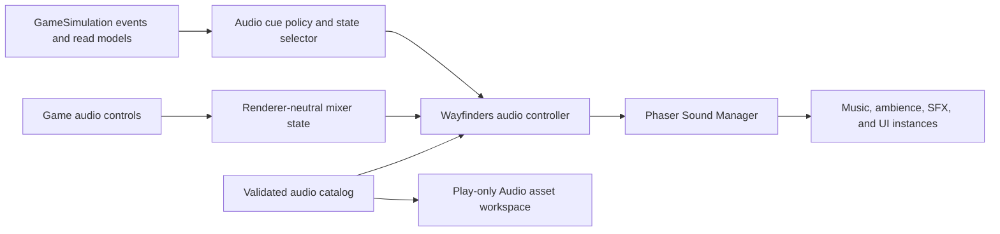

# Wayfinders audio-system proposal

Implementation is present through `AUD-1`; its live browser acceptance remains
to be recorded. Planning and authorization status for `AUD-2` through `AUD-5`
is owned only by `Wayfinders_Roadmap.md`.

This document owns the remaining audio design and acceptance criteria. Current
runtime behavior is owned by `Wayfinders_Technical_Design.md`; current code
ownership by `ARCHITECTURE_MAP.md`; stored-artifact and replacement contracts by
`Wayfinders_Asset_Pipeline.md`; and volatile `AUD-1` verification state by
`IMPLEMENTATION_STATUS.md`.

## Recommendation

Add audio as presentation, not gameplay authority. A small renderer-neutral
policy should translate existing committed events and visible read models into
audio intentions. A Phaser adapter should own loading, playback, game mixing,
unlocking, and cleanup. `GameSimulation` should not know which sound plays,
whether audio is enabled, or how a cue is mixed.

The audio track has five milestones:

1. `AUD-1` established the stored sound library, runtime catalog, play-only
   asset workspace, mixer, unlock flow, controls, diagnostics, and lifecycle
   boundary.
2. `AUD-2` adds ocean and vessel ambience driven by current presentation state.
3. `AUD-3` adds bounded gameplay and interface cues from existing typed events.
4. `AUD-4` adds two-state music and lifecycle transitions.
5. `AUD-5` produces the final sounds and music, overwrites the reference files
   at their stable runtime paths, completes browser acceptance, and closes
   production readiness.

This sequence produces useful sound early without making the simulation depend
on audio. It keeps every content change replaceable through an ordinary file
overwrite and adds no repository tool for creating or modifying audio.

## Investigation findings

### Existing repository seams

- The project uses Phaser `3.90.0` and already preloads shared presentation
  assets from `WayfindersScene.preload()`.
- `GameEventMap` is a complete typed source for committed discovery, survey,
  return, wreck, succession, and completion events. These events are suitable
  for discrete cues and do not need a second event bus.
- `WayfindersScene.bindSimulationEvents()` already performs presentation-only
  adaptation and coalesces related return events. Audio can follow the same
  subscription and cleanup pattern without changing authoritative ordering.
- Continuous audio cannot come only from discrete events. Wake level, ocean
  ambience, and music state should consume current ship pose, current knowledge
  at the ship, expedition/lifecycle state, and existing return-risk read models.
  They must not query hidden terrain or create a second simulation state.
- The current authored-asset pipeline is intentionally PNG-, layer-, animation-,
  and collision-oriented. Adding audio fields to its V1 package contract would
  couple unrelated lifecycles. Audio therefore has one separate checked-in
  catalog and stable runtime files.
- Game, asset-library, and isolated-trial modes share one application shell.
  Game audio is loaded only in game mode. The asset library receives one
  play-only Audio workspace that loads only the selected stored audio file and never
  starts gameplay ambience or music state.

### Browser and Phaser constraints

Phaser's Sound Manager selects Web Audio when available and falls back to
HTML5 Audio. It is global to the Phaser game rather than scoped to a scene, so
looping instances must be stopped and destroyed explicitly on scene shutdown.
Phaser exposes a global mute and volume plus individual sound configuration; a
portable category mixer should therefore compute effective per-instance volume
rather than depend on custom Web Audio nodes. See the official
[Phaser audio concept](https://docs.phaser.io/phaser/concepts/audio) and
[Phaser 3.90 Sound Manager API](https://docs.phaser.io/api-documentation/3.90.0/class/sound-basesoundmanager).

Audible playback is normally blocked until the user interacts with the page.
The implementation must expose the locked state, use an explicit user action to
enable audio, and treat a failed locked play as a normal state rather than an
error or a cue to replay later. See the
[MDN autoplay guide](https://developer.mozilla.org/en-US/docs/Web/Media/Guides/Autoplay).

Phaser accepts stored audio URLs and selects a supported media type. The fixed
library currently uses PCM WAV for the validated desktop-browser target. Every
final replacement must be decoded and loop-tested on those targets; changing
file format or adding alternate sources is a catalog-contract change rather
than an implicit content replacement. See the
[MDN audio codec guide](https://developer.mozilla.org/en-US/docs/Web/Media/Guides/Formats/Audio_codecs).

## Target extensions for remaining work

`ARCHITECTURE_MAP.md` is the canonical owner of current boundaries. Remaining
milestones may extend the existing seams only in these directions:

| Seam | Remaining extension | Constraint |
| --- | --- | --- |
| `src/wayfinders/audio` | add typed cue priority/cooldown and renderer-neutral ambience/music state selection | no Phaser objects, gameplay authority, or filesystem writes |
| `src/wayfinders/rendering/audio` | add long-lived ambience/music instances, crossfades, and bounded cue adaptation | no gameplay rules, hidden-world queries, or simulation mutation |
| `WayfindersScene` | pass current presentation-safe read models and bind existing typed events | no individual cue policy or sound-instance bookkeeping |
| Audio workspace | continue auditioning the shared stored files without new production controls | no upload, creation, editing, mixing, metadata writes, or gameplay state |
| `public/assets/audio` | receive final `AUD-5` bytes at existing paths | no source-production tooling or gameplay data |



Future audio work changes this ownership only through a coordinated architecture
decision.

## Runtime contract

This section specifies planned behavior for `AUD-2` through `AUD-4` on top of
the implemented foundation. `Wayfinders_Technical_Design.md` remains the
canonical owner of current mixer, unlock, control, and lifecycle behavior.

### Audio categories

The mixer has four categories:

| Category | Content | Initial category gain | Initial voice limit |
| --- | --- | ---: | ---: |
| Music | score loops and lifecycle music transitions | `0.42` | `2` during a crossfade |
| Ambience | ocean bed and speed-controlled wake | `0.55` | `3` |
| SFX | discoveries, surveys, returns, wrecks, and completion accents | `0.75` | `8` |
| UI | confirm, cancel, toggle, and dialog actions | `0.60` | `2` |

Initial master gain is `0.80`. A sound's effective gain is:

```text
master gain × category gain × catalog base gain × transition gain
```

All values are presentation configuration, clamped to `[0, 1]`, and have no
place in `prototypeConfig`, which owns gameplay tuning. These numbers are a
starting mix for acceptance, not loudness certification.

The controller owns at most fifteen simultaneous voices across all categories.
When a category reaches its limit, policy rejects the newest low-priority cue
or replaces the oldest equal-or-lower-priority cue. It never creates an
unbounded pool. Music and ambience keep explicit long-lived instances; one-shot
helpers may self-destroy only after the controller has accounted for them.

### Unlock and user control

- The game begins in a visible `sound unavailable until enabled` state when the
  browser reports the Sound Manager as locked.
- **Enable sound** is an explicit DOM button in the game controls. Activating it
  attempts unlock. `AUD-2` and `AUD-4` reconcile their current ambience/music
  layers only after a successful unlock.
- Events that occurred while locked are not queued or replayed. After unlock,
  continuous layers reconcile to current state and the next eligible one-shot
  plays normally.
- Master mute plus independent music, ambience, SFX, and UI levels are exposed
  in the same screen-space control ownership as the existing game UI. Controls
  remain keyboard accessible and report exact values.
- Audio controls are in-memory for `AUD-1` through `AUD-5`. Cross-session
  preference persistence would be a separate explicit decision; it must not
  become an incidental gameplay-save seam.
- Sound is supplementary. Every discovery, danger, return, failure, and action
  remains readable through existing visual and semantic UI without audio.
- Blur uses Phaser's pause-on-blur behavior. Focus reconciliation resumes only
  current loops; it does not replay one-shots missed while the page was hidden.

### Discrete cue policy

Events emitted synchronously by one authoritative transaction are collected
until the current microtask boundary, then reduced by priority. This prevents a
survey that discovers an idol, or a return that also completes a tenure and the
game, from producing a pile-up of independent stings.

| Source | Default audio intention | Coalescing rule |
| --- | --- | --- |
| Direct accepted UI action | `ui.confirm`; `ui.cancel`; `ui.toggle` | At most one UI cue per action |
| `islandSighted`, `surveySiteSighted`, `fishingShoalSighted`, `wreckDiscovered` | `sfx.discovery` | Stable entity lifecycle already prevents repeated first-sighting spam; controller adds a short global cooldown |
| `islandDossierSurveyed`, `surveySiteSurveyed`, `fishingShoalSurveyed`, `wreckSurveyed` | `sfx.survey-complete` | Suppressed when a higher-priority idol discovery occurs in the same transaction |
| `idolLocationDiscovered` | high-priority `sfx.discovery` | Replaces ordinary discovery/survey cues in the same transaction without requiring another file |
| `expeditionReturned` | `sfx.dock-return` | Returned feature-record events do not each play another cue |
| `shipReplenished` with reason `dock` | `sfx.dock-return` | Used only when no expedition return already owns the transaction |
| `navigatorTenureCompleted` | succession accent in `AUD-4` | Layers with or replaces ordinary return according to music priority |
| `gameCompleted` | final-location completion transition in `AUD-4` | Highest return-transaction priority |
| `shipWrecked` | `sfx.wreck` | `expeditionFailed` does not play a second failure cue |
| `provisionConsumed`, `shipEnteredTile`, `knowledgeChanged`, `returnStateChanged` | no one-shot | High-rate state informs visuals or continuous audio only |
| `shipTeleported`, `worldRegenerated` | no celebratory cue | Reconcile or stop loops; developer actions are not gameplay achievements |

Each one-shot family declares priority, cooldown, maximum simultaneous voices,
and whether a newer cue replaces or rejects. The pure cue-policy tests use
ordered event batches and a fake clock; no test needs to decode audio.

### Continuous ambience

The ocean bed is a low, non-positional loop. The wake loop is multiplied by a
smoothed normalized absolute ship speed and reaches silence at rest. Direction
changes must not restart it. The first implementation does not add surf emitters
to every island, wind simulation, weather, occlusion, or positional landmark
audio.

Continuous state may use only information already available to presentation:
current ship pose and speed, current tile, current visibility/knowledge at the
ship, exact-dock/lifecycle gates, and published risk/read-model state. It must
not sample an unseen island, inspect hidden blockers, scan the world, or infer a
route. Audio can reinforce current knowledge but cannot reveal future terrain.

Updates perform no allocation in a stable frame. The controller changes a gain
only when its target differs by a declared epsilon and advances fades on the
scene clock. Scene shutdown stops loops, removes Sound Manager listeners, and
destroys owned sound instances even though the manager itself is global.

### Music state

`AUD-4` begins with two score states:

- **Home harbor** for the exact dock, home interaction, and quiet Supported
  water near the start of a voyage; and
- **Open water** while an expedition is active outside Supported water.

The selector publishes a small state ID only when its inputs change. It does
not expose exact simulation data to the music adapter. State changes crossfade
over `1.5` seconds by default. Re-entering the same state keeps the current
loop; it never restarts on a stable frame.

Wreck, succession, exact return, and game completion may temporarily duck music
behind their high-priority cue, then reconcile to current state. A separate
danger track, generative score, beat-synchronized stems, or music based on
unseen discovery proximity is out of scope until playtesting justifies it.

## Asset contract dependency

The canonical current stored-library, metadata, replacement, validation-budget,
and play-only workspace contract is in `Wayfinders_Asset_Pipeline.md`. Remaining
milestones preserve the stable runtime IDs and paths. `AUD-5` replaces the
reference WAV bytes in place; it does not add a second production directory or
require a loader change. Cue priority, cooldown, transaction coalescing,
continuous-state selection, and music transitions remain presentation policy,
not catalog metadata.

## Milestones

### AUD-1 — Audio foundation, unlock, and controls

Implemented, with live browser acceptance pending. Current behavior and
ownership are documented by the technical design, architecture map, and asset-
pipeline guide. The current roadmap owns the remaining acceptance follow-up.

### AUD-2 — Sailing ambience

Deliver:

- the catalog-owned `ambience.ocean` and `ambience.wake` loops;
- a renderer-neutral ambience target derived from current pose and current
  presentation-safe state;
- smoothed wake gain, start/stop hysteresis, focus reconciliation, and mute
  reconciliation; and
- bounded diagnostics for active ambience voices and target/current gain.

Acceptance gate:

- Tests cover rest, forward/reverse speed, direction changes, wreck hold,
  teleport, regeneration, unlock after movement has begun, and return to dock.
- Identical continuous inputs create no sound instance, listener, timer, or
  collection allocation on stable updates.
- Hidden obstacles and unseen islands cannot change an ambience target.
- Browser acceptance hears an inaudible wake at rest, a smooth rise under
  motion, no restart at direction reversal, and no loop seam over ten repeats.
- The total ambience voice count never exceeds three.

### AUD-3 — Gameplay and interface cues

Deliver:

- pure event-batch-to-cue policy with priority, cooldown, and replacement;
- discovery, survey, exact-return, wreck, confirm, cancel, and toggle families;
- high-priority idol discovery using the catalog's discovery sound, derived
  from the same transaction batch;
- scene subscriptions through the existing `GameEvents` instance; and
- diagnostics containing only recent bounded cue decisions, never decoded
  audio buffers or authoritative mutation.

Acceptance gate:

- Contract tests cover every source row in the discrete cue table.
- Integration tests prove an idol survey produces one high-priority cue, an
  ordinary survey produces one survey cue, a completed-tenure return does not
  pile up record-return cues, and wreck produces one failure cue.
- High-rate tile, provision, knowledge, and return-state events never create
  one-shots.
- Cooldown and voice-cap sweeps remain deterministic under the fake clock.
- All sound-reinforced actions retain equivalent visible and semantic feedback
  with master mute enabled.

### AUD-4 — Adaptive music and lifecycle transitions

Deliver:

- renderer-neutral home-harbor and open-water music-state selection;
- the two catalog music bindings and bounded crossfade ownership;
- music ducking/return for wreck, exact return, succession, and completion;
- completion priority consistent with the current lifecycle gate; and
- replacement-safe catalog binding so final music can change without gameplay
  or cue-policy changes.

Acceptance gate:

- State-selector tests cover dock, Supported departure, expedition start,
  return, wreck hold, handover, completion, Continue, and Start new game.
- A stable state never restarts or reallocates a loop.
- Rapid state changes leave no orphan loop and never exceed two music voices.
- Completion and succession in the same return transaction follow current
  completion priority and reconcile after the modal action.
- Browser acceptance confirms smooth crossfades, intelligible high-priority
  cues, pause/focus behavior, and ten seam-free repetitions per loop.

### AUD-5 — Production audio and closure

Deliver:

- final, product-ready music, ambience, sound-effect, and UI WAV files for every
  catalog entry;
- replacement of the reference WAVs at the existing `public/assets/audio/v1`
  paths without changing runtime IDs, paths, categories, or loader code;
- product-owner audition and approval through the play-only Audio workspace;
- read-only catalog/file validation in the full repository gate;
- final default game mix, category ranges, stored-library budget, and browser
  acceptance records; and
- current-state updates to the architecture map and technical design plus
  durable acceptance evidence in the roadmap archive.

Acceptance gate:

- Every catalog entry resolves to its final stored WAV at the already-integrated
  path, and both the Audio workspace and game decode the same bytes.
- Replacing each reference file requires no TypeScript, JSON, or loader change.
- Missing, corrupt, unsupported, or undecodable files fail gracefully to a
  no-audio state without blocking gameplay startup.
- Stored size, load, decode, active-voice, stable-frame, and teardown
  measurements meet the declared budgets on validated desktop-browser targets.
- Default and maximum control mixes do not clip during the worst accepted cue,
  ambience, and music overlap.
- Music and ambience loop seamlessly for ten consecutive repetitions; every
  one-shot starts responsively and ends without an audible cut.
- No audio synthesis, editing, mixing, encoding, upload, or repository-write
  tool is added as part of production delivery.
- Keyboard and screen-reader acceptance confirms controls and all reinforced
  information remain usable with sound disabled.
- `npm.cmd run check`, browser acceptance, and a final repository diff/status
  review pass before the milestone is archived.

## Product decisions for remaining milestones

1. Approve, revise, or reject the restrained palette represented by the
   reference files: wooden percussion, soft bells, low pads, and abstract
   surf rather than orchestral or cinematic scoring.
2. Decide after `AUD-4` playtesting whether music should remain two-state or
   earn a separate risk/danger layer. The initial milestones should not infer
   danger from hidden world state.
3. Decide separately whether audio preferences may persist across refresh.
   The implemented foundation keeps them in memory to avoid expanding the
   current persistence boundary incidentally.

## Explicitly deferred scope

- spoken narration, voice acting, and localization-specific audio;
- weather simulation, dynamic wind, and per-island surf emitters;
- HRTF or general positional-audio infrastructure;
- audio-driven gameplay timing or rhythm mechanics;
- repository tooling for recording, synthesis, waveform editing, trimming,
  normalization, encoding, mixing, or DAW integration;
- generative music, middleware, or a universal asset-pipeline rewrite;
- preference persistence or any gameplay save/load behavior; and
- asset-library upload, metadata editing, review, promotion, or repository
  replacement operations for audio.
