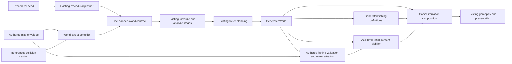
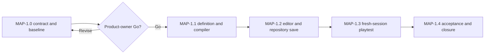

# Wayfinders authored-map editor milestone

Status: proposed on 2026-07-20. This document does not authorize
implementation.

This document owns the detailed unimplemented design and acceptance criteria
for `MAP-1`. `Wayfinders_Roadmap.md` owns planning, sequencing, and
authorization status. Implemented behavior belongs in
`Wayfinders_Technical_Design.md`, current ownership belongs in
`ARCHITECTURE_MAP.md`, asset and repository-transaction contracts belong in
`Wayfinders_Asset_Pipeline.md`, and completion evidence belongs in
`Wayfinders_Roadmap_Archive.md`.

## Recommendation

Add a developer-only **Maps** workspace for creating repeatable playtest
worlds by placing available authored islands and fishing shoals. A saved map is
a checked-in initial-world definition. Opening or saving it is local repository
authoring; playtesting it always constructs a fresh `GameSimulation` and never
serializes or restores voyage progress.

Procedural generation remains the default and remains available unchanged. An
authored map is selected only through an explicit map ID and content
fingerprint, normally from the workspace's **Playtest map** action. Both
sources must converge on the
same rasterization, analysis, water, navigation, feature, and presentation
pipeline.

Use the terms **Open map definition**, **Save changes**, and **Playtest map**.
Do not label these operations **Load Game** or **Save Game**. A whole-world
`authored-map` source is also distinct from an `authored` island asset within a
procedural or authored world.

## Intended outcome

`MAP-1` is successful when a developer can:

1. create or duplicate a map definition for the current normal-game world;
2. place, select, move, and remove available authored islands on the wrapping
   tile grid;
3. place, move, remove, and assign lean, steady, or rich quality to fishing
   shoals;
4. see Home, the departure corridor, channel clearances, periodic aliases, and
   invalid placements while editing;
5. undo, redo, discard, reopen, and atomically save the definition;
6. start a fresh full-game playtest from the exact saved map fingerprint; and
7. return to ordinary procedural play without changing its seed-derived output.

The editor is intentionally a layout tool, not a general world painter. Home,
the dock, Supported water, water presentation, dossiers, survey sites, idol
hosts, and other derived content continue to use existing semantic systems.

## V1 product contract

The following focused V1 contract is the recommendation submitted for
`MAP-1.0` approval. That milestone validates it with one small workflow
prototype and records the explicit product-owner Go before later milestones
proceed.

| Decision | V1 contract |
| --- | --- |
| World shape | One dedicated authored-layout contract derived from the current normal-game settings: current dimensions, tile/chunk scale, and two-axis wrapping topology only |
| Home | The authored Home island, dock, return tile, Supported-water boundary, and protected eastbound departure corridor remain fixed and visible but not editable |
| Island palette | One or more non-home island instances, with no fixed upper count, using currently available authored-island assets; assets are reusable by distinct stable instances; no procedural-island editor controls and no procedural shortfall |
| Island transform | Canonical tile-centre placement only; authored art and collision keep their prepared orientation and scale |
| Fishing shoals | Any number that fit the semantic and spatial rules; explicit canonical tile and quality; stable ID and semantic clue are materialized in the saved definition, and the service anchor is always the same tile |
| Other content | Derived deterministically from the saved base seed and compiled terrain through existing systems |
| Restart behavior | Refresh, developer restart, and authored-mode **Start new game** construct fresh state from the same map ID and content fingerprint; switching to procedural play is explicit |
| Persistence | Checked-in map definitions only; no ship, knowledge, provisions, expedition, lineage, survey, wreck, Prosperity, route, animation, or UI state |
| Authoring host | A dedicated Maps scene in the existing developer workspace shell, not another branch in `AssetViewerScene` and not a running game scene |

The map must contain at least one non-home island because current world
landmarks and completion content require a valid non-home layout. Save and
playtest remain unavailable until the complete compiled world satisfies every
mandatory invariant.

Capacity is therefore derived from fit, not a number in the editor. An add or
duplicate command may reject a candidate only because the resulting layout
breaks a semantic, spatial, identity, or compatibility invariant--never because
an island or shoal array reached a fixed product count. The fixed finite world
and its clearance/separation rules provide the natural capacity.

`MAP-1.0` must record a conservative cardinality proof from the fixed tile
count, topology, minimum island footprint/channel, and shoal-separation rules.
Every identifier, parser, serializer, request, and runtime collection range must
exceed that proven geometric capacity. If an existing range does not, `MAP-1.1`
widens it while keeping every existing procedural identifier valid.

## Authored map definition

Create one strict, JSON-compatible `AuthoredMapDefinitionV1` envelope owned by
app-level map composition. It contains a world-owned
`AuthoredWorldLayoutV1` and a fishing-owned `AuthoredFishingLayoutV1`. The
app-level codec composes those public contracts, canonical serialization,
source fingerprinting, and cross-feature viability without making `world`
import feature code.

The envelope is an editable source definition, not a serialized `WorldGrid`
and not a replacement for `WorldManifestV2`. Compilation produces the ordinary
manifest and runtime inputs.

The definition contains:

- `formatVersion: 1`;
- an immutable 1-through-64-byte lowercase ASCII stable map ID matching
  `[a-z0-9]+(?:-[a-z0-9]+)*`, and an editable display name limited to 80 Unicode
  scalar values and 320 UTF-8 bytes;
- a canonical content fingerprint;
- an authored-layout contract version, dedicated layout-settings fingerprint,
  exact dimensions/topology, generator/content contract versions, and base
  seed;
- stable positive numeric island source IDs, authored asset IDs, exact asset
  revisions, and canonical centres; and
- semantic fishing-shoal entries with stable current-version IDs, canonical
  tile, quality, and clue.

V1 contains no unbounded user-authored string. Stable IDs use the restricted
form above, fingerprints and versions have fixed forms, asset IDs/revisions are
resolved from validated catalogs, and materialized clue fields retain their
feature-owned bounds. These are input-safety limits, not placed-object limits.

The dedicated layout-settings fingerprint covers only normal-game inputs that
can affect fixed Home/Supported water, authored-island rasterization and
clearance, navigation validation, water planning, or downstream initial
content. It does not reuse the named benchmark profiles or include
procedural-only island selection, weighting, or placement-attempt settings.
`MAP-1.0` locks the exact fingerprint inventory before implementation.

Arrays serialize in stable-ID order. Each island's saved positive numeric
`sourceId` becomes `GeneratedIsland.id` and each
`WorldManifestV2.islands[].sourceId`; the manifest's stable island ID is
derived from that value. The authored asset ID is provenance, not instance
identity. The lowest numeric island source ID owns any required deterministic
hidden-landmark role, and deleting one placed object never renumbers surviving
IDs. Multiple island instances may reference the same `authoredAssetId`; each
keeps a distinct `sourceId` and derived stable manifest ID while sharing the
asset's collision and presentation data. The codec uses exact-key validation,
canonical JSON, and recursively frozen normalized output. Any defensive
structural or byte bound must be sized above the greatest layout that can pass
the fixed world's geometric rules, so it never becomes a product count limit.
Unknown versions or fields fail with an actionable JSON path.

The content fingerprint covers the normalized semantic payload and referenced
input revisions, excluding the fingerprint field itself. Monotonic repository
revision is catalog metadata and is not stored in or hashed with the immutable
definition bytes. A public fishing-owned constructor deterministically
materializes a new shoal's semantic clue from the base seed and stable shoal ID.
Moving the shoal, changing its explicit quality, or changing another object
does not reroll that saved clue. Compilation always derives and requires
`serviceAnchor === tile`.

Authored-island collision is not copied into each map file. The compiler
resolves the referenced asset through the validated available-island catalog
and requires its exact saved revision. A missing, unavailable, or
revision-mismatched collision source blocks compilation; it must never fall
back to another island or silently generate a procedural replacement.
Presentation may retain its existing coherent developer-graphics fallback
after collision authority has been resolved successfully.

Application composition builds matching map-scoped collision and presentation
catalog projections containing each unique referenced island asset once. Any
number of placed instances may resolve through that entry. The projection
revision is a deterministic fingerprint of those entries, so adding or changing
an unrelated available island does not invalidate or alter the map. The world
compiler consumes only the renderer-neutral collision projection; presentation
receives its sibling projection through the existing one-way seam.
For an authored source, that projection is deliberately the catalog supplied
to world generation and `WayfindersScene`, so the manifest's
`authoredIslandCatalogRevision` matches both siblings. Procedural sources
continue to receive the complete available catalogs exactly as they do now.

## Source and compilation boundary

Add an explicit source union at application composition:

```text
procedural source = seed + current validated configuration
authored source   = validated map envelope + exact referenced-island catalog projections
```

The source is normalized before live state exists. A failed parse, catalog
resolution, compilation, or validation cannot partially replace an editor
preview or `GameSimulation`.



The composed authored-map compiler must:

1. validate the complete definition and its compatibility with the current
   authored-layout settings fingerprint and generator/content contracts;
2. ask the world-owned compiler to resolve each island's collision geometry,
   derive planned-island/periodic/landmark facts, and call the existing
   rasterize, global-ocean, analysis, and water stages;
3. ask the fishing-owned materializer/validator to create the exact definitions
   against that completed semantic world, with no authored-map count cap and
   `serviceAnchor === tile`;
4. at app composition, generate the ordinary island-dossier, survey-site, and
   idol-host definitions needed to prove the map can satisfy current completion
   and mandatory service-anchor contracts; and
5. publish `GeneratedWorld`, compiled `WorldManifestV2`, fishing definitions,
   matching referenced-island catalog projections, and a
   `WorldSourceIdentityV1` carrying the map ID, content fingerprint, layout
   contract/fingerprint, and referenced-catalog revision.

The world compiler never imports fishing, dossiers, survey sites, or idol
contracts. The fishing owner never compiles terrain. Cross-feature viability
and the complete envelope codec belong at app composition, where those
one-way dependencies already converge.

`GameSimulation` should choose generated fishing definitions for a procedural
source and the existing explicit-definition fishing factory for an authored
source. All sighting, surveying, return, Prosperity, traffic, spatial-index,
renderer, audio, and event paths then consume their existing contracts without
an authored-map branch.

Do not save live terrain, knowledge, collision, visibility, island/resource
arrays, analysis indices, derived routes, water textures, or Phaser objects.
They are rebuilt from the selected source for every fresh session.

## Validation contract

The same pure compiler and validators serve the editor, repository save
service, and game startup. The browser never becomes the sole enforcement
point.

### Structural and compatibility validation

- supported envelope, authored-layout, generator, and content versions;
- exact two-axis wrapping topology, dimensions, scale, and dedicated
  layout-settings fingerprint;
- stable unique map ID, positive numeric island source IDs and their derived
  manifest IDs, and current-version fishing-shoal IDs, with allocator/parser
  ranges that cannot exhaust before the fixed world's placement rules do;
- at least one island, no fixed upper island or shoal count, and canonical
  integer tile coordinates;
- exact current authored-island asset ID and revision; and
- valid saved fishing quality/clue inputs for the feature-owned materializer.

### Island and world validation

- Home clearance and the protected departure corridor;
- exact authored collision bounds and strictly smaller-than-world periodic
  footprints;
- seam- and corner-aware island separation and minimum channels;
- repeated authored-asset references are valid when every placed instance has a
  distinct source/stable ID and resolves the same exact asset revision;
- deterministic, non-overlapping island identity and rasterization;
- required passable approaches and the existing global-ocean/winding-cycle
  contract; and
- enough valid downstream dossier/survey-site hosts for the configured
  completion catalog.

Extract or expose the current headless placement rules from the world owner.
The editor must not reimplement approximate geometry in UI code.

### Fishing-shoal validation

- the tile is navigation-passable ocean in the dock's connected component, and
  the materialized service anchor equals that tile;
- the tile contains no island or resource identity;
- the current Home exclusion and inter-shoal separation rules hold through
  minimum-image distance;
- IDs and coordinates are unique; and
- the exact saved quality and clue form a valid current semantic definition.

Extract public pure authored-shoal clue construction, materialization, and
placement validation from the fishing owner. Authored definitions do not reuse
the procedural generator's default count as a cap. Reuse the existing Home
exclusion and separation rules. Do not make sprite bounds, water colour, fish
pixels, or editor overlays authoritative.

Errors block save and playtest and identify the object and rule. Warnings may
describe unusual but valid balance choices, such as all shoals on one side of
the world, but may not downgrade a current gameplay invariant.

Structural opening is separate from playable compilation. A current-format map
whose settings or island references are stale still opens as a complete draft
with blocking diagnostics. If the same available asset ID has a newer revision,
an explicit undoable **Adopt current island revision** command updates that
reference and recompiles the real collision; a missing or unavailable asset
must be removed or replaced. An explicit undoable **Adopt current layout
contracts** command updates a current-format draft's layout-settings,
generator, and content contract identities, preserves its semantic placements,
rebuilds every derived fact, and reports any resulting placement or viability
errors for manual correction. Save and playtest remain disabled until the draft
is valid. Unsupported map formats do not receive an implicit migration path and
must be recreated under the current format.

## Editor workflow

Register a dedicated `map-editor` workspace scene through the existing
workspace registry and scene factory. Follow the focused workspace lifecycle:
permanent left library, centre preview, right workbench, independently
scrolling controls, one `AbortController`, and complete DOM/Phaser teardown on
workspace switch.

Do not add the editor to the already broad `AssetViewerScene`. The workspace is
a host for world-authoring presentation; it does not make map definitions asset
packages or move their schema/compiler into the asset subsystem.

### Left library

- list checked-in map definitions with saved/invalid/stale status;
- create a new definition from the current V1 authored-layout settings
  snapshot;
- duplicate a saved definition under a new stable ID;
- open one definition at a time; and
- expose reusable available authored islands plus one fishing-shoal placement
  tool.

Browser deletion, stable-ID rename, portable import/export, and bulk map
operations are deferred. Git remains the recovery and manual removal path.

### Centre preview

- render the fixed Home/dock and the actual authored-island presentation over
  semantic generated water;
- pan, zoom, fit, and toggle grid/validation overlays;
- place and drag on canonical tile centres;
- show translated ghost copies at wrapping seams and corners while retaining
  one canonical selected object;
- show Home exclusion, departure corridor, island-channel clearance,
  impassable shoal cells, and exact conflicts; and
- distinguish the selected object, unsaved draft, warnings, and blocking
  errors without relying on colour alone.

Dragging uses a cheap ghost and local diagnostics. The complete compiler runs
after a committed drop, undo/redo, open, save preparation, or a short idle
debounce; it may not rebuild an area-sized world every pointer-move frame.

Fit view uses one compact derived semantic terrain/water texture plus indexed
placed objects; it does not allocate the production water renderer's two
canvases for every canonical world chunk. Closer inspection uses a
viewport-bounded preview with performance budgets set in `MAP-1.0`, not an
authored-object count cap. Full production water, fog, and active-chunk behavior
are verified through **Playtest map**, not duplicated in the authoring scene.

### Right workbench

- map name, immutable stable ID, base seed, catalog repository revision,
  content fingerprint, and source status;
- selected-object identity, canonical coordinates, asset revision, or shoal
  quality;
- explicit **Adopt current island revision** for a selected or all resolvable
  stale references;
- explicit **Adopt current layout contracts** for a structurally open
  current-format draft;
- undo, redo, remove selection, and discard/reopen actions;
- actionable validation summary linked to affected objects;
- one guarded **Save changes** action; and
- **Playtest map**, enabled only for a valid, currently saved content
  fingerprint.

The pure draft model owns commands, stable IDs, dirty state, undo/redo, and
selection-independent validation results. Phaser sprites and DOM elements are
views only. The editor preview never constructs or mutates a live
`GameSimulation`; **Playtest map** hands the saved source to normal game
startup.

The workspace registers a dirty-draft navigation guard with the shell. Tab
switches, browser history, page navigation, and refresh require an explicit
discard decision while dirty; cancelling retains the pure draft and command
history. Scene shutdown still releases all DOM/Phaser resources. No draft or
undo history is persisted after a confirmed discard or page unload.

## Repository and launch contract

Store checked-in definitions under a dedicated public map directory with one
versioned, stable-sorted catalog and immutable content-addressed revisions, for
example:

```text
public/maps/catalog.json
public/maps/v1/<stable-map-id>/<content-fingerprint>.map.json
```

Each catalog entry owns the map's monotonic repository revision, current content
fingerprint, and retained fingerprint list. Definition files own immutable
semantic bytes and their self-excluding content fingerprint; they do not own
the repository revision.

The browser posts a size-checked same-origin request containing semantic map
data, the stable ID, expected catalog revision, and expected current map
repository revision--never a filesystem path. A create/duplicate request
supplies no prior map revision and requires the stable ID not to exist. Under
the shared repository lock, the development-server service re-reads the disk
catalog and the current disk-backed island availability/revisions, checks both
optimistic tokens, compiles the submitted definition, and computes its canonical
content fingerprint. The security byte bound must admit the greatest definition
that can fit and validate in the fixed world; it is not an island or shoal count
limit. The service may not validate against a module-time asset snapshot.

`MAP-1.0` derives that request bound conservatively from fixed envelope bytes,
the bounded UTF-8 fields, the maximum canonical bytes per island/shoal entry,
and the proven geometric cardinalities. The body limit is no smaller than that
sum plus encoding overhead. A contract test proves that inequality;
repository-I/O acceptance covers a dense valid canonical payload and
adversarial oversized strings/unknown fields separately.

A semantic no-op returns the existing fingerprint and advances no revision.
Otherwise the service commits the new immutable map file first and replaces the
catalog pointer last. A static reader therefore observes either the old catalog
and old file or the new catalog and an already-present new file; it cannot
observe a catalog entry that points to a not-yet-created definition. Failure
rolls back the catalog and removes any newly orphaned revision file.

Add a read-only `maps:check` repository gate to the full check. It validates the
catalog schema and sorting, stable safe paths, ID/fingerprint agreement,
canonical bytes, every referenced file, absence of unlisted/orphan files, and
full current-head compilation against the current settings and island catalog.
Retained non-current revisions remain structurally and hash-valid; if their old
external asset inputs no longer exist, an exact launch fails stale rather than
silently changing them.

Static/production runtime can read checked-in map files but exposes no write
endpoint. Repository writes exist only in the local development server and are
map authoring, not gameplay persistence.

The playtest route carries an explicit stable map ID and content fingerprint,
for example `?map=<id>&mapFingerprint=<fingerprint>`. Startup resolves, parses,
compiles, and validates the complete source before creating the scene. Missing,
stale, incompatible, or invalid explicit maps produce a blocking actionable
startup error with a separate link to ordinary procedural play; they never
silently fall back to a random world.

The developer drawer and diagnostics expose `procedural:<seed>` or
`authored-map:<id>@<content-fingerprint>` plus the catalog repository revision
so screenshots, observations, and defects can be traced to the exact source.
Refresh always constructs fresh gameplay state from the URL fingerprint; a
later map save cannot overwrite those immutable bytes. If a referenced external
asset or settings contract has become incompatible, refresh fails stale rather
than substituting a different source. In authored mode, restart and **Start new
game** reuse the same fingerprint; leaving authored mode is an explicit source
change.

## Architecture plan

| Owner or seam | Planned extension | Must not do |
| --- | --- | --- |
| App-level authored-map composition | Envelope codec, canonical serializer/fingerprint, source identity, nested contract composition, and downstream initial-content viability | Import Phaser/DOM, own repository I/O, or move feature rules into `world` |
| `world` authored-layout package | Layout contract/fingerprint, reusable-asset instance resolution, planned-world compiler, and world placement validation | Import fishing/other features, Phaser, DOM, repository I/O, or live gameplay state |
| Existing world generator | Accept one validated planned-world contract before shared rasterize/analyze/water stages | Maintain separate procedural and authored grids or silently fill shortfall |
| Fishing public seam | Own count-free authored entry/materialization, clue construction, anchor equality, and shared pure placement validation | Infer authority from the renderer, compile terrain, or reroll saved semantics |
| `GameSimulation` / app composition | Resolve one explicit world source, matching referenced-island catalog projections, and the matching initial fishing definitions | Save session state, hide source provenance, or branch ordinary feature behavior |
| Dedicated Maps workspace scene | Draft input, pan/zoom, preview, overlays, controls, and playtest handoff | Own world rules, construct a running simulation, or join `AssetViewerScene` |
| Local development-server map service | Guarded, size-checked, locked, atomic catalog/map writes | Trust client paths, write during ordinary runtime, or accept invalid worlds |
| Map repository checker | Validate catalog/files, hashes, paths, current-head compilation, and orphan policy | Mutate or repair repository state |
| Existing game renderers | Consume the compiled generated world and ordinary read models | Add authored-map-specific gameplay or duplicate source selection |

Implementation updates `ARCHITECTURE_MAP.md` only when these seams exist. This
proposal does not describe them as current truth.

## Explicit non-goals

`MAP-1` does not add:

- gameplay-session saving, autosave, checkpoints, restoration, browser save
  slots, migrations, or voyage resumption;
- a replacement for procedural generation or a player-facing default map
  choice;
- editing a running world or preserving knowledge, ship position, provisions,
  expeditions, lineage, surveys, wrecks, Prosperity, routes, or presentation
  state;
- finite-world mode, arbitrary dimensions, or topology selection;
- moving or replacing Home, the dock, Supported water, or the departure
  corridor;
- terrain, collision-mask, coastline, shallow-water, water-type, biome, survey
  site, idol, wreck, storm, cloud, traffic, or fog painting;
- island import, art editing, collision editing, arbitrary transform, or scale;
- procedural-island placement controls or automatic procedural shortfall;
- a generic level-editor framework, collaborative/cloud authoring, portable
  import/export, browser deletion, or persistent undo history; or
- automatic or cross-format backward-compatible map migrations in this
  unreleased codebase.

Any of these requires a later explicit product decision and milestone.

## Milestone sequence

### MAP-1.0 - Product contract, workflow slice, and baseline

- Review the V1 decisions, terminology, restart semantics, storage paths, and
  non-goals.
- Lock free-string bounds, the geometric-capacity proof, non-binding identifier
  ranges, and the derived maximum canonical request-size formula.
- Exercise one small static workflow mock: place repeated instances of one
  island asset, place across a seam, add shoals beyond the procedural default,
  see an invalid corridor, save, and enter a fresh playtest.
- Record procedural generation signatures and named P0/P1 generation timing
  before source work begins.
- Set attributed budgets for map parse/compile, committed editor rebuild,
  authored runtime startup, dense steady gameplay/presentation, and stable-frame
  resources.

Exit: explicit product-owner Go on the V1 contract and the ordered
`MAP-1.1` through `MAP-1.4` implementation batch.

### MAP-1.1 - Versioned definition and deterministic compiler

- Implement the app-owned envelope/codec/source identity, world-owned layout
  contract/compiler/fingerprint, map-scoped collision/presentation catalog
  projection, and fishing-owned authored entry/materializer/validator.
- Compile through existing manifest, rasterization, analysis, and water stages;
  then perform app-owned downstream dossier/site/idol viability without
  inverting feature dependencies.
- Lock the capacity-by-fit contract, reusable island-asset instances, count-free
  authored shoals, `serviceAnchor === tile`, clue stability, and the dedicated
  authored-layout settings fingerprint. Manifest validation keeps source/stable
  island identity unique while allowing repeated `authoredAssetId` provenance;
  procedural selection and default counts remain unchanged.
- Prove the fishing ID/parser/allocator range exceeds shoal geometric capacity.
  If it does not, widen the current-version format and update every
  `isCurrentFishingShoalId` consumer while retaining existing procedural IDs.
- Enforce the bounded semantic strings and expose the conservative canonical
  payload-size calculation used by repository I/O.
- Extract current island and fishing placement rules rather than copying them
  into the editor.
- Cover exact round trips, input-order independence, seam/corner geometry,
  stale assets/config, global-ocean requirements, completion viability, and
  procedural equivalence.

Exit: tiny headless authored maps compile deterministically into the ordinary
runtime contracts, and every invalid input fails before state replacement.

### MAP-1.2 - Basic editor and guarded repository open/save

- Add the dedicated Maps workspace, pure draft command model, pan/zoom, seam
  aliases, island/shoal tools, selection, move/remove, quality choice,
  undo/redo/discard, stale asset/layout-contract adoption, dirty-navigation
  guard, compact fit preview, and compiler-backed diagnostics.
- Add checked-in catalog open, create, duplicate, separate catalog/map
  optimistic revisions, immutable fingerprinted files, catalog-last locked
  save, fresh disk asset validation, rollback, byte-identical no-op behavior,
  capacity-proof-sized request handling, and the read-only map repository
  checker.
- Keep complete compilation off pointer-move frames and prove workspace
  teardown removes every listener and Phaser resource.

Exit: browser and repository-I/O acceptance can create, edit, save, reopen, and
reproduce exact stable objects without constructing gameplay state.

### MAP-1.3 - Fresh-session game launch and playtest loop

- Add explicit startup source resolution, fail-closed ID/fingerprint loading,
  source-aware restart/new-game behavior, diagnostics, and the editor's
  **Playtest map** handoff.
- Compose authored fishing definitions through the existing feature factory;
  keep collision, sight, survey, return, wreck, lineage, completion,
  Prosperity, traffic, water, clouds, audio, and presentation paths shared.
- Exercise repeated-island-heavy and shoal-heavy dense valid fixtures through
  startup, descriptor seeding, visibility/read-model synchronization,
  return/Prosperity/traffic refresh, and stable gameplay frames.
- Prove an absent map selection produces the same procedural manifest, grid,
  islands, shoals, and observable gameplay for the same seed/settings.

Exit: one saved map completes the editor-to-sail-to-survey-to-return journey,
including a seam placement, and refresh begins that map again with fresh state.

### MAP-1.4 - Scale, usability, documentation, and closure

- Run the relevant contract, integration, repository-I/O, architecture,
  source/test typecheck, performance, bundle, and live-browser acceptance.
- Verify keyboard and pointer operation, responsive layout, actionable errors,
  source badges, restart behavior, console-clean workspace switching, and
  stable resource plateaus.
- Rewrite current-state documentation only after implementation exists, record
  volatile verification separately, archive durable evidence, and compress the
  roadmap to the implemented outcome.

Exit: all acceptance criteria and product-owner playtest sign-off pass without
weakening existing generation, navigation, feature, or performance contracts.



## Acceptance criteria

### Determinism and source integrity

- The same map bytes, authored-layout contract/settings fingerprint,
  generator/content versions, and referenced-island catalog projections
  produce byte-equivalent normalized definitions, manifests, grids, analysis
  facts, island identities, shoal definitions, service anchors, and downstream
  generated content.
- Adding or changing an unreferenced available island changes no authored-map
  fingerprint, projected catalog revision, manifest, grid, or presentation.
- Reordering definition arrays changes no compiled fact; stable surviving IDs
  do not change after another object is removed.
- Seam and corner placements remain one canonical object with equivalent
  periodic collision, sighting, interaction, and presentation aliases.
- Missing/stale assets, settings, generator contracts, map fingerprints, or
  explicit URL fingerprints fail visibly and never substitute content.
- With no map selected, same-seed procedural results remain equivalent to the
  pre-`MAP-1` baseline, including existing procedural island and shoal counts.

### Editor and repository authoring

- Place, move, remove, undo, redo, discard, duplicate, save, and reopen retain
  exact coordinates, qualities, IDs, and dirty-state transitions.
- Every island or shoal that passes the fixed world's semantic and spatial rules
  can be placed regardless of the current object count; there is no fixed
  editor, schema, repository, or runtime count cap. Moving a shoal preserves its
  clue and compilation always makes its service anchor equal its visible tile.
- Multiple instances of the same authored-island asset retain distinct stable
  identities and periodic collision/presentation placement while resolving one
  exact shared asset revision.
- A checked cardinality proof covers islands and shoals, and identifier
  allocation/parsing remains available through that full range. The first
  rejected placement is attributable to a named map invariant, never identifier
  exhaustion.
- A stale current-format map opens structurally; explicit asset-revision
  adoption, explicit layout-contract adoption, or remove/replace repairs it
  without silently changing authority. Each adoption is undoable and requires
  complete recompilation before save.
- Every blocking rule is visible before save and rechecked by the repository
  service; a crafted client request cannot bypass compilation.
- Save is origin-checked, size-bounded, guarded by separate expected catalog and
  map repository revisions, validated from fresh disk state inside the lock,
  rollback-safe, and byte-identical on no-op.
- The request-size bound admits every definition that can satisfy the fixed
  world's placement invariants and therefore never acts as the effective
  island or shoal capacity.
- Stable map IDs, display names, and every other string obey their schema and
  UTF-8 byte bounds; the configured body limit is mechanically verified against
  the conservative canonical-size formula.
- Immutable definition files are committed before the catalog pointer; old and
  new concurrent static readers each observe a complete valid pair.
- Concurrent stale saves cannot overwrite the current map, and an operation on
  one map preserves every unrelated catalog entry/file.
- The read-only repository checker rejects malformed catalogs, unsafe or
  missing paths, bad hashes, noncanonical bytes, unlisted files, and invalid
  current heads before a bundle ships.
- Dirty workspace/tab/history/page navigation cannot discard the draft without
  an explicit decision; cancel preserves the pure draft and command history.
- Workspace switching and destruction release DOM listeners, input bindings,
  timers, textures, and preview resources.

### Runtime playtest

- Explicit authored launch starts at the normal Home dock with fresh knowledge,
  provisions, expedition, lineage, wreck, Prosperity, and feature state.
- The exact placed islands and shoals participate in ordinary collision,
  sighting, surveying, return, Prosperity, traffic, fog, water, audio, and
  presentation behavior without a parallel feature implementation.
- Refresh and authored restart keep the same map ID/content fingerprint while
  resetting all gameplay state. A later save cannot overwrite those immutable
  map bytes; incompatible external inputs fail stale. Switching to procedural
  play is explicit.
- Invalid authored input never partially mutates an existing simulation or
  editor preview.
- Runtime and static builds never write map files.

### Performance and maintainability

- Stable editor frames perform no total-world compile, total-placed-object scan,
  texture allocation, or repository work. View and interaction queries use a
  spatial index. Dragging uses bounded local checks; full validation occurs only
  on committed draft revisions or explicit actions.
- Fit view uses a compact semantic preview and close views remain
  viewport-bounded; neither allocates production water resources for every
  canonical chunk. `MAP-1.0` measures normal and dense-valid, near-capacity
  fixtures and sets time/resource budgets that scale with placed content rather
  than rejecting a valid object count.
- Existing named procedural generation budgets remain green. `MAP-1.0` records
  separate normal and dense-valid authored-map parse/compile targets from
  measured baselines. Placement validation uses spatial lookup so increasing
  content does not introduce avoidable all-pairs work.
- Repeated-island-heavy and shoal-heavy dense valid maps meet attributed budgets
  for simulation construction, descriptor seeding, stable gameplay and
  presentation frames, and return/Prosperity/traffic refresh. Routine frames do
  not scan every authored object; explicit batch/revision work may scale with
  the affected collection.
- The game retains one rasterize/analyze/water pipeline, one `WorldGrid`, one
  navigation authority, one fishing system, and the existing active-chunk and
  renderer ownership.
- World imports no feature contract; app composition owns the envelope and
  cross-feature viability, while fishing owns authored shoal semantics.
- No compatibility facade, dual runtime path, generic editor framework, or
  saved live-state shape remains after the coordinated change.

## Verification

Use `tests/README.md` as the canonical lane guide. Expected coverage includes:

- contract tests for the map codec, bounded strings/canonical payload formula,
  geometric-capacity proof, non-binding ID allocation/parsing, stable IDs,
  canonical ordering, compatibility, repeated asset instances, exact shared
  asset resolution, periodic placement, count-free shoal rules, and pure editor
  commands;
- integration tests for authored-source construction, restart semantics,
  sight/survey/return/Prosperity journeys, dense repeated-island and shoal-heavy
  runtime fixtures, seam traversal, and procedural equivalence;
- repository-I/O tests for the catalog/map transaction, same-origin and byte
  limits, catalog-last visibility, fresh disk asset state, create races, stale
  writes, no-op identity, immutable revisions, rollback, and `maps:check`;
- workspace tests for registration, layout, controls, aliases, validation,
  stale repair, dirty tab/history/page guards, compact-preview resources, and
  teardown;
- serial performance tests for map compilation, spatial queries, committed
  preview rebuilds, runtime construction, descriptor seeding, stable frames,
  and feature refreshes using normal and densely packed valid fixtures; and
- live browser acceptance for create, save, reopen, playtest, refresh, source
  switching, responsive layout, keyboard/pointer use, and console-clean
  restart.

During implementation, run the focused owning tests, `npm.cmd run check:quick`,
source and test typechecks, relevant contract/integration/I/O/performance lanes,
`npm.cmd run build:bundle`, and finally `npm.cmd run check`. Record volatile
timings and operational blockers only in `IMPLEMENTATION_STATUS.md`.

## Risks and controls

| Risk | Control |
| --- | --- |
| Map saving is mistaken for campaign saving | Persist only versioned initial-world semantics; every launch creates fresh gameplay state |
| Procedural generation is forked or changed | Normalize both sources into one planned-world contract and retain exact procedural regression signatures |
| UI geometry diverges from runtime collision | Reuse pure world-owned placement/compiler rules and preview the compiled result |
| Missing or revised island art changes gameplay | Pin referenced revisions, open stale drafts structurally, require explicit adopt/remove/replace, and never silently fill |
| Wrapped placements appear duplicated or collide incorrectly | Store one canonical centre and derive all periodic footprint/alias facts through `WorldTopology` |
| An invalid map breaks completion or navigation | Run the full rasterize, global-ocean, analysis, service-anchor, and host-viability checks before save and launch |
| Fishing placement bypasses existing rules | Fishing owns the clue factory, anchor equality, semantic validator, and explicit definitions; authored counts are constrained only by those rules |
| An ID, string, or request bound becomes a hidden placement cap | Bound free strings, prove geometric cardinalities, size identifier/request ranges above that proof, and test the computed inequalities |
| Capacity-by-fit causes frame scans or quadratic placement checks | Index placed objects spatially, query only the active viewport/neighbourhood, and budget normal plus dense-valid near-capacity fixtures |
| A dense valid map compiles but is impractical to play | Budget startup, descriptor seeding, stable frames, and revision-triggered feature refreshes with repeated-island-heavy and shoal-heavy runtime fixtures |
| Editing rebuilds a full world every pointer frame | Use ghost/local checks during drag and compile only committed or debounced revisions |
| Repository writes corrupt or expose a mixed map/catalog pair | Fresh disk reads under the shared lock, separate optimistic revisions, immutable map-first/catalog-last commit, rollback, and repository checker |
| Authored source hides test provenance | Show map ID/content fingerprint, catalog repository revision, layout fingerprint, and referenced-catalog revision in diagnostics |
| Scope expands into a generic editor or save system | Fixed V1 controls and explicit non-goals; later capabilities require separate authorization |

## Documentation closure

While `MAP-1` is proposed, this document owns its detailed design and
acceptance criteria and the roadmap owns its status. Do not update the
technical design, architecture map, asset pipeline, quickstart, or
implementation status as though these surfaces exist.

When the track closes:

1. rewrite the technical design with the implemented definition, source,
   restart, and fresh-session contracts;
2. update the architecture map with actual ownership and dependency seams;
3. update the asset pipeline and quickstart with the real guarded repository
   transaction and operator workflow;
4. keep only volatile verification and operational state in implementation
   status;
5. archive the durable outcome, implementation references, skipped decisions,
   and acceptance evidence; and
6. replace the detailed current-roadmap plan with a concise completed summary.
