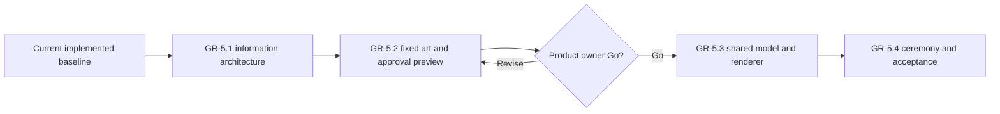

# Wayfinders graphical Great Hall milestone proposal

This document owns the detailed design and acceptance criteria for the
graphical Great Hall proposal. `Wayfinders_Roadmap.md` owns its planning,
sequencing, and authorization state. The retained concepts under
`concept_art/great-hall` are reference art only and are not runtime assets.
`Wayfinders_Great_Hall_Infographic_Lexicon.md` owns the exact counting-cord,
navigator, voyage, achievement, wreck-fate, idol, and detail-symbol vocabulary.

## Outcome

Replace the text-led Great Hall presentation with a physical-looking ancestral
chronicle that:

- shows a recognizable picture for every navigator;
- communicates returned-voyage achievements primarily through a stable symbol
  language while retaining exact text on demand and for accessibility;
- gives active, completed, lost, and later-confirmed navigator histories
  distinct material treatments;
- makes one navigator's maximum four voyages readable at a glance;
- remains usable with one through twenty generations through fixed-size era
  pages, direct era navigation, and bounded rendering;
- feels like the interior of the authored home island's central timber hall;
- preserves home, handover, and completion modes and every existing privacy and
  lifecycle rule; and
- keeps portraits, symbols, era grouping, and all rendered pixels strictly in
  presentation authority.

The proposal is complete when the selected visual system, twenty predefined
portraits, fixed symbol and Hall assets, an explicitly approved preview-tool
example, graphical Hall implementation, ceremony modes, accessibility
behavior, responsive layouts, and measured twenty-generation budgets all pass
their acceptance gates.

## Evidence and current constraints

### Current presentation

`GreatHallView` is a screen-space HTML dialog. It currently uses headings,
prose, numeric cards, a newest-first generation button list, and textual
achievement lists. It contains no navigator portrait, general achievement icon,
SVG, canvas illustration, or Hall-specific runtime art.

The current dialog has three required modes:

- **Home:** optional, dismissible browsing at the exact home dock.
- **Handover:** non-dismissible focus on the outgoing navigator before the next
  generation can sail.
- **Completion:** final returned idol-location history plus **Continue
  exploring** and **Start new game**. Completion takes priority when the same
  return also creates a pending handover.

The graphical Hall must preserve these mode and ordering contracts. It must not
become a sailing HUD.

### Information displayed today

The redesign retains the following information, but changes its default visual
form.

| Current information | Graphical default | Exact-text access |
| --- | --- | --- |
| Idol locations found / total | Prominent gold shell-idol count | Focus/click label |
| Navigators, safe journeys, completed tenures, lost navigators | Counting-cord symbols and numbers | Tally glossary |
| Supported route tiles and mapped enclosed water tiles | Wake and lagoon symbols with counts | Tally glossary |
| Island leads and dossiers | Outline and inlaid island symbols with counts | Tally glossary |
| Site leads and reports | Outline and filled marker symbols with counts | Tally glossary |
| Fishing leads and surveys | Outline and filled fish-ripple symbols with counts | Tally glossary |
| Confirmed wrecks | Repaired broken-mast symbol with count | Tally glossary |
| Generation number and lifecycle state | Portrait position, small numeral, frame material | Portrait accessible name and detail plaque |
| Returned-voyage progress and next voyage | Four fixed voyage positions; empty, returned, or lost treatment | Navigator detail plaque |
| Fatal voyage and unlocated/confirmed wreck fate | Cracked band; later shell repair and finder link | Navigator detail plaque |
| Journey number and outcome | Position one through four plus return/loss shape | Voyage accessible name |
| Every returned achievement label | Achievement symbol cluster | Focus/click roster containing every source label |

The underlying `GreatHallChronicle` read model also exposes structured fields
for each achievement, totals, navigator state, wreck fate, and idol progress.
The implementation must map those fields rather than parse display strings.

### Achievement kinds

The current read model has ten structured achievement kinds:

1. supported route tiles;
2. mapped enclosed water tiles;
3. island lead;
4. island dossier;
5. survey-site lead;
6. survey-site report;
7. fishing leads;
8. fishing survey;
9. wreck report; and
10. idol location.

Fatal voyages contain no provisional achievements. Undiscovered idol hosts are
structurally absent. Those are data-safety rules, not visual choices.

### Navigator identity gap

Navigator lineage records currently contain stable ID, generation, lifecycle,
succession identity, completed-voyage count, and committed voyage records. They
do not contain a name, portrait, appearance, gender, age, traits, or biography.

The graphical Hall therefore needs a new renderer-neutral, deterministic
portrait descriptor. It is decorative presentation identity derived from the
stable navigator ID. It must not be persisted as gameplay state, influence
simulation, or imply that appearance attributes are gameplay facts.

### Existing scale behavior

The generation list currently instantiates one button per navigator and places
them in a nested scroller. Opening the Hall rebuilds the complete chronicle.
Lineage length is append-only and uncapped in an in-memory session, while each
navigator has no more than four safe voyages.

The graphical redesign must bound visible DOM and art resources across the
supported range of one through twenty generations. The existing complete
read-model build may remain if the twenty-generation baseline passes; caching
or a page-specific selector requires a demonstrated miss.

### Home-island visual language

The authored home island establishes dense, crisp pixel art; lush tropical
foliage; warm timber and rust roofs; basalt and ochre sand; turquoise harbor
water; and small high-contrast silhouettes. The Great Hall should plausibly be
the interior of the prominent central building, using heavy timber posts,
woven wall and roof panels, shell or bone inlay, rope, basalt footings, warm
firelight, and turquoise daylight from the harbor.

The requested tribal quality will come from an invented home-island material
and pattern grammar based on navigation, sea life, canoe construction,
weaving, timber, and shells. Production art must not directly copy an
identifiable real-world Indigenous culture or sacred motif without a separate
cultural review.

## Concept decision

Four retained directions and the culturally refined selected image are indexed
in `concept_art/great-hall/README.md`:

- **A — Ancestor Wall:** twelve-portrait era page, selected portrait, and four
  voyage bands;
- **B — Woven River:** continuous vertical lineage tapestry and scrub cord;
- **C — Generation Spiral:** zoomable circular lineage medallion; and
- **D — Memorial Posts:** an immersive hall of portrait posts grouped into
  alcoves.

### Selected base: Ancestor Wall

Ancestor Wall is the implementation base because it:

- keeps navigator portraits and the selected navigator's four voyages large
  enough to read;
- translates the current select-one-navigator interaction without preserving
  its text-list appearance;
- uses discrete pages rather than forcing the player to scroll through every
  ancestor;
- permits a fixed rendering budget of twelve portrait buttons plus one detail
  view;
- adapts to desktop, tablet, and narrow layouts without changing era identity;
- provides direct, predictable keyboard and screen-reader navigation; and
- makes the Hall itself an artifact of the home island rather than a generic
  overlay.

The final direction deliberately borrows:

- age fading, repair stitching, and a knotted era-position cord from Woven
  River; and
- the fresh, patinated, blackened, and shell-repaired material states from
  Memorial Posts.

The spiral remains a useful ceremonial motif but not the primary navigation
model. Its shrinking targets and non-linear chronology are a poor foundation
for responsive and accessible browsing.

## Selected experience

### Physical composition

The Hall is a shallow front-facing interior rather than an abstract card grid.
Timber beams, woven panels, roof underside, harbor openings, and restrained
firelight establish place. The interface remains screen-space HTML so it can
preserve current focus, semantic, and responsive behavior.

Five physical-looking parts organize the screen:

1. **Counting cord:** lineage totals represented by stable symbols and short
   numbers. Idol progress remains visually prominent. A glossary exposes all
   fourteen current labels.
2. **Era wall:** exactly twelve navigator portraits arranged in chronological
   order. Older portraits show more patina within the same visual system.
3. **Era rail:** previous/next canoe-prow buttons, a knotted position track,
   current-generation shortcut, and an accessible direct generation jump.
4. **Selected memorial:** one enlarged navigator portrait, generation numeral,
   lifecycle material state, progress, and wreck-fate treatment.
5. **Four voyage bands:** permanent positions one through four, containing
   compact achievement-symbol clusters or an unambiguous empty/lost state.

### Era model

`12` is a presentation-only era size. Era one contains generations 1–12, era
two contains 13–24, and so on. The page identity does not change at responsive
breakpoints; only its grid changes.

- Desktop: a `4 x 3` or `3 x 4` portrait wall beside the selected memorial.
- Medium width: a `4 x 3` wall above the selected memorial.
- Narrow width: a `2 x 6` wall above four stacked voyage bands.
- The dialog has one outer vertical scroll at narrow sizes; the era wall does
  not create a nested scroll region.

Opening in home mode selects the current navigator and its era. Selecting an
older navigator does not mutate history. Reopening may again select the current
navigator; cross-session selection persistence is out of scope.

Previous/next controls move one era. The knotted rail makes a coarse jump when
there are many eras, and a small direct-generation control provides exact
access without placing a search field in the main visual hierarchy. Keyboard
`PageUp` / `PageDown` changes eras; arrow keys move among portraits; `Home` /
`End` moves to the first/current navigator where it does not conflict with a
focused native control.

Only the selected era, selected memorial, four voyage bands, current tally
symbols, and one optional detail roster are rendered. No hidden button is
created for every generation.

### Portrait system

The Hall uses a fixed catalog of twenty complete navigator portrait images.
Portraits are created ahead of time and stored as ordinary project assets;
faces, clothing, pose, and adornment are not assembled or generated at
runtime. Generations one through twenty map directly to portraits one through
twenty, so rerender, chronicle rebuild, preview controls, and responsive layout
always show the same portrait for the same generation.

The supported and tested scope of this milestone is twenty generations. A
future increase beyond twenty must add more predefined portraits or explicitly
choose a reuse policy in a later milestone; this proposal does not silently
cycle or procedurally vary the current set.

Lifecycle and fate are fixed presentation treatments applied around the
portrait:

| State | Material treatment |
| --- | --- |
| Active | Fresh turquoise pigment and a subtle harbor-light edge |
| Completed | Warm timber patina and four closed voyage notches |
| Lost, wreck unlocated | Smoke-darkened cracked frame and broken final band |
| Lost, wreck confirmed | Same crack repaired with bright shell stitching and a finder mark |

State must also have a distinct silhouette and accessible label; color alone is
insufficient.

### Infographic language

The canonical set is defined in
`Wayfinders_Great_Hall_Infographic_Lexicon.md`. It covers the fourteen lineage
totals, twelve-generation era rail, navigator plaque states, six voyage-slot
states, ten achievement kinds, three current survey-site insets, three fishing
qualities, wreck-fate relationship, idol completion medallion, and exact-detail
plaque.

Compact voyage bands group tokens by kind. Selecting or focusing a group opens
a plain-language roster containing every underlying achievement label; nothing
is dropped or replaced by a count. Empty safe returns and fatal voyages use
different shapes and labels. Tooltips are supplemental only: pointer click,
keyboard activation, and screen-reader names provide the same information.

### Text policy

Minimal text means removing repeated prose from the default scan, not hiding
facts.

Always visible text is limited to small generation/era numerals, short numeric
totals, and essential action labels. Exact achievement names, fishing quality,
site results, island findings, wreck attribution, handover explanation, and
completion choices remain available in a focused physical-looking plaque.
Screen-reader content uses the complete existing labels.

Handover and final completion may use one short ceremonial sentence because
their consequences must be explicit. **Continue exploring**, **Start new
game**, and **Begin generation n** remain textual actions.

## Preview-first approval gate

Before the graphical Hall is implemented in the game, the assets preview tool
must expose a dedicated **Great Hall** tab. This is a product-review surface,
not merely a gallery of the concept sheets. It should present one cohesive,
interactive example of the selected Ancestor Wall experience at approximately
the scale and framing a player would see.

The asset tool now has first-class **Islands**, **Ships**, and **Fishing
shoals** workspaces behind one accessible tab shell. Each workspace is
direct-linkable, participates in browser history, owns an isolated lifetime and
selection state, and uses the permanent library, preview, and workbench
regions. Great Hall should join that established model as a fourth,
first-class workspace rather than appearing as a nested asset category,
temporary modal, or link into the playable game.

This milestone depends on the workspace capability and its user-facing
contracts, not its current internal classes or mounting details. If the asset
tool is refactored again, Great Hall should follow the successor workspace seam
that still provides the same isolation, navigation, accessibility, and
direct-link behavior.

The preview must:

- appear as a **Great Hall** peer tab in the asset-workspace tab order;
- support the same direct-link, browser back/forward, roving keyboard focus,
  and tab-panel semantics as the existing workspaces;
- own its preview state and lifetime so switching workspaces does not leak Hall
  listeners, selection, fixtures, or presentation resources into another tab;
- remain isolated from the playable game and create no gameplay or persistence
  dependency;
- provide a simple navigator-count control from `1` through `20` that shows the
  first selected entries from one predefined twenty-navigator preview roster;
- use that fixed roster to cover active,
  completed, lost/unlocated, lost/confirmed, achievement-dense, handover, and
  completion examples;
- demonstrate the approved first-version screen composition: one Hall backdrop,
  twelve-member era wall, era rail, selected memorial, four voyage bands,
  achievement symbols, and exact-detail plaque; lineage totals and the counting
  cord remain deferred;
- allow the reviewer to change era, select navigators, inspect achievement
  details, and switch among the important Hall modes;
- include desktop and narrow-width views, or a simple way to inspect both;
- use the established three-region shell coherently: scenario or fixture
  choices in the library region, the player-scale Hall example in the central
  preview, and state, viewport, detail, and review controls in the workbench
  region;
- clearly identify all imagery and behavior as provisional and preview-only;
  and
- provide enough fidelity to judge composition, information density,
  portrait prominence, symbol readability, navigation, home-island fit, and
  the intended sense of accumulated history.

The preview uses the twenty predefined portraits and fixed Hall/symbol assets
created in the same milestone. It is view-only: it does not need image editing,
portrait generation, atlas preparation, asset candidate review, fingerprint
approval, promotion controls, collision tools, game wiring, full ceremony
animation, or final performance optimization. If an image needs revision, edit
the project asset in place; the next preview run or development reload uses the
current file. Work that exists only to answer a visual or interaction question
should remain in the preview rather than being built into the game
speculatively.

The product owner records one of two outcomes after reviewing the tab:

- **Go:** the direction and predefined asset set are approved as the base for
  game implementation, with any bounded follow-up notes recorded; or
- **Revise:** the direction is not approved, the preview is iterated, and
  graphical game implementation remains blocked.

Silence, completion of concept art, or technical review does not count as the
go-ahead. Approval of the preview accepts the overall visual and interaction
direction; it does not waive later accessibility, responsive, performance, or
game-behavior acceptance gates.

## Ownership and dependency rules

- `GreatHallChronicle` remains the immutable renderer-neutral read model over
  authoritative lineage and returned-world records.
- `GreatHallPresentationModel` is the single JSON-compatible input contract for
  the graphical Hall. It contains only versioned plain objects, arrays, scalar
  values, stable asset references, and accessible labels; it contains no
  functions, classes, DOM nodes, `Map`, `Set`, Phaser objects, or live
  simulation references.
- A pure Great Hall presentation adapter maps `GreatHallChronicle` into that
  contract, including era membership, predefined portrait references, voyage
  states, grouped symbol tokens, ceremony mode, and accessible labels. It
  imports no Phaser, owns no gameplay fact, and parses no display prose.
- The asset viewer supplies a checked-in, schema-validated fixture in the same
  contract. Its navigator-count and scenario controls derive another valid
  presentation object in memory; they do not maintain a second preview model.
- One shared semantic HTML graphical renderer consumes the presentation model.
  The asset workspace and in-game `GreatHallView` are hosts around that same
  renderer, not separate implementations. Decorative art is hidden from
  assistive technology; portrait buttons, symbols, modes, and actions retain
  explicit semantics.
- Opening the in-game Hall builds the presentation object from current game
  state and passes it directly to the renderer. It does not write, reload, or
  persist a JSON file.
- The preview and game use the same fixed portrait, symbol, state, and Hall
  image files. Replacing one of those files in place deliberately changes the
  next preview or game run; there is no runtime portrait generation or separate
  approval/promotion lifecycle for this feature.
- The Great Hall preview is an asset workspace with isolated interaction state.
  It does not claim collision profiles, start `GameSimulation`, or own
  authoritative lineage state. Its presentation fixture is owned only for
  product review.
- Runtime pixels never choose an achievement, navigator state, era membership,
  wreck fate, or idol completion state.
- The home-dock access policy, movement suppression, non-dismissible handover,
  completion priority, and focus return remain composition behavior.

The fixed files used by both preview and game should live at stable project
asset paths under `public/assets/gr5/great-hall`. Editing a file at one of those
paths replaces that asset for the next run; no separate generated copy or
promotion step is required. Hall UI art has no collision semantics.

## Milestone sequence

### GR-5.1 — Information architecture, interaction prototype, and baselines

Status: implemented with automated verification; interactive browser review is
pending with the approval preview.

Lock the Ancestor Wall information hierarchy before producing the fixed art
set. Build representative chronicle fixtures for 1, 12, 13, and 20
generations, including active, completed, lost/unlocated, lost/confirmed,
achievement-dense, handover, and completion cases. Record the current
chronicle-build, Hall-open, navigator-switch, DOM-count, and responsive browser
baselines. Prototype the twelve-member era page, selected memorial, four voyage
bands, tally glossary, exact-text roster, and keyboard behavior with temporary
shapes or existing developer styling.

Record the required presentation fields, stable era arithmetic,
selection/focus model, symbol accessible names, reduced-motion behavior, and
browser screenshot matrix. The single final JSON-compatible contract and
shared renderer are implemented in `GR-5.3`. Do not create caching, a generic
virtual-list framework, or a new authoritative lineage model without a
measured need.

Acceptance gate:

- all currently displayed information has one graphical location and one exact
  text/accessibility path;
- era boundaries and selection are deterministic for all named fixtures;
- the prototype creates no more than twelve era portrait controls and four
  selected voyage bands across the supported one-to-twenty range;
- home, handover, completion, fatal-voyage privacy, later wreck confirmation,
  and final-return-before-handover flows are represented;
- keyboard, pointer, focus, narrow-layout, and no-hover flows are demonstrated;
- measured baseline and proposed regression budgets are recorded; and
- no gameplay, persistence, or runtime asset contract changes are made.

### GR-5.2 — Predefined art set and approval preview

Status: implemented and awaiting product-owner review and an explicit **Go**.
Depends on `GR-5.1`.

Create twenty complete pixel-art navigator portraits as fixed image assets.
Also create the ten achievement symbols, fourteen lineage tally symbols,
voyage-band states, era controls, lifecycle and wreck-fate frame treatments,
idol medallion, detail plaque, and restrained Hall-interior pieces required by
the selected composition. Work at the pixel scale and nearest-neighbor rules
intended for the game. Validate every symbol in silhouette, grayscale, reduced
saturation, and the smallest supported size.

Portraits are whole predefined images, not runtime-generated combinations.
Use a simple manifest or equally direct ordered catalog to map generations
`1` through `20` to portrait files. Keep presentation state treatments separate
only where a reusable frame or repair image is visibly useful; do not build a
generic avatar, layering, atlas, recipe, candidate-review, or promotion system.

Use those exact project assets in the dedicated Great Hall workspace described
by the preview-first approval gate. Its only authoring-oriented control is the
navigator-count selector from `1` through `20`; all other controls exist to
browse representative eras, navigators, achievements, modes, and responsive
views. The workspace is for viewing and product decisions, not editing assets.
Iterate by replacing source images in place and reloading until the product
owner records an explicit **Go** decision.

The first reviewable composition deliberately simplifies the selected concept.
It uses one empty Hall-interior background plate, then overlays the unchanged
navigator portraits, a left-side selected memorial with four pictorial cloth
bands, and a right-side `4 x 3` ancestor wall. All twelve portrait positions
remain visible; positions beyond the selected navigator count use covered
frames. The counting cord and lineage totals are not displayed in this review
version. Their reference art and infographic definitions remain available for
a later product decision.

For visual review, the default current-navigator fixture displays all ten
achievement symbols across three returned voyages, with multiple achievements
per band, while retaining one awaiting voyage state.
The portrait wall and voyage bands omit visible position numerals; generation
and voyage positions remain available through accessible labels and the review
workbench. Lost-state treatment does not cross the portrait art, and the voyage
marker is the existing player-boat pictogram rather than an abstract shape.

Acceptance gate:

- exactly twenty distinct, complete navigator portrait files exist and map
  directly to generations one through twenty;
- rebuild, responsive relayout, repeated selection, and preview-count changes
  never alter a generation's portrait assignment;
- all ten achievement kinds have a unique visual and accessible mapping;
- lead/report and safe/lost states remain distinguishable without color;
- gold remains reserved for idol-location progress and shell repairs; and
- reviewed source/contact sheets contain no text artifacts, watermark,
  photorealistic element, generic modern UI chrome, or unapproved real-world
  sacred motif;
- a dedicated Great Hall tab demonstrates the required representative states,
  achievements, interactions, desktop view, and narrow view for any selected
  navigator count from one through twenty without entering the playable game;
- the tab is a direct-linkable peer of the existing asset workspaces, follows
  their accessible keyboard and history behavior, and cleans up its isolated
  preview lifetime when another workspace takes over; and
- the product owner's explicit **Go** decision and any bounded follow-up notes
  are recorded before this milestone closes.

### GR-5.3 — Shared presentation contract and graphical Hall integration

Status: proposed, not started, and not authorized. Depends on the explicit
preview **Go** from `GR-5.2`.

Define and validate one versioned, JSON-compatible
`GreatHallPresentationModel`. Extract the approved graphical Hall from the
asset workspace into one shared semantic HTML renderer that accepts only that
model plus interaction callbacks. The renderer owns layout, era paging,
portrait selection, the selected memorial, four pictorial voyage bands,
achievement symbols, accessible detail, and ceremony presentation; it does not
read `GameSimulation` or `GreatHallChronicle` directly.

Replace the TypeScript-only preview roster with a checked-in fixture using the
same contract. The asset workspace validates and passes that fixture to the
shared renderer, deriving navigator-count and scenario variations in memory.
Add a pure adapter that converts the existing `GreatHallChronicle` and fixed
portrait catalog into the same presentation model when the game opens or
refreshes the Hall. The game passes the resulting object directly to the
existing Great Hall host; no runtime file write or persistence path is added.

Remove the old text-card renderer and the preview-only graphical rendering path
after both hosts use the shared renderer. Do not retain a dual runtime path or
translation facade. Preserve existing home, handover, completion, focus,
action, and lifecycle callbacks at the host boundary.

Use one outer scroll container only. Render no off-page navigator portraits or
hidden all-generation controls. Load the current era's predefined portrait
files and release replaced page resources. If the combined chronicle-to-
presentation build misses its accepted twenty-generation budget, introduce the
smallest measured page/index or memoization seam with equivalence and stale-
data tests.

Acceptance gate:

- one documented, versioned presentation contract is JSON-compatible and
  rejects malformed fixture data before rendering;
- the game adapter maps every navigator picture, lifecycle/fate state, four
  voyage positions, returned achievement, and ceremony mode from structured
  chronicle fields without changing authoritative state;
- the asset workspace and game host render the same presentation object through
  the same graphical renderer, with host-specific controls outside it;
- home mode opens on the current navigator and can browse any generation by
  era, direct generation, pointer, and keyboard;
- selecting an achievement group exposes every exact underlying label;
- fatal voyages show no provisional credit and undiscovered idol hosts never
  appear;
- handover remains focused and non-dismissible; completion keeps both choices
  and takes priority over pending handover;
- focus restoration, action gating, and movement suppression remain unchanged;
- visible portrait controls and voyage bands stay within the fixed structural
  budget for the twenty-generation fixture;
- fixture-validation, adapter-equivalence, shared-renderer, focused view,
  contract, integration, typecheck, architecture, and bundle tests pass; and
- the old text renderer, preview-only presentation model, and duplicate Hall
  rendering markup are removed.

### GR-5.4 — Ceremony, responsive polish, and acceptance

Status: proposed, not started, and not authorized. Depends on `GR-5.3`.

Finish the shared Hall renderer as a historical place rather than a reskinned
data panel. Handover adds the outgoing portrait to the wall and reveals the next
fresh frame without delaying authoritative succession. Loss uses a short
restrained material transition; a later returned wreck report changes only the
frame treatment and never draws across the portrait. Completion emphasizes the
final voyage and approved achievement symbols before showing the existing
choices; it does not reintroduce the deferred counting cord or lineage totals.
All animation is optional presentation and has an immediate reduced-motion
path.

Tune desktop, medium, and narrow layouts; focus visibility; tooltip/plaque
placement; text scaling; contrast; grayscale symbol recognition; touch-sized
targets inside the Hall; and resize behavior. Run repeated open/page/close
measurements through twenty generations against the budgets
recorded in `GR-5.1`, including decoded texture and live DOM/resource counts.

Acceptance gate:

- browser screenshots pass for 1, 12, 13, and 20 generations across
  home, handover, loss, confirmed fate, and completion states at the approved
  desktop, medium, and narrow viewports;
- for an identical presentation object, the asset-workspace and game hosts have
  equivalent Hall content, ordering, state treatments, and accessible names;
- no layout uses horizontal overflow or a nested generation scroller;
- every interaction works without hover and with keyboard-only navigation;
- screen-reader traversal exposes era position, selected navigator, state,
  voyage outcomes, exact achievement labels, fate, and actions in a coherent
  order;
- reduced motion presents every state change immediately and loses no
  information;
- repeated era traversal and Hall reopening plateau at approved DOM, image,
  listener, decoded-byte, adapter, and rendering timing budgets with no stale
  selection or leak;
- current home-dock, lineage, discovery, completion, and movement outcomes
  remain unchanged; and
- all relevant visual, quick, contract, integration, repository/I/O,
  performance, typecheck, architecture, asset, and bundle gates pass.

## Dependency summary

The graph shows technical dependencies, not authorization or product priority.

## Performance and resource policy

The implemented baseline records:

- a deterministic one-, twelve-, thirteen-, and twenty-generation model suite;
- a measured twenty-generation model-build regression contract owned by
  `Wayfinders_Technical_Design.md`; the latest volatile run is recorded in
  `IMPLEMENTATION_STATUS.md`;
- a structural ceiling of twelve visible era portrait controls, four selected
  voyage bands, and one selected detail surface for every count through twenty;
  and
- repository-I/O validation for twenty distinct fixed portrait files, the Hall
  backdrop, and the authored achievement-symbol sheet.

Interactive browser measurements remain to be recorded during product review
for each named lineage fixture and viewport:

- chronicle-to-presentation build and Hall open p50/p95/p99;
- era page switch and selected navigator switch p50/p95/p99;
- visible and total Hall DOM nodes, listeners, and image elements;
- loaded predefined portrait count and decoded bytes;
- layout-shift and resize behavior; and
- repeated open/page/close plateau behavior.

The fixed structural budget is twelve portrait controls, four selected voyage
bands, one selected detail surface, and controls whose count depends on visible
eras rather than total generations. The deferred tally values and counting cord
are not part of this budget. A numeric timing or byte ceiling is accepted only
after the baseline is measured.

Fallback order for a measured miss:

1. reduce decorative layers and animation;
2. load only the twelve visible predefined portraits plus the selected detail;
3. reduce fixed image dimensions or decorative variants while retaining
   nearest-neighbor presentation;
4. add a bounded era selector/index while retaining complete history; and
5. retain a static interior and symbol-only state treatments.

Do not fix a presentation miss by pruning lineage history, hiding exact labels,
weakening focus semantics, leaking provisional knowledge, or changing gameplay
ordering.

## Risks and mitigations

| Risk | Mitigation |
| --- | --- |
| Portrait art invents gameplay identity | Treat the ordered twenty-portrait catalog as presentation only; it never changes gameplay facts |
| A portrait changes between views | Map generations one through twenty directly to fixed files and test the mapping |
| Symbols become a code players must memorize | Use paired visual grammar, focus/click detail, and screen-reader names |
| Minimal text hides island names or findings | Preserve every source `label` in the selected symbol roster |
| Twelve portraits still feel flat | Use physical frames, age patina, repaired loss states, interior depth, and restrained light |
| Twenty generations create unnecessary hidden DOM work | Render one fixed era only and benchmark the complete twenty-generation read-model build separately |
| Ceremony changes simulation ordering | Trigger presentation only from existing committed states and events |
| Art copies a living culture's sacred language | Use an invented sea/navigation material grammar and review the fixed art set before the preview Go |
| A rejected direction is implemented in the game | Require an interactive assets-preview tab and explicit product-owner Go before game integration |
| In-place art changes are overlooked | Keep fixed files plainly named and verify the preview reloads the current project assets |
| Raster text becomes inaccessible or stale | Keep labels/actions as semantic HTML, never baked into art |
| Preview and game drift after approval | Require both hosts to consume the same versioned presentation object through one renderer and test equivalent output |
| A fixture is treated as game authority | Validate fixture data only at the asset-workspace boundary; build the in-game model exclusively from `GreatHallChronicle` |

## Out of scope

- navigator names, biographies, traits, family trees, inheritance, politics,
  age simulation, or new succession rules;
- gameplay saving, cloud history, or lineage persistence across refresh;
- new achievements, discovery rewards, idol rules, or wreck mechanics;
- an explorable 3D Hall, first-person walking, or a second Phaser scene;
- a permanent sailing score panel;
- photorealistic portraits or direct representation of a named real-world
  culture;
- a general avatar creator, UI editor, icon framework, atlas system, event bus,
  or virtual-list framework;
- writing, reloading, or persisting a JSON file when the in-game Hall opens;
- parsing prose to recover achievement meaning; and
- loading anything directly from `concept_art` in production.

## Definition of done

The graphical Great Hall track is done when generations one through twenty map
to twenty stable predefined portraits; the product owner approved the cohesive
preview-tool example before game integration; one versioned JSON-compatible
presentation contract and one graphical renderer serve both the asset workspace
and game; the complete supported chronicle is readable through an accessible
symbol language and exact-text detail; fixed twelve-generation era pages make
the twenty-generation scope practical without lineage-sized DOM; home,
handover, loss, confirmed fate, and completion modes preserve their current
rules; the old text and preview-only rendering paths are removed; the Hall looks
like the authored home island's accumulated ancestral interior; all responsive,
accessibility, visual, resource, performance, repository, and game-behavior
gates pass; and no presentation pixel or fixture has become gameplay authority.
