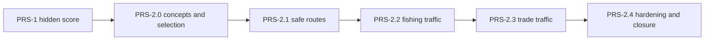

# Wayfinders prosperity-system milestone

Status: explicitly authorized on 2026-07-19 as the ordered `PRS-1` through
`PRS-2.4` implementation batch.

This document owns the detailed unimplemented design and acceptance criteria
for the Prosperity batch. `Wayfinders_Roadmap.md` owns planning, sequencing,
and authorization status. Implemented behavior belongs in
`Wayfinders_Technical_Design.md`, current ownership belongs in
`ARCHITECTURE_MAP.md`, production artifact contracts belong in
`Wayfinders_Asset_Pipeline.md`, and completion evidence belongs in
`Wayfinders_Roadmap_Archive.md`.

Concept studies under `concept_art/prosperity-traffic` are reference art only.
They must never load at runtime or establish gameplay facts by themselves.

## Recommendation

Add Prosperity in two deliberately separate layers:

1. an authoritative, hidden integer score that records the lasting value of
   exact-dock knowledge returns; and
2. renderer-neutral safe-water traffic routes whose noninteractive fishing and
   trade vessels make two returned discoveries visible in the world.

The first release does not spend Prosperity, expose it to the player, gate
traffic behind score thresholds, change expedition support, or simulate an
economy. The score is a foundation for later explicitly designed world
progression. Traffic is an immediate consequence of returned facts, not a
reward tier inferred from an invisible number.

## Intended outcome

The batch is successful when:

- every eligible returned fact can add one deterministic, idempotent hidden
  contribution at the exact home-dock settlement;
- direct surveys and lead-then-survey returns produce identical final values;
- fishing quality and island size preserve their existing ordinal meaning in
  the valuation schedule;
- failed voyages, provisional knowledge, empty returns, and raw mapped-water
  counts add nothing;
- returned surveyed shoals visibly gain restrained fishing activity;
- returned surveyed inhabited islands visibly gain restrained trade traffic
  to and from home;
- every traffic edge is passable Supported water selected by one shared,
  deterministic connectivity authority;
- traffic owns no collision, input, resources, provisions, events, or other
  gameplay effect; and
- normal sailing, Voyage Sense, fog, markers, prompts, and the player vessel
  remain visually and mechanically dominant.

## Hidden Prosperity contract

### Authority and lifetime

Create `src/wayfinders/features/prosperity` as the authoritative owner of:

- a non-negative safe-integer score;
- a revision that changes only when the score changes;
- a source-keyed contribution ledger; and
- pure preparation plus one exact-dock commit operation.

`GameSimulation` is the only composition point. Prosperity persists across
navigator succession in one game and resets with world regeneration, refresh,
or **Start new game** under the existing no-save contract. No save format,
migration, browser storage, or networking seam is added.

The score and its numeric delta must not appear in the Great Hall, return
ceremony, voyage log, HUD, prompt, accessible player text, audio, or
presentation read model. A renderer cannot query it. A typed internal selector
may expose an immutable snapshot to future gameplay work and diagnostics.

### Versioned valuation schedule

Values are cumulative per returned source. A lead establishes the first point;
the later completed fact raises that source to its final value. A direct lead
plus survey return reaches the same total in one settlement.

| Returned source state | Cumulative value | Award from an earlier lead |
| --- | ---: | ---: |
| Island lead | 1 | 1 |
| Small island dossier | 5 | +4 |
| Medium island dossier | 7 | +6 |
| Large island dossier | 9 | +8 |
| Survey-site lead | 1 | 1 |
| Returned survey-site report | 7 | +6 |
| Fishing-shoal lead | 1 | 1 |
| Lean fishing survey | 5 | +4 |
| Steady fishing survey | 7 | +6 |
| Rich fishing survey | 9 | +8 |
| Confirmed navigator-wreck report | 4 | 4 |
| Returned idol location | 12 | 12 in addition to its host fact |

Island themes and survey-site types are categorical rather than quality tiers,
so they do not receive invented rankings. Island size and fishing quality are
already explicit ordered content facts and therefore retain small/medium/large
and lean/steady/rich valuation.

The schedule has its own contract version. A stable source key identifies each
island, survey site, fishing shoal, navigator wreck, and idol location. A
source's stored value may only increase to the schedule's canonical value.
Repeated settlements, revisits, and reordered inputs are no-ops once that value
has been credited. Preparation validates every ID, state, canonical value, and
safe-integer total before mutation, so an invalid settlement cannot partially
change Prosperity.

### Explicit zero contributions

The input contract contains no field for:

- Supported-water tile count, route length, enclosed-water count, or total map
  coverage;
- the removed Supported-route or Mapped-water achievement kinds;
- voyage completion, tenure, succession, provisions, or traffic activity; or
- provisional sightings and surveys, including all knowledge lost in a wreck.

Raw tile counts remain useful return telemetry under their existing owner but
cannot accidentally become Prosperity inputs. A confirmed wreck report is
valuable recovered knowledge; causing a new wreck is not.

### Exact-dock transaction

The return transaction must:

1. capture and validate a pure Prosperity settlement from the same provisional
   returned facts used by the existing feature commits;
2. commit Personal knowledge and provisional feature facts through their
   existing owners;
3. complete and validate the lineage voyage;
4. apply the already-valid Prosperity settlement;
5. refresh derived traffic routes from committed returned facts and Supported
   topology; and
6. replenish and publish existing return events.

Prosperity is applied before `expeditionReturned`, so future internal
subscribers observe settled authority. The event itself remains unchanged and
does not expose the score.

## Safe traffic-route contract

### Eligibility

One immutable renderer-neutral route is derived for each eligible returned
target:

- fishing: a returned fishing survey of any quality with a Supported path to
  its exact service anchor; and
- trade: a returned island dossier whose semantic theme is exactly
  `community`, with a Supported path to at least one declared island approach.

Leads, provisional surveys, non-community dossiers, failed expeditions, and
targets without a safe path create no route. Habitation is never inferred from
island art, asset names, `IslandKind`, or rendered pixels.

Routes start at the exact home return tile. Every route index must be passable
and `KnowledgeState.Supported`; Personal, Unknown, current sight, and rendered
water are ineligible. Island routing selects the shortest connected declared
approach, then the lowest canonical index. Path expansion retains the existing
north/east/south/west tie-break.

### Shared connectivity and wrapping

`GameSimulation` composes one `SupportedConnectivitySystem` for the world and
shares it with fishing eligibility and Prosperity traffic. It builds at most
one whole-world Supported flood per Supported-topology revision. It must not
run one flood per target or search during an ordinary presentation frame.

The connectivity result retains each chosen cardinal direction and whole-world
image offset. A seam edge is one tile long in lifted space even when its
canonical endpoints lie on opposite sides of the map. Direction provenance is
required for width-two worlds, where canonical endpoints alone cannot identify
which periodic edge was selected.

Traffic routes are deterministic derived state, not navigation instructions or
economy authority. They refresh only when returned-record revisions or the
Supported-topology revision change. If later returned knowledge connects a
previously disconnected eligible target, that target may then gain a route.

## Visual delivery

### Concept and selection gate

Create at least three paired fishing-skiff and trade-canoe studies under
`concept_art/prosperity-traffic`. Review them beside the player craft at normal
gameplay scale and in open water, near a fishing shoal, at Home Shore, and at a
community-island approach. Each direction must include heading variants,
restrained wakes, grayscale evidence, a reduced-motion/static pose, and a
deliberately busy three-vessel fixture.

Select the direction that best meets these criteria:

- fishing, trade, and player silhouettes remain distinct at target size and in
  grayscale;
- the player vessel remains the most prominent craft;
- the fishing craft reads as a low working skiff rather than a combat vessel;
- the trade craft reads as a slightly broader cargo carrier without becoming
  a second player ship;
- the craft language follows the art guide without identifiable sacred or
  culture-specific copying; and
- the shapes remain practical for crisp code-native runtime drawing.

Record prompts, provenance, comparison, and selection in the concept folder.
The selected concept guides a dedicated code-native traffic renderer; concept
PNGs remain reference-only and no speculative production-asset pipeline is
added.

### Vessel behavior

Fishing skiffs travel from home to the shoal, dwell in a quiet working pose,
and return on the same path. Trade canoes travel between home and a returned
community island with brief endpoint dwells. Direction and position are sampled
on lifted safe-route edges before canonicalization, so vessels never take a
long visual chord across a world seam.

Presentation time, stable route identity, and a deterministic phase schedule
control movement. Traffic never advances simulation time and owns no physics
body, collision shape, input target, prompt, gameplay event, sound source,
resource output, provision effect, or world mutation. Reduced motion shows a
useful static vessel pose on its safe route and removes the wake.

### Density and non-interference

The shared hard contract is:

- at most two live fishing descriptors and two live trade descriptors;
- at most one live descriptor per eligible target;
- at most three canonical traffic vessels visible on screen;
- at most one vessel in the immediate home-harbour area;
- unused capacity in one family is not reassigned to the other;
- deterministic rotation gives every eligible route service without scanning
  the full route catalog each frame;
- wakes render below hulls, and both render below fog, Voyage Sense, markers,
  prompts, and the player ship;
- craft remain materially smaller, quieter, and less saturated than the player
  vessel; and
- traffic smoothly fades to zero close to the player, then returns outside a
  declared clearance band.

Periodic aliases share one canonical vessel identity. Bounded pools may create
only the small declared maximum of graphics views, and stable frames allocate
no textures or game objects.

## Architecture plan

| Owner or seam | Planned extension | Must not do |
| --- | --- | --- |
| `features/prosperity` | Hidden score, ledger, exact-return settlement, derived traffic contracts and route selector | Import Phaser, expose the score to presentation, or own an economy |
| `SupportedConnectivitySystem` | One shared revisioned flood, multiple-target queries, lifted path edges | Read returned-feature semantics or run per frame |
| Fishing public seam | Consume the shared connectivity authority | Create a duplicate whole-world flood |
| `GameSimulation` | Compose exact-return ordering and immutable internal/traffic selectors | Own craft drawing or publish the score in player events |
| `ProsperityTrafficRenderer` | Bounded schedule, lifted sampling, code-native craft/wakes, periodic views, reduced motion and diagnostics | Add physics, input, hidden-world queries, or simulation mutation |
| `WayfindersScene` | Pass the existing active-chunk boundary, topology, player pose, time, and accessibility preference | Scan all routes or create a second viewport policy |

Implementation updates `ARCHITECTURE_MAP.md` only after these seams exist.
This planning document does not make them current truth.

## Milestone sequence

### PRS-1 — Hidden Prosperity score foundation

Status: explicitly authorized on 2026-07-19 as the first milestone in the
ordered batch.

- Implement the versioned schedule, safe-integer score, revision, monotonic
  source ledger, preparation, and exact-dock commit.
- Cover every value, direct-versus-staged parity, repeat settlement,
  iteration-order independence, wreck rollback, idle return, succession, and
  reset.
- Prove the score is absent from player-facing contracts and that raw map/route
  telemetry cannot enter the settlement input.

Exit: focused contracts and exact-return integration pass, with no UI or
presentation change.

### PRS-2.0 — Traffic concept studies and selection

Status: authorized; begins after `PRS-1` closes. Selecting the strongest
compliant direction is part of this authorized batch and needs no second gate.

- Generate and retain at least three paired concept directions.
- Compare normal scale, grayscale, reduced motion, and the bounded busy case.
- Record the selected crisp, restrained craft language and translate it into a
  code-native runtime drawing brief.

Exit: provenance and selection rationale are checked in; concept art remains
reference-only.

### PRS-2.1 — Returned-target safe-route model

Status: authorized; depends on `PRS-2.0`.

- Share the existing Supported connectivity flood.
- Add multiple-approach selection and direction-preserving lifted path edges.
- Derive stable fishing and community-island routes from committed facts and
  topology revisions.
- Measure the P2 route refresh fixture and enforce an `80 ms` cold-build
  ceiling plus a `2 ms` unchanged-revision cache-hit ceiling on the repository
  performance runner. Existing P0/P1/P2 authoritative budgets remain green.

Exit: route safety, determinism, seam/corner, cache, return, and regeneration
contracts pass.

### PRS-2.2 — Fishing traffic presentation

Status: authorized; depends on `PRS-2.1` and the selected drawing brief.

- Add noninteractive fishing skiffs for safely connected returned surveys.
- Implement lifted outbound/dwell/return sampling, headings, quiet wakes,
  player-clearance fading, caps, reduced motion, pooling, and diagnostics.

Exit: focused presentation/resource tests and live fishing-shoal acceptance
pass.

### PRS-2.3 — Trade traffic presentation

Status: authorized; depends on `PRS-2.2`.

- Add noninteractive trade canoes for safely connected returned
  `community`-theme dossiers.
- Reuse all route, wrapping, visibility, density, pooling, accessibility, and
  non-interaction contracts.
- Keep home and island dwell points outside the exact dock and survey-prompt
  footprints.

Exit: community-only eligibility, deterministic fair scheduling, route safety,
and live home-to-island acceptance pass.

### PRS-2.4 — Hardening, acceptance, and documentation closure

Status: authorized; closes the ordered batch after all earlier gates pass.

- Prove stable-frame allocation, fixed resource ceilings, active-chunk
  ownership, periodic alias identity, teardown, and repeated-lap plateaus.
- Run normal/reduced-motion, fog, seam/corner, responsive, and console-clean
  browser acceptance without traffic obscuring play.
- Rewrite current technical/architecture truth, archive durable evidence, and
  compress the roadmap to the completed outcome.

Exit: all relevant lanes, bundle, performance, live acceptance, documentation
consistency, and final rebase pass.

## Acceptance criteria

### Prosperity authority

- Fresh construction and new-game regeneration expose score zero and revision
  zero; succession retains both.
- Only an exact home-dock commitment can increase the score.
- Direct completed returns equal lead-plus-later-upgrade returns.
- Repeated settlements, revisits, and input permutations leave total and
  revision unchanged.
- Every scheduled value and every fishing quality/island size is exhaustively
  covered.
- Wreck rollback, empty replenishment, route length, tile count, and traffic add
  zero.
- No player-facing model, label, event, view, audio source, or accessible text
  exposes the score.

### Safe routes

- Every path is inclusive, passable, Supported, and direction-valid from the
  home return tile to its selected endpoint.
- Multiple targets at one topology revision share one flood build.
- Island approaches choose shortest path then lowest index; path construction
  is independent of catalog iteration order.
- Seam and corner routes remain tile-local in lifted space, including
  width-two directional ambiguity.
- Leads, provisional surveys, failed returns, non-community dossiers, and
  disconnected endpoints produce no route.
- Route construction changes no score, knowledge, collision, provisions,
  lineage, or target state.

### Presentation

- A returned connected shoal can show one recognizably working fishing skiff;
  a returned connected community island can show one recognizably laden trade
  canoe.
- All sampled motion and static reduced-motion poses lie on stored safe-route
  geometry.
- The player, fog, Voyage Sense, markers, shorelines, prompts, and UI remain
  more prominent and above traffic.
- Close traffic fades completely before it can overlap or distract from the
  player.
- Family, screen, home-area, and periodic-view caps hold with many eligible
  routes and through repeated laps.
- Teardown releases all traffic-owned graphics, listeners, and timers; stable
  frames allocate none.

## Verification

Use `tests/README.md` as the canonical lane guide. Expected coverage includes:

- score schedule, idempotence, validation, ordering, overflow, lifecycle, and
  exact-return integration contracts;
- Supported path endpoints, tie-breaks, multiple approaches, shared-cache
  counts, seam/corner direction provenance, and route eligibility;
- pure traffic schedule, lifted sampling, headings, dwells, player fading,
  reduced motion, caps, alias placement, resource pooling, and teardown;
- a named P2 cold-route build and cache-hit performance fixture; and
- live browser acceptance at normal and responsive sizes, with normal and
  reduced motion, fog, seams/corners, several returned targets, repeated laps,
  and a clean console.

During implementation, run focused owning tests, `npm.cmd run check:quick`,
source and test typechecks, relevant contract/integration/performance lanes,
`npm.cmd run build:bundle`, and finally `npm.cmd run check`. Record volatile
timings and operational blockers only in `IMPLEMENTATION_STATUS.md`.

The pre-implementation baseline on the rebased branch passed
`npm.cmd run check:quick` on 2026-07-19. `PRS-2.1` owns the first attributed
route-refresh measurement because no Prosperity route fixture exists before
that milestone; its ceilings above are accepted regression contracts rather
than a weakening of existing profile budgets.

## Risks and controls

| Risk | Control |
| --- | --- |
| Hidden score becomes an unexplained unlock currency | No spending or score threshold in this batch; world effects follow returned semantic facts |
| Route/map farming dominates substantive discovery | Raw tile and route counts are structurally absent from score input |
| Direct and staged surveys score differently | Monotonic cumulative value per stable source key |
| Wrecks become farmable Prosperity | Only later confirmation of a unique wreck report scores; causing or suffering the wreck does not |
| Traffic crosses unknown or unsafe water | Shared passable-Supported flood and immutable direction-preserving paths |
| Island art accidentally defines habitation | Exact returned dossier theme is the only trade eligibility fact |
| Seam interpolation crosses the map | Sample lifted edges before canonicalizing position |
| Decorative vessels obscure the voyage | Hard family/screen/home caps, subdued art, lower depth, and player-clearance fade |
| World scale causes per-frame route scans | Revision-built route index and four bounded live descriptors |
| Presentation acquires gameplay authority | No physics, input, events, output, provisions, score access, or world mutation |

## Out of scope

- visible Prosperity numbers, bars, tiers, notifications, or achievements;
- spending, decay, thresholds, technology trees, expedition-support changes,
  supply scaling, recovery bonuses, trade inventories, fishing yields, or an
  economy simulation;
- interactive NPCs, collision avoidance, escorts, combat, piracy, blocking,
  rescue, or player-owned traffic;
- routes through Personal or Unknown water, dynamic rerouting while sailing,
  traffic-authored knowledge, or NPC routefinding per frame;
- settlement growth, cultivated land, docks, monuments, additional traffic
  families, or storm interaction; and
- gameplay saving, migration, networking, a generic ECS, or a universal event
  bus.

Any of these requires a later explicitly authorized milestone with its own
player feedback, balance, performance, and acceptance design.

## Documentation closure

Until the batch closes, this document owns its detailed design and acceptance
criteria while the roadmap owns authorization. Do not describe planned seams
as current truth in the technical design or architecture map.

When `PRS-2.4` closes:

1. rewrite the technical design and architecture map to implemented truth;
2. update the asset pipeline only if real runtime artifacts were added;
3. keep only volatile verification and operational state in implementation
   status;
4. archive durable outcome, implementation references, skipped decisions, and
   acceptance evidence; and
5. replace the detailed roadmap plan with a concise completed summary.
