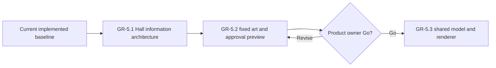

# Wayfinders current roadmap

Status: forward plan. Gameplay is complete through `GP-5.1`; the Great Hall
track is complete through `GR-5.3`; cloud atmosphere is complete through
`CLD-1`.
Implemented behavior belongs in `Wayfinders_Technical_Design.md`; completed
milestones and acceptance evidence belong in `Wayfinders_Roadmap_Archive.md`.

## Standing planning rules

### Saving policy

The technical design owns the current runtime persistence boundary. For future
planning, persistence must not be added incidentally to another feature or
inferred from development-only asset authoring. It may return
only through an explicitly authorized milestone designed for the game that
exists at that time. No persistence milestone is currently planned or
authorized.

### Milestones and authorization

- `GP-x.y` identifies gameplay milestones and acceptance gates.
- `GR-x.y` identifies graphics, asset-pipeline, and production-presentation
  milestones and acceptance gates.
- `AUD-x` identifies game-audio milestones and their acceptance gates.
- `WTR-x.y` identifies the proposed water-presentation track.
- `CLD-x.y` identifies cloud-atmosphere milestones and acceptance gates.
- A milestone is complete only when its behavior, tests, maintainability,
  performance criteria, and acceptance evidence pass.
- This roadmap proposes sequencing but authorizes no work by itself.
- An explicitly authorized ordered batch may proceed dependency-first without
  renewed permission between its named milestones. Work pauses when the batch
  is complete or continuing needs a new product decision, expanded scope or
  authority, or an unresolved external blocker.
- Before implementation starts, record measurable baseline and regression
  budgets appropriate to the work.

Developer graphics remain valid fallback presentation. Gameplay consumes
semantic terrain and content data; rendered pixels, sprite footprints, and
animation never become gameplay authority.

In planning, **tribe** means the authoritative support state of the home
community. **Community** is the broader design term and may also describe
remote settlements. Code contracts must not use the terms interchangeably.

## Current planning point

The implemented baseline supports the prototype world and the named large-world
profiles. Its current contracts are documented in the technical design and
architecture map; its delivery history is archived.

The asset-workspace shell, focused island workshop, single island-availability
lifecycle, deterministic authored-island world planning, and chunk-bounded
authored runtime presentation and independent revealed-map cloud atmosphere are
implemented. No further production-presentation milestone is currently
proposed.

The Voyage Sense thread and its supply commitments are implemented through
`GP-5.2`. Remaining `AUD-2` through `AUD-5` work and the water-system proposal
remain separate candidate tracks. Great Hall concept and planning work is
complete. The product owner accepted the
`GR-5.2` view-only approval workspace and recorded **Go** on 2026-07-16. The
shared presentation contract, renderer, fixture, game adapter, and bounded era
integration in `GR-5.3` are implemented.

## Great Hall presentation

### GR-5 — Graphical Great Hall chronicle

Status: complete through `GR-5.3`. No further milestone is planned.

Replace the text-led Great Hall with the selected **Ancestor Wall** direction:
reviewed navigator portraits, a stable achievement-symbol language, fixed
twelve-generation era pages, one selected navigator's four voyage bands, and
material states for active, completed, lost, and later-confirmed histories. All
current exact text remains available on focus or activation and to assistive
technology.

The implementation sequence is:

1. `GR-5.1` — implemented information architecture, interaction prototype,
   fixtures, and measured model baseline through twenty generations;
2. `GR-5.2` — implemented twenty predefined portraits, fixed Hall and symbol
   art, and a first-class, direct-linkable Great Hall viewing workspace,
   accepted by the product owner;
3. `GR-5.3` — one versioned JSON-compatible presentation contract, a shared
   graphical renderer for the asset viewer and game, the chronicle adapter, and
   bounded era paging, all now implemented.

The detailed current-information inventory, retained concepts, selected visual
grammar, scaling model, contracts, budgets, and acceptance gates are defined in
`Wayfinders_Great_Hall_Presentation_Milestone.md`. The closed current-data
symbol set is defined in `Wayfinders_Great_Hall_Infographic_Lexicon.md`.
Concept PNGs remain reference-only under `concept_art/great-hall` and never
load at runtime. The reviewed copies consumed by the approval workspace live at
stable paths under `public/assets/gr5/great-hall`.

## Voyage Sense

### GP-5 — Voyage Sense presentation

Status: complete through `GP-5.2`. No further Voyage Sense milestone is planned.

The implemented Voyage Sense thread contract is owned by the technical design;
its scope and acceptance evidence are archived.

#### GP-5.2 — Voyage Sense supply commitments

`GP-5.2` extends the thread's risk language into the graphical cargo rack. Its
implemented behavior is owned by the technical design and its acceptance
evidence is archived. The rack intentionally contains no visible words or
numbers; exact quantities remain available to assistive technology.

## Audio presentation

### AUD — Game sound and music layer

Status: `AUD-1` implemented on 2026-07-17; keyboard/media browser acceptance
remains to be recorded. `AUD-2` through `AUD-5` remain proposed and are not
authorized.

The implemented foundation loads one validated stored-audio catalog, exposes a
play-only Audio asset workspace, and gives game mode an explicit enable flow,
in-memory mixer controls, bounded voice ownership, diagnostics, silent fallback,
and complete scene cleanup. Current ownership and behavior are documented in
`ARCHITECTURE_MAP.md`, `Wayfinders_Technical_Design.md`, and
`Wayfinders_Asset_Pipeline.md`; volatile verification state is recorded in
`IMPLEMENTATION_STATUS.md`.

`AUD-1` closes after live browser acceptance verifies keyboard focus and exact
values for enable, mute, master, and all four category controls; stored-file
decode and audition in the Audio workspace; locked startup; and console-clean
scene teardown and restart without leaked playback.

The remaining proposed sequence is:

1. `AUD-2` — ocean and vessel ambience derived only from current
   presentation-safe ship/read-model state;
2. `AUD-3` — priority- and cooldown-bounded gameplay and UI cues consuming the
   existing typed event stream;
3. `AUD-4` — home-harbor/open-water music states plus lifecycle crossfades and
   ducking; and
4. `AUD-5` — production of the final sounds and music, in-place replacement of
   the reference WAVs at their existing runtime paths, final game mix, budgets,
   and acceptance closure.

The remaining event-to-cue policy, browser constraints, budgets, and acceptance
gates are defined in `Wayfinders_Audio_System_Milestone.md`. No remaining
milestone adds audio creation, editing, mixing, upload, or repository-write
tooling.

## Water presentation

### WTR-1 — Layered water system

Status: proposed, not started, and not authorized.

The proposal replaces developer water fills with deterministic, grid-aligned,
chunk-activated water presentation while preserving terrain, collision,
navigation, knowledge, and world generation as the only gameplay authorities.
Its source pack, render design, implementation sequence, budgets, and acceptance
criteria are defined in `Wayfinders_Water_System_Milestone.md`.

Before authorization, confirm the proposed art direction. Implementation must
consume the existing shared active-chunk boundary and must not introduce a
second presentation-lifetime policy or simulation clock.

## Authorization boundary

No further milestone is authorized for implementation. The water proposal and
`AUD-2` through `AUD-5`, and any other new gameplay or production-asset
milestone require explicit user authorization. Do not implement gameplay
saving; it may return only through an explicitly authorized milestone designed
for the game that exists at that time.
