# Wayfinders current roadmap

Status: active implementation plan. The accepted gameplay baseline runs through
`GP-4.1`, and the accepted graphics/tooling baseline runs through `GR-2.5`.
The user verified the saved home-island collision in gameplay, so the separate
`GR-2.6` acceptance pass is skipped for now. `GR-3.1` through `GR-3.4` are an
implemented lightweight production-asset prototype. `GR-3.5` through `GR-3.8`
are defined but not started; they close the remaining UI-only intake,
collision-finalization and isolated sea-trial gaps.

This document records active, upcoming and explicitly deferred work. Concise
completion state is retained here for dependency clarity; detailed acceptance
evidence lives in `Wayfinders_Roadmap_Archive.md`.

## Standing planning rules

### Saving policy

Gameplay-session saving is intentionally absent from the active baseline. Every
launch or refresh starts a fresh voyage, and new gameplay work has no schema,
storage, migration, checkpoint, reload or restoration obligation. Reviewed
asset-package writes in the development workbench are repository authoring, not
gameplay persistence.

Gameplay persistence must not be added incidentally to another feature. It may
return only when the user explicitly authorizes a named milestone whose scope
includes it. No gameplay-saving milestone is currently planned or authorized.

### Milestones and authorization

- `GP-x.y` identifies gameplay milestones and acceptance gates.
- `GR-x.y` identifies graphics, asset-pipeline and production-presentation
  milestones and acceptance gates.
- `AM-x` identifies architecture, performance and development-feedback
  milestones. Their detailed scope and acceptance gates live in
  [`architecture_milestones.md`](../architecture_milestones.md).
- A minor is complete only when its behavior, tests, readability, performance
  criteria and acceptance evidence pass.
- Authorization and acceptance are separate. This roadmap proposes sequencing
  but authorizes no work by itself.
- An authorized ordered batch may proceed dependency-first without renewed
  permission between named minors. Work pauses when the batch is complete or
  continuing needs a new product decision, expanded scope or authority, or an
  unresolved external blocker.
- Before each authorized minor starts, its implementation plan records
  measurable baseline and regression budgets appropriate to that work.

Developer graphics remain the fallback after production assets exist. Gameplay
uses semantic terrain and content data; rendered pixels, sprite footprints and
animation never become gameplay authority.

In planning, **tribe** means the authoritative support state of the home
community. **Community** is the broader design term and may also describe
remote settlements. Code contracts must not use the terms interchangeably.

## Current planning point

The completed `GR-1` and `GR-2.1` through `GR-2.5` work proved authored runtime
packages, the shared asset library, hybrid collision authoring and direct
repository save. Their acceptance evidence is in the archive.

No next gameplay milestone is currently defined. The implemented `GR-3.1`
through `GR-3.4` prototype can prepare, browse and review candidates, but still
requires command-line preparation/promotion and does not let a pending island
finalize its own collision or enter a faithful isolated game test. The next
defined graphics work is `GR-3.5` through `GR-3.8`; it removes those gaps without
building a general-purpose art, animation or generation suite.

The authorized architecture batch is complete. `AM-0` through `AM-6` were
implemented in dependency order. The AM-6 evidence gate selected an exact
cooperative ForwardGuidance task; a 100-request paired P2 run reduced
main-thread guidance work from a 4.44 ms synchronous-oracle p95 to a 3.17 ms
slice p95, so hierarchy and workers remain deferred. `AM-7` remains deferred
under the standing gameplay-saving policy.

The post-milestone consolidation removed the unused session wrapper stack,
renderer/overlay migration shims, test-only future resource cache, and the
ForwardGuidance synchronous/deferred switch. The architecture track therefore
has no active transition facade or dual runtime path.

## Architecture and scale track

Status: implemented; `AM-0` through `AM-6` are complete.
The authoritative detailed plan and evidence are
[`architecture_milestones.md`](../architecture_milestones.md).

Goal: remove the measured tile-entry sailing hitch, make runtime work scale
with nearby or changed content, support a deterministic `384 x 384` world with
hundreds of islands, and shorten the feedback loop for AI-agent development
without replacing the prototype wholesale.

### AM-0 — Trustworthy baseline

Status: implemented.

Freeze repeatable prototype and scale fixtures; type-check tests; split quick,
integration and performance feedback; and record subsystem-level navigation,
generation, resource and memory measurements.

### AM-1 — Sailing responsiveness

Status: implemented.

Cache topology/collision edge classification and separate authoritative
movement and return queries from revisioned forward guidance. Meet the
tile-entry and rendered-frame budgets before changing camera or shoreline feel.

### AM-2 — Agent-friendly ownership boundaries

Status: implemented.

Keep GameSimulation as the explicit composition and command/read-model boundary,
pass configuration explicitly to extracted systems, add typed mutation effects,
and establish the fishing feature's public ownership contract. The consolidation
removed unused wrapper facades after those stable seams were proven.

### AM-3 — Local-change scaling

Status: implemented.

Add spatial indexes, chunk membership and revision-driven interaction and
presentation updates so idle, interaction and diagnostics work no longer grows
with every island or feature definition.

### AM-4 — Deterministic high-density world pipeline

Status: implemented; the 100-seed P2 and 500-island stress gates pass.

Introduce a versioned world manifest, bounded spatially indexed island
placement and one shared analysis index. Prove the normal `384 x 384` profile
across fixed seeds with at least 300 islands.

### AM-5 — Active-chunk presentation

Status: implemented; the 25-chunk terrain/overlay/marker lifetime gate passes.

Tie terrain, overlay, marker and authored-asset lifetime to a bounded active
chunk window. Prove stable object, texture and memory use during a
coast-to-coast large-world voyage.

### AM-6 — Evidence-gated hierarchy or workers

Status: implemented and consolidated. Exact ForwardGuidance now advances as the
sole bounded, cancellable/coalesced task and publishes only complete
current-revision results. P2 slice p95 is 3.17 ms against the 4 ms gate;
movement and return ordering remain synchronous on the simulation thread.
Worker and hierarchy complexity were not justified by the measured result.

### AM-7 — Persistence

Status: explicitly deferred. This heading records the architectural handoff
only; it does not plan or authorize gameplay saving. Persistence may begin only
under a separately authorized milestone consistent with the standing saving
policy.

## Graphics track

### GR-2 — Asset viewing, creation and collision authoring

Status: `GR-2.1` through `GR-2.5` are implemented and accepted. The user
verified the saved home collision in gameplay, so `GR-2.6` is skipped for now.

Goal: make authored assets cheap to inspect, validate and prepare without
creating a second renderer or parallel gameplay authority.

#### GR-2.1 — Runtime asset viewer

Status: implemented and accepted.

Build a browser using the same Phaser renderer, factories, camera and texture
path as the game. Preview IDs, headings, animations, origins, footprints, fog,
overlays and fixed-seed placement without inventing parallel gameplay rules.

The accepted metadata contract already describes multi-slice home art and
directional/multi-frame boat art, while the pilot renderer implements only one
complete home image and a rotating one-frame boat. This minor must close that
contract/runtime mismatch through presentation factories shared by game and
viewer. The viewer is a separate application mode, not a second gameplay
simulation.

Acceptance gate: the same asset and metadata render equivalently in the viewer
and game; missing frames, invalid origins and overlay-contrast problems are
visible without requiring a voyage. Automated coverage must exercise every
catalog entry and heading/frame resolution, and browser acceptance must inspect
all three pilot package kinds at normal and fog/overlay contrast.

#### GR-2.2 — Candidate intake and creation workbench

Status: implemented and accepted.

Create or import candidate records from templates; edit semantic metadata;
validate frames, dimensions and variants; export tracked source/runtime files
and a package-catalog entry consumable by both viewer and game.

Browser security prevents the workbench itself from silently writing tracked
repository files. Full visual candidates therefore export one portable bundle
containing validated metadata and PNG bindings. A repository intake command
revalidates that bundle with the same contract, materializes the tracked
metadata/runtime images and catalog entry, and requires an explicit replacement
flag when an existing semantic ID would change. GR-2.5's collision-only
loopback endpoint is the narrow exception: the server, not the browser, owns
that validated repository write.

Acceptance gate: invalid IDs, missing frames, incompatible dimensions and
incomplete metadata are rejected; valid output loads in the viewer and game
without duplicate configuration. Candidate import must not grant new gameplay
authority or expand the fixed GR-1 semantic-ID set before a separately
authorized content rollout.

#### GR-2.3 — Conditional build automation

Status: implemented and accepted.

Automate the repeated catalog-key wiring, PNG dimension/frame inspection,
thumbnail creation and whole-catalog validation exposed by the four GR-1
textures and three packages. Do not add atlas packing: the accepted pilot has
no texture-count or draw-call evidence that would justify it.

Acceptance gate: clean rebuilds are byte-for-byte or semantically reproducible,
stay within a `4096 x 4096` per-texture preparation limit, detect stale generated
outputs in the normal verification gate and demonstrably remove repeated manual
catalog and thumbnail work.

#### GR-2.4 — Hybrid navigation and collision-mask contract

Status: implemented and accepted.

Keep `32 x 32`-pixel navigation cells as the terrain, knowledge and route node
grid, while allowing an optional `8 x 8`-pixel solid override inside shoreline
or object cells. Store fine data sparsely: cells without an override retain
their compact coarse representation; authored `4 x 4` patches may be mixed or
uniform when they intentionally differ from coarse terrain.

The accepted fine mask is semantic package metadata. Offline tooling may propose
a mask from source alpha or segmentation, but the game must never sample PNG
pixels for collision. Every runtime object category has a registered collision
profile, package-backed when authored and metadata-backed when still rendered
with developer graphics. Intentionally passable objects such as fishing shoals
carry an empty solid mask rather than relying on an omitted or ambiguous shape.
The authored player-ship hull is locked into the simulation's runtime config
view so later live tuning cannot silently diverge from package metadata.

Add a coarse broad phase and fine narrow phase for swept ship collision. Derive
cardinal navigation-edge connectivity from the fine mask after applying the
configured ship clearance, so route, return-viability and manual sailing cannot
disagree about a shoreline passage. A legacy package without a fine mask must
retain its current coarse behavior.

Acceptance gate: `8` divides the `32`-pixel navigation cell exactly; sparse masks
round-trip without coordinate drift; the ship cannot overlap a solid subcell or
tunnel through one; a route never advertises an edge the ship cannot traverse;
home dock, service anchors and accepted channels remain reachable; and collision
queries stay within the recorded frame-time budget.

Implemented regression budget: a sailing query visits only the coarse cells
intersecting the swept hull AABB and at most `16` primitives for any refined
cell; route topology is derived lazily and must not scan the world during a
normal return calculation. The scale-invariance fixture records `8` broad-phase
cells and `1` fine primitive for the same high-speed sweep in both `10`- and
`96`-cell-wide worlds. Interactive acceptance must retain the desktop target of
`p95 <= 20 ms` rendered frames while sailing with collision diagnostics enabled;
that browser measurement remains pending.

#### GR-2.5 — Asset-viewer collision-mask editor

Status: implemented and accepted. Depends on `GR-2.4`.

The asset viewer now combines the three runtime packages and 20 island source
references in a searchable concept-inspired library, while still enumerating
all nine registered runtime collision categories. One selected-asset inspector
keeps metadata, layers, animation descriptors and collision tools together.
The finite package-backed profiles are editable with truthful, profile-specific
controls: aligned `8`-pixel detail and `32`-pixel whole-cell hybrid-grid brushes
for the home island, a centred square box for the player ship and an explicit
empty/passable profile for the fishing shoal. Generated-island policy plus the wreck, survey
site, survey service, island approach and home-dock developer profiles remain
inspectable and explicitly read-only. Giving those dynamic categories blocking
geometry requires runtime authority and remains deferred to `GR-2.6` or a later
named runtime-collision milestone.

The workbench shows the `32`-pixel navigation grid, optional `8`-pixel subgrid,
rendered art or developer preview, origins, anchors, bounds, raw solids and the
effective ship-clearance probe together. Hybrid editing provides paint, erase,
flood fill, rectangular selection, undo/redo and zoom/pan. Unsaved drafts are
retained per asset while browsing, and reference textures/thumbnails load on
demand. Box and empty profiles use their constrained semantic controls rather
than pretending every object is a paintable raster.

Collision edits never modify or rebundle the source PNG. A discriminated,
versioned collision-only candidate records the target, base runtime revision,
deterministic base-collision fingerprint and an explicit replace or
reset-to-coarse intent. **Save to library** sends that candidate only to the
loopback development server, where authoritative intake revalidates it and
updates the package directly. Cross-process locking and rollback-safe writes
prevent concurrent or partial acceptance. Portable import/export remains an
advanced transfer path. Intake increments the package revision once while
preserving runtime art and catalog image bindings. Full visual candidates
default to preserving accepted collision metadata and require an explicit
`replace` or `reset-to-coarse` intent to change it.

Automated acceptance covers exhaustive registry descriptors, deterministic
editor operations and undo/redo, stable sparse-mask serialization, stale
candidate rejection and exact required-anchor and derived navigation-edge
clearance validation, whole-cell overrides, library enumeration and local-save
transaction behavior. Interactive acceptance must still verify pointer hit
testing for both brush sizes, overlay alignment, search/filter/previous/next over
all 23 entries, per-asset draft retention, selected-only reference memory,
responsive inspector layouts and direct-save reload into a fresh game. Collision
diagnostics must retain the desktop `p95 <= 20 ms` frame target; no browser
performance result is claimed yet.

#### GR-2.6 — Pilot collision accuracy and runtime acceptance

Status: skipped for now; collision is verified as working as expected.

Start from the home shoreline mask already saved through the asset library.
Refine it with `32`-pixel whole-cell edits and `8`-pixel shoreline detail rather
than regenerating it from rendered pixels. Cover the complete outer beach,
internal water and protected harbour opening, and verify the accepted revision
after reloading it in the live game.

Give every current runtime object category one shared collision/debug descriptor:
package masks for authored assets, the authoritative hull for player and wreck
ships, explicit empty profiles for passable shoals, and declared tile/service
bounds for generated sites until those sites receive authored packages. The
asset-library profile, in-game diagnostic and movement query must consume that
same descriptor rather than maintain parallel shapes.
Diagnostic coverage records existing blocking/passable semantics; it does not
make a developer object solid merely so a box can be drawn.

Upgrade the in-game collision diagnostic to show fine solid cells, hull shapes,
passable item bounds and service anchors at normal play zoom. Record fixed-view
references for the north, east/harbour, south and west home shoreline plus every
non-home object category, including the saved package revision and profile kind.

Acceptance gate: the visible home shoreline has neither material missing solids
nor blocked internal water; the ship can enter and leave the harbour at all
headings without overlapping land; the library-saved revision is the revision
loaded by a fresh game; every current object category appears in the diagnostic
with correct blocking/passable semantics; fixed-view references, movement
regressions and the collision-overlay frame budget pass; and no expedition,
route or interaction behavior regresses.

### GR-3 — Asset production pipeline

Status: `GR-3.1` through `GR-3.4` are implemented. `GR-3.5` through `GR-3.8`
are defined but not started. The track improves the source-to-preview-to-game-
testing loop without authorizing a general renderer rewrite or broad automatic
runtime catalog expansion.

#### GR-3.1 — Production asset specification and recipe manifest

Status: implemented and accepted. The version-1 manifest records the three
collision-preserving pilot bindings and five selected island sources without
expanding runtime world-placement authority.

Add a small versioned recipe manifest beside the closed pilot runtime contracts.
Recipes cover islands, vessels, shoals and other world finds with stable source
identity, lifecycle, provenance, ordered layers, minimal animation metadata,
preparation settings and an explicit collision-draft policy. Generated hashes,
dimensions, thumbnails and output paths belong in the preparation report rather
than duplicated hand-authored metadata. Reference images remain reference-only
until an explicit decision.

Acceptance gate: schemas reject incomplete or incompatible recipes; source and
runtime files cannot be confused; all 23 current library records migrate without
identity drift; one representative recipe per existing pilot family validates;
and a visual-only revision cannot silently change collision, anchors or gameplay
semantics.

#### GR-3.2 — Generation and deterministic preparation runners

Status: implemented and accepted. The local runner deterministically prepares
the five selected island sources, emits transparent candidates, bounded
thumbnails, blank collision drafts and fingerprinted reports, and safely skips
unchanged jobs.

Build a dependency-free deterministic preparation command for border-connected
matte cleanup, trim/pad, contain scaling, ordered layer outputs, existing-sheet
validation and bounded thumbnails. It creates review candidates, not runtime
packages. Islands start with blank editable `32`/`8`-pixel collision drafts (or
an explicit semantic mask); alpha is never assumed to mean solid shoreline.
Shoals default to an explicit empty/passable draft.

Record recipe/source hashes and deterministic outputs. A per-job key, atomic
output and safe skip are sufficient prototype caching/resume behavior; worker
pools, provider integrations and a general generation service are out of scope.

Acceptance gate: clean preparation from an accepted source reproduces identical
layer, animation, thumbnail and report outputs; unchanged work is skipped
safely; one failed asset does not corrupt or promote the rest of a batch; source
references stay reference-only; and all outputs satisfy package, texture and
collision validators.

#### GR-3.3 — Review, comparison and promotion workbench

Status: implemented. The existing asset library now contains 45 runtime,
candidate and reference records. Prepared candidates expose source/prepared
comparison, layer visibility/opacity, their exact collision draft and
fingerprinted approve/reject actions. An approved candidate can be launched as
a visual-only game substitution while the bound runtime package retains its
accepted collision, anchors and gameplay metadata.

Extend the existing browser and selected-asset inspector so all recipe assets
can be previewed without playing the game. Add only the controls used by current
recipes: layer visibility/opacity, existing animation-sheet playback, collision
draft overlay, candidate/accepted/rejected state and explicit local review
actions. Do not create a parallel workbench or general raster/animation editor.

Acceptance gate: reviewers can identify the exact source, recipe, layer stack,
animation, visual diff and mask diff for a candidate; accepting a visual
replacement never overwrites a reviewed collision mask implicitly; rejected
candidates leave the runtime catalog unchanged; and promoted output appears in
the same library record and loads through the same viewer and game factories.

#### GR-3.4 — Batch production and readiness gate

Status: tooling implemented; candidate content acceptance remains pending. The
prototype batch now continues past isolated recipe failures, publishes only
exact current approvals, retains accepted runtime collision bindings and emits
a deterministic public manifest, review queue, lineage summary and bounded
payload/memory evidence. The library contains the 20 reference-island benchmark,
but the current five prepared candidates remain pending and the public manifest
is intentionally empty until a human reviews the art. Startup/frame timing and
operator-time evidence remain later acceptance work if this prototype pipeline
is retained.

Scale the preparation command to a simple multi-family batch with isolated job
failures, generated catalog/report data, stale-output detection, thumbnails, a
review queue and an auditable promotion summary. Sequential or modest bounded
work is sufficient; dependency schedulers and atlas packing are not required.

Prove the workflow on an explicitly authorized representative batch before any
broad content rollout. Use the 20-example island collection as the minimum
reference/preparation benchmark, while promoting only the explicitly reviewed
subset. Measure operator time, generation/preparation throughput, cache
effectiveness, review rework, library startup and thumbnail payload, selected-
asset decoded/GPU memory, game startup, texture memory and frame cost. Later
non-home island, remaining shoal, survey-site, activity, lineage and
environmental-art milestones may be defined only from that evidence.

Acceptance gate: the representative batch can be rebuilt, reviewed and promoted
without manual catalog edits; source-to-runtime lineage is complete; stale or
unreviewed outputs fail the normal verification gate; numeric budgets pass; and
the batch demonstrates a repeatable production cadence.

#### GR-3.5 — Guided UI source intake and recipe creation

Status: defined, not started.

Turn every usable source/reference record into an actionable library item. A
reference such as `island-01-crescent-cay-uninhabited` gains **Import and
prepare**, and the same flow accepts a new local image. A compact guided form
asks only for information that cannot be inferred safely: asset name/family,
stable ID confirmation, intended size, layer roles, passable-versus-solid
collision semantics and an optional runtime/test category. It supplies sensible
family defaults and writes the internal recipe itself.

Preparation runs behind the existing constrained local development-server API,
with progress, validation errors, retry and cancel represented in the library.
No asset-production command or hand-authored JSON is part of the operator flow.
The standard act of launching the development app is outside this pipeline
scope; after the library is open, intake through promotion must be UI-driven.

Acceptance gate: starting from the Crescent Cay reference or a newly selected
PNG, a user can create one stable pending candidate without editing a file or
opening a terminal; inferred/defaulted values are visible before confirmation;
refreshing the library preserves the new record; re-import cannot silently
duplicate or overwrite an existing identity; and invalid input produces a
recoverable field-level error rather than partial repository output.

#### GR-3.6 — Best-effort collision seed on import

Status: defined, not started.

Generate a useful first collision draft as part of island preparation. Use the
prepared transparency/matte boundary and connected shoreline geometry to seed
sparse `8`-pixel collision subcells within the `32`-pixel navigation grid.
Prefer a conservative shoreline that blocks visible land while retaining coves,
channels and surrounding water; do not fill the entire image rectangle. Family
semantics still win: shoals and declared passable effects remain explicitly
empty, and uncertain results remain editable drafts rather than accepted
gameplay authority.

Show the generated mask, its method and any warnings immediately after import.
The algorithm must be deterministic for the same source and form settings, but
does not need computer-vision sophistication or a promise of final-quality
collision.

Acceptance gate: each of the 20 island examples receives a deterministic,
non-empty shoreline draft aligned to its prepared image; transparent exterior
water is not broadly marked solid; thin projections and concave shorelines are
represented at `8`-pixel resolution where detectable; passable families remain
empty; and every generated result enters pending review without becoming a
runtime mask automatically.

#### GR-3.7 — Pending candidate authoring and UI completion

Status: defined, not started.

Make the pending record the single place to finish an asset. Reuse the existing
paint/erase, `8`/`32`-pixel brush, selection, fill, undo/redo and hull-probe tools
against the candidate's own collision draft. Present structured controls for
the recipe details that matter in the prototype—name, family, dimensions,
layer order/visibility/opacity, collision semantics and test binding—without
exposing raw JSON as the editing interface.

**Save candidate** writes the source-side recipe and collision draft through a
narrow validated API, re-prepares affected output, creates a new fingerprint
and returns any earlier approval to pending. Approval, rejection, validation
and promotion also become UI actions with clear current/stale/error states.
Preview-only controls must be visibly distinguished from saved recipe values.

Acceptance gate: a user can refine a generated shoreline, change supported
asset settings, save, refresh and see the exact edits again; changed source,
recipe or mask invalidates the previous fingerprint and review; invalid masks
or settings cannot be approved or promoted; and a valid candidate can complete
prepare, validate, approve/reject and promote without commands or manual JSON.

#### GR-3.8 — Isolated single-island sea trial

Status: defined, not started.

Replace the current home-island visual substitution with an explicit candidate
trial launched from the pending editor. The trial world contains only open
water, the player boat and the selected island centered at a deterministic test
position. It loads that candidate's actual prepared layer stack and saved
collision draft; it must not borrow the home island's image, footprint or
collision. Pending candidates may be trialed before approval so collision can
be iterated quickly.

Provide safe boat spawn/reset positions around the island, collision and
navigation-grid debug overlays, and a direct return to the same candidate in
the library. Trial state is disposable and is not gameplay-session saving or
world-catalog promotion.

Acceptance gate: the selected candidate fingerprint, image dimensions, origin
and collision revision are visible in the trial; no home island, other islands,
shoals, sites or discoveries are present; the boat can circle the shoreline and
is blocked exactly by the saved candidate mask; collision edits followed by
save/retrial are reflected immediately; and returning to the library restores
the same pending record and review state.

## Forward dependency

```mermaid
flowchart LR
    B["Accepted GP-4.1 and GR-1.4 baseline"] --> GR21["GR-2.1 runtime asset viewer"]
    GR21 --> GR22["GR-2.2 candidate intake workbench"]
    GR22 --> GR23["GR-2.3 deterministic validation and catalog automation"]
    GR23 --> GR24["GR-2.4 hybrid collision contract"]
    GR24 --> GR25["GR-2.5 collision-mask editor"]
    GR25 --> GR31["GR-3.1 production recipe manifest"]
    GR25 -. "GR-2.6 skipped for now" .-> GR26["Optional collision acceptance expansion"]
    GR31 --> GR32["GR-3.2 generation and preparation runners"]
    GR32 --> GR33["GR-3.3 review and promotion workbench"]
    GR33 --> GR34["GR-3.4 batch readiness gate"]
    GR34 --> AM0["AM-0 trustworthy baseline"]
    AM0 --> AM1["AM-1 sailing responsiveness"]
    AM1 --> AM2["AM-2 ownership boundaries"]
    AM2 --> AM3["AM-3 local-change scaling"]
    AM3 --> AM4["AM-4 high-density world pipeline"]
    AM4 --> AM5["AM-5 active-chunk presentation"]
    AM5 --> AM6["AM-6 cooperative guidance"]
    GR34 --> GR35["GR-3.5 guided UI intake"]
    GR35 --> GR36["GR-3.6 collision seed"]
    GR36 --> GR37["GR-3.7 pending candidate authoring"]
    GR37 --> GR38["GR-3.8 isolated sea trial"]
```

The graph shows acceptance dependencies, not authorization. Viewer and intake
work must reuse accepted runtime asset interfaces. Game integration remains a
serialized gate; isolated tooling must not fork rendering or gameplay rules.

## Explicitly deferred

- Broad automatic runtime-asset expansion until the defined `GR-3.5` through
  `GR-3.8` UI-native intake, authoring and sea-trial loop is implemented and a
  separate content batch is explicitly authorized.
- Authoritative tribe economy/output, selectable voyage loadouts, generic
  wreck salvage/recovery and automatic trade gameplay.
- Chained discovery quests, island dossiers that spawn separate site leads and
  nested site-within-island targets.
- Large resource catalogs, dynamic pricing, arbitrage, markets, manual route
  assignment, fleet management and labour allocation.
- Real-time economic refill timers or idle progression.
- NPC collision, combat, escorts or direct fleet commands.
- Family trees, inheritable traits, politics, illness, age simulation and
  non-wreck mid-voyage death.
- Physical idol recovery/cargo, idols as money or compulsory upgrades,
  arbitrary open-water collectibles, and a forced ending without the existing
  continue/new-game choice.
- A permanent economy panel or arcade score HUD.
- A general-purpose raster/pixel-art editor. `GR-2.5` is deliberately limited
  to semantic collision masks, anchors and bounds.
- Touch-first sailing until separately designed and approved as a
  gameplay/platform input minor.
- Gameplay saving, cloud sync, server-backed voyage saves and multiplayer.

## Active authorization boundary

The user authorized and completed `GR-3.1` through `GR-3.4` and `AM-0` through
`AM-6` as ordered implementation batches. `GR-2.6` is skipped for now. A new
gameplay minor, `GR-3.5` through `GR-3.8`, automatic broad runtime rollout, new
world-placement authority, or scope beyond this prototype still requires
explicit authorization. `AM-7` remains deferred under the standing
gameplay-saving policy.
