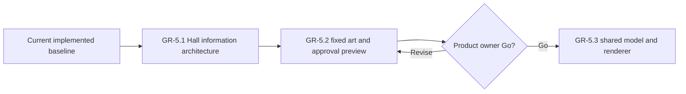

# Wayfinders current roadmap

Status: forward plan. Gameplay is complete through `GP-5.1`; the Great Hall
track is complete through `GR-5.3`.
Implemented behavior belongs in `Wayfinders_Technical_Design.md`; completed
milestones and acceptance evidence belong in `Wayfinders_Roadmap_Archive.md`.

## Standing planning rules

### Saving policy

The technical design owns the current runtime persistence boundary. For future
planning, persistence must not be added incidentally to another feature or
inferred from development-only asset authoring. It may return
only through an explicitly authorized milestone designed for the game that
exists at that time. No persistence milestone is currently planned or
authorized.

### Milestones and authorization

- `GP-x.y` identifies gameplay milestones and acceptance gates.
- `GR-x.y` identifies graphics, asset-pipeline, and production-presentation
  milestones and acceptance gates.
- `WTR-x.y` identifies the proposed water-presentation track.
- A milestone is complete only when its behavior, tests, maintainability,
  performance criteria, and acceptance evidence pass.
- This roadmap proposes sequencing but authorizes no work by itself.
- An explicitly authorized ordered batch may proceed dependency-first without
  renewed permission between its named milestones. Work pauses when the batch
  is complete or continuing needs a new product decision, expanded scope or
  authority, or an unresolved external blocker.
- Before implementation starts, record measurable baseline and regression
  budgets appropriate to the work.

Developer graphics remain valid fallback presentation. Gameplay consumes
semantic terrain and content data; rendered pixels, sprite footprints, and
animation never become gameplay authority.

In planning, **tribe** means the authoritative support state of the home
community. **Community** is the broader design term and may also describe
remote settlements. Code contracts must not use the terms interchangeably.

## Current planning point

The implemented baseline supports the prototype world and the named large-world
profiles. Its current contracts are documented in the technical design and
architecture map; its delivery history is archived.

The asset-workspace shell, focused island workshop, single island-availability
lifecycle, deterministic authored-island world planning, and chunk-bounded
authored runtime presentation are implemented. No further production-asset
milestone is currently proposed.

The Voyage Sense thread in `GP-5.1` is implemented. `GP-5.2` is the next
proposed gameplay milestone and extends that visual language into the supply
display. The water-system proposal remains a separate candidate track. Great
Hall concept and planning work is complete. The product owner accepted the
`GR-5.2` view-only approval workspace and recorded **Go** on 2026-07-16. The
shared presentation contract, renderer, fixture, game adapter, and bounded era
integration in `GR-5.3` are implemented.

## Great Hall presentation

### GR-5 — Graphical Great Hall chronicle

Status: complete through `GR-5.3`. No further milestone is planned.

Replace the text-led Great Hall with the selected **Ancestor Wall** direction:
reviewed navigator portraits, a stable achievement-symbol language, fixed
twelve-generation era pages, one selected navigator's four voyage bands, and
material states for active, completed, lost, and later-confirmed histories. All
current exact text remains available on focus or activation and to assistive
technology.

The implementation sequence is:

1. `GR-5.1` — implemented information architecture, interaction prototype,
   fixtures, and measured model baseline through twenty generations;
2. `GR-5.2` — implemented twenty predefined portraits, fixed Hall and symbol
   art, and a first-class, direct-linkable Great Hall viewing workspace,
   accepted by the product owner;
3. `GR-5.3` — one versioned JSON-compatible presentation contract, a shared
   graphical renderer for the asset viewer and game, the chronicle adapter, and
   bounded era paging, all now implemented.

The detailed current-information inventory, retained concepts, selected visual
grammar, scaling model, contracts, budgets, and acceptance gates are defined in
`Wayfinders_Great_Hall_Presentation_Milestone.md`. The closed current-data
symbol set is defined in `Wayfinders_Great_Hall_Infographic_Lexicon.md`.
Concept PNGs remain reference-only under `concept_art/great-hall` and never
load at runtime. The reviewed copies consumed by the approval workspace live at
stable paths under `public/assets/gr5/great-hall`.

## Voyage Sense

### GP-5 — Voyage Sense presentation

Status: complete through `GP-5.1`; `GP-5.2` is proposed, not started, and not
authorized.

The implemented Voyage Sense thread contract is owned by the technical design;
its scope and acceptance evidence are archived.

#### GP-5.2 — Voyage Sense supply commitments

Extend the on-board supply display so the player can see what the current
shortest known return will cost, what an available survey will cost, and what
supply remains after those commitments. This milestone changes presentation
only: provision state, fractional travel expenditure, shortest-path return cost,
survey eligibility, and survey charging remain owned by their existing
simulation systems.

Return-cost presentation:

- Derive one renderer-neutral supply-display model from current usable supply,
  `ReturnPathResult.returnCost`, and `ReturnPathResult.riskLevel`. `CargoRenderer`
  consumes that model and never recalculates a route, travel cost, or margin.
- Overlay a contiguous spend-end portion of the supply rack equal to the exact
  cost of the current shortest eligible route to Supported water. Support a
  partially highlighted bundle so the display agrees with the fractional
  provision accumulator rather than rounding the commitment to whole icons.
- Treat any already-accumulated travel fraction as unavailable to both
  commitments. It may remain visible as a depleted portion of its physical
  bundle, but it must not be counted as supply left for return or survey.
- Use the Voyage Sense thread's green, yellow, orange, and red states for the
  return-cost portion. Keep uncommitted supply visually distinct so the amount
  left after the known return is readable at a glance.
- When the known return costs more than the usable supply, colour all available
  supply red and show the exact shortfall; do not create fictitious bundle
  icons. When the ship is already in Supported water or no eligible known route
  exists, show no return-cost allocation and expose the safe/unknown state in
  text rather than inventing a cost.

Survey-cost presentation:

- Add the survey-cost layer only while one of the existing survey prompts is
  present. Use the prompt's shared `SurveyBudgetReadModel`; do not infer survey
  availability from marker proximity or duplicate its affordability rules in
  presentation.
- Highlight exactly the supply that the offered survey would spend, including
  a partial bundle if configuration permits one. While the prompt is present,
  partition usable supply from the spend end as survey cost, then shortest-known
  return cost, then uncommitted remainder. The return portion uses the projected
  post-survey risk state supplied by the shared survey budget contract, so the
  display makes an unsafe post-survey return visible before confirmation without
  presentation reclassifying the margin itself.
- Use a restrained breathing outline or luminance pulse that remains visually
  distinct from the four return-risk colours. The pulse must not change the
  authoritative amount, trigger live-region announcements on animation frames,
  or create and destroy graphics every frame. Under reduced-motion preference,
  replace it with an equally legible static emphasis.
- If the survey is unaffordable, emphasize all usable supply that would be
  consumed and state the exact survey shortfall. After a survey succeeds, is
  rejected, moves out of range, or is replaced by another prompt, update or
  clear the commitment immediately without stale highlighting.

Readability and accessibility:

- Preserve the compact diegetic bundle rack and its existing add/remove
  animation. The commitment layers must remain legible at normal gameplay zoom
  for one-row and multi-row supplies without covering the bundle count.
- Keep colour and motion supplementary. The accessible status states usable
  supply, shortest-known-return cost or unknown/safe state, offered survey
  cost, projected remaining supply, and any shortfall in concise text.
- Reuse current scene-owned screen-space presentation and lifecycle. Stable
  frames perform no route work, supply partitioning, DOM writes, graphics
  allocation, or tween creation.

Acceptance gate:

- Renderer-neutral tests cover whole and fractional usable supply, partial
  return allocations, every Voyage Sense risk colour, safe and unknown returns,
  insufficient-return shortfall, and one-row and multi-row partitioning.
- Survey presentation tests cover affordable, exactly affordable, fractional,
  unaffordable, prompt replacement, successful spend, rejection, out-of-range
  clearing, post-survey return reclassification, and reduced-motion behavior.
- Integration coverage proves the display consumes the same return and survey
  read models used by authoritative actions, and that the highlighted survey
  amount equals the amount actually charged when the action succeeds.
- Browser acceptance at normal gameplay zoom confirms readable green, yellow,
  orange, and red return allocations; a restrained survey pulse; clear
  remaining supply; immediate clearing; multi-row layout; and an equivalent
  static reduced-motion state without warning or error output.
- Focused tests, `check:quick`, architecture validation, source and test
  typechecks, and the relevant rendered-frame integration lane pass. Record
  supply-display update and stable-frame baselines before implementation and
  preserve the current normal-sailing performance contracts.

## Water presentation

### WTR-1 — Layered water system

Status: proposed, not started, and not authorized.

The proposal replaces developer water fills with deterministic, grid-aligned,
chunk-activated water presentation while preserving terrain, collision,
navigation, knowledge, and world generation as the only gameplay authorities.
Its source pack, render design, implementation sequence, budgets, and acceptance
criteria are defined in `Wayfinders_Water_System_Milestone.md`.

Before authorization, confirm the proposed art direction. Implementation must
consume the existing shared active-chunk boundary and must not introduce a
second presentation-lifetime policy or simulation clock.

## Authorization boundary

No further milestone is authorized for implementation. `GP-5.2`, the water
proposal, and any other new gameplay or production-asset milestone require
explicit user authorization. Do not implement gameplay saving; it may return
only through an explicitly authorized milestone designed for the game that
exists at that time.
