# Wayfinders development roadmap

Status: active. The current implementation is the accepted baseline. The
ordered `GP-0.1` through `GP-4.1` work and `GR-1.1` are complete and accepted.
The ordered `GR-1.2` through `GR-1.4` batch is authorized. No other later
gameplay or graphics minor is authorized by this roadmap status.

### Saving policy

Saving is intentionally absent from the active development baseline so new
gameplay does not incur schema, storage, migration, checkpoint, reload or
restoration obligations. Every launch or refresh starts a fresh session.

Saving must not be implemented, maintained as an acceptance requirement, or
added incidentally to another feature. It may return only when the user
explicitly authorizes a future named milestone whose scope includes saving.
No saving milestone is currently planned or authorized. Any older save-related
acceptance evidence below is historical and creates no present compatibility or
implementation obligation.

## Roadmap model

The work that produced the current build is historical context, not the
numbering system for future work. Forward planning uses three labels:

- **Baseline** — the implemented and protected starting point;
- **GP-x.y** — gameplay major milestones and their minor acceptance gates;
- **GR-x.y** — graphics, asset-pipeline and production-presentation gates.

A minor milestone is complete only when its behavior, tests,
readability and performance criteria pass and its acceptance evidence is
recorded. A major milestone closes only when all required minor gates pass.

Authorization and acceptance are distinct. The user may authorize one minor or
an explicitly ordered batch of named minors. Every batch member is authorized
up front, but integration and acceptance remain dependency ordered. Complete,
verify and record each minor's acceptance gate, then continue immediately into
the next named minor without asking for renewed permission. A failed check is
work to resolve within the authorized scope, not a new authorization boundary.
Work pauses only when the batch is complete, the user intervenes, or continuing
requires a new product decision, expanded scope or authority, or an unresolved
external blocker.

Before each authorized minor starts, including every member of an authorized
batch, its implementation plan records measurable baseline and regression
budgets appropriate to that work (for example frame time, memory, load time,
traffic count or bounded recovery voyages). The roadmap intentionally does not
invent target numbers before representative work exists to measure.

Developer graphics remain intentional throughout gameplay development and
remain the fallback after production assets exist. No rendered pixel, sprite
footprint or animation may become gameplay authority.

In this roadmap, **tribe** means the authoritative support state of the home
community. **Community** is the broader design term and may also describe
remote settlements. Code and save contracts must not use the terms
interchangeably.

This roadmap records proposed sequencing and authorizes no work by itself.
Implementation starts only when the user explicitly authorizes a named minor or
ordered batch of minors.

## Accepted baseline

The current build already provides:

- deterministic home waters, islands, navigation and terrain authority;
- continuous sailing, fog, current sight and Unknown, Personal and Supported
  water knowledge;
- provisions, forward/return guidance and exact-dock expedition commitment;
- Supported-route inheritance, deterministic island dossiers and their
  provisional sighting/survey to returned lead/dossier records;
- one directly sightable seed-derived historic wreck, coastal ruin and tidal
  cave using one extensible lead/report lifecycle;
- wreck rollback, persistent wrecks and exactly-once generation advancement
  per resolved wreck;
- versioned navigator identities, four-voyage tenures and exactly-once
  succession after either a completed tenure or a fatal wreck;
- exact-dock-committed achievement records for each safe voyage and a shared
  Great Hall chronicle whose focused handover mode presents them at succession;
- fresh-session startup with no browser persistence or checkpoint obligations;
- functional developer graphics, developer controls, diagnostics and the
  performance foundation.

Generation is backed by a versioned navigator lineage with distinct active,
completed and lost records. Exact-dock active-expedition returns complete one
of a navigator's four voyages, while fatal wrecks and completed-tenure
transitions share one idempotent succession authority.
Island dossier and survey-site findings are descriptive records and do not
create active resources or a tribe economy. Cross-session save/load is not part
of the active baseline.

## Cross-cutting gameplay gates

### GP-0 — Gameplay integration foundation

#### GP-0.1 — Exact-version save validation

Status: retired from the active baseline. The following acceptance evidence is
historical only and is superseded by the Saving policy above.

Acceptance evidence (updated 2026-07-13): autosave and checkpoint records pass
through one fail-closed parser for the exact current save schema, world
generator, content versions and serialized sub-format versions. Any readable
record that is malformed, older or newer is deleted instead of migrated or
preserved. A rejected autosave starts fresh; a rejected checkpoint becomes
unavailable without replacing the running world. Current docked-return,
active-expedition, pending-wreck and unacknowledged generation-handover states
still round-trip through the two atomic IndexedDB records. The full pipeline
passes 215 tests across 23 files plus typecheck and production build;
validation runs only at load boundaries
and adds no movement-loop work.

Before new authoritative gameplay state is integrated:

- decide whether storage remains one active lineage plus a checkpoint or must
  support multiple named saved games before fixing registry shape;
- establish how each owning gameplay minor adds its authoritative state and
  bumps every affected schema, content or serialized-format version;
- keep derived paths, traffic transforms and renderer state out of saves;
- treat every version field as an exact equality guard, never a migration
  selector; and
- require current-version autosave and manual-checkpoint round trips in every
  later GP minor.

Acceptance gate:

- exact current-version saves restore deterministically;
- every mismatched or malformed autosave/checkpoint is deleted and cannot
  disable or overwrite fresh play;
- feature-specific settlement idempotency is proven at its owning minor;
- existing wreck-hold and exact ship/camera restoration behavior survives;
- no later GP minor can be accepted without explicit version invalidation and
  current-version persistence coverage.

These former persistence requirements no longer apply to active milestones.
No gameplay milestone should add save fragments, schema versions or round-trip
coverage unless saving is explicitly included in its authorized scope.

#### GP-0.2 — Versioned integration boundaries

Status: accepted.

Acceptance evidence (2026-07-12): contract version one fixes the fishing-shoal
ID/content namespace, clue and quality vocabulary, hidden-versus-revealed
renderer read models, Survey/Leave commands and results, authoritative record
fragments and persistence ownership. The boundary introduces no navigator,
cargo, tribe, achievement or general-route contract. The full pipeline passes
153 tests across 17 files plus typecheck and production build; the contract
module adds no runtime loop work.

Establish only the boundaries needed by GP-1; authorization of later minors in
the same batch does not widen this gate:

- ownership of stable ID namespaces, content versions and invalidation rules;
- authoritative-versus-derived state rules;
- versioned interfaces and read models for independently owned modules;
- survey command and interaction result types;
- single-owner integration boundaries for simulation, persistence and scene
  wiring.

Cargo, tribe, navigator, achievement, general route, idol and graphics
contracts remain deferred to their owning GP/GR minor. Batch authorization of
those later minors does not pull their contract design into GP-0.2.

Acceptance gate: GP-1's opportunity identity, survey command/result types,
persistence ownership, renderer read models and narrowly required integration
boundaries are explicit, versioned and sufficient for separate pure-module
work. This is an engineering gate, not player-facing feature completion.

## Gameplay track

### GP-1 — Fishing grounds and survey work

Goal: add the first deliberate exploration job and prove the complete clue,
choice, return and inherited-result loop using developer graphics.

#### GP-1.1 — Deterministic fishing shoals

Status: accepted.

Acceptance evidence (2026-07-12): fishing content version one derives four
sparse, immutable shoal definitions from the saved seed and generation config,
with stable namespaced IDs, locations, service anchors, clues and hidden
quality outcomes. The catalog is generated off-loop and does not mutate
terrain, collision, island/resource identity or the accepted discovery
catalog. Current-sight observation is idempotent; fog-filtered read models hide
quality and never create terrain knowledge. Schema V2 added content-version
identity and sorted active-expedition sighting records; earlier schema or
content versions became incompatible. Autosave/checkpoint load paths accept
only exact current versions and delete rejected records. Developer markers are
revision-driven, pooled and viewport-culled. The full pipeline passes 159 tests
across 18 files plus typecheck and production build; normal movement checks
only the four definitions and performs no world-area scan or default visible-set
copy.

- Add sparse, seed-derived shoal IDs, locations, qualities and environmental
  clues in a namespace that cannot move islands or alter terrain.
- Add latent and sighted states without granting an economic benefit.
- Keep accepted island discoveries unchanged while the new opportunity model
  is proven.

Acceptance gate: the same world/content version produces the same shoals and
quality outcomes; clues do not reveal fogged terrain; sightings and survey
results cannot reroll after reload; existing terrain, island and discovery
identities do not change.

#### GP-1.2 — Survey action and limited capacity

Status: accepted.

Acceptance evidence (2026-07-12): the headless fishing owner exposes one
non-stacking survey case, derived exhaustively from the current allocation's
authoritative provisional state. Initial play and completed dock/respawn
allocations have one case; a survey atomically changes one sighted record to
surveyed and leaves zero, while Leave and every rejected command are
mutation-free. Wreck holds are non-interactive and reload preserves spent
capacity. Schema V3 admits at most one surveyed provisional record; every
other schema version is incompatible with that build. A temporary clue-and-case
ribbon supplies real Survey/Leave buttons, `F`/`Escape` keyboard controls and
contextual pointer or touch activation; Leave stays dismissed until the player exits, and the
1.2-second survey cue is presentation-only. Browser acceptance exercised both
buttons and the keyboard survey path with no console warnings/errors. The full
pipeline passes 162 tests across 18 files plus typecheck and production build;
proximity work remains bounded to four definitions and adds no world scan or
permanent sailing HUD.

- Add a proximity **Survey / Leave** decision.
- Begin with one fixed survey case for each new expedition allocation;
  GP-3.1 later supersedes that case with the standard provision allocation.
- Exact-home-dock replenishment or post-wreck respawn intentionally creates the
  next one-case allocation; unused cases do not accumulate between voyages.
- Sailing past a clue is free; surveying consumes a case and a short in-world
  action.
- Use developer graphics and no permanent sailing HUD.

Acceptance gate: the player can knowingly spend or preserve the case; no case
means no survey; dock, wreck and reload paths perform the one intentional
replenishment without duplicate or unearned cases; keyboard, pointer and any
approved contextual touch input work.

This accepted milestone records the original GP-1 behavior. GP-3.1 explicitly
supersedes its fixed survey case and Survey / Leave interaction with
provision-funded, supply-limited surveying; it does not rewrite GP-1's
historical acceptance evidence.

#### GP-1.3 — Provisional, returned and lost surveys

Status: accepted.

Acceptance evidence (2026-07-12): authoritative returned records are separate
from active-expedition provisional records, with exactly one legal overlap: a
returned lead plus its provisional surveyed upgrade. Exact-dock return commits
sightings as inherited inactive leads and surveys as terminal returned surveys;
wreck rollback removes only provisional state, so an earlier lead survives an
unsuccessful upgrade voyage. Returned surveys are the sole later-activation
eligible state and remain idempotent across revisit, repeat input, dock, wreck,
autosave and checkpoint round trips. Schema V4 adds sorted returned records;
other schema versions are rejected and removed. Faint provisional/lead marks
and the automatic dock report remain revision-driven, pooled, viewport-culled
and coalesced with the existing return cue. The full pipeline passes 166 tests across 18 files plus
typecheck and production build. Browser validation covers lead return, a later
Supported-water survey upgrade, exact-dock commit, terminal revisit and manual
checkpoint reload with the expected authoritative state throughout.

- Complete the branching lifecycle:
  - latent → sighted/provisional → returned lead when reported safely without
    surveying; a returned lead is inherited but inactive;
  - latent → sighted/provisional → surveyed/provisional → returned survey when
    the investigation is safely reported;
  - returned lead → surveyed/provisional upgrade → returned survey when it is
    investigated on a later expedition and safely reported. Until exact-dock
    return, the committed returned lead remains the rollback state, so a
    wreck discards only the provisional upgrade and leaves the returned lead
    intact.
- Treat a returned survey as terminal and idempotent for GP-1. Later sightings,
  survey input, docking and wreck resolution leave its record and deterministic
  outcome unchanged; they do not consume another case, create provisional state
  or duplicate its return commit or report.
- Add distinct faint provisional and returned-lead marks plus a concise
  automatic dock report.
- Commit only at the exact home dock; remove a failed expedition's provisional
  state without deleting the deterministic opportunity or any prior returned
  state.

Acceptance gate: clue, provisional sighting, returned lead, provisional survey
and returned survey are distinct; a later survey of a returned lead commits
only on exact-home-dock return and a wreck restores the same returned lead; a
returned survey is terminal and idempotent across revisits, repeat input,
dock/wreck handling and repeated autosave/manual-checkpoint round trips from a
record containing that state, with no additional case consumption, reroll, or
duplicate record, report or commit; only a returned survey is eligible for
later activation; existing provision, route-growth, wreck and generation rules
remain unchanged.

#### GP-1.4 — Returned-ground cue and connectivity proof

Status: accepted.

Acceptance evidence (2026-07-12): the exact saved-world `homeReturnTile` and
seed-derived opportunity `serviceAnchor` are the connectivity endpoints. A
cached flood uses passable Supported cells only, cardinal movement and a fixed
north/east/south/west tie-break; both endpoints must themselves qualify. The
world exposes a dedicated Supported-topology revision, so Personal knowledge,
visibility and ordinary frames do not rebuild the search. Only a connected
returned survey enters the derived activation-eligible set. It receives a
double-diamond beacon, glow ring, four cardinal rays and explicit home-linked
label; a disconnected returned survey keeps its ordinary returned mark, and
leads/provisional surveys cannot structurally request the cue. Connectivity and
paths are derived after load and never enter schema V4. The full pipeline passes
173 tests across 19 files plus typecheck and production build. Fresh-browser
validation loaded the GP-1.3 returned survey, rebuilt one connection, showed the
beacon, preserved it across manual checkpoint reload and produced no console
warnings or errors.

- Define an opportunity service anchor and a deterministic home-connected
  Supported-water eligibility check.
- Show one unmistakable developer-art cue for an eligible returned survey.
  This remains a derived, non-economic proof. Sparse fishing and trade traffic
  remains presentation-only work for a separately planned future graphics
  milestone; an authoritative tribe economy, output model or automatic trade
  system requires a separately approved future gameplay major.

Acceptance gate: returned leads and provisional surveys never show the cue;
returned surveys show it only with a valid Supported connection; connectivity
uses stable endpoints and tie-breaking; the cue is not serialized and does not
affect navigation.

Major acceptance: players understand that they noticed, chose to survey,
returned and caused a visible inherited change.

### GP-2 — Explorer lives, generations and lineage history

Goal: turn the existing generation counter into a sequence of distinct
explorers, prevent one explorer from serving forever and preserve meaningful
credit across the lineage.

#### GP-2.1 — Navigator and succession model

Status: accepted.

Acceptance evidence (2026-07-13): a dedicated lineage authority owns stable
versioned navigator IDs, lifecycle history and deterministic succession keys.
Wreck rollback terminalizes the outgoing navigator before the unchanged
four-second presentation, while completion creates exactly one successor.
Schema V5 first required a coherent lineage and pending-wreck fragment;
subsequent exact-version contracts supersede it rather than migrate it. A
mid-hold save/reload finishes the same key once
without duplicating or skipping a generation. The simulation snapshot and
browser diagnostics expose navigator
identity without moving authority into presentation. All inherited Supported
water, returned content and persistent wrecks retain their prior behavior. The
full pipeline passes 182 tests across 20 files plus typecheck and production
build.

- Give each navigator a stable ID and lifecycle state.
- Centralize succession reasons such as wreck and completed tenure.
- Preserve the four-second wreck sequence and inherited world state.

Acceptance gate: every succession creates exactly one navigator/generation;
reload during a current-version transition cannot skip or duplicate it;
non-current lineage contracts are rejected and removed.

#### GP-2.2 — Four-voyage navigator tenure

Status: accepted.

Acceptance evidence (2026-07-13): each navigator may complete at most four
numbered voyages. Only an active expedition's successful exact-home-dock
return completes a voyage; inactive docking, replenishment, idle time,
distance, travel time and reload do not. Returns one through three commit their
results and replenish normally. The fourth return commits normally and then
completes the navigator's tenure, immediately creating exactly one successor
without a retirement choice or fifth voyage. A wreck during any voyage is
fatal: it records the navigator as lost, preserves the four-second wreck
presentation and creates exactly one successor after the pending transition.
Every succession presents the required handover mode of the Great Hall: a
completed tenure shows the exact-dock-committed achievements from all four safe
voyages, while an early loss shows the committed earlier voyages followed by
the numbered voyage on which the navigator was lost at sea. The focused
handover entry includes route-
support counts, discovery names, fishing leads and surveys, and returned wreck
identities; it never credits provisional results from a fatal voyage. The
GP-2.3 chronicle reuses that same focused navigator entry in the permanent home
archive and adds derived lineage aggregates. A later navigator can sight an
unidentified runtime wreck, spend the existing one-per-voyage survey case to
identify it provisionally, and commit that identity/fate report only by
returning to the exact home dock. Retirement actions and their dock ribbon are
absent. The full verification pipeline and browser acceptance cover the voyage
status, both succession summaries, fatal-wreck transition, wreck-survey commit
and rollback, and a clean warning/error console. The full pipeline passes 215
tests across 23 files plus typecheck and production build.

- Complete one numbered voyage only on an active expedition's successful
  exact-home-dock return, after its island leads, dossiers, surveys and
  knowledge commit.
- After returns one through three, replenish and begin the next voyage with
  the same navigator; after return four, complete the tenure and create exactly
  one successor through the shared succession authority.
- Let a wreck during any voyage kill the navigator early, preserve the
  existing four-second wreck sequence and create exactly one successor when
  that persisted transition completes.
- At each fourth-return or fatal-wreck succession, show the required handover
  mode of the shared Great Hall for the outgoing navigator. For every safely
  returned voyage, list the
  Supported-route and enclosed-water counts, returned island leads and dossier
  findings, fishing leads and surveys, and returned navigator-wreck identities
  committed on that exact-dock return. Show an explicit no-new-findings message when all those
  categories are empty. Follow the committed rows with **Lost at sea** at the
  fatal voyage when applicable, and never credit that voyage's provisional
  results. Persist the unacknowledged handover and per-voyage records, reopen
  them unchanged after reload and suppress authoritative sailing until the
  player begins the successor's generation.
- Keep a later generation's sighting of a runtime player wreck unidentified
  until the player deliberately surveys it. Surveying spends the existing
  one-per-voyage survey case and makes the wreck's navigator identity and fate
  provisional to that expedition. Exact-dock return commits the report; a
  wreck before return discards it so the persistent wreck can be surveyed
  again. This adds no salvage, cargo, chart restoration or economy reward.
- Treat every return-to-next-voyage and wreck-to-successor boundary as elapsed
  world time. Safe-return transitions are immediate; wrecks retain only their
  existing four-second presentation hold, with no additional timed or
  wall-clock wait and no economy accumulation. The acknowledgement gate still
  suppresses sailing. The required committed-achievement summary makes the
  generation handover legible; later presentation may show derived world
  changes there or give the shared handover mode a richer mourning/ceremony
  presentation. Any future authoritative settlement system requires separate
  approval and is not implied by this boundary.
- Keep the limit legible through the existing navigator status and return cues
  as **Voyage n of 4**; add no retirement decision interface.

Acceptance gate: the fourth exact-dock return commits before generation
advances exactly once; the same navigator can never begin a fifth voyage; a
wreck at any voyage count ends that navigator without crediting the failed
expedition; reload cannot consume, skip or duplicate a voyage or succession;
inactive docking consumes no voyage; and inherited world state survives both
completion and loss. Status/checkpoint restoration shows the correct next
voyage and no retirement control remains. The required Great Hall handover
mode reconciles exactly with the outgoing navigator's safe-return count,
committed voyage records and fatal voyage, suppresses sailing while open and
never displays provisional achievements. A
runtime wreck is reported at most once to its correct lost navigator; sight,
survey, repeat input, exact-dock return, survey-expedition loss and reload are
  idempotent, and a failed report never restores the lost expedition's Personal
  chart or provisional findings.

#### GP-2.3 — Great Hall voyage chronicle

Status: accepted.

Acceptance evidence (2026-07-13): one versioned, ephemeral chronicle read model
derives active, completed and lost navigator entries directly from the
authoritative lineage and returned island-dossier, fishing and runtime-wreck
records. Stable navigator/voyage/achievement keys, per-navigator totals and
lineage totals are derived rather than persisted. The required GP-2.2
succession gate and the optional archive render the same navigator entry: the
handover mode focuses the outgoing navigator and can only continue through
**Begin generation n**, while home mode is dismissible and browses every
generation, including the active navigator's committed returns. **Go ashore ·
Great Hall** is available only at the exact home dock; returns one through
three update the chronicle and retain their concise dock cue without forcing it
open. A lost navigator remains **Wreck not yet located** until a later
exact-dock-returned identity report links that fate confirmation back to the
lost entry while preserving credit on the reporting voyage. No new save state,
schema migration or aggregate ledger was added. The full pipeline passes 220
tests across 24 files plus typecheck and production build.

- Present GP-2.2's four numbered, committed voyage records as a permanent,
  browsable Great Hall history and extend their stable achievement categories
  with later returned landfalls, connections and idols at their owning gates.
- Show all four returned voyages for a completed tenure. For a navigator lost
  early, show their completed voyages plus a respectful terminal lost-voyage
  record; never credit provisional achievements from that fatal expedition.
- Maintain lineage-wide aggregates. Optional browsing is available only from
  the exact home dock; important returns update the archive without forcing it
  open, and succession opens it automatically. It is never a sailing score HUD.
- Reuse GP-2.2's committed transition records in the permanent chronicle. The
  bounded handover is the required succession mode of that shared Great Hall;
  generation browsing and aggregates remain exclusive to its optional home
  mode.
- Show a lost navigator as **Lost at sea** before their wreck is located. When
  GP-2.2's provisional wreck-identity survey is returned, attach the confirmed
  wreck and fate report to the correct navigator. Generic wreck salvage,
  bounded chart recovery and economy effects are explicitly deferred.

The chronicle presentation begins after GP-2.2 supplies stable voyage ordinals,
terminal states and committed summaries, but each later category is integrated
at its owning gate: returned surveys after GP-1.3, returned island dossiers
after GP-3.2, returned survey-site results after GP-3.3 and returned idol-location
findings after GP-4.1. Stable achievement keys must include navigator and voyage
identity and prevent duplicate credit.

Acceptance gate: only exact-dock-committed achievements receive credit; four
numbered positions reconcile with each navigator's completed-voyage count and
terminal state; no reload or checkpoint replay duplicates credit; navigator and
lineage totals reconcile; provisional information never appears as permanent
history.

### GP-3 — Provision-funded surveying and discoverable places

Goal: make expedition supplies support repeated, meaningful investigation and
expand surveying from the first fishing and navigator-wreck cases to islands
and an extensible set of world sites. GP-3 adds no tribe economy, output model,
voyage loadouts, automatic trade or generic wreck-salvage system.

#### GP-3.1 — Provision-funded surveying

Status: accepted.

This milestone supersedes GP-1's accepted fixed, non-stacking survey case while
leaving that historical acceptance record intact.

- Guarantee the same standard provision allocation at the beginning of every
  journey. GP-3 adds no selectable loadout, tribe reserve or recovery tier.
- Remove authoritative survey-case state and remove the **Leave** command,
  button and keyboard action. Seeing a clue and sailing past it remain free.
- Keep the contextual survey prompt non-modal. It offers only **Survey**, stays
  out of the sailing HUD and automatically dismisses when the ship leaves the
  target's interaction range; returning to range may show it again.
- Give each survey target a deterministic provision cost. Before confirmation,
  show both that cost and its projected impact on the known return route using
  the same provision budget and return-path authority as sailing.
- Apply the provision spend and provisional survey result as one authoritative
  transaction. A rejection, stale command, duplicate command or failed
  validation changes neither supplies nor target state.
- Allow multiple surveys on one journey while provisions remain. Surveying is
  supply-limited rather than capped by a separate case counter.

Acceptance gate: every journey begins with the standard supplies exactly once;
sighting, prompt dismissal and sailing away cost nothing; a successful survey
spends the displayed provisions exactly once and immediately refreshes
forward/return guidance; insufficient supplies reject without mutation;
repeat input and current-version reload cannot spend or award twice; fishing-
ground and navigator-wreck surveys retain exact-dock commitment and wreck
rollback; the non-modal prompt never suppresses sailing and sail-away dismissal
requires no Leave action.

Acceptance evidence: the fixed survey allocation and Leave path are absent;
fishing-ground and navigator-wreck surveys share a configurable two-bundle
cost, expose remaining supply and projected return margin, and commit the spend
with provisional state atomically. Multiple targets can be surveyed during one
journey, fractional travel spend is included in affordability, and steering
remains live while the prompt is visible. At this historical GP-3.1 acceptance
gate, exact-version schema 10 rejected old saves; accepted GP-3.2 subsequently
bumped the current schema to V11. The GP-3.1 typecheck, 227-test suite and
production build passed.

#### GP-3.2 — Island landfalls and single-dossier surveys

Status: accepted.

Depends on GP-3.1's provision-funded survey transaction and the accepted stable
island identity, sight and exact-dock expedition boundaries.

Acceptance evidence (2026-07-13): island-dossier content V1 derives exactly one
stable definition, deterministic name and descriptive result from each non-home
island ID. Every exact-island footprint has a sorted set of passable,
dock-reachable coastal approaches within 1.5 tile widths; the canonical
approach is a developer/presentation convenience rather than the only valid
interaction point. Current sight records a free provisional lead without
exposing the hidden result. The shared provision-funded **Survey** transaction
upgrades either that sighting or a returned lead exactly once. Exact-dock return
commits a lead or dossier with expedition/generation provenance, while wreck
rollback removes only the active expedition's provisional work. Surveyed state
suppresses fog on every tile carrying that exact island ID and on no surrounding
water or other island, without mutating knowledge, topology, travel cost or
route credit. The legacy `DiscoverySystem` and its island discovery records are
removed. Exact save schema V11 validates island-dossier content V1 and lineage
contract V5; the Great Hall V2 read model gives distinct, idempotent island-lead
and island-dossier achievements and lineage totals. Developer placeholder
markers, a Survey-only coastal prompt and next-island-dossier inspection support
the complete loop. The GP-3.2 typecheck, 244-test suite across 26 files and
production build pass.

- Make first sight of a non-home island free. It records a provisional island
  lead without spending provisions or revealing the island's full dossier.
- Derive a coastal approach ring from the exact generated island footprint.
  A dock-reachable passable water tile is a valid approach when the Euclidean
  distance between its center and the center of at least one tile carrying that
  exact island ID is at most 1.5 tile widths. The interaction is not tied to
  one arbitrary marker or to land movement.
- Give each exact island ID one deterministic dossier and at most one dossier
  survey state. Surveying from any valid approach tile uses GP-3.1's cost and
  transaction; repeated approach tiles cannot create duplicate dossiers.
- Fold the former one-per-island generated discovery into that dossier's
  descriptive result. Retire its `HistoricWreck` and `FishingGround` outcomes
  as separate island-discovery target types: GP-3.3 sites and
  GP-1 shoals are the only authoritative historic-wreck and fishing targets.
- Preserve the returned-lead branch. Exact-dock return of a sighted but
  unsurveyed island commits an inherited lead. Surveying a provisional sighting
  or a returned lead creates a provisional dossier; exact-dock return commits
  it, while a wreck removes that expedition's provisional sighting/dossier and
  restores any previously returned lead.
- Derive full reveal of tiles carrying that exact island ID from the
  provisional or returned dossier. This fog presentation does not write
  `KnowledgeState`, reveal other islands or water, change travel cost, create a
  Supported route or mutate generated terrain.
- Add no separate historic-wreck, ruin, cave or other site leads in GP-3.2; the
  island itself is the single survey target and dossier owner, and its dossier
  neither spawns nor unlocks a nested point target.

Acceptance gate: sighting and naming an island is free; every eligible approach
tile is derived from the exact footprint and is passable and dock-reachable;
one island ID can produce only one deterministic dossier regardless of approach
tile, revisit or reload; lead, provisional dossier and returned dossier remain
distinct; wreck rollback loses only the current expedition's work; exact-dock
return commits once; full exact-island-ID reveal appears and rolls back from
dossier state without changing knowledge counts, route costs, connectivity,
terrain or another island's fog; legacy island discovery categories cannot
duplicate a GP-1 shoal or GP-3.3 site.

#### GP-3.3 — Extensible survey sites

Status: accepted.

Depends on GP-3.1's survey transaction and GP-3.2's accepted separation between
island dossiers, fog presentation and generated terrain.

Acceptance evidence (2026-07-13): survey-site content V1 derives exactly one
historic wreck, one coastal ruin and one tidal cave from the seed, each with a
stable typed ID, independently sightable clue tile, passable dock-reachable
service anchor, deterministic hidden result and developer placeholder
presentation. All three descriptors use the same free `sighted`, shared two-
bundle `surveyed`, returned `lead` / `report` and wreck-rollback lifecycle.
Island dossiers neither spawn nor unlock sites; historic sites remain distinct
from runtime navigator wrecks. A synthetic fourth descriptor passes the shared
catalog/lifecycle contract without a new command, reducer or persistence
fragment. Exact-dock site credit uses lineage V6 voyage records V3 and Great
Hall V3 lead/report achievements and totals. Save schema V12 accepts only exact
survey-site content V1 and persists minimal provenance records; definitions and
hidden results regenerate. Developer controls move directly to each initial
type's service anchor. Typecheck, 262 tests across 28 files and the production
build pass. Browser acceptance confirms the three matching service-anchor
interactions, live unsuppressed input with the drawer open, Survey-only prompt,
developer placeholder art and a clean warning/error console.

- Add one versioned, seed-derived survey-site catalog whose only content types
  shipped in GP-3.3 are **historic wreck**, **coastal ruin** and **tidal cave**.
  Historic sites remain distinct from runtime wrecks left by lost navigators.
- Give all three types the same free sighting, non-modal prompt,
  returned-lead branch, provision-funded survey, provisional result, exact-dock
  return and wreck-rollback mechanics. A data-driven type descriptor supplies
  placement, clue, result vocabulary and presentation IDs rather than changing
  the lifecycle.
- Let types differ only where content should differ: stable placement rules,
  environmental clues, deterministic survey results and developer/production
  art. Adding a later non-idol site type must not require another interaction or
  persistence model.
- Keep every site independently seed-derived and directly sightable. Island
  dossiers do not spawn, unlock or point to these sites; chained leads and
  nested site-within-island discoveries are deferred expansion work.
- Treat each result as descriptive returned knowledge and Great Hall credit.
  GP-3.3 results do not refill provisions, reveal water routes, create safe
  waypoints or generate follow-on leads.
- Keep site definitions separate from terrain and island generation authority;
  sites may attach to stable island/coastal anchors but cannot edit collision,
  island IDs, `KnowledgeState` or travel costs.
- Add no idols, idol clues, relic cargo, archive progress or completion state.
  Those remain exclusively GP-4 work.

Acceptance gate: the same seed/content version produces the same site IDs,
types, placements, clues and hidden results; all initial types pass one shared
lifecycle and survey-cost contract; unsurveyed state never reveals hidden
results or clears area fog, while a successful survey reveals its result only
to the active expedition until exact-dock return; return and wreck rollback are
idempotent across reload; runtime navigator wreck identity remains unambiguous;
a synthetic fourth non-idol descriptor can pass the shared contract tests
without a new command, reducer or save fragment, but it does not ship as
GP-3.3 content; no idol state exists.

### GP-4 — Lost idol locations and lineage completion

Goal: make the lineage's finite long-term objective the discovery and safe
return of knowledge describing every idol location lost when the world split
into islands. Idols are never recovered or transported as physical objects.

#### GP-4.1 — Lost idol locations and game completion

Status: implemented and accepted.

Depends on GP-3.3's accepted deterministic survey locations and GP-2.3's stable
navigator, voyage and Great Hall credit.

- Add a finite, separately versioned idol-location catalog. Each world configures
  a positive idol count; the default world uses exactly three. Deterministically
  select that many unique eligible survey locations without replacement, with
  at most one idol per location. Reject a world configuration whose count
  exceeds its eligible locations rather than silently reducing it.
- Make every current seed-derived survey location eligible except fishing
  shoals: one-dossier non-home islands plus historic-wreck, coastal-ruin and
  tidal-cave sites. Runtime navigator wrecks are dynamic fate-report locations,
  not seeded idol hosts. Future survey families must declare whether they are
  eligible.
- Keep the idol mapping hidden until its host is surveyed. Add no advance idol
  marker, remote clue chain or idol-specific command. The existing
  provision-funded **Survey** action yields its normal result plus a special
  provisional idol-location finding when the host contains one.
- Reuse the host survey's expedition ownership. A wreck discards the provisional
  idol finding so it can be discovered again; exact-dock return commits it once.
  No physical idol, recovery action, cargo, loss site, currency, power or upgrade
  exists.
- Record each returned idol-location finding as a distinguished achievement in
  the existing Great Hall for the exact navigator and voyage that brought the
  knowledge home. Show returned-location progress against the configured total
  without revealing any undiscovered host. Do not add a Gem Hall, Relics wing or
  normal-sailing score HUD.
- After exact-dock settlement returns the final location, commit the finding and
  Great Hall credit first, then present the final Great Hall with the completed
  lineage history and two choices:
  - **Continue Exploring** returns to the same completed world at home. Completion
    can never trigger again, ordinary voyage/succession/discovery play continues
    indefinitely, and the Great Hall remains normally accessible for later
    viewing.
  - **Start New Game** discards the current in-session world and starts a fresh
    lineage with a newly generated seed that cannot equal the prior world's
    seed.
- If the final return is also a navigator's fourth voyage, show the final Great
  Hall first. Continuing then resumes the required succession handover before
  further sailing. Starting a new game discards that pending transition with the
  rest of the completed world.

Acceptance gate: the default seed contains exactly three unique idol hosts; the
same seed, idol count and content version produce the same order-independent
idol-to-host mapping; every host is an eligible existing survey location and no
fishing shoal or runtime navigator wreck can host one; hidden read models expose
the total but no undiscovered location; normal survey cost, provisional state,
wreck rollback and exact-dock commitment remain exactly-once and idempotent; the
Great Hall credits the correct navigator/voyage without duplicates; only the
final returned location opens the final Great Hall; **Continue Exploring** can
never replay completion and preserves normal Great Hall access; **Start New
Game** resets all world/lineage state with a different seed; catalog generation
changes no terrain, island identity or existing survey placement and adds no
full-world fixed-update work. Saving and production art remain out of scope.

Implementation evidence: idol-location contract/content V1 selects immutable
unique hosts from canonical eligible inputs and validates the configured count;
the simulation derives provisional, returned and lost idol knowledge from host
survey state; Great Hall read model V4 derives exact navigator/voyage credit and
safe returned/total progress; completion has explicit `awaiting-choice` and
non-retriggering `continued` states; scene presentation gives the final Hall
priority over ordinary return and succession cues. Catalog, integration, Hall,
completion-choice, seed-reset and final-voyage-order tests are part of the clean
typecheck/test/build gate recorded in `IMPLEMENTATION_STATUS.md`.

## Graphics track

### GR-0 — Developer graphics contract

Status: active baseline contract, not a production-art milestone.

- Every GP minor receives functional placeholder presentation.
- Developer assets remain the fallback after the production pipeline exists.
- Gameplay remains readable under fog, Personal grey and risk overlays.
- Missing production assets never block gameplay testing.

Acceptance gate on every GP minor: each new authoritative state is
distinguishable at normal zoom, overlays remain readable and presentation does
not define collision, identity or rules.

### GR-1 — Authored-asset runtime pilot

Start gate: satisfied because GP-3.3 is accepted. The ordered `GR-1.1` through
`GR-1.4` batch is authorized; `GR-1.1` is accepted.

Goal: prove the smallest useful path from externally generated source art to
grid-aligned runtime assets. Asset generation and preparation happen before the
game loads them. The runtime procedurally places complete authored assets; it
does not generate an island by selecting and joining interchangeable terrain
squares.

The ordered pilot covers exactly one authored home island, the player boat and
one fishing-shoal representation. The example images under
`concept_art/example assets` are reference material only and must not be loaded
or adapted directly as runtime assets.

#### GR-1.1 — Authored asset and grid-metadata contract

Status: implemented and accepted.

Define the minimal semantic IDs and metadata needed by the pilot:

- source and derived-runtime identity for the home island, player boat and one
  shoal;
- grid dimensions, placement origin, render offsets, scale and depth;
- an authored home-island cell map describing terrain, collision, shallows,
  harbour, dock and return/service anchors;
- boat origin, visual bounds and heading/animation behavior; and
- shoal footprint, passability and service anchor.

A whole island may be cut into runtime slices for texture limits, grid
alignment, fog or culling, but those slices remain parts of one authored
composition. The runtime may not rearrange them into a new island. Rendered
pixels are never sampled for gameplay; validated metadata supplies the logical
shape and anchors.

Acceptance gate: contract fixtures reject missing cells, overlapping or
out-of-range slices, invalid anchors, inconsistent dimensions and a blocked
dock approach; the complete authored home layout maps exactly onto the
navigation grid; boat and shoal contracts have unambiguous origins and bounds;
and no contract requires a viewer, editor, asset-lifecycle registry or general
non-home-island refactor.

Implementation evidence: authored asset contract V1 fixes semantic IDs for the
home island, player boat and pilot fishing shoal; validates complete cell maps,
terrain-derived collision, exact dock/return/service anchors, fixed render
slices, normalized origins, all-heading boat metadata and passable read-model-
gated shoals; and rejects invalid layouts before runtime integration. The clean
typecheck, 245-test and production-build gate passes.

#### GR-1.2 — Minimal package loading

Status: authorized; next in the ordered batch.

Add the smallest runtime boundary that loads the three accepted packages and
their metadata when the game starts. A typed catalog maps semantic IDs to
runtime files and validated metadata. It supports a whole texture or ordered
slices from the same authored composition and keeps filenames out of gameplay
and renderer call sites.

This minor does not add candidate/approved/deprecated lifecycle states,
deterministic visual variants, atlas automation, hot swapping or a generalized
resolver. Existing developer graphics remain the explicit fallback when a
package cannot load or validate.

Acceptance gate: all three packages preload before their renderers are created;
valid packages resolve by semantic ID; missing images and invalid metadata fail
legibly and preserve usable developer presentation; regeneration does not
duplicate textures or display objects; and loading stays within the approved
pilot memory and startup-time budgets.

#### GR-1.3 — Home island, boat and shoal proof

Status: authorized; pending GR-1.2 acceptance.

Generate new grid-ready art for the current game rather than using the example
assets directly. Integrate:

- one complete authored home-island composition, stamped at the procedural
  world's home placement from its validated terrain and anchor metadata;
- one player-boat asset using the current continuous position and heading; and
- one fishing-shoal asset at one deterministically selected existing shoal,
  while all other shoals retain developer presentation.

The home island's shape comes from its authored package, not the existing
radius/noise painter or runtime tile assembly. World placement, island identity,
ship movement, shoal placement and discovery state remain procedural and
authoritative. Fog, knowledge, risk, route and interaction presentation remain
separate runtime layers.

Acceptance gate: the authored home layout produces a reachable dock and the
expected land/shallow/collision map at the home anchor; the boat remains aligned
through turning, sailing, docking, teleport and wreck/reset presentation; the
chosen shoal remains passable, appears only when its existing read model permits
and preserves its full survey/return/wreck lifecycle; all three assets remain
readable at normal zoom under fog and overlays; unchanged gameplay outside the
home layout passes regression tests; and the approved startup, memory, draw-call
and frame-time budgets pass.

#### GR-1.4 — Directional boat and wake animation

Status: authorized; pending GR-1.3 acceptance.

Turn the GR-1.3 player-boat proof into a finished animated vessel. Use the
simplest animation approach that remains convincing at the game's normal zoom:
directional frames or a rotation-safe sprite for every heading, restrained hull
or sail motion, and a speed-responsive wake animation while moving. Animation
is presentation-only and continues to follow the interpolated simulation pose.

The boat must look intentional rather than mirrored or upside down at every
heading. Its origin, visual footprint, heading convention and animation timing
belong to the authored package metadata. Wake frames or particles remain a
separate layer behind the boat, stop promptly when stationary and do not affect
movement, collision, fog or voyage state.

Acceptance gate: representative cardinal, diagonal and wraparound headings have
the correct bow direction and stable origin; turns do not pop, mirror or drift
off the simulation position; motion animation is restrained and legible; wake
direction, intensity and cadence respond to speed and disappear at rest; the
boat remains correct during forward/reverse movement, docking, teleport,
wreck/reset and camera zoom; and the approved memory, draw-call and frame-time
budgets pass.

### GR-2 — Asset viewing and creation tooling

Status: deferred until GR-1.4 is accepted and its manual asset-preparation
friction is understood. GR-2 remains necessary for later expansion but is not
part of the authored-asset pilot.

#### GR-2.1 — Runtime asset viewer

Status: proposed.

Build a browser using the same Phaser renderer, factories, camera and texture
path as the game. Preview IDs, headings, animations, origins, footprints, fog,
overlays and fixed-seed placement without inventing parallel gameplay rules.

Acceptance gate: the same asset/metadata renders equivalently in viewer and
game; missing frames, invalid origins and overlay contrast problems are visible
without a voyage.

#### GR-2.2 — Candidate intake and creation workbench

Status: proposed.

Create or import candidate records from templates; edit semantic metadata;
validate frames, dimensions and variants; export tracked source/runtime files
and a package-catalog entry consumable by both viewer and game.

Acceptance gate: invalid IDs, missing frames, incompatible dimensions and
incomplete metadata are rejected; valid output loads in viewer and game without
duplicate configuration.

#### GR-2.3 — Conditional build automation

Status: optional and proposed only after repeated manual work proves the need.

Add typed ID generation, thumbnails, atlas packing or batch validation only
when it removes measured repetition and produces deterministic outputs.

Acceptance gate: clean rebuilds are byte-for-byte or semantically reproducible,
stay within texture limits and demonstrably remove repeated manual work.

### GR-3 — Deferred production expansion

Status: placeholder only. Do not define or authorize GR-3 minors until the
authored-asset GR-1 pilot and the relevant GR-2 workflow have shown what should
be standardized. Later planning may cover authored non-home island packages,
remaining shoals, survey sites, activity presentation, lineage/completion art,
environmental polish and platform validation. It must preserve procedural
whole-asset placement and must not reintroduce runtime island construction from
interchangeable grid squares.

## Dependencies and safe parallel work

The graph shows acceptance dependencies, not authorization for concurrent
integration. A minor may be authorized individually or within an ordered batch,
but it may be integrated or accepted only after all incoming acceptance
dependencies pass. Batch authorization waives neither dependency order nor the
safe-parallel-work limits below.

```mermaid
flowchart LR
    B["Accepted baseline"] --> GP0["GP-0 exact save boundary and first contracts"]
    GP0 --> GP1["GP-1 fishing and surveying"]
    GP0 --> GP21["GP-2.1 navigator and succession"]
    GP21 --> GP22["GP-2.2 four-voyage tenure"]
    GP1 --> GP23["GP-2.3 Great Hall chronicle"]
    GP22 --> GP23
    GP1 --> GP31["GP-3.1 provision-funded surveying"]
    GP23 --> GP31
    GP31 --> GP32["GP-3.2 island dossiers"]
    GP32 --> GP33["GP-3.3 extensible survey sites"]
    GP33 --> GP41["GP-4.1 idol locations and completion"]
    GP23 --> GP41
    GP33 --> GR11["GR-1.1 authored asset contract"]
    GR11 --> GR12["GR-1.2 minimal package loading"]
    GR12 --> GR13["GR-1.3 three-asset proof"]
    GR13 --> GR14["GR-1.4 animated boat and wake"]
    GR14 --> GR2["GR-2 deferred viewer and intake tooling"]
    GR2 -. future replanning .-> GR3["GR-3 production expansion placeholder"]
```

Work may proceed in parallel only after its relevant minor is authorized,
individually or within a batch, and its minimal versioned contracts are
accepted:

| Workstream | Safe parallel boundary | Integration gate |
| --- | --- | --- |
| Opportunity catalog | New deterministic catalog module and dedicated tests; do not edit terrain/island generators | Content-version and save identity are integrated by one owner |
| Survey lifecycle | Separate headless opportunity-state reducer and tests against frozen catalog types | One owner wires actions, return/wreck behavior and saves |
| Navigator identity, voyage-tenure policy and chronicle reducers | Separate headless lineage modules/read model and dedicated tests | Succession/event/save integration is serialized |
| Island approach and dossier derivation | New pure footprint/ring and fog-read-model modules against stable island IDs | World observation, scene fog composition and save wiring are serialized |
| Survey-site presentation | New clue/site renderers against frozen read models | Scene construction, input and lifecycle wiring are serialized |
| Fishing/trade traffic presentation | Graphics-only renderer/path work after GP-3.3 and the relevant GR interfaces are accepted | Traffic must remain derived, non-authoritative and absent from saves |
| Save version validation/invalidation | One persistence owner can work beside pure modules after the current state shape is approved | Parser/store/startup and shared exact-version round-trip tests remain one integration gate |
| Idol locations and completion | Pure deterministic host catalog and read-model tests after survey-site and navigator IDs freeze | One owner integrates survey results, exact-dock credit, final Great Hall and completion ordering |
| Authored asset packages and loader | New asset-contract/runtime modules after the GP-3.3 start gate; source-art generation stays outside game code | Home generation and renderer replacement are serialized through the ordered GR-1 gates |
| Isolated asset viewer/intake tools | New tooling directory after the relevant GR-1 runtime interfaces are accepted | Game integration and production passes wait for GR-2 acceptance |

Central integration files are single-owner merge gates and should not be edited
concurrently by feature agents:

- `src/wayfinders/core/GameSimulation.ts`, `GameEvents.ts` and shared core types;
- `src/wayfinders/persistence/SaveGame.ts`, `IndexedDbSaveStore.ts` and exact
  version-validation policy;
- `src/wayfinders/rendering/WayfindersScene.ts`, `CargoRenderer.ts`, action
  input and autosave wiring;
- `src/wayfinders/config/prototypeConfig.ts` and `src/main.ts`;
- `WorldGenerator.ts`, `IslandGenerator.ts` and content-version ownership; and
- `tests/helpers.ts` plus shared save, persistence, expedition and
  full-simulation tests.

Provision spending, survey commitment/rollback, voyage succession,
idol-location credit and endgame all change lifecycle ordering. Their pure domain models can overlap,
but their integration must be serialized through one owner. Each parallel
branch should add its own new modules and tests; a designated integrator
performs schema, simulation and scene changes at the documented gate.

These boundaries describe the current architecture and must be re-audited when
each minor is planned; they are not permanent product rules.

## Explicitly deferred

- Production-asset replacement until a GR-1 minor is explicitly authorized,
  despite its GP-3.3 dependency gate now being open.
- Authoritative tribe economy/output, selectable voyage loadouts, generic wreck
  salvage/recovery and automatic trade gameplay.
- Chained discovery quests, island dossiers that spawn separate site leads and
  nested site-within-island targets.
- Large resource catalogs, dynamic pricing, arbitrage, markets, manual route
  assignment, fleet management and labour allocation.
- Real-time economic refill timers or idle progression.
- NPC collision, combat, escorts or direct fleet commands.
- Family trees, inheritable traits, politics, illness, age simulation and
  non-wreck mid-voyage death.
- Physical idol recovery/cargo, idols as money or compulsory upgrades, arbitrary
  open-water collectibles, and a forced ending without continue/new-game choice.
- A permanent economy panel or arcade score HUD.
- A custom pixel editor or mass asset automation before the viewer/intake
  workflow demonstrates a concrete need.
- Touch-first sailing until it is separately designed and approved as a
  gameplay/platform input minor; graphics validation alone cannot supply it.
- Cloud sync, server saves and multiplayer.

## Confirmed immediate decisions

The following GP-0/GP-1 decisions are confirmed and are the basis of the
authorized ordered batch:

1. The Baseline plus `GP-*`/`GR-*` major-and-minor roadmap model is accepted.
2. Storage remains one active lineage with a rolling autosave and one
   overwriteable checkpoint; there is no named-game registry in this batch.
3. Saves load only when schema, generator, content and serialized-format
   versions exactly match the running build. Rejected records are deleted;
   development builds do not migrate or preserve older/newer saves.
4. GP-1 used fishing shoals, one non-stacking fixed survey case per new
   expedition allocation and developer art. This remains accurate accepted
   history; GP-3.1 explicitly supersedes the case and Leave interaction.
5. A safely returned but unsurveyed sighting becomes an inactive persistent
   lead that can be surveyed later. A wreck loses only the current expedition's
   provisional state and preserves any earlier returned lead.
6. GP-3.3 opened the GR-1 dependency gate. The ordered `GR-1.1` through
   `GR-1.4` authored-asset pilot is authorized; accepted gates continue directly
   to the next batch member without renewed permission.

Additional product decisions are recorded here for later milestones:

- GP-2.2 is confirmed and accepted: each navigator may complete at most four
  active-expedition exact-dock voyages; the fourth return commits before
  automatic succession, while a wreck during any voyage is fatal and creates
  a new navigator after the compressed non-return/mourning transition. Every
  succession summarizes the achievements committed on each safe voyage and
  shows no provisional achievements for a fatal voyage. A later navigator may
  survey the lost navigator's unidentified runtime wreck with the existing
  GP-2 survey case, but only exact-dock return commits its identity/fate report.
  GP-3.1 later replaces that case with an atomic provision cost without changing
  the returned-report boundary.
- GP-3 is confirmed as exactly three minors: provision-funded surveying; one
  exact-island-ID dossier per landfall; and data-driven historic-wreck, coastal-
  ruin and tidal-cave survey sites. Standard supplies are guaranteed every
  journey; survey cases and Leave controls are removed; non-modal prompts
  dismiss by sailing away; multiple surveys are limited by provisions; island
  fog reveal is dossier-derived and does not mutate knowledge or travel; and no
  idol, tribe economy/output, loadout, trade or generic wreck-recovery state is
  added.
- GP-4.1 is accepted as one complete survey-to-ending slice: exactly three
  idol locations in the default world, deterministic unique placement across
  non-fishing seeded survey locations, normal provision-funded survey and
  wreck/exact-dock knowledge rules, distinguished Great Hall credit, a final
  Great Hall, continued play with later Hall access, or a fresh new-seed game.
  There is no physical idol recovery, cargo, Gem Hall or Relics wing.
- Touch-first sailing needs a separately scoped gameplay/platform input minor
  if it is a target; future graphics/platform validation covers only input that
  has actually been built.

Recommended delivery rule: parallel feature agents own disjoint new
modules/tests, while one integration owner changes shared lifecycle, save and
scene files within each minor. Reconfirm the file ownership map in every
authorized minor's implementation plan. In an authorized batch, record each
minor's acceptance evidence and continue directly to the next included minor
when its gate and dependencies pass; do not request renewed permission between
batch members.
