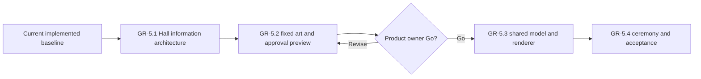

# Wayfinders current roadmap

Status: forward plan. The Great Hall approval preview is implemented and awaits
the product-owner decision; other proposed implementation remains unauthorized.
Implemented behavior belongs in `Wayfinders_Technical_Design.md`; completed
milestones and acceptance evidence belong in `Wayfinders_Roadmap_Archive.md`.

## Standing planning rules

### Saving policy

The technical design owns the current runtime persistence boundary. For future
planning, persistence must not be added incidentally to another feature or
inferred from development-only asset authoring. It may return
only through an explicitly authorized milestone designed for the game that
exists at that time. No persistence milestone is currently planned or
authorized.

### Milestones and authorization

- `GP-x.y` identifies gameplay milestones and acceptance gates.
- `GR-x.y` identifies graphics, asset-pipeline, and production-presentation
  milestones and acceptance gates.
- `WTR-x.y` identifies the proposed water-presentation track.
- A milestone is complete only when its behavior, tests, maintainability,
  performance criteria, and acceptance evidence pass.
- This roadmap proposes sequencing but authorizes no work by itself.
- An explicitly authorized ordered batch may proceed dependency-first without
  renewed permission between its named milestones. Work pauses when the batch
  is complete or continuing needs a new product decision, expanded scope or
  authority, or an unresolved external blocker.
- Before implementation starts, record measurable baseline and regression
  budgets appropriate to the work.

Developer graphics remain valid fallback presentation. Gameplay consumes
semantic terrain and content data; rendered pixels, sprite footprints, and
animation never become gameplay authority.

In planning, **tribe** means the authoritative support state of the home
community. **Community** is the broader design term and may also describe
remote settlements. Code contracts must not use the terms interchangeably.

## Current planning point

The implemented baseline supports the prototype world and the named large-world
profiles. Its current contracts are documented in the technical design and
architecture map; its delivery history is archived.

The asset-workspace shell, focused island workshop, single island-availability
lifecycle, deterministic authored-island world planning, and chunk-bounded
authored runtime presentation are implemented. No further production-asset
milestone is currently proposed.

The water-system proposal remains a separate candidate track. Great Hall
concept and planning work is complete. `GR-5.1` and the `GR-5.2` view-only
approval workspace are implemented; `GR-5.2` remains open for product review.
Game integration in `GR-5.3` remains blocked until the product owner records an
explicit **Go**.

## Great Hall presentation

### GR-5 — Graphical Great Hall chronicle

Status: `GR-5.1` and the `GR-5.2` approval workspace are implemented. Product
review and an explicit **Go** are still required to close `GR-5.2`; later
milestones remain gated by that decision.

Replace the text-led Great Hall with the selected **Ancestor Wall** direction:
reviewed navigator portraits, a stable achievement-symbol language, fixed
twelve-generation era pages, one selected navigator's four voyage bands, and
material states for active, completed, lost, and later-confirmed histories. All
current exact text remains available on focus or activation and to assistive
technology.

The implementation sequence is:

1. `GR-5.1` — implemented information architecture, interaction prototype,
   fixtures, and measured model baseline through twenty generations;
2. `GR-5.2` — implemented twenty predefined portraits, fixed Hall and symbol
   art, and a first-class, direct-linkable Great Hall viewing workspace; open
   only for interactive product review and the explicit decision;
3. `GR-5.3` — one versioned JSON-compatible presentation contract, a shared
   graphical renderer for the asset viewer and game, the chronicle adapter, and
   bounded era paging after that preview approval; and
4. `GR-5.4` — ceremony modes, responsive/accessibility polish, visual review,
   shared-host equivalence, and twenty-generation performance acceptance.

The detailed current-information inventory, retained concepts, selected visual
grammar, scaling model, contracts, budgets, and acceptance gates are defined in
`Wayfinders_Great_Hall_Presentation_Milestone.md`. The closed current-data
symbol set is defined in `Wayfinders_Great_Hall_Infographic_Lexicon.md`.
Concept PNGs remain reference-only under `concept_art/great-hall` and never
load at runtime. The reviewed copies consumed by the approval workspace live at
stable paths under `public/assets/gr5/great-hall`.

## Water presentation

### WTR-1 — Layered water system

Status: proposed, not started, and not authorized.

The proposal replaces developer water fills with deterministic, grid-aligned,
chunk-activated water presentation while preserving terrain, collision,
navigation, knowledge, and world generation as the only gameplay authorities.
Its source pack, render design, implementation sequence, budgets, and acceptance
criteria are defined in `Wayfinders_Water_System_Milestone.md`.

Before authorization, confirm the proposed art direction. Implementation must
consume the existing shared active-chunk boundary and must not introduce a
second presentation-lifetime policy or simulation clock.

## Explicitly deferred

- Broad runtime-asset expansion beyond the proposed authored-island track until
  a separate content batch defines and authorizes its packages, placement, and
  gameplay-facing semantics.
- Authoritative tribe economy/output, selectable voyage loadouts, generic wreck
  salvage/recovery, and automatic trade gameplay. Product rationale and open
  questions belong in `Wayfinders_Economy_Design.md`.
- Chained discovery quests, nested site targets, large resource catalogs,
  dynamic pricing, markets, fleet management, and labour allocation.
- Real-time economic refill timers or idle progression.
- NPC collision, combat, escorts, or direct fleet commands.
- Family trees, inheritable traits, politics, illness, age simulation, and
  non-wreck mid-voyage death.
- Physical idol recovery/cargo, idols as money or compulsory upgrades, and a
  forced ending without the current continue/new-game choice.
- A permanent economy panel or arcade score HUD.
- A general-purpose raster, pixel-art, atlas, or animation editor.
- Touch-first sailing until separately designed and approved.
- Gameplay saving, cloud sync, server-backed voyage saves, and multiplayer.

## Authorization boundary

No further milestone is authorized for implementation. `GR-5.2` remains open
only for product review and bounded revisions to its approval preview. `GR-5.3`
and `GR-5.4` require the product-owner **Go** recorded after that review. The
water proposal, gameplay persistence, a new gameplay or production-asset
milestone, broad runtime content rollout, or any other deferred scope requires
explicit user authorization.
