# Wayfinders current roadmap

Status: planning. The accepted gameplay work through `GP-4.1` and graphics
work through `GR-1.4` form the current baseline. `GR-2.1` through `GR-2.3` are
implemented as one dependency-ordered tooling batch and await their interactive
browser acceptance pass. `GR-2.4` through `GR-2.6` and `GR-3.1` through
`GR-3.4` are now defined as proposed collision-authoring and asset-production
work; planning does not authorize their implementation.

This document contains only upcoming or explicitly deferred work. Completed
milestone scope and acceptance evidence live in
`Wayfinders_Roadmap_Archive.md`.

## Standing planning rules

### Saving policy

Saving is intentionally absent from the active baseline. Every launch or
refresh starts a fresh session, and new work has no schema, storage, migration,
checkpoint, reload or restoration obligation.

Saving must not be added incidentally to another feature. It may return only
when the user explicitly authorizes a named milestone whose scope includes it.
No saving milestone is currently planned or authorized.

### Milestones and authorization

- `GP-x.y` identifies gameplay milestones and acceptance gates.
- `GR-x.y` identifies graphics, asset-pipeline and production-presentation
  milestones and acceptance gates.
- A minor is complete only when its behavior, tests, readability, performance
  criteria and acceptance evidence pass.
- Authorization and acceptance are separate. This roadmap proposes sequencing
  but authorizes no work by itself.
- An authorized ordered batch may proceed dependency-first without renewed
  permission between named minors. Work pauses when the batch is complete or
  continuing needs a new product decision, expanded scope or authority, or an
  unresolved external blocker.
- Before each authorized minor starts, its implementation plan records
  measurable baseline and regression budgets appropriate to that work.

Developer graphics remain the fallback after production assets exist. Gameplay
uses semantic terrain and content data; rendered pixels, sprite footprints and
animation never become gameplay authority.

In planning, **tribe** means the authoritative support state of the home
community. **Community** is the broader design term and may also describe
remote settlements. Code contracts must not use the terms interchangeably.

## Current planning point

The completed `GR-1` pilot proved the authored-asset contract, package loading,
one authored home island, the player boat, one fishing-shoal cue and directional
boat/wake presentation. Its acceptance evidence is in the archive.

No next gameplay milestone is currently defined. The immediate graphics
planning sequence is to close the `GR-2.1` through `GR-2.3` browser acceptance
pass, add fine collision-mask authoring without replacing the `32`-pixel
navigation grid, then prove a production-asset workflow before expanding the
runtime catalog.

## Upcoming graphics track

### GR-2 — Asset viewing, creation and collision authoring

Status: `GR-2.1` through `GR-2.3` are implemented and await interactive browser
acceptance; `GR-2.4` through `GR-2.6` are planned and not authorized. The
accepted `GR-1` pilot supplies the manual asset-preparation evidence for this
work.

Goal: make authored assets cheap to inspect, validate and prepare without
creating a second renderer or parallel gameplay authority.

#### GR-2.1 — Runtime asset viewer

Status: implemented; interactive viewer acceptance pending.

Build a browser using the same Phaser renderer, factories, camera and texture
path as the game. Preview IDs, headings, animations, origins, footprints, fog,
overlays and fixed-seed placement without inventing parallel gameplay rules.

The accepted metadata contract already describes multi-slice home art and
directional/multi-frame boat art, while the pilot renderer implements only one
complete home image and a rotating one-frame boat. This minor must close that
contract/runtime mismatch through presentation factories shared by game and
viewer. The viewer is a separate application mode, not a second gameplay
simulation.

Acceptance gate: the same asset and metadata render equivalently in the viewer
and game; missing frames, invalid origins and overlay-contrast problems are
visible without requiring a voyage. Automated coverage must exercise every
catalog entry and heading/frame resolution, and browser acceptance must inspect
all three pilot package kinds at normal and fog/overlay contrast.

#### GR-2.2 — Candidate intake and creation workbench

Status: implemented; interactive workbench acceptance pending.

Create or import candidate records from templates; edit semantic metadata;
validate frames, dimensions and variants; export tracked source/runtime files
and a package-catalog entry consumable by both viewer and game.

Browser security prevents the workbench itself from silently writing tracked
repository files. The workbench therefore exports one portable candidate
bundle containing validated metadata and PNG bindings. A repository intake
command revalidates that bundle with the same contract, materializes the
tracked metadata/runtime images and catalog entry, and requires an explicit
replacement flag when an existing semantic ID would change.

Acceptance gate: invalid IDs, missing frames, incompatible dimensions and
incomplete metadata are rejected; valid output loads in the viewer and game
without duplicate configuration. Candidate import must not grant new gameplay
authority or expand the fixed GR-1 semantic-ID set before a separately
authorized content rollout.

#### GR-2.3 — Conditional build automation

Status: implemented; automated acceptance passes, pending ordered-batch closure.

Automate the repeated catalog-key wiring, PNG dimension/frame inspection,
thumbnail creation and whole-catalog validation exposed by the four GR-1
textures and three packages. Do not add atlas packing: the accepted pilot has
no texture-count or draw-call evidence that would justify it.

Acceptance gate: clean rebuilds are byte-for-byte or semantically reproducible,
stay within a `4096 x 4096` per-texture preparation limit, detect stale generated
outputs in the normal verification gate and demonstrably remove repeated manual
catalog and thumbnail work.

#### GR-2.4 — Hybrid navigation and collision-mask contract

Status: planned; not authorized.

Keep `32 x 32`-pixel navigation cells as the terrain, knowledge and route node
grid, while allowing an optional `8 x 8`-pixel solid mask inside mixed shoreline
or object cells. Store fine data sparsely: fully open and fully solid navigation
cells retain their compact coarse representation, and only mixed cells carry a
`4 x 4` subcell patch.

The accepted fine mask is semantic package metadata. Offline tooling may propose
a mask from source alpha or segmentation, but the game must never sample PNG
pixels for collision. Every runtime object category has a registered collision
profile, package-backed when authored and metadata-backed when still rendered
with developer graphics. Intentionally passable objects such as fishing shoals
carry an empty solid mask rather than relying on an omitted or ambiguous shape.

Add a coarse broad phase and fine narrow phase for swept ship collision. Derive
cardinal navigation-edge connectivity from the fine mask after applying the
configured ship clearance, so route, return-viability and manual sailing cannot
disagree about a shoreline passage. A legacy package without a fine mask must
retain its current coarse behavior.

Acceptance gate: `8` divides the `32`-pixel navigation cell exactly; sparse masks
round-trip without coordinate drift; the ship cannot overlap a solid subcell or
tunnel through one; a route never advertises an edge the ship cannot traverse;
home dock, service anchors and accepted channels remain reachable; and collision
queries stay within the recorded frame-time budget.

#### GR-2.5 — Asset-viewer collision-mask editor

Status: planned; depends on `GR-2.4`; not authorized.

Extend the existing asset viewer/workbench with one collision-authoring mode for
every registered asset or object profile, including islands, player/wreck ships,
shoals, sites and future package kinds. Show the `32`-pixel navigation grid, the
optional `8`-pixel subgrid, rendered art or developer visual, origins, anchors,
object bounds and the effective ship-clearance preview together. Provide paint,
erase, fill, selection, undo/redo, zoom/pan and explicit empty/passable-mask
controls.

The editor modifies metadata, not the source PNG. Browser security remains
unchanged: edits import from and export to a portable candidate bundle, and the
repository intake command performs validated replacement. The editor must
preserve hand-authored masks when visual candidates are regenerated unless the
operator explicitly chooses to replace the mask.

Acceptance gate: every current runtime object category can display and edit its
effective profile; a catalog package or standalone object profile can be opened,
modified, exported, re-imported and rendered identically; invalid dimensions,
disconnected required anchors, out-of-bounds cells and navigation-edge
contradictions are rejected before export; and keyboard/mouse editing has
deterministic undo/redo behavior.

#### GR-2.6 — Pilot collision reauthoring and runtime acceptance

Status: planned; depends on `GR-2.5`; not authorized.

Reauthor the home island shoreline with sparse `8`-pixel subcells, including the
outer beach, internal water and the protected harbour opening. Give every current
runtime object category an explicit debug shape source: package masks for
authored assets, the shared hull shape for player and wreck ships, explicit empty
masks for passable shoals, and declared tile/service bounds for generated sites
until those sites receive authored packages.

Upgrade the in-game collision diagnostic to show fine solid cells, hull shapes,
passable item bounds and service anchors at normal play zoom. Record fixed-view
reference images for the north, east/harbour, south and west home shoreline plus
representative non-home objects.

Acceptance gate: the visible home shoreline has neither material missing solids
nor blocked internal water; the ship can enter and leave the harbour at all
headings without overlapping land; every current object category appears in the
diagnostic with correct blocking/passable semantics; fixed-view references and
movement regressions pass; and no expedition, route or interaction behavior
regresses.

### GR-3 — Asset production pipeline

Status: planned; not authorized. Begin only after `GR-2.6` is accepted. These
minors build the production workflow; they do not themselves authorize broad
runtime catalog expansion.

#### GR-3.1 — Production asset specification and recipe manifest

Define package-family templates for islands, vessels, shoals, sites, activity
cues and UI/presentation art. Each source record declares semantic ID, revision,
provenance, source hashes, target dimensions, origins, frames/slices, palette and
style requirements, collision/interaction layers, preparation recipe and output
bindings. Distinguish source, candidate, accepted and runtime-derived states.

Acceptance gate: schemas reject incomplete or incompatible recipes; source and
runtime files cannot be confused; one representative recipe per existing pilot
family validates; and a visual-only revision cannot silently change collision,
anchors or gameplay semantics.

#### GR-3.2 — Generation and deterministic preparation runners

Build provider-neutral source intake/generation jobs followed by deterministic
local preparation steps for transparency cleanup, trim/pad, scale, pixel-grid
alignment, slicing, directional frames, animation sheets and thumbnails. A job
may suggest collision from offline alpha/segmentation, but suggested masks remain
unaccepted candidates until reviewed in the `GR-2.5` editor.

Record source hashes and generation parameters even when source generation is
nondeterministic; every derived transform after an accepted source must be
reproducible. Support incremental rebuilds, content-addressed caching, resumable
batches and isolated failure reports without adding runtime generation.

Acceptance gate: clean preparation from an accepted source reproduces identical
runtime outputs and reports; unchanged work is skipped safely; one failed asset
does not corrupt or promote the rest of a batch; and all outputs satisfy package,
texture and collision validators.

#### GR-3.3 — Review, comparison and promotion workbench

Add variant contact sheets, side-by-side diffs, animation/heading playback,
in-game overlay previews, collision editing, reviewer notes and explicit
candidate/accepted/rejected states. Promotion continues through portable bundles
and repository intake; the browser does not gain arbitrary repository writes.

Acceptance gate: reviewers can identify the exact source, recipe, visual diff
and mask diff for a candidate; accepting a visual replacement never overwrites a
reviewed collision mask implicitly; rejected candidates leave the runtime catalog
unchanged; and promoted output loads through the same viewer and game factories.

#### GR-3.4 — Batch production and readiness gate

Scale the `GR-2.3` automation to ordered multi-family batches: dependency-aware
jobs, bounded parallel preparation, catalog/report regeneration, stale-output
detection, package thumbnails, review queues and an auditable promotion summary.
Atlas packing remains evidence-driven rather than automatic.

Prove the workflow on an explicitly authorized representative batch before any
broad content rollout. Measure operator time, generation/preparation throughput,
cache effectiveness, review rework, runtime startup, texture memory and frame
cost. Later non-home island, remaining shoal, survey-site, activity, lineage and
environmental-art milestones may be defined only from that evidence.

Acceptance gate: the representative batch can be rebuilt, reviewed and promoted
without manual catalog edits; source-to-runtime lineage is complete; stale or
unreviewed outputs fail the normal verification gate; numeric budgets pass; and
the batch demonstrates a repeatable production cadence.

## Forward dependency

```mermaid
flowchart LR
    B["Accepted GP-4.1 and GR-1.4 baseline"] --> GR21["GR-2.1 runtime asset viewer"]
    GR21 --> GR22["GR-2.2 candidate intake workbench"]
    GR22 --> GR23["GR-2.3 deterministic validation and catalog automation"]
    GR23 --> GR24["GR-2.4 hybrid collision contract"]
    GR24 --> GR25["GR-2.5 collision-mask editor"]
    GR25 --> GR26["GR-2.6 collision reauthoring acceptance"]
    GR26 --> GR31["GR-3.1 production recipe manifest"]
    GR31 --> GR32["GR-3.2 generation and preparation runners"]
    GR32 --> GR33["GR-3.3 review and promotion workbench"]
    GR33 --> GR34["GR-3.4 batch readiness gate"]
```

The graph shows acceptance dependencies, not authorization. Viewer and intake
work must reuse accepted runtime asset interfaces. Game integration remains a
serialized gate; isolated tooling must not fork rendering or gameplay rules.

## Explicitly deferred

- Broad production-asset expansion until `GR-3.4` proves the pipeline and a
  separate content batch is explicitly authorized.
- Authoritative tribe economy/output, selectable voyage loadouts, generic
  wreck salvage/recovery and automatic trade gameplay.
- Chained discovery quests, island dossiers that spawn separate site leads and
  nested site-within-island targets.
- Large resource catalogs, dynamic pricing, arbitrage, markets, manual route
  assignment, fleet management and labour allocation.
- Real-time economic refill timers or idle progression.
- NPC collision, combat, escorts or direct fleet commands.
- Family trees, inheritable traits, politics, illness, age simulation and
  non-wreck mid-voyage death.
- Physical idol recovery/cargo, idols as money or compulsory upgrades,
  arbitrary open-water collectibles, and a forced ending without the existing
  continue/new-game choice.
- A permanent economy panel or arcade score HUD.
- A general-purpose raster/pixel-art editor. `GR-2.5` is deliberately limited
  to semantic collision masks, anchors and bounds.
- Touch-first sailing until separately designed and approved as a
  gameplay/platform input minor.
- Saving, cloud sync, server saves and multiplayer.

## Active authorization boundary

This roadmap update authorizes planning only. Implementation remains paused
after `GR-2.3`; the remaining previously authorized action is the interactive
viewer/workbench acceptance pass. Starting `GR-2.4`, any `GR-3` minor, a new
gameplay minor or semantic asset-ID expansion requires explicit authorization.
