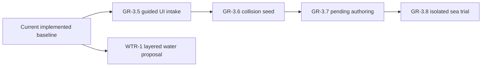

# Wayfinders current roadmap

Status: forward plan only. No implementation batch is currently authorized.
Implemented behavior belongs in `Wayfinders_Technical_Design.md`; completed
milestones and acceptance evidence belong in `Wayfinders_Roadmap_Archive.md`.

## Standing planning rules

### Saving policy

Gameplay-session saving is intentionally absent. Every launch or refresh starts
a fresh voyage. New gameplay work has no schema, storage, migration, checkpoint,
reload, or restoration obligation. Reviewed asset-package writes in the local
development workbench are repository authoring, not gameplay persistence.

Persistence must not be added incidentally to another feature. It may return
only through an explicitly authorized milestone designed for the game that
exists at that time. No persistence milestone is currently planned or
authorized.

### Milestones and authorization

- `GP-x.y` identifies gameplay milestones and acceptance gates.
- `GR-x.y` identifies graphics, asset-pipeline, and production-presentation
  milestones and acceptance gates.
- `WTR-x.y` identifies the proposed water-presentation track.
- A milestone is complete only when its behavior, tests, maintainability,
  performance criteria, and acceptance evidence pass.
- This roadmap proposes sequencing but authorizes no work by itself.
- An explicitly authorized ordered batch may proceed dependency-first without
  renewed permission between its named milestones. Work pauses when the batch
  is complete or continuing needs a new product decision, expanded scope or
  authority, or an unresolved external blocker.
- Before implementation starts, record measurable baseline and regression
  budgets appropriate to the work.

Developer graphics remain valid fallback presentation. Gameplay consumes
semantic terrain and content data; rendered pixels, sprite footprints, and
animation never become gameplay authority.

In planning, **tribe** means the authoritative support state of the home
community. **Community** is the broader design term and may also describe
remote settlements. Code contracts must not use the terms interchangeably.

## Current planning point

The implemented baseline supports the prototype world and the named large-world
profiles. Its current contracts are documented in the technical design and
architecture map; its delivery history is archived.

No next gameplay milestone is defined. The next defined production-asset work
is the `GR-3.5` through `GR-3.8` sequence below. It closes the remaining guided
intake, collision-draft, pending-authoring, and isolated-trial gaps without
building a general-purpose art editor or expanding runtime world content.

The water-system proposal is another independent candidate track. Product
priority between it and the production-asset sequence has not been chosen.

## Production-asset workflow

### GR-3.5 — Guided UI source intake and recipe creation

Status: defined, not started, and not authorized.

Turn every usable source/reference record into an actionable library item. A
reference gains **Import and prepare**, and the same flow accepts a new local
image. A compact form asks only for information that cannot be inferred safely:
asset name and family, stable-ID confirmation, intended size, layer roles,
passable-versus-solid collision semantics, and an optional runtime/test
category. Family defaults remain visible before confirmation.

Preparation runs through the constrained local development-server API, with
progress, validation errors, retry, and cancellation represented in the
library. After the development app is open, intake through promotion must not
require an asset-production command or hand-authored JSON.

Acceptance gate: starting from an existing reference or a newly selected PNG, a
user can create one stable pending candidate without editing a file or opening a
terminal; refresh preserves the record; re-import cannot silently duplicate or
overwrite an identity; invalid input produces recoverable field-level errors;
and no partial repository output remains after failure or cancellation.

### GR-3.6 — Best-effort collision seed on import

Status: defined, not started, and not authorized. Depends on `GR-3.5`.

Generate a useful first island-collision draft from prepared transparency,
matte boundaries, and connected shoreline geometry. Seed sparse `8`-pixel
subcells within the `32`-pixel navigation grid. Prefer a conservative shoreline
that blocks visible land while retaining coves, channels, and surrounding
water. Family semantics remain authoritative: shoals and other passable effects
stay explicitly empty, and uncertain output remains an editable draft.

The library shows the method and warnings with the mask. The algorithm must be
deterministic for identical source and settings, but it need not provide
general computer vision or final-quality collision.

Acceptance gate: every current island reference receives a deterministic,
non-empty, grid-aligned shoreline draft; transparent exterior water is not
broadly solid; detectable thin projections and concave shorelines use the fine
grid; passable families remain empty; and generated drafts never become runtime
authority automatically.

### GR-3.7 — Pending candidate authoring and UI completion

Status: defined, not started, and not authorized. Depends on `GR-3.6`.

Make the pending record the single place to finish an asset. Reuse collision
paint/erase, `8`/`32`-pixel brushes, selection, fill, undo/redo, and hull-probe
tools against the candidate draft. Provide structured controls for name,
family, dimensions, layer order/visibility/opacity, collision semantics, and
test binding; raw JSON is not the normal editing interface.

**Save candidate** writes validated recipe and collision data through a narrow
API, prepares affected output, creates a new fingerprint, and returns any prior
approval to pending. Approval, rejection, validation, and promotion are UI
actions with explicit current, stale, and error states. Preview-only settings
must be visibly distinct from persisted recipe values.

Acceptance gate: collision and supported asset settings survive save and
refresh exactly; changed source, recipe, or mask invalidates the prior
fingerprint and review; invalid data cannot be approved or promoted; and a
valid candidate can complete preparation, validation, review, and promotion
without commands or manual JSON.

### GR-3.8 — Isolated single-island sea trial

Status: defined, not started, and not authorized. Depends on `GR-3.7`.

Launch an explicit candidate trial from the pending editor. The deterministic
trial world contains only open water, the player boat, and the selected island.
It loads that candidate's actual prepared layers and saved collision draft; it
must not borrow the home island's image, footprint, or collision. Pending
candidates may be trialed before approval.

Provide safe boat spawn/reset positions, collision and navigation-grid debug
overlays, and a direct return to the same library record. Trial state is
disposable and is neither gameplay persistence nor world-catalog promotion.

Acceptance gate: the candidate fingerprint, dimensions, origin, and collision
revision are visible; no unrelated world content is present; the boat is
blocked exactly by the saved candidate mask; save/retrial reflects edits
immediately; and returning to the library restores the same pending record and
review state.

## Water presentation

### WTR-1 — Layered water system

Status: proposed, not started, and not authorized.

The proposal replaces developer water fills with deterministic, grid-aligned,
chunk-activated water presentation while preserving terrain, collision,
navigation, knowledge, and world generation as the only gameplay authorities.
Its source pack, render design, implementation sequence, budgets, and acceptance
criteria are defined in `Wayfinders_Water_System_Milestone.md`.

Before authorization, confirm the proposed art direction and whether this track
runs before or after the production-asset workflow. Implementation must consume
the existing shared active-chunk boundary and must not introduce a second
presentation-lifetime policy or simulation clock.

## Forward dependencies

The graph shows technical dependencies, not authorization. Runtime integration
remains serialized; tools must reuse current renderer, asset, collision, and
gameplay contracts rather than fork them.

## Explicitly deferred

- Broad runtime-asset expansion until the UI-native intake, authoring, and
  sea-trial loop exists and a separate content batch is authorized.
- Authoritative tribe economy/output, selectable voyage loadouts, generic wreck
  salvage/recovery, and automatic trade gameplay.
- Chained discovery quests, nested site targets, large resource catalogs,
  dynamic pricing, markets, fleet management, and labour allocation.
- Real-time economic refill timers or idle progression.
- NPC collision, combat, escorts, or direct fleet commands.
- Family trees, inheritable traits, politics, illness, age simulation, and
  non-wreck mid-voyage death.
- Physical idol recovery/cargo, idols as money or compulsory upgrades, and a
  forced ending without the current continue/new-game choice.
- A permanent economy panel or arcade score HUD.
- A general-purpose raster, pixel-art, atlas, or animation editor.
- Touch-first sailing until separately designed and approved.
- Gameplay saving, cloud sync, server-backed voyage saves, and multiplayer.

## Authorization boundary

No milestone in this document is authorized for implementation. Starting the
production-asset sequence, the water proposal, gameplay persistence, a new
gameplay milestone, broad runtime content rollout, or any other deferred scope
requires explicit user authorization.
