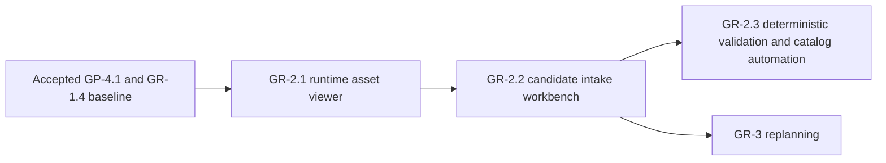

# Wayfinders current roadmap

Status: active. The accepted gameplay work through `GP-4.1` and graphics work
through `GR-1.4` form the current baseline. `GR-2.1` through `GR-2.3` are
authorized as one dependency-ordered tooling batch; no later gameplay or
graphics minor is authorized.

This document contains only upcoming or explicitly deferred work. Completed
milestone scope and acceptance evidence live in
`Wayfinders_Roadmap_Archive.md`.

## Standing planning rules

### Saving policy

Saving is intentionally absent from the active baseline. Every launch or
refresh starts a fresh session, and new work has no schema, storage, migration,
checkpoint, reload or restoration obligation.

Saving must not be added incidentally to another feature. It may return only
when the user explicitly authorizes a named milestone whose scope includes it.
No saving milestone is currently planned or authorized.

### Milestones and authorization

- `GP-x.y` identifies gameplay milestones and acceptance gates.
- `GR-x.y` identifies graphics, asset-pipeline and production-presentation
  milestones and acceptance gates.
- A minor is complete only when its behavior, tests, readability, performance
  criteria and acceptance evidence pass.
- Authorization and acceptance are separate. This roadmap proposes sequencing
  but authorizes no work by itself.
- An authorized ordered batch may proceed dependency-first without renewed
  permission between named minors. Work pauses when the batch is complete or
  continuing needs a new product decision, expanded scope or authority, or an
  unresolved external blocker.
- Before each authorized minor starts, its implementation plan records
  measurable baseline and regression budgets appropriate to that work.

Developer graphics remain the fallback after production assets exist. Gameplay
uses semantic terrain and content data; rendered pixels, sprite footprints and
animation never become gameplay authority.

In planning, **tribe** means the authoritative support state of the home
community. **Community** is the broader design term and may also describe
remote settlements. Code contracts must not use the terms interchangeably.

## Current planning point

The completed `GR-1` pilot proved the authored-asset contract, package loading,
one authored home island, the player boat, one fishing-shoal cue and directional
boat/wake presentation. Its acceptance evidence is in the archive.

No next gameplay milestone is currently defined. `GR-2` is the active graphics
batch and remains a prerequisite for broader production-asset work.

## Upcoming graphics track

### GR-2 — Asset viewing and creation tooling

Status: authorized as an ordered `GR-2.1` through `GR-2.3` batch. The accepted
`GR-1` pilot supplies the manual asset-preparation evidence needed for this
work.

Goal: make authored assets cheap to inspect, validate and prepare without
creating a second renderer or parallel gameplay authority.

#### GR-2.1 — Runtime asset viewer

Status: authorized.

Build a browser using the same Phaser renderer, factories, camera and texture
path as the game. Preview IDs, headings, animations, origins, footprints, fog,
overlays and fixed-seed placement without inventing parallel gameplay rules.

The accepted metadata contract already describes multi-slice home art and
directional/multi-frame boat art, while the pilot renderer implements only one
complete home image and a rotating one-frame boat. This minor must close that
contract/runtime mismatch through presentation factories shared by game and
viewer. The viewer is a separate application mode, not a second gameplay
simulation.

Acceptance gate: the same asset and metadata render equivalently in the viewer
and game; missing frames, invalid origins and overlay-contrast problems are
visible without requiring a voyage. Automated coverage must exercise every
catalog entry and heading/frame resolution, and browser acceptance must inspect
all three pilot package kinds at normal and fog/overlay contrast.

#### GR-2.2 — Candidate intake and creation workbench

Status: authorized.

Create or import candidate records from templates; edit semantic metadata;
validate frames, dimensions and variants; export tracked source/runtime files
and a package-catalog entry consumable by both viewer and game.

Browser security prevents the workbench itself from silently writing tracked
repository files. The workbench therefore exports one portable candidate
bundle containing validated metadata and PNG bindings. A repository intake
command revalidates that bundle with the same contract, materializes the
tracked metadata/runtime images and catalog entry, and requires an explicit
replacement flag when an existing semantic ID would change.

Acceptance gate: invalid IDs, missing frames, incompatible dimensions and
incomplete metadata are rejected; valid output loads in the viewer and game
without duplicate configuration. Candidate import must not grant new gameplay
authority or expand the fixed GR-1 semantic-ID set before GR-3 replanning.

#### GR-2.3 — Conditional build automation

Status: authorized with narrowed scope based on measured GR-1 repetition.

Automate the repeated catalog-key wiring, PNG dimension/frame inspection,
thumbnail creation and whole-catalog validation exposed by the four GR-1
textures and three packages. Do not add atlas packing: the accepted pilot has
no texture-count or draw-call evidence that would justify it.

Acceptance gate: clean rebuilds are byte-for-byte or semantically reproducible,
stay within a `4096 x 4096` per-texture preparation limit, detect stale generated
outputs in the normal verification gate and demonstrably remove repeated manual
catalog and thumbnail work.

### GR-3 — Deferred production expansion

Status: placeholder only. Do not define or authorize `GR-3` minors until the
relevant `GR-2` workflow has shown what should be standardized.

Later planning may cover authored non-home island packages, remaining shoals,
survey sites, activity presentation, lineage/completion art, environmental
polish and platform validation. It must preserve procedural whole-asset
placement and must not reintroduce runtime island construction from
interchangeable grid squares.

## Forward dependency

The graph shows acceptance dependencies, not authorization. Viewer and intake
work must reuse accepted runtime asset interfaces. Game integration remains a
serialized gate; isolated tooling must not fork rendering or gameplay rules.

## Explicitly deferred

- Broad production-asset expansion until the relevant `GR-2` workflow is
  accepted and `GR-3` minors are defined.
- Authoritative tribe economy/output, selectable voyage loadouts, generic
  wreck salvage/recovery and automatic trade gameplay.
- Chained discovery quests, island dossiers that spawn separate site leads and
  nested site-within-island targets.
- Large resource catalogs, dynamic pricing, arbitrage, markets, manual route
  assignment, fleet management and labour allocation.
- Real-time economic refill timers or idle progression.
- NPC collision, combat, escorts or direct fleet commands.
- Family trees, inheritable traits, politics, illness, age simulation and
  non-wreck mid-voyage death.
- Physical idol recovery/cargo, idols as money or compulsory upgrades,
  arbitrary open-water collectibles, and a forced ending without the existing
  continue/new-game choice.
- A permanent economy panel or arcade score HUD.
- A custom pixel editor or mass asset automation before the viewer/intake
  workflow demonstrates a concrete need.
- Touch-first sailing until separately designed and approved as a
  gameplay/platform input minor.
- Saving, cloud sync, server saves and multiplayer.

## Active authorization boundary

Implementation may proceed through `GR-2.3` dependency-first. It pauses after
that batch; defining `GR-3`, adding a gameplay minor or expanding the semantic
asset-ID set requires a new decision.
