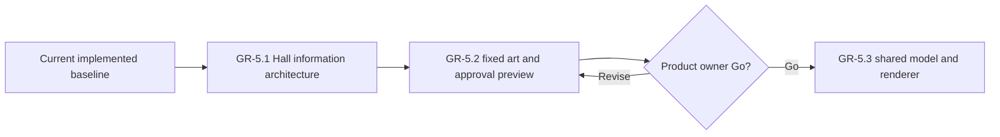
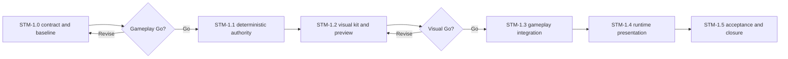

# Wayfinders current roadmap

Status: forward plan. Gameplay is complete through `GP-6.6`; the Great Hall
track is complete through `GR-5.3`, and `GR-6.1` is implemented with live
browser acceptance pending; cloud atmosphere is complete through `CLD-3`;
water presentation is complete through `WTR-2.6`;
and Prosperity is complete through `PRS-2.4`. `STM-1` remains proposed and its
runtime implementation is not authorized.
Implemented behavior belongs in `Wayfinders_Technical_Design.md`; completed
milestones and acceptance evidence belong in `Wayfinders_Roadmap_Archive.md`.

## Standing planning rules

### Saving policy

The technical design owns the current runtime persistence boundary. For future
planning, persistence must not be added incidentally to another feature or
inferred from development-only asset authoring. It may return
only through an explicitly authorized milestone designed for the game that
exists at that time. No persistence milestone is currently planned or
authorized.

### Milestones and authorization

- `GP-x.y` identifies gameplay milestones and acceptance gates.
- `GR-x.y` identifies graphics, asset-pipeline, and production-presentation
  milestones and acceptance gates.
- `AUD-x` identifies game-audio milestones and their acceptance gates.
- `WTR-x.y` identifies water-presentation milestones and acceptance gates.
- `CLD-x.y` identifies cloud-atmosphere milestones and acceptance gates.
- `PRS-x.y` identifies Prosperity and living-traffic milestones and acceptance
  gates.
- `STM-x.y` identifies cross-system storm milestones and acceptance gates.
- A milestone is complete only when its behavior, tests, maintainability,
  performance criteria, and acceptance evidence pass.
- This roadmap proposes sequencing but authorizes no work by itself.
- An explicitly authorized ordered batch may proceed dependency-first without
  renewed permission between its named milestones. Work pauses when the batch
  is complete or continuing needs a new product decision, expanded scope or
  authority, or an unresolved external blocker.
- Before implementation starts, record measurable baseline and regression
  budgets appropriate to the work.

Developer graphics remain valid fallback presentation. Gameplay consumes
semantic terrain and content data; rendered pixels, sprite footprints, and
animation never become gameplay authority.

In planning, **tribe** means the authoritative support state of the home
community. **Community** is the broader design term and may also describe
remote settlements. Code contracts must not use the terms interchangeably.

## Current planning point

The implemented baseline supports the prototype world and the named large-world
profiles. Its current contracts are documented in the technical design and
architecture map; its delivery history is archived.

The asset-workspace shell, focused island workshop, single island-availability
lifecycle, deterministic authored-island world planning, bounded periodic
authored runtime presentation, independent revealed-map cloud atmosphere, live
cloud-world authoring preview, and production water system are implemented.
They establish the presentation seams used by the proposed storm track.

The Voyage Sense thread, its supply commitments, and the continuous global
world are implemented through `GP-6.6`. Prosperity and returned-fact traffic
are implemented through `PRS-2.4`. `GR-6.1` Home and non-home island
de-labelling is implemented with live browser acceptance pending, while `STM-1`
proposes the next gameplay and presentation system and is not authorized.
Remaining audio acceptance follow-up requires no new runtime scope; the
production water system is complete through `WTR-2.6`.
Great Hall concept and planning work is complete. The product owner accepted the
`GR-5.2` view-only approval workspace and recorded **Go** on 2026-07-16. The
shared presentation contract, renderer, fixture, game adapter, and bounded era
integration in `GR-5.3` are implemented.

## Great Hall presentation

### GR-5 — Graphical Great Hall chronicle

Status: complete through `GR-5.3`. No further Great Hall milestone is planned.

Replace the text-led Great Hall with the selected **Ancestor Wall** direction:
reviewed navigator portraits, a stable achievement-symbol language, fixed
twelve-generation era pages, one selected navigator's four voyage bands, and
material states for active, completed, lost, and later-confirmed histories. All
current exact text remains available on focus or activation and to assistive
technology.

The implementation sequence is:

1. `GR-5.1` — implemented information architecture, interaction prototype,
   fixtures, and measured model baseline through twenty generations;
2. `GR-5.2` — implemented twenty predefined portraits, fixed Hall and symbol
   art, and a first-class, direct-linkable Great Hall viewing workspace,
   accepted by the product owner;
3. `GR-5.3` — one versioned JSON-compatible presentation contract, a shared
   graphical renderer for the asset viewer and game, the chronicle adapter, and
   bounded era paging, all now implemented.

The detailed current-information inventory, retained concepts, selected visual
grammar, scaling model, contracts, budgets, and acceptance gates are defined in
`Wayfinders_Great_Hall_Presentation_Milestone.md`. The closed current-data
symbol set is defined in `Wayfinders_Great_Hall_Infographic_Lexicon.md`.
Concept PNGs remain reference-only under `concept_art/great-hall` and never
load at runtime. The reviewed copies consumed by the approval workspace live at
stable paths under `public/assets/gr5/great-hall`.

## World discovery presentation

### GR-6 — Home and island de-labelling

Status: implemented on 2026-07-20. Live browser acceptance remains pending.

The persistent `HOME ISLAND` caption and the non-home island name, chart icon,
letter badge, finding caption, and lifecycle ring have been removed from the
sailing world. The island art itself is the complete persistent world
presentation.

This is a presentation-only removal. Current sight continues to create island
sightings, and generated names, dossier results, survey interaction, survey
cost, notices, fog reveal, return and wreck settlement, lineage, and completion
remain unchanged.

The implementation contains one milestone:

1. `GR-6.1` — remove the Home caption and all persistent non-home island dossier
   names and marker graphics, update presentation resource assertions, and
   verify unchanged island sighting and survey behavior.

Fishing shoals, survey sites, navigator wrecks, discovery notices, the survey
ribbon, and current-voyage achievement icons remain as implemented. No later
`GR-6` milestone is currently proposed.

The impact analysis, scoped presentation inventory, non-goals, and detailed
acceptance criteria are defined in
`Wayfinders_World_Discovery_Presentation_Milestone.md`.

## Voyage Sense

### GP-5 — Voyage Sense presentation

Status: complete through `GP-5.2`. No further Voyage Sense milestone is planned.

The implemented Voyage Sense thread contract is owned by the technical design;
its scope and acceptance evidence are archived.

#### GP-5.2 — Voyage Sense supply commitments

`GP-5.2` extends the thread's risk language into the graphical cargo rack. Its
implemented behavior is owned by the technical design and its acceptance
evidence is archived. The rack intentionally contains no visible words or
numbers; exact quantities remain available to assistive technology.

## Audio presentation

### AUD — Game sound and music layer

Status: implemented through `AUD-5` on 2026-07-17; rebuilt-ambience product-owner
audition plus the remaining keyboard/media, audible-loop, cue, crossfade, and
ducking browser acceptance remains to be recorded.

The implemented foundation loads one validated stored-audio catalog, exposes a
play-only Audio asset workspace, and gives game mode an explicit enable flow,
in-memory mixer controls, bounded voice ownership, diagnostics, silent fallback,
and complete scene cleanup. Current ownership and behavior are documented in
`ARCHITECTURE_MAP.md`, `Wayfinders_Technical_Design.md`, and
`Wayfinders_Asset_Pipeline.md`; volatile verification state is recorded in
`IMPLEMENTATION_STATUS.md`.

`AUD-1` closes after live browser acceptance verifies keyboard focus and exact
values for enable, mute, master, and all four category controls; stored-file
decode and audition in the Audio workspace; locked startup; and console-clean
scene teardown and restart without leaked playback.

`AUD-2` adds one persistent ocean bed and one speed-controlled wake loop. It
closes after live browser acceptance verifies silence at rest, smooth motion
gain, direction reversal without restart, focus reconciliation, and ten
seam-free repeats of both reference loops.

`AUD-3` adds deterministic microtask-batched gameplay and UI cues over the
existing typed event stream. Pure policy and event-adapter contracts cover the
source table, priority, cooldown, voice cap, replacement, idol-survey, return,
wreck, high-rate silence, and developer-action suppression. It closes after
live muted/unmuted browser acceptance confirms cues remain supplementary to the
existing visual and semantic feedback.

`AUD-4` adds renderer-neutral home-harbor/open-water selection, two stable music
voices, bounded `1.5`-second crossfades, and priority lifecycle ducking for
return, wreck, succession, and completion. State/controller contracts cover the
full lifecycle matrix, stable frames, rapid reversals, focus reconciliation,
completion priority, modal release, two-voice capacity, and teardown. It closes
after live browser acceptance confirms audible transitions and ten seamless
repetitions of both stored reference loops.

`AUD-5` placed the final sounds and music at their existing runtime paths and
retained a deterministic complete-set renderer for future regeneration. The
remaining event-to-cue policy, browser constraints, budgets, and acceptance
gates are defined in `Wayfinders_Audio_System_Milestone.md`. No further audio
milestone is proposed; the current acceptance follow-up does not authorize new
runtime scope.

## Water presentation

### WTR-1 — Layered water system

Status: completed as the visual prototype that established the direction now
implemented by WTR-2. Historical scope and acceptance evidence are archived in
`Wayfinders_Roadmap_Archive.md`.

### WTR-2 — Production water integration

Status: implemented on 2026-07-17. The durable runtime contracts and behavior
are owned by the technical design and architecture map; completion evidence is
archived in `Wayfinders_Roadmap_Archive.md`.

## Prosperity and living traffic

### PRS — Hidden score and safe-water world feedback

Status: implemented through `PRS-2.4` on 2026-07-19. Current behavior and
numeric contracts are owned by `Wayfinders_Technical_Design.md`; ownership and
dependency direction are owned by `ARCHITECTURE_MAP.md`; completion evidence is
archived in `Wayfinders_Roadmap_Archive.md`. No economy, score-spending,
settlement-growth, or later Prosperity milestone is proposed or authorized.

## Storm system

### STM-1 — Deterministic regional storm system

Status: proposed on 2026-07-19. Implementation is not authorized.

Add sparse, deterministic storm regions that move and wrap across the global
world. Storm state is gameplay authority owned independently from the existing
decorative cloud and water renderers. One immutable presentation model then
drives storm cloud mass, shadow, rain, water and shore response, vessel
response, weather UI, and optional sound without rendered pixels becoming a
rule source.

The first storm release has four bounded gameplay effects: heading-relative
sailing speed, reduced turn response, temporarily reduced current sight, and
severe-storm rejection of fishing-shoal surveying. It does not add passive
drift, provision surcharges, hull health, direct storm wrecks, lightning
damage, terrain mutation, dynamic collision, or time-dependent route costs.
Personal and Supported knowledge cannot be erased by a passing storm.

Visually, the five studies under `concept_art/storms` are contrast and
readability fixtures, not five biome-specific mechanics or runtime assets. The
runtime family is a reusable layered storm kit. All current-state storm cues
must be clipped to current-clear visibility coverage, remain readable at world
seams and corners, preserve routes, markers, shorelines, the vessel, and UI,
and expose equivalent static cues when reduced motion or flash-safe
presentation is enabled.

The proposed implementation sequence is:

1. `STM-1.0` — lock the product contract, tuning bands, vertical slice, and
   measured baseline, then record an explicit gameplay **Go**;
2. `STM-1.1` — add deterministic storm plans, wrapped footprints, lifecycles,
   overlap rules, local queries, revisions, and headless presentation data;
3. `STM-1.2` — build the reusable visual kit and a direct-linkable Storms
   approval workspace, then record an explicit visual **Go**;
4. `STM-1.3` — integrate movement handling, visibility refresh, and atomic
   severe-storm fishing rejection without changing route or provision rules;
5. `STM-1.4` — integrate the bounded renderer, accessibility, weather status,
   lifecycle cleanup, and optional audio after the current audio acceptance
   follow-up is closed; and
6. `STM-1.5` — close seam, replay, performance, resource-plateau, live-browser,
   and documentation acceptance.

Detailed authority, fixed-step ordering, effect bands, visual layering, asset
family, fog rules, budgets, tests, non-goals, risks, and acceptance criteria
are defined in `Wayfinders_Storm_System_Milestone.md`.

## Authorization boundary

WTR-1.0 through WTR-1.5 and WTR-2.0 through WTR-2.6 are complete. No later water
milestone is authorized. Gameplay is complete through `GP-6.6`. `PRS-1`
through `PRS-2.4` are complete; no later Prosperity, economy, or
settlement-growth milestone is authorized. `GR-6.1` is implemented with live
browser acceptance pending. `STM-1` remains proposed but not authorized. Its
implementation, like any later gameplay or production-asset milestone, requires
explicit user authorization.
Do not implement gameplay saving; it may return only through an explicitly
authorized milestone designed for the game that exists at that time.
