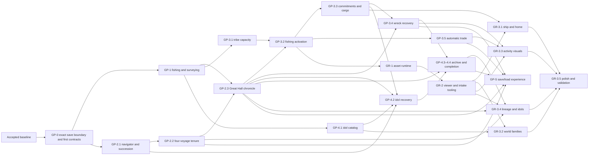

# Wayfinders development roadmap

Status: active. The current implementation is the accepted baseline. The
ordered `GP-0.1` through `GP-2.2` work is complete and accepted. Work is
paused before `GP-2.3`; further implementation requires a new authorization.

## Roadmap model

The work that produced the current build is historical context, not the
numbering system for future work. Forward planning uses three labels:

- **Baseline** — the implemented and protected starting point;
- **GP-x.y** — gameplay major milestones and their minor acceptance gates;
- **GR-x.y** — graphics, asset-pipeline and production-presentation gates.

A minor milestone is complete only when its behavior, persistence, tests,
readability and performance criteria pass and its acceptance evidence is
recorded. A major milestone closes only when all required minor gates pass.

Authorization and acceptance are distinct. The user may authorize one minor or
an explicitly ordered batch of named minors. Every batch member is authorized
up front, but integration and acceptance remain dependency ordered. Complete,
verify and record each minor's acceptance gate, then continue immediately into
the next named minor without asking for renewed permission. A failed check is
work to resolve within the authorized scope, not a new authorization boundary.
Work pauses only when the batch is complete, the user intervenes, or continuing
requires a new product decision, expanded scope or authority, or an unresolved
external blocker.

Before each authorized minor starts, including every member of an authorized
batch, its implementation plan records measurable baseline and regression
budgets appropriate to that work (for example frame time, memory, load time,
traffic count or bounded recovery voyages). The roadmap intentionally does not
invent target numbers before representative work exists to measure.

Developer graphics remain intentional throughout gameplay development and
remain the fallback after production assets exist. No rendered pixel, sprite
footprint or animation may become gameplay authority.

In this roadmap, **tribe** means the authoritative support state of the home
community. **Community** is the broader design term and may also describe
remote settlements. Code and save contracts must not use the terms
interchangeably.

This roadmap records proposed sequencing and authorizes no work by itself.
Implementation starts only when the user explicitly authorizes a named minor or
ordered batch of minors.

## Accepted baseline

The current build already provides:

- deterministic home waters, islands, navigation and terrain authority;
- continuous sailing, fog, current sight and Unknown, Personal and Supported
  water knowledge;
- provisions, forward/return guidance and exact-dock expedition commitment;
- Supported-route inheritance, deterministic island discoveries and
  provisional-to-returned records;
- wreck rollback, persistent wrecks and exactly-once generation advancement
  per resolved wreck;
- versioned navigator identities, four-voyage tenures and exactly-once
  succession after either a completed tenure or a fatal wreck;
- schema-validated IndexedDB autosave, a stable manual checkpoint and exact
  ship/camera restoration;
- functional developer graphics, developer controls, diagnostics and the
  performance foundation.

Generation is backed by a versioned navigator lineage with distinct active,
completed and lost records. Exact-dock active-expedition returns complete one
of a navigator's four voyages, while fatal wrecks and completed-tenure
transitions share one idempotent succession authority.
Discoveries are descriptive records and do not yet create active resources or
a tribe economy. Save/load is functional infrastructure rather than a complete
player-facing game-management flow.

## Cross-cutting gameplay gates

### GP-0 — Gameplay integration foundation

#### GP-0.1 — Exact-version save validation

Status: accepted.

Acceptance evidence (updated 2026-07-13): autosave and checkpoint records pass
through one fail-closed parser for the exact current save schema, world
generator, content versions and serialized sub-format versions. Any readable
record that is malformed, older or newer is deleted instead of migrated or
preserved. A rejected autosave starts fresh; a rejected checkpoint becomes
unavailable without replacing the running world. Current docked-return,
active-expedition and pending-wreck states still round-trip through the two
atomic IndexedDB records. The full pipeline passes 188 tests across 20 files
plus typecheck and production build; validation runs only at load boundaries
and adds no movement-loop work.

Before new authoritative gameplay state is integrated:

- decide whether storage remains one active lineage plus a checkpoint or must
  support multiple named saved games before fixing registry shape;
- establish how each owning gameplay minor adds its authoritative state and
  bumps every affected schema, content or serialized-format version;
- keep derived paths, traffic transforms and renderer state out of saves;
- treat every version field as an exact equality guard, never a migration
  selector; and
- require current-version autosave and manual-checkpoint round trips in every
  later GP minor.

Acceptance gate:

- exact current-version saves restore deterministically;
- every mismatched or malformed autosave/checkpoint is deleted and cannot
  disable or overwrite fresh play;
- feature-specific settlement idempotency is proven at its owning minor;
- existing wreck-hold and exact ship/camera restoration behavior survives;
- no later GP minor can be accepted without explicit version invalidation and
  current-version persistence coverage.

Persistence is not postponed to the later save/load milestone. GP-5 adds
player-facing game management after every preceding gameplay system already
persists correctly.

#### GP-0.2 — Versioned integration boundaries

Status: accepted.

Acceptance evidence (2026-07-12): contract version one fixes the fishing-shoal
ID/content namespace, clue and quality vocabulary, hidden-versus-revealed
renderer read models, Survey/Leave commands and results, authoritative record
fragments and persistence ownership. The boundary introduces no navigator,
cargo, tribe, achievement or general-route contract. The full pipeline passes
153 tests across 17 files plus typecheck and production build; the contract
module adds no runtime loop work.

Establish only the boundaries needed by GP-1; authorization of later minors in
the same batch does not widen this gate:

- ownership of stable ID namespaces, content versions and invalidation rules;
- authoritative-versus-derived state rules;
- versioned interfaces and read models for independently owned modules;
- survey command and interaction result types;
- single-owner integration boundaries for simulation, persistence and scene
  wiring.

Cargo, tribe, navigator, achievement, general route, idol and graphics
contracts remain deferred to their owning GP/GR minor. Batch authorization of
those later minors does not pull their contract design into GP-0.2.

Acceptance gate: GP-1's opportunity identity, survey command/result types,
persistence ownership, renderer read models and narrowly required integration
boundaries are explicit, versioned and sufficient for separate pure-module
work. This is an engineering gate, not player-facing feature completion.

## Gameplay track

### GP-1 — Fishing grounds and survey work

Goal: add the first deliberate exploration job and prove the complete clue,
choice, return and inherited-result loop using developer graphics.

#### GP-1.1 — Deterministic fishing shoals

Status: accepted.

Acceptance evidence (2026-07-12): fishing content version one derives four
sparse, immutable shoal definitions from the saved seed and generation config,
with stable namespaced IDs, locations, service anchors, clues and hidden
quality outcomes. The catalog is generated off-loop and does not mutate
terrain, collision, island/resource identity or the accepted discovery
catalog. Current-sight observation is idempotent; fog-filtered read models hide
quality and never create terrain knowledge. Schema V2 added content-version
identity and sorted active-expedition sighting records; earlier schema or
content versions became incompatible. Autosave/checkpoint load paths accept
only exact current versions and delete rejected records. Developer markers are
revision-driven, pooled and viewport-culled. The full pipeline passes 159 tests
across 18 files plus typecheck and production build; normal movement checks
only the four definitions and performs no world-area scan or default visible-set
copy.

- Add sparse, seed-derived shoal IDs, locations, qualities and environmental
  clues in a namespace that cannot move islands or alter terrain.
- Add latent and sighted states without granting an economic benefit.
- Keep accepted island discoveries unchanged while the new opportunity model
  is proven.

Acceptance gate: the same world/content version produces the same shoals and
quality outcomes; clues do not reveal fogged terrain; sightings and survey
results cannot reroll after reload; existing terrain, island and discovery
identities do not change.

#### GP-1.2 — Survey action and limited capacity

Status: accepted.

Acceptance evidence (2026-07-12): the headless fishing owner exposes one
non-stacking survey case, derived exhaustively from the current allocation's
authoritative provisional state. Initial play and completed dock/respawn
allocations have one case; a survey atomically changes one sighted record to
surveyed and leaves zero, while Leave and every rejected command are
mutation-free. Wreck holds are non-interactive and reload preserves spent
capacity. Schema V3 admits at most one surveyed provisional record; every
other schema version is incompatible with that build. A temporary clue-and-case
ribbon supplies real Survey/Leave buttons, `F`/`Escape` keyboard controls and
contextual pointer or touch activation; Leave stays dismissed until the player exits, and the
1.2-second survey cue is presentation-only. Browser acceptance exercised both
buttons and the keyboard survey path with no console warnings/errors. The full
pipeline passes 162 tests across 18 files plus typecheck and production build;
proximity work remains bounded to four definitions and adds no world scan or
permanent sailing HUD.

- Add a proximity **Survey / Leave** decision.
- Begin with one fixed survey case for each new expedition allocation;
  tribe-funded loadouts belong to GP-3.
- Exact-home-dock replenishment or post-wreck respawn intentionally creates the
  next one-case allocation; unused cases do not accumulate between voyages.
- Sailing past a clue is free; surveying consumes a case and a short in-world
  action.
- Use developer graphics and no permanent sailing HUD.

Acceptance gate: the player can knowingly spend or preserve the case; no case
means no survey; dock, wreck and reload paths perform the one intentional
replenishment without duplicate or unearned cases; keyboard, pointer and any
approved contextual touch input work.

#### GP-1.3 — Provisional, returned and lost surveys

Status: accepted.

Acceptance evidence (2026-07-12): authoritative returned records are separate
from active-expedition provisional records, with exactly one legal overlap: a
returned lead plus its provisional surveyed upgrade. Exact-dock return commits
sightings as inherited inactive leads and surveys as terminal returned surveys;
wreck rollback removes only provisional state, so an earlier lead survives an
unsuccessful upgrade voyage. Returned surveys are the sole later-activation
eligible state and remain idempotent across revisit, repeat input, dock, wreck,
autosave and checkpoint round trips. Schema V4 adds sorted returned records;
other schema versions are rejected and removed. Faint provisional/lead marks
and the automatic dock report remain revision-driven, pooled, viewport-culled
and coalesced with the existing return cue. The full pipeline passes 166 tests across 18 files plus
typecheck and production build. Browser validation covers lead return, a later
Supported-water survey upgrade, exact-dock commit, terminal revisit and manual
checkpoint reload with the expected authoritative state throughout.

- Complete the branching lifecycle:
  - latent → sighted/provisional → returned lead when reported safely without
    surveying; a returned lead is inherited but inactive;
  - latent → sighted/provisional → surveyed/provisional → returned survey when
    the investigation is safely reported;
  - returned lead → surveyed/provisional upgrade → returned survey when it is
    investigated on a later expedition and safely reported. Until exact-dock
    return, the committed returned lead remains the rollback state, so a
    wreck discards only the provisional upgrade and leaves the returned lead
    intact.
- Treat a returned survey as terminal and idempotent for GP-1. Later sightings,
  survey input, docking and wreck resolution leave its record and deterministic
  outcome unchanged; they do not consume another case, create provisional state
  or duplicate its return commit or report.
- Add distinct faint provisional and returned-lead marks plus a concise
  automatic dock report.
- Commit only at the exact home dock; remove a failed expedition's provisional
  state without deleting the deterministic opportunity or any prior returned
  state.

Acceptance gate: clue, provisional sighting, returned lead, provisional survey
and returned survey are distinct; a later survey of a returned lead commits
only on exact-home-dock return and a wreck restores the same returned lead; a
returned survey is terminal and idempotent across revisits, repeat input,
dock/wreck handling and repeated autosave/manual-checkpoint round trips from a
record containing that state, with no additional case consumption, reroll, or
duplicate record, report or commit; only a returned survey is eligible for
later activation; existing provision, route-growth, wreck and generation rules
remain unchanged.

#### GP-1.4 — Returned-ground cue and connectivity proof

Status: accepted.

Acceptance evidence (2026-07-12): the exact saved-world `homeReturnTile` and
seed-derived opportunity `serviceAnchor` are the connectivity endpoints. A
cached flood uses passable Supported cells only, cardinal movement and a fixed
north/east/south/west tie-break; both endpoints must themselves qualify. The
world exposes a dedicated Supported-topology revision, so Personal knowledge,
visibility and ordinary frames do not rebuild the search. Only a connected
returned survey enters the derived activation-eligible set. It receives a
double-diamond beacon, glow ring, four cardinal rays and explicit home-linked
label; a disconnected returned survey keeps its ordinary returned mark, and
leads/provisional surveys cannot structurally request the cue. Connectivity and
paths are derived after load and never enter schema V4. The full pipeline passes
173 tests across 19 files plus typecheck and production build. Fresh-browser
validation loaded the GP-1.3 returned survey, rebuilt one connection, showed the
beacon, preserved it across manual checkpoint reload and produced no console
warnings or errors.

- Define an opportunity service anchor and a deterministic home-connected
  Supported-water eligibility check.
- Show one unmistakable developer-art cue for an eligible returned survey.
  This is a derived, non-economic proof; authoritative `Active` tribe state,
  general traffic and output belong to GP-3.2.

Acceptance gate: returned leads and provisional surveys never show the cue;
returned surveys show it only with a valid Supported connection; connectivity
uses stable endpoints and tie-breaking; the cue is not serialized and does not
affect navigation.

Major acceptance: players understand that they noticed, chose to survey,
returned and caused a visible inherited change.

### GP-2 — Explorer lives, generations and lineage history

Goal: turn the existing generation counter into a sequence of distinct
explorers, prevent one explorer from serving forever and preserve meaningful
credit across the lineage.

#### GP-2.1 — Navigator and succession model

Status: accepted.

Acceptance evidence (2026-07-13): a dedicated lineage authority owns stable
versioned navigator IDs, lifecycle history and deterministic succession keys.
Wreck rollback terminalizes the outgoing navigator before the unchanged
four-second presentation, while completion creates exactly one successor.
Schema V5 first required a coherent lineage and pending-wreck fragment;
subsequent exact-version contracts supersede it rather than migrate it. A
mid-hold save/reload finishes the same key once
without duplicating or skipping a generation. The simulation snapshot and
browser diagnostics expose navigator
identity without moving authority into presentation. All inherited Supported
water, returned content and persistent wrecks retain their prior behavior. The
full pipeline passes 182 tests across 20 files plus typecheck and production
build.

- Give each navigator a stable ID and lifecycle state.
- Centralize succession reasons such as wreck and completed tenure.
- Preserve the four-second wreck sequence and inherited world state.

Acceptance gate: every succession creates exactly one navigator/generation;
reload during a current-version transition cannot skip or duplicate it;
non-current lineage contracts are rejected and removed.

#### GP-2.2 — Four-voyage navigator tenure

Status: accepted.

Acceptance evidence (2026-07-13): each navigator may complete at most four
numbered voyages. Only an active expedition's successful exact-home-dock
return completes a voyage; inactive docking, replenishment, idle time,
distance, travel time and reload do not. Returns one through three commit their
results and replenish normally. The fourth return commits normally and then
completes the navigator's tenure, immediately creating exactly one successor
without a retirement choice or fifth voyage. A wreck during any voyage is
fatal: it records the navigator as lost, preserves the unchanged four-second
wreck presentation and creates exactly one successor after the pending
transition. Schema V7 requires the V3 lineage contract, which stores each
navigator's completed-voyage count; V6 and older age/final-voyage records are
incompatible and removed under the exact-version save policy. Retirement
actions and their dock ribbon are absent. The full pipeline passes 189 tests
across 20 files plus typecheck and production build. Browser acceptance covers
the voyage status, fourth-return succession, fatal-wreck transition and a clean
warning/error console.

- Complete one numbered voyage only on an active expedition's successful
  exact-home-dock return, after its discoveries, surveys and knowledge commit.
- After returns one through three, replenish and begin the next voyage with
  the same navigator; after return four, complete the tenure and create exactly
  one successor through the shared succession authority.
- Let a wreck during any voyage kill the navigator early, preserve the
  existing four-second wreck sequence and create exactly one successor when
  that persisted transition completes.
- Treat every return-to-next-voyage and wreck-to-successor boundary as elapsed
  world time. Safe-return transitions are immediate; wrecks retain only their
  existing four-second presentation hold, with no additional gameplay/economy
  wait. Later milestones may settle community activity or show a
  handover/mourning scene there, but GP-2.2 adds no economy or cutscene.
- Keep the limit legible through the existing navigator status and return cues
  as **Voyage n of 4**; add no retirement decision interface.

Acceptance gate: the fourth exact-dock return commits before generation
advances exactly once; the same navigator can never begin a fifth voyage; a
wreck at any voyage count ends that navigator without crediting the failed
expedition; reload cannot consume, skip or duplicate a voyage or succession;
inactive docking consumes no voyage; and inherited world state survives both
completion and loss. Status/checkpoint restoration shows the correct next
voyage and no retirement control remains.

#### GP-2.3 — Great Hall voyage chronicle

Status: proposed.

- Give every navigator four numbered Great Hall voyage positions and credit
  returned landfalls, surveys, Supported connections and later idols to the
  responsible navigator and voyage.
- Show all four returned voyages for a completed tenure. For a navigator lost
  early, show their completed voyages plus a respectful terminal lost-voyage
  record; never credit provisional achievements from that fatal expedition.
- Maintain lineage-wide aggregates and present history at home, after important
  returns or during succession—not as a sailing score HUD.
- Associate a lost navigator with their persistent wreck so a later discovery
  can reveal their fate. Recovering evidence or knowledge from that wreck is a
  later GP-3.4 mechanic, not part of the chronicle milestone.

The chronicle framework begins after GP-2.2 supplies stable voyage ordinals and
terminal states, but each category is integrated
at its owning gate: returned surveys after GP-1.3, fishing activation after
GP-3.2, connected-community/trade records after GP-3.5 and idols after GP-4.2.
Stable achievement keys must include navigator and voyage identity and prevent
duplicate credit.

Acceptance gate: only exact-dock-committed achievements receive credit; four
numbered positions reconcile with each navigator's completed-voyage count and
terminal state; no reload or checkpoint replay duplicates credit; navigator and
lineage totals reconcile; provisional information never appears as permanent
history.

### GP-3 — Tribe economy, support and recovery

Goal: make exploration materially affect community capability without markets,
route micromanagement or real-time waiting.

#### GP-3.1 — Tribe capacity and protected recovery floor

Status: proposed.

- Add a small community-support state and a guaranteed useful recovery
  allocation.
- Settle activity only on the instantaneous inter-voyage return/wreck
  transitions defined by GP-2.2, never wall-clock waiting.
- Define a persisted settlement key/cursor and apply tribe changes atomically
  inside the authoritative return/wreck transaction; presentation events are
  notifications, not the economy ledger.
- Communicate healthy, strained and recovering states through developer world
  cues and plain-language dock feedback.

Acceptance gate: the player can always begin a meaningful voyage; clock
manipulation gives no advantage; the minimum state vocabulary and settlement
events are approved; tribe state is deterministic and exact-version replay-safe;
replay or reload cannot settle one outcome twice.

#### GP-3.2 — Tribe activation, fishing output and route activity

Status: proposed.

- Promote a GP-1.4-eligible returned survey into authoritative `Active` tribe
  state and let it contribute a simple fishing benefit.
- Add sparse non-blocking fishing activity on Supported routes using developer
  graphics so returned findings can become visible on later voyages.
- Settle output idempotently on meaningful events; regenerate routine boat
  transforms instead of saving them.

Acceptance gate: unreturned shoals give no benefit; boats never enter Personal
or Unknown water; reload cannot double-apply output; activity stays readable
and within the performance baseline.

GP-3.2 is the earliest proposed gate for beginning isolated graphics-platform
work. Production-asset replacement still waits for stable gameplay entities.

#### GP-3.3 — Voyage commitments and physical capacity

Status: proposed.

- Add dockside **Light, Standard, Deep-water and Recovery** commitments.
- Let choices determine provisions, survey/salvage capacity and open cargo room
  at a legible tribe cost.
- Keep cargo small and physical; do not introduce spreadsheet inventory.

Acceptance gate: choices create distinct expeditions; consequences are clear
before departure; unaffordable commitments cannot be selected; Recovery is
always useful; reload cannot create supplies.

#### GP-3.4 — Wreck setback and playable recovery

Status: proposed.

Depends on GP-2.1's accepted navigator/succession model and GP-2.3's stable
voyage-record identity.

- Lose the current tribe investment on wreck, reduce optional support and lower
  visible activity.
- Preserve Supported routes, returned opportunities and the minimum allocation.
- Recover through successful play and established activity, never waiting.
- Let later navigators find the persistent wreck of a lost navigator and
  recover bounded evidence or knowledge of what happened. The wreck remains a
  meaningful optional subgoal rather than restoring the failed expedition's
  provisional achievements wholesale.

Acceptance gate: a major loss affects the next generation; no legal failure
sequence creates an unwinnable or idle-only state; the approved minor defines
and tests a concrete maximum recovery sequence; recovered evidence is credited
once to the correct lost navigator/wreck; pending-wreck reload remains
idempotent.

#### GP-3.5 — Connected communities and automatic trade

Status: proposed.

- Define stable water service anchors for returned settlements and a
  Supported-only connection rule.
- Give connected communities a small, legible surplus/need relationship and
  settle exchange automatically without prices or manual cargo orders.
- Use sparse, non-blocking developer-art trade traffic as world feedback.
- Activate and settle new links at inter-voyage transitions so their traffic
  can first appear naturally on a later voyage.

Acceptance gate: trade begins only after both endpoints and their Supported
connection are returned; traffic never reveals or enters Personal/Unknown
water; exchange cannot double-settle; no market, arbitrage or fleet-management
screen is introduced.

### GP-4 — Idols, archive and optional completion

Goal: make returning every idol the finite long-term exploration goal and allow
the player to complete the game without forcing the saved world to end.

#### GP-4.1 — Deterministic idol registry and clues

Status: proposed.

- Attach the first finite, versioned idol set to existing stable island and
  historic-wreck anchors through a derived content catalog that does not edit
  terrain generation. Ruins, caves, reef chambers or abandoned anchorages need
  their own approved point-of-interest gate before use.
- Reuse the sighting/survey lifecycle and avoid treating living-community
  objects as loot.
- Reveal the total count but never exact remaining locations.

Acceptance gate: idol count and sites are stable; clues signal promise without
map spoilers; idols are not currency, compulsory power or arbitrary open-water
collectibles.

#### GP-4.2 — Salvage, cargo and recoverable loss

Status: proposed.

Depends on GP-3.3's accepted physical-capacity contract. Catalog, clue and
archive read-model work may proceed earlier, but cargo/wreck integration may
not.

- Spend salvage capacity and cargo space to recover surveyed idols.
- Track surveyed → recovered aboard → returned states.
- On wreck, leave the idol recoverable at the wreck or restore its source.

Acceptance gate: only exact-dock return credits an idol; every idol remains
collectible after every legal wreck sequence; aboard and lost states round-trip
exactly; each idol exists in exactly one authoritative place/state—source,
aboard, recoverable loss or archive; navigator and lineage credit agree.

#### GP-4.3 — Home archive

Status: proposed.

- Add a home-only archive with named exhibits, silhouettes, lore, recovered
  count and navigator credit.
- Keep it outside the normal sailing HUD.

Acceptance gate: the archive contains only returned idols, preserves mystery,
survives generations and remains optional for ordinary sailing.

#### GP-4.4 — Completion and continue choice

Status: proposed.

- Returning the final idol unlocks an unmistakable completion event and an
  option to end the lineage's story or continue exploring the same world.
- Persist completion as a one-shot state so reload cannot replay or erase it.

Acceptance gate: full collection can complete the game; the ending is not
forced; continued play does not invalidate the world; arbitrary legal wreck
histories cannot make completion impossible.

### GP-5 — Player-facing save, load and game continuity

Goal: build on the accepted autosave/checkpoint foundation to provide a clear
game lifecycle once the authoritative gameplay shape is stable.

#### GP-5.1 — Saved-game model and metadata

Status: proposed.

- Apply the storage-model decision made before GP-0.1 persistence architecture:
  one active lineage plus checkpoints or, if explicitly approved, multiple
  named saved games.
- Define displayed metadata such as seed, navigator, generation, voyage state,
  idol progress and last-played time.

Acceptance gate: the chosen model is understandable and does not blur autosave,
manual save and checkpoint semantics. Multiple slots are not required unless
separately approved.

#### GP-5.2 — New, save, load and delete flow

Status: proposed.

- Add the confirmed player-facing controls with overwrite/delete safeguards.
- Preserve the exact-dock, active-expedition and pending-wreck states supported
  by the authoritative schema.

Acceptance gate: every legal save point restores exactly; destructive actions
require clear confirmation; a failed/corrupt record cannot silently damage an
unrelated saved lineage or checkpoint.

#### GP-5.3 — Long-sequence continuity hardening

Status: proposed.

- Test repeated current-version save/load across voyage tenure, succession, economy,
  idol loss/recovery and optional completion.
- Delete malformed or version-mismatched records and provide legible fresh-start
  recovery behavior.

Acceptance gate: long multi-generation histories remain deterministic and no
settlement, achievement, generation or completion event can be duplicated by
reload.

## Graphics track

### GR-0 — Developer graphics contract

Status: active baseline contract, not a production-art milestone.

- Every GP minor receives functional placeholder presentation.
- Developer assets remain the fallback after the production pipeline exists.
- Gameplay remains readable under fog, Personal grey and risk overlays.
- Missing production assets never block gameplay testing.

Acceptance gate on every GP minor: each new authoritative state is
distinguishable at normal zoom, overlays remain readable and presentation does
not define collision, identity or rules.

### GR-1 — Minimal asset runtime

Do not begin before GP-3.2 is accepted unless this start gate is explicitly
reapproved.

#### GR-1.1 — Semantic asset contracts

Status: proposed.

Define stable semantic IDs plus origin, footprint, heading, animation, scale
and layering contracts for the ship, dock, ocean, one island family, shoals and
fishing skiffs.

Acceptance gate: swapping an asset ID's visual leaves simulation snapshots,
terrain, identities and saves unchanged; incompatible footprints or meanings
receive new IDs.

#### GR-1.2 — Manifest, loader and resolver

Status: proposed.

Implement a hand-authored manifest, developer/candidate/approved/deprecated
lifecycle states, deterministic variants and an explicit missing-asset
fallback.

Acceptance gate: every lifecycle state resolves predictably; missing or invalid
assets fall back visibly without crashing; deterministic variants remain stable
for a saved world/content version.

#### GR-1.3 — Representative runtime proof

Status: proposed.

Route candidate or developer versions of the player ship, dock, ocean, one
island family, a shoal and a fishing skiff through the resolver. This proves the
runtime path; GR-3 later completes approved production families.

Acceptance gate: origins, headings, scale and depth are correct under fog and
route/risk overlays; visual swaps leave gameplay/save snapshots unchanged; the
approved minor plan's numeric draw-call, memory and frame-time budgets pass.

### GR-2 — Asset viewing and creation tooling

#### GR-2.1 — Runtime asset viewer

Status: proposed.

Build a browser using the same Phaser renderer, factories, camera and texture
path as the game. Preview IDs, headings, animations, origins, footprints, fog,
overlays and fixed-seed placement without inventing parallel gameplay rules.

Acceptance gate: the same asset/metadata renders equivalently in viewer and
game; missing frames, invalid origins and overlay contrast problems are visible
without a voyage.

#### GR-2.2 — Candidate intake and creation workbench

Status: proposed.

Create or import candidate records from templates; edit semantic metadata;
validate frames, dimensions and variants; export tracked source/runtime files
and a manifest entry consumable by both viewer and game.

Acceptance gate: invalid IDs, missing frames, incompatible dimensions and
incomplete metadata are rejected; valid output loads in viewer and game without
duplicate configuration.

#### GR-2.3 — Conditional build automation

Status: optional and proposed only after repeated manual work proves the need.

Add typed ID generation, thumbnails, atlas packing or batch validation only
when it removes measured repetition and produces deterministic outputs.

Acceptance gate: clean rebuilds are byte-for-byte or semantically reproducible,
stay within texture limits and demonstrably remove repeated manual work.

### GR-3 — Production graphics passes

#### GR-3.1 — Ship and home waters

Status: proposed. Replace the player vessel, physical cargo presentation,
ocean, dock and home-island composition while preserving authoritative
footprints and overlay readability.

Acceptance gate: docking, heading, origins and cargo readability remain exact;
terrain stays authoritative; the approved visual/performance budgets pass.

#### GR-3.2 — Island and world families

Status: proposed. Add deterministic visual families for generated islands,
reefs, rocks and offshore detail without changing topology, IDs or culling.

Acceptance gate: saved seeds choose stable variants; atoll passages and terrain
topology are unchanged; culling, chunk invalidation and memory budgets pass.

#### GR-3.3 — Gameplay activity visuals

Status: proposed. Replace clues, survey objects, fishing activity, tribe states
and later connection vessels only after their gameplay contracts are accepted.

Acceptance gate: provisional, returned and active states remain distinct;
traffic remains sparse, non-blocking and Supported-only; economic feedback does
not require a permanent numerical panel.

#### GR-3.4 — Lineage, idol and completion presentation

Status: proposed. Add navigator/voyage cues, Great Hall and chronicle
presentation, optional handover/mourning transitions, idol cargo, archive
exhibits and optional-ending celebration without leaking hidden state.

Acceptance gate: presentation matches authoritative navigator/idol records,
does not reveal hidden locations and never forces the optional ending.

#### GR-3.5 — Environmental polish and platform validation

Status: proposed. Add restrained animation, particles, audio and final contrast
work, then validate frame time, memory and loading on representative target
hardware.

Acceptance gate: the approved numeric platform budgets pass and every already
implemented input method remains usable. Touch-first sailing requires a
separate approved gameplay/platform minor; graphics validation does not create
that missing control scheme implicitly.

## Dependencies and safe parallel work

The graph shows acceptance dependencies, not authorization for concurrent
integration. A minor may be authorized individually or within an ordered batch,
but it may be integrated or accepted only after all incoming acceptance
dependencies pass. Batch authorization waives neither dependency order nor the
safe-parallel-work limits below.

Work may proceed in parallel only after its relevant minor is authorized,
individually or within a batch, and its minimal versioned contracts are
accepted:

| Workstream | Safe parallel boundary | Integration gate |
| --- | --- | --- |
| Opportunity catalog | New deterministic catalog module and dedicated tests; do not edit terrain/island generators | Content-version and save identity are integrated by one owner |
| Survey lifecycle | Separate headless opportunity-state reducer and tests against frozen catalog types | One owner wires actions, return/wreck behavior and saves |
| Navigator identity, voyage-tenure policy and chronicle reducers | Separate headless lineage modules/read model and dedicated tests | Succession/event/save integration is serialized |
| Supported-only route selection | New read-only navigation/activity module wrapping existing graph/path primitives | Economy activation and simulation wiring are serialized |
| Economy settlement reducer | New pure reducer after settlement-key/outcome contracts are approved | Atomic return/wreck mutation and persistence are serialized |
| Placeholder opportunity and traffic renderers | New renderer classes against a frozen read model | Scene construction, input and lifecycle wiring are serialized |
| Save version validation/invalidation | One persistence owner can work beside pure modules after the current state shape is approved | Parser/store/startup and shared exact-version round-trip tests remain one integration gate |
| Idol catalog and lore/visual shell | Pure catalog plus non-authoritative archive shell after opportunity and navigator IDs freeze | The authoritative archive read model waits for GP-4.2's returned-idol/credit contract |
| Asset manifest and resolver | New asset-runtime directory after the GP-3.2 start gate | Runtime renderer replacement waits for accepted GR-1 interfaces |
| Isolated asset viewer/intake tools | New tooling directory after the relevant GR-1 runtime interfaces are accepted | Game integration and production passes wait for GR-2 acceptance |

Central integration files are single-owner merge gates and should not be edited
concurrently by feature agents:

- `src/wayfinders/core/GameSimulation.ts`, `GameEvents.ts` and shared core types;
- `src/wayfinders/persistence/SaveGame.ts`, `IndexedDbSaveStore.ts` and exact
  version-validation policy;
- `src/wayfinders/rendering/WayfindersScene.ts`, `CargoRenderer.ts`, action
  input and autosave wiring;
- `src/wayfinders/config/prototypeConfig.ts` and `src/main.ts`;
- `WorldGenerator.ts`, `IslandGenerator.ts` and content-version ownership; and
- `tests/helpers.ts` plus shared save, persistence, expedition and
  full-simulation tests.

Economy commitments, cargo/salvage, voyage succession and endgame all change
lifecycle ordering. Their pure domain models can overlap, but their integration
must be serialized through one owner. Each parallel branch should add its own
new modules and tests; a designated integrator performs schema, simulation and
scene changes at the documented gate.

These boundaries describe the current architecture and must be re-audited when
each minor is planned; they are not permanent product rules.

## Explicitly deferred

- Production-asset replacement before the survey-to-active-fishing loop and
  GP-3.2 asset-focus gate are accepted.
- Large resource catalogs, dynamic pricing, arbitrage, markets, manual route
  assignment, fleet management and labour allocation.
- Real-time economic refill timers or idle progression.
- NPC collision, combat, escorts or direct fleet commands.
- Family trees, inheritable traits, politics, illness, age simulation and
  non-wreck mid-voyage death.
- Idols as money, compulsory upgrades, arbitrary random collectibles or a
  forced ending.
- A permanent economy panel or arcade score HUD.
- A custom pixel editor or mass asset automation before the viewer/intake
  workflow demonstrates a concrete need.
- Touch-first sailing until it is separately designed and approved as a
  gameplay/platform input minor; graphics validation alone cannot supply it.
- Cloud sync, server saves and multiplayer.

## Confirmed immediate decisions

The following GP-0/GP-1 decisions are confirmed and are the basis of the
authorized ordered batch:

1. The Baseline plus `GP-*`/`GR-*` major-and-minor roadmap model is accepted.
2. Storage remains one active lineage with a rolling autosave and one
   overwriteable checkpoint; there is no named-game registry in this batch.
3. Saves load only when schema, generator, content and serialized-format
   versions exactly match the running build. Rejected records are deleted;
   development builds do not migrate or preserve older/newer saves.
4. GP-1 uses fishing shoals, one non-stacking fixed survey case per new
   expedition allocation and developer art.
5. A safely returned but unsurveyed sighting becomes an inactive persistent
   lead that can be surveyed later. A wreck loses only the current expedition's
   provisional state and preserves any earlier returned lead.
6. GR-1 remains deferred until GP-3.2 proves survey → return → visible tribe
   benefit with developer graphics, unless that start gate is explicitly
   reapproved.

Additional product decisions are recorded here for later milestones:

- GP-2.2 is confirmed and accepted: each navigator may complete at most four
  active-expedition exact-dock voyages; the fourth return commits before
  automatic succession, while a wreck during any voyage is fatal and creates
  a new navigator after the compressed non-return/mourning transition.
- GP-3 must define the minimal tribe vocabulary, settlement transactions,
  tuning values and maximum recovery bound before economy implementation.
- GP-4 proposes an optional ending plus continued play after the last idol;
  its narrative presentation remains to be chosen.
- Touch-first sailing needs a separately scoped gameplay/platform input minor
  if it is a target; GR-3.5 validates only input that has actually been built.

Recommended delivery rule: parallel feature agents own disjoint new
modules/tests, while one integration owner changes shared lifecycle, save and
scene files within each minor. Reconfirm the file ownership map in every
authorized minor's implementation plan. In an authorized batch, record each
minor's acceptance evidence and continue directly to the next included minor
when its gate and dependencies pass; do not request renewed permission between
batch members.
