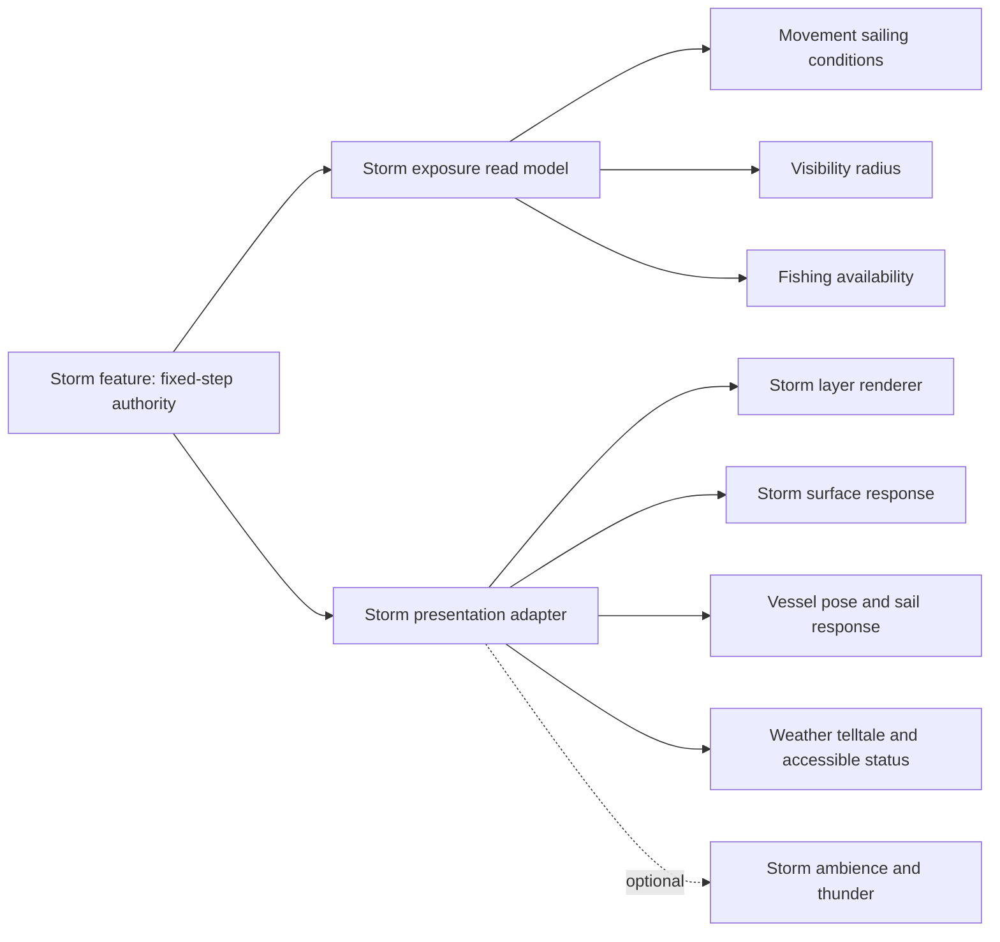
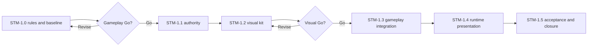

# Wayfinders storm-system milestone

Status: proposed on 2026-07-19. This document does not authorize runtime
implementation.

This document owns the detailed unimplemented design and acceptance criteria
for `STM-1`. `Wayfinders_Roadmap.md` owns planning, sequencing, and
authorization status. Implemented behavior belongs in
`Wayfinders_Technical_Design.md`, current ownership belongs in
`ARCHITECTURE_MAP.md`, production artifact contracts belong in
`Wayfinders_Asset_Pipeline.md`, and completion evidence belongs in
`Wayfinders_Roadmap_Archive.md`.

The five studies under `concept_art/storms` are reference art only. They must
never load at runtime or establish gameplay facts by themselves.

## Recommendation

Add sparse deterministic regional storms as a new gameplay-authoritative
feature with a separate presentation adapter. Existing decorative clouds,
cloud atlas slots, generated rough water, rendered pixels, particles, audio,
and animation remain presentation-only.

The first storm release should affect play in four bounded ways:

1. storm wind changes commanded sailing speed relative to heading;
2. storm intensity reduces turn response;
3. storm intensity temporarily reduces current sight without erasing Personal
   or Supported knowledge; and
4. severe storm exposure disables fishing-shoal surveying while leaving shoal
   identity, quality, placement, and returned records unchanged.

It should not add passive lateral drift, provision surcharges, hull health,
random lightning damage, direct storm wrecks, dynamic collision, terrain
mutation, or time-dependent route costs. Those exclusions preserve the current
exact movement sweep, provision accounting, Forward Guidance, Voyage Sense,
and wreck lifecycle while still making storm approach, heading, visibility,
and the decision to fish tactically meaningful.

## Intended outcome

`STM-1` is successful when:

- storms have stable identities, wrapped footprints, lifecycles, wind, and
  intensity driven by fixed simulation time;
- a stopped ship can be overtaken by a storm and receive updated sight and
  interaction state without moving;
- players can read an approaching front, its current footprint, wind direction,
  and local severity through coordinated world cues and accessible status;
- the same semantic storm state drives cloud mass, shadow, rain, water response,
  shore response, vessel response, and optional sound without pixels becoming
  authority;
- terrain, routes, the ship, markers, risk guidance, prompts, and screen-space
  UI remain readable under every weather state;
- west/east, north/south, and corner wrapping produce one storm identity rather
  than duplicate hazards;
- reduced motion and flash-safe presentation preserve every gameplay meaning;
  and
- normal sailing remains local, bounded, revision-driven, and stable across
  repeated world laps.

## Current constraints

### Authority boundaries

- `GameSimulation` is the headless composition root and owns deterministic
  cross-feature ordering.
- `MovementAuthority` owns accepted displacement, collision-safe movement,
  ordered tile entries, and travel segments.
- `VisibilitySystem` owns current line of sight. Knowledge remains separate:
  reduced current sight cannot delete Personal or Supported state.
- Forward and return guidance share exact terrain, collision, knowledge, and
  provision rules. A moving storm cost would make those searches
  time-dependent, so `STM-1` does not change travel cost or passability.
- `CloudLayerRenderer` is an independent render-time decorative layer. Its
  frames, positions, shadows, frequency, and motion cannot define a storm.
- `GeneratedWaterLayout` rough/current/abyss facts are presentation-only. They
  cannot become storm placement or severity.
- The single `ActiveChunkSet` and its hard 25-entry periodic-image cap remain
  the presentation boundary. Storms do not add another viewport policy.
- The current audio milestone deliberately deferred dynamic weather. Storm
  audio is conditional scope described below, not a prerequisite for readable
  gameplay.

### Existing visual evidence

The five concept studies test one shared visual grammar in different value and
detail conditions:

| Study | Review purpose | What it does not authorize |
| --- | --- | --- |
| Home Shore squall | A readable diagonal weather boundary across dense settlement art | Permanent safety or storm immunity at Home Shore |
| Open-ocean lightning front | Long-range approach readability, wind, whitecaps, and vessel scale | Lightning damage or a global forecast |
| Mangrove lagoon deluge | Rain, runoff, reef spray, and clear water channels in dense foliage | A mechanical mangrove or lee-shelter system |
| Basalt-cove thunderstorm | Dark-on-dark silhouette, runoff, cliff spray, and local warm shelter accents | Terrain-derived protection or volcanic mechanics |
| Winter-atoll squall | Pale-on-pale storm contrast and static precipitation readability | A winter biome, snow, hail, or sleet gameplay type |

The initial runtime package may ship rain and thunder variants. Location- or
biome-specific precipitation must wait for an explicit semantic biome contract;
it cannot be inferred from an island PNG, asset name, or concept painting.

## Gameplay contract

### Authoritative storm plan

Create a new feature package at `src/wayfinders/features/storms`. It owns:

- a versioned deterministic `StormPlanV1` generated from the world seed,
  topology, static storm configuration, and a dedicated random/hash namespace;
- stable storm IDs and sorted descriptor order;
- canonical wrapped position, lifted query geometry, footprint radii/rotation,
  wind direction, motion, lifecycle phase, and normalized intensity;
- fixed-step advancement and a semantic revision;
- bounded local and active-region queries; and
- renderer-neutral current-exposure and presentation read models.

The storm namespace must not consume or reorder existing terrain, island,
water, idol, survey-site, fishing, cloud, or visual random streams. A storm
visual namespace change must leave canonical serialized gameplay definitions
and equality-observable values unchanged.

Storm footprints are analytic periodic shapes, not masks sampled from artwork.
Each descriptor has deterministic forming, mature, and dissipating phases. Its
centre moves continuously across the wrapping topology and its intensity uses a
fixed function of integer simulation tick. World regeneration creates a fresh
plan from the same declared inputs; pause freezes authoritative storm time.

The configured profile count is bounded by a declared hard cap. `STM-1.0` must
select P0/P1/P2 density only after recording a baseline. Local ship and
active-region queries may use a maintained spatial index or another measured
bounded scheme; they may not scan an area-proportional catalog every fixed
step or presentation frame.

The opening plan guarantees at least 30 simulation seconds without a severe
storm at the home dock. Later storms may cross Home Shore. Exact docking,
return settlement, replenishment, handover, completion, and developer
regeneration remain available during any storm.

### Overlap and exposure

Every query returns one normalized exposure derived from semantic storm
descriptors. Overlapping intensities do not add. Select the greatest exposure;
ties use stable storm ID. Wind and presentation identity come from that same
winning descriptor. This prevents overlapping storms from exceeding tuned
bounds or changing with iteration order.

Use three readable bands with deterministic hysteresis so a boundary cannot
chatter between states:

| Band | Proposed threshold | Sailing | Turn response | Current sight | Fishing survey |
| --- | ---: | --- | ---: | --- | --- |
| Clear | below `0.35` | `1.00` | `1.00` | configured radius | available |
| Squall | `0.35` through `0.69` | heading-relative `0.80-1.00` | `0.90` | configured radius minus 1 | available |
| Severe | `0.70` and above | heading-relative `0.55-0.85` | `0.70` | configured radius minus 2 | unavailable |

Sight never falls below one tile. Tailwind reaches the upper end of the speed
range, headwind the lower end, and crosswind interpolates deterministically.
No `STM-1` wind multiplier exceeds ordinary clear-water speed. Reverse sailing
uses the actual travel heading. Exact numeric thresholds and multipliers are
proposed defaults; `STM-1.0` locks them after a controlled vertical-slice
playtest and config validation.

The modifier changes only commanded turn and forward/reverse distance before
the existing collision sweep. Zero throttle remains zero displacement. Storms
never push an idle ship, move it through collision, create blocker tiles, or
alter the accepted `MovementResult` contract.

### Fixed-step ordering

For each fixed simulation step:

1. advance the authoritative storm clock and publish at most one semantic storm
   revision;
2. sample exposure at the ship's canonical pose;
3. derive validated heading-relative speed, turn, and sight inputs;
4. run the existing movement/collision sweep;
5. prepare ordinary distance/knowledge provision charges from accepted travel
   segments;
6. sample exposure at the accepted final pose;
7. refresh current visibility when the ship moved or the weather-limited sight
   radius changed, including while the ship is stationary;
8. continue existing knowledge, observation, dock, lifecycle, and guidance
   ordering; and
9. publish storm exposure/read-model changes for presentation.

An exposure change must not replay a movement, charge, observation, or
interaction. Existing final-bundle docking precedence and the one wreck path
remain unchanged.

### Visibility and knowledge

`VisibilitySystem` should accept an explicit validated radius for each
observation/crossed-centre update rather than reading storm state or mutating
terrain sight blockers. The final accepted centre owns `visibleNow`; crossed
centres still contribute to observation without gaps.

When a storm reduces sight:

- current full-colour visibility shrinks;
- Personal and Supported knowledge never downgrade;
- existing blocking terrain and nearest-image line traversal remain authority;
- sight expands again immediately when exposure clears;
- visibility revision invalidates affected interaction candidates and derived
  guidance through existing seams; and
- no storm layer, forecast, sound, or status may reveal hidden terrain.

Forward and return travel costs remain unchanged. Any guidance change comes
only from the current visibility contract already used by those systems, not
from a new storm surcharge or passability rule.

### Fishing interaction

Severe weather makes a nearby fishing-shoal survey unavailable because the
surface cannot be worked safely. Sighting remains governed by current sight.
Island dossiers, survey sites, wreck surveys, home interaction, and lifecycle
commands do not receive a speculative universal weather gate.

The fishing read model exposes a typed unsafe-weather availability state, and
the command rechecks the current exposure atomically. Rejection:

- spends no provisions;
- changes no fishing, expedition, knowledge, storm, or feature revision;
- never rerolls quality, clue, outcome, placement, or ID; and
- becomes available again when severe exposure clears.

Do not introduce a generic encounter system or second event bus for this rule.

### Explicit non-effects

`STM-1` does not add:

- passive wind drift, inertia, sail trim, tacking, or a general wind simulator;
- storm travel-cost multipliers or time-expanded route search;
- provision drain while stationary;
- hull health, damage, repair, exposure meters, or direct storm wrecks;
- random lightning strikes or lightning gameplay;
- new collision, terrain, water, resource, fishing-quality, or island-biome
  state;
- mechanical cove, lagoon, mangrove, or terrain-derived shelter;
- global forecasting, charted storm memory, or weather-watch rewards;
- tide, flooding, changing shorelines, dynamic depth, or current gameplay;
- gameplay persistence, save migration, or networking; or
- a plugin framework, universal environmental-effect bus, or second scheduler.

Any one of these requires a later explicitly authorized milestone with its own
guidance, fairness, performance, and acceptance design.

## Visual delivery

### Visual thesis

Keep the crisp high-angle pixel-gameplay language, organic coastlines, deep
teal water, luminous shallows, and selective warm craft accents. Let one
coherent storm footprint alter cloud value, shadow, precipitation, wind,
surface response, spray, runoff, and vessel pose together while preserving
large quiet regions and a decisive exposed-versus-clear boundary.

The world communicates the storm first. A compact screen-space weather
telltale may reinforce current local band and wind direction, but it cannot
show undiscovered storms or replace exact accessible text.

### One semantic input, several presentation consumers

`StormPresentationAdapter` projects stable semantic IDs, canonical/lifted
footprints, current band/intensity, wind, lifecycle phase, and presentation
event ticks. It may select asset variants, tints, density, and animation phase,
but those choices never feed back into `GameSimulation`.

### Production asset family

Create a separate validated storm package rather than extending the ordinary
24-slot cloud package. The package may contain:

- broad storm shelf, canopy, and broken-cell cloud silhouettes;
- paired high-altitude shadow/coverage masks;
- rain-curtain and streak animations with useful static frames;
- surface-response art for rain rings, short chop, whitecaps, spray, and a
  restrained lightning reflection;
- shore/ground accents for spray, runoff, small falls, and wind debris where
  semantic placement supports them;
- local lightning variants with a non-flashing fallback; and
- metadata for origins, bounds, layers, animation, reduced motion, and stable
  presentation IDs.

Proposed paths are `assets-src/stm1/storms` for retained sources/provenance,
`public/assets/stm1/storms` for prepared runtime RGBA, and
`src/wayfinders/assets/packages/storm-atmosphere.json` for the validated
package. A read-only asset checker validates format, dimensions, frame
geometry, unique IDs, opaque bounds, transparency, safe paths, and static
fallbacks.

A dedicated Storms asset workspace should preview the real package and shared
presentation adapter over deterministic fixtures. It owns preview seed, time,
pause, zoom, guides, reduced motion, and presentation settings only. It cannot
change gameplay thresholds, storm authority, fog rules, terrain, water layout,
or repository state unless a later authoring gate explicitly defines a guarded
transaction.

### Layer and ownership plan

| Planned layer | Owner | Rule |
| --- | --- | --- |
| Storm surface/shore response near depth `12` | `StormLayerRenderer` using semantic terrain and presentation facts | Above baked map planes, below fog; never mutates `GeneratedWaterLayout` |
| Main precipitation/spray curtain near depth `34` | `StormLayerRenderer` | Below knowledge/risk so routes remain readable |
| Knowledge and Voyage Sense at current `35-38` | Existing renderers | No storm-owned redraw or authority |
| Markers and ship at current `36-50` | Existing renderers plus bounded ship pose input | Ship silhouette remains readable |
| Ordinary cloud shadow/cloud at `51/52` | Existing `CloudLayerRenderer` | Remains decorative and independent |
| Elevated storm shelf/lightning near `52.5/53` | `StormLayerRenderer` | Below diagnostics, prompts, and UI; no full-screen flash |

Depth alone is not a fog policy. Unknown is opaque but Personal fog is
translucent, so every current-state storm layer - including response planes
below depth 35 - must be clipped or gated by shared current-clear visibility
coverage (`visibleNow`, not merely Personal or Supported knowledge), or by an
explicit owning storm-visibility selector. Above-fog shelf/lightning uses
conservative padded whole-footprint gating. No current storm state may leak
through occluded Personal tiles unless a later milestone defines durable
weather memory.

Water response is a transient view of the storm snapshot. It cannot write
`GeneratedWaterLayout`, create a storm terrain/profile ID, suppress authored
water ownership incorrectly, or sample composite pixels. Periodic aliases
share canonical storm resources and carry only lifted offsets.

### Readability and accessibility

- The storm boundary, wind direction, local band, and affected water must read
  without relying on lightning or colour alone.
- The ship, coastline, channels, markers, return thread, cargo, prompts, and UI
  remain legible in clear, Squall, and Severe fixtures.
- Exact semantic text reports current local band and its handling/sight/fishing
  effects. It is ordinary live UI, never baked into raster art.
- Lightning is local, rare, luminance-capped, and never accompanied by screen
  shake. No rapid or full-screen strobe is permitted.
- Reduced motion preserves authoritative storm position and boundary but holds
  cloud turbulence, rain/ring/whitecap phases, and vessel accents at useful
  static poses. It removes lightning flashing while retaining a non-flashing
  cue.
- Animation may not be the sole carrier of severity, wind, or fishing
  availability.

### Conditional audio

Storm visuals and semantic UI must be sufficient with audio muted or
unavailable. After the outstanding current audio browser acceptance closes,
`STM-1.4` may add one bounded wind/rain ambience state and visible-lightning
thunder cues through the existing renderer-neutral mixer and Phaser adapter.
It adds no second event bus, hidden-world query, weather authority, or
repository audio editor. If that dependency is still open, storm audio is
recorded as deliberately deferred and does not block the visual/gameplay
milestone.

## Architecture plan

| Owner or seam | Planned extension | Must not do |
| --- | --- | --- |
| `features/storms` | Plan, fixed-step state, exposure query, selectors, public contracts, presentation adapter | Import Phaser or rendered assets |
| World topology/manifest identity | Supply seed, topology, and declared storm-plan version/fingerprint | Store per-frame particles or infer from art |
| `GameSimulation` | Compose storm ordering and expose bounded read models/events | Own rendering choices or a second mutation path |
| `MovementAuthority` | Accept validated renderer-neutral sailing conditions | Import storm feature rules or add passive drift |
| `VisibilitySystem` | Accept an explicit validated observation radius | Mutate terrain blockers or read sprites |
| Fishing public seam | Expose/recheck typed unsafe-weather availability | Reroll content or create a generic encounter layer |
| `StormLayerRenderer` | Consume active-chunk delta and presentation snapshot; own bounded resources | Scan the world or write gameplay |
| Existing cloud renderer | Continue decorative cloud ownership | Become storm authority |
| Existing water/ship renderers | Consume bounded presentation parameters where they already own the surface/ship | Duplicate storm state or mutate layout |
| Diagnostics | Report bounded storm revisions, candidates, queries, resources, and timing | Own commands outside existing debug composition |

Implementation may update `ARCHITECTURE_MAP.md` only when these seams actually
exist. This proposal does not make them current truth.

## Milestone sequence

### STM-1.0 — Product contract, vertical slice, and baseline

- Approve, revise, or reject the authority/effect matrix and non-goals.
- Build one tiny deterministic headless fixture plus a temporary developer
  visualization without production art.
- Playtest Clear, Squall, and Severe handling/sight/fishing behavior.
- Lock thresholds, multipliers, start-clear rule, density cap, query budget,
  visual thesis, and reduced-motion/flash policy.
- Record current performance and resource baselines before broad work.

Exit: explicit product-owner Go on the gameplay rules and the bounded
implementation batch. No later gate proceeds automatically without that Go.

### STM-1.1 — Deterministic storm authority

- Implement versioned stable storm planning, fixed-step lifecycle/motion,
  periodic geometry, overlap selection, bounded queries, revisions, snapshots,
  and diagnostics.
- Cover same-seed replay, different-seed variation, seam/corner continuity,
  iteration-order independence, regeneration, pause, and opening safety.
- Prove terrain, islands, water, resources, fishing content, and ordinary cloud
  descriptors are unchanged by the storm namespace.

Exit: headless contracts and named local-query budgets pass.

### STM-1.2 — Visual kit and approval workspace

- Author the storm package, source provenance, checker, static fallbacks, and
  the dedicated Storms preview.
- Implement the shared presentation adapter and enough renderer work to review
  every layer in the real water/fog/knowledge/risk/cloud/ship/UI stack.
- Review all five concept scenarios at minimum/default/maximum zoom, every fog
  state, grayscale, reduced motion, and flash-safe settings.

Exit: separate technical validation and product-owner visual Go. Concept PNGs
remain reference-only.

### STM-1.3 — Gameplay integration

- Add heading-relative sailing conditions to movement without changing
  collision results or `MovementResult` provenance.
- Add per-observation weather-limited sight and stationary refresh.
- Add severe-weather fishing availability and atomic rejection.
- Preserve guidance cost, docking precedence, knowledge, expedition, wreck,
  lineage, and completion contracts.

Exit: unit, contract, integration, replay, and lifecycle matrices pass with
the approved tuning.

### STM-1.4 — Runtime presentation and accessibility

- Integrate storm response, precipitation, elevated atmosphere, vessel pose,
  weather telltale, exact accessible status, reduced motion, and teardown.
- Share canonical resources across periodic aliases and gate every current
  storm layer against current-clear visibility coverage.
- Add conditional storm audio only if its prerequisite is closed.

Exit: browser acceptance passes with audio enabled, muted, and unavailable;
with normal and reduced motion; and across fog and topology seams.

### STM-1.5 — Scale, polish, and closure

- Run named P0/P1/P2 storm density, repeated-lap, seam/corner, and active-chunk
  resource acceptance.
- Tune only within the approved semantic contract; do not weaken budgets or
  safety assertions to close the gate.
- Rewrite technical design and architecture as current truth, update the asset
  pipeline for real artifacts, record volatile verification in implementation
  status, archive durable evidence, and compress the roadmap to the completed
  outcome.

Exit: full relevant test lanes, performance budgets, bundle, live acceptance,
documentation consistency, and product-owner sign-off pass.

## Acceptance criteria

### Determinism and authority

- Same seed, config, topology, storm version, fixed tick, and input sequence
  produce identical storm plans, exposure bands, ship state, visibility,
  events, fishing availability, diagnostics, and snapshots.
- Different seeds can change storm layout without changing non-storm content.
- Queries and overlap results are stable across descriptor iteration order.
- Seam and corner images resolve one canonical storm and equivalent exposure.
- No pixel, sprite, tint, animation frame, audio state, cloud slot, water
  profile, or active-chunk alias can change gameplay.

### Gameplay

- Headwind, crosswind, tailwind, reverse, turn, zero-throttle, collision, and
  seam movement truth tables pass for all bands.
- Storms change travel time/handling but not distance-based provision charges,
  terrain passability, or route cost.
- Sight shrinks and expands at the correct fixed step while Personal and
  Supported knowledge remain unchanged.
- A storm crossing a stationary ship refreshes visibility and interaction
  state without synthetic movement.
- Severe fishing rejection is atomic and reversible and leaves all stable
  fishing facts unchanged.
- Docking, return, replenishment, handover, wreck, and completion retain their
  existing precedence and one-shot behavior.

### Presentation

- All five fixtures communicate storm footprint, wind, and exposure while
  preserving terrain, shoreline, channels, ship, markers, route, cargo, and UI.
- Rain, rings, whitecaps, spray, runoff, cloud shadow, vessel pose, and
  lightning agree on one wind and footprint.
- Unknown and occluded Personal fog reveal no current storm or hidden terrain
  through any layer, particle, reflection, sound, or status.
- Static/reduced-motion frames preserve severity and wind; lightning never
  strobes or carries essential meaning.
- Concept art is never loaded by game or asset workspace.

### Resources and performance

- Storm queries and rendering reuse the existing active-chunk boundary and do
  no ordinary total-world scan.
- The hard 25 active periodic-image-entry cap remains unchanged.
- Canonical storm resources are shared by aliases; deactivation releases only
  storm-owned resources before activation creates replacements.
- Stable frames allocate no textures and storm-dirty changes invalidate only
  intersecting canonical owners plus a declared narrow dependency ring.
- Repeated laps reach stable descriptor, sprite, texture, listener, timer,
  audio-voice, and redraw plateaus.
- Existing authoritative P0/P1 tile-entry and P2 guidance budgets remain
  green. `STM-1.0` sets an attributed storm query/update budget from a measured
  baseline before implementation.

## Verification

Use `tests/README.md` as the canonical lane guide. Expected coverage includes:

- tiny headless storm generation, overlap, topology, movement, visibility, and
  fishing contracts;
- fixed-step partition and same-seed periodic journey replay;
- renderer invalidation, current-clear clipping, alias/rebase equivalence,
  reduced motion, resource ownership, and scene teardown;
- asset contract/checker and repository I/O only if guarded writes are added;
- named serial performance profiles and repeated laps; and
- live browser acceptance for the five fixtures, fog boundaries, seams,
  pause/background recovery, responsive viewports, reduced motion, audio
  enabled/muted/unavailable, and console-clean restart.

During implementation, run the focused owning tests, `npm.cmd run check:quick`,
source and test typechecks, relevant contract/integration/I/O/performance lanes,
`npm.cmd run build:bundle`, and finally `npm.cmd run check`. Record volatile
timings and operational blockers only in `IMPLEMENTATION_STATUS.md`.

## Risks and controls

| Risk | Control |
| --- | --- |
| Decorative clouds or rough water become hidden gameplay authority | Separate storm feature and one-way presentation adapter |
| Moving costs make exact guidance stale every tick | No storm passability or provision-cost changes in `STM-1` |
| Wind drift diverges predicted and accepted routes | Heading-relative commanded speed only; no passive vector |
| Dynamic sight churns guidance and interaction caches | Publish semantic revisions only on real radius/state changes |
| Storm art reveals hidden terrain through Personal fog | Current-clear clipping for every current-state layer, not depth alone |
| Overlap produces extreme or order-dependent effects | Maximum exposure plus stable-ID tie break |
| Dark weather erases routes, ship, or shoreline | Fixed layer order, value-separation review, and five contrast fixtures |
| Lightning creates accessibility or gameplay ambiguity | Local luminance cap, no strobe/screen shake, no damage |
| Island-specific art invents shelter or biome rules | Concepts remain review fixtures; runtime consumes only semantic contracts |
| New renderer scales with world size | Shared active set, bounded local queries, canonical resource sharing, telemetry |
| Storm scope absorbs tides, damage, forecasting, or saving | Explicit non-goals and a product decision before expansion |

## Documentation closure

While `STM-1` is proposed, this document owns its detailed design and acceptance
criteria and the roadmap owns its status. Do not update the technical design or
architecture map as though these seams exist.

When the track closes:

1. rewrite the technical design and architecture map to present implemented
   truth;
2. update the asset pipeline only for actual checked-in storm artifacts and
   repository transactions;
3. keep only volatile verification/operational state in implementation status;
4. archive durable outcome, implementation references, skipped decisions, and
   acceptance evidence; and
5. replace the detailed current-roadmap plan with a concise completed summary.
