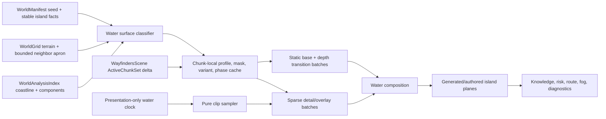

# Wayfinders water-system milestone proposal

This document owns detailed design and acceptance criteria for the water-system
proposal. `Wayfinders_Roadmap.md` owns its planning and authorization state. A
reviewable source/runtime candidate pack exists under `assets-src/gr1/water`,
but no water asset is registered or loaded by the game.

The first milestone is a rapid, branch-only **Water** workspace prototype in the
asset library. Its purpose is to put plausible water in front of the product
owner quickly, gather visual feedback, and iterate on tiles and depth blending
before iterating on animation and island handoffs. The replacement follow-up
milestones remain branch playground work; production contracts and game
integration are not scheduled by this proposal.

## Outcome

Evolve the branch Water workspace into a focused visual playground that:

- visually belongs beside the current home island and island reference set;
- distinguishes deep, shallow, reef, lagoon, current, rough, and biome-specific
  water without inventing accidental gameplay rules;
- demonstrates judged-default wind and wave animation without a tuning-heavy UI;
- places representative authored and generated islands in irregular
  shore-following shallow-to-deep water;
- adds broken, non-uniform animated waves around island edges;
- introduces up to ten fishing-shoal looks matched to different water profiles
  and animates them in context;
- preserves terrain, collision, navigation, knowledge, provisions, and world
  generation as the only gameplay authorities; and
- keeps every preview decision visual-only and isolated from gameplay authority.

The proposed sequence is complete when the Water tab can demonstrate convincing
open-water motion, irregular island depth handoffs, varied animated shoreline
waves, and water-specific animated fishing shoals well enough to gather product
feedback. It does not imply a promoted package, default runtime renderer,
generalized animation system, or game integration.

## Evidence and current constraints

The proposal is based on the current repository and these art references:

- `public/assets/gr1/images/home-island.png` is a tracked `480 x 480` RGBA runtime image
  aligned to a `15 x 15` navigation-cell package. It already includes turquoise
  shallows, an irregular shorewash/foam edge, harbor water, rocks, sand, and a
  transparent exterior.
- The retained `assets-src/gr1/water` pack contains the current water reference
  material and provenance notes. It remains source material only and must never
  be sampled, keyed, or loaded by the game.
- The art style uses dense but readable top-down pixel clusters, warm sand and
  foliage, broken rather than continuous highlights, organic scalloped
  coastlines, and a turquoise-to-navy depth ramp. Water must support the islands,
  not compete with their higher-contrast structures and vegetation.
- The current validated configuration uses a `32 px` navigation cell and a
  `16 px` presentation art cell. The water package consumes that configured
  `artTileSize`, so each current navigation cell contains a `2 x 2` visual
  lattice. The art lattice is presentation configuration, not gameplay
  authority, and must not be hard-coded. The separate `8 px` hybrid collision
  lattice is collision authoring only and is not a water-art grid.
- The current default world chunk is `32 x 32` navigation cells, but runtime
  code must read `WorldGrid.chunkSize` rather than encode that default.
  Neighbor classification must cross chunk boundaries; a seam at a chunk
  boundary is a correctness failure.
- `TerrainType` currently distinguishes `DeepOcean`, `ShallowOcean`, and
  blocking `Reef`. Currents, rough patches, lagoon calm, and glints are
  presentation variants, not new terrain. Brackish art remains prepared but
  unplaced because the current world has no matching biome context.
- `WorldRenderer` draws a full-ocean backdrop, per-cell shallow or Supported
  fills, and sparse wave strokes. `WayfindersScene` owns one `ActiveChunkSet`;
  its bounded delta controls construction and destruction for terrain, overlays,
  markers, textures, and authored assets. Water must consume that same boundary
  and preserve dirty knowledge updates rather than invent a viewport policy.
- The authored-home path currently omits water/waves for the entire rectangular
  home footprint. That must be narrowed: water needs to continue behind
  transparent island pixels so the organic alpha edge never exposes a flat
  rectangle or empty background.
- The project has metadata-timed ship/wake presentation, but no shared general
  animation system. WTR-1.1 uses the smallest Water-workspace-local timing path
  practical and does not create a game-wide clock. Any later runtime proposal
  must keep presentation time outside simulation and avoid a second simulation
  clock.
- `WorldManifest` now owns durable generated identity and `WorldAnalysisIndex`
  owns shared coastline and water-component facts. Water may derive its exact
  eight-neighbor visual mask from a bounded `WorldGrid` apron, but it must reuse
  those public facts where they apply and must not add another full-world
  coastline or connectivity pass.
- The asset library currently exposes Islands, Ships, Fishing shoals, and Great
  Hall workspaces. WTR-1.0 adds a Water tab on its prototype branch. The tab is
  a feedback surface, not a commitment that its code, route, or structure ships
  unchanged in the production asset library.

## Visual language

### Palette handoff

Use the island shallows as the fixed handoff point. The water package may vary
within these bands, but the shoreline-facing pixels must converge on the same
turquoise/seafoam family.

| Role | Palette anchor | Rule |
| --- | --- | --- |
| Abyss | `#082f40` | Lowest contrast and least highlight density |
| Open deep water | `#12536a` | Default ocean body; sparse short blue-green glints |
| Lagoon/depth transition | `#2d858b` | Mid-tone bridge; never a hard cyan stripe |
| Coastal shelf | `#4aa1a0` | Turquoise island apron with warm sand influence |
| Shorewash | `#8bd0cf` | Broken, low-opacity edge and ripple accents |
| Pale foam | `#a9d6ad` | Rare brightest water mark; below sand/structure highlights |

Supported, Personal, and Unknown are knowledge states, not water types. Preserve
the Supported cue with a renderer tint/material parameter and preserve
Personal/Unknown through the knowledge overlay. Do not duplicate the entire art
pack for each knowledge state.

### Texture and motion rules

- Keep large areas quiet. Fine mottling may fill the surface, but bright marks
  should occupy only a small fraction of a cell.
- Prefer broken wavelets, short caustic arcs, and irregular reef shadows over
  uninterrupted parallel lines.
- Keep the islands as the focal plane. Deep water should be lower contrast than
  foliage, buildings, docks, rocks, and shoreline foam.
- Do not put a unique focal object in a repeatable base tile. Fish, debris,
  bubbles, birds, or a single large coral head belong in sparse detail overlays.
- Variants may change interior texture and highlight placement, but they must not
  change topology coverage at an edge.
- Motion should read at normal zoom without making the full map shimmer. Freeze
  the base plane by default and animate sparse overlays.
- No magenta key color, premultiplied fringe, opaque transparent RGB, watermark,
  text, horizon, perspective, or directional lighting belongs in runtime water.

## Water taxonomy

The classifier chooses one authoritative terrain class and then zero or more
presentation tags. The tags may change appearance only.

| Visual profile | Authority | Placement | Initial motion | Gameplay meaning |
| --- | --- | --- | --- | --- |
| Abyss | `DeepOcean` | Rare far-water or deliberately deep patches | 3 FPS sparse glint | Same passability/cost as its underlying terrain |
| Deep | `DeepOcean` | Default open ocean | Static base; 3–4 FPS ripple overlay | Existing deep-water behavior |
| Coastal | `ShallowOcean` | One or more cells around island land/reef and home art | Static base; 4–5 FPS caustic/shore accents | Existing shallow-water behavior |
| Lagoon | contextual `ShallowOcean` | Enclosed harbor, cove, atoll interior | Slow 2–4 FPS small reflections | No new rule |
| Reef | exactly `Reef` | Existing reef cells only | 3 FPS caustic/breaker accents | Remains blocking; must be visually unmistakable |
| Current | presentation tag on passable water | Seeded coherent ribbons, never isolated checkerboard cells | 4–7 FPS directional streak | Visual only in this milestone; no navigation current |
| Rough | presentation tag on passable water | Seeded exposed-looking patches | 5–7 FPS sparse whitecap | Visual only in this milestone; no weather authority |
| Brackish | prepared future profile | Deferred until a world contract supplies mangrove, marsh, or river-mouth context | 2–3 FPS subdued ripple | Not placed by WTR-1 |

Additional sparse overlay details can include seagrass shadow, coral glint, foam,
whitecap, bubbles, or floating debris. None may imply a collision or navigation
rule that the underlying terrain does not have. In particular, do not call a
passable decorative coral patch a reef while `TerrainType.Reef` blocks movement.
The brackish frames remain useful package inventory, but WTR-1 must not infer a
biome that the current manifest and terrain contracts do not describe.

### Classification priority

1. Use `WorldGrid` terrain as authority and `WorldManifest` for stable world and
   island identity.
2. For `Reef`, always choose the reef-readable base before contextual styling.
3. For `ShallowOcean`, select coastal or lagoon from island kind,
   enclosure/harbor context, and a namespaced deterministic value. Brackish
   remains unplaced until its context exists.
4. For `DeepOcean`, select deep by default and abyss only in coherent regions.
5. Apply current/rough/detail tags after the base profile. A tag cannot change
   terrain, cost, collision, or sight.
6. Reuse `WorldAnalysisIndex` coastline/component facts for eligibility and
   bounded queries. Derive only the exact local eight-neighbor mask that the
   index does not already provide; never rescan the full world.
7. Apply knowledge/risk/route/fog presentation in their existing layers after
   water composition.

## Grid, seams, and transitions

### Runtime cell contract

- The prepared package's general water frames display as exactly `32 x 32`
  world pixels. Package validation must reject a runtime configuration whose
  navigation tile size disagrees with the accepted water package.
- Compose features around the package's `16 px` internal art lattice: major caustic bends,
  reef clusters, and transition control points should cross the half-cell lines
  naturally instead of forming a second arbitrary grid. This is an art review
  rule, not a new logical coordinate system.
- Do not align water decoration to the `8 px` collision subgrid.
- Use integer source rectangles and stable sprite origins. Render placement is
  always `tileX * 32`, `tileY * 32` before camera transformation.
- Runtime sheets use a `2 px` duplicated-edge margin and `4 px` spacing between
  frames. The loader must be extended to pass both values. This prevents adjacent
  frame bleed with antialiasing and fractional zoom.
- Validate at minimum zoom `0.65`, default zoom, and zoom `1.7` with the game's
  actual WebGL settings.

### Deep-to-shallow topology

Use a gated eight-neighbor blob mask rather than a four-neighbor-only shoreline.
Bits are:

```text
N=1, E=2, S=4, W=8, NE=16, SE=32, SW=64, NW=128
```

A diagonal bit is retained only if both adjacent cardinal bits are present. That
canonicalization produces 47 masks. The prepared transition sheet stores those
47 masks explicitly through `maskLookup` in `water-package.json`.

```text
canonical = mask & (N | E | S | W)
keep NE only when N and E are set
keep SE only when S and E are set
keep SW only when S and W are set
keep NW only when N and W are set
```

Classification needs a one-cell neighbor apron beyond each activated chunk.
Build exact masks from authoritative neighboring terrain, including neighbors
owned by another chunk, then cache the mask with the chunk view. Use existing
`WorldAnalysisIndex` facts to select coastline/component candidates; do not
recompute global coastline or connectivity. Knowledge changes must not
recalculate topology or deterministic variants.

Depth transitions are a presentation plane between the deep and shallow bases.
Variants may alter interior water texture, but a given mask has fixed edge
coverage. This prevents variant choice from opening pinholes or tearing corners.

### Deterministic variation

Use a visual-only coordinate hash with a fixed namespace, for example:

```text
variant = hash(manifest.seed, tileX, tileY, "water-base-v1") % variantCount
phase   = hash(manifest.seed, tileX, tileY, "water-phase-v1") % phaseBucketCount
detail  = hash(manifest.seed, tileX, tileY, "water-detail-v1")
```

Do not consume `SeededRandom` calls from terrain/island/resource generation.
Changing a visual namespace must change pixels only; a serialized comparison of
terrain, island IDs, resources, collision, and navigation must remain identical.
Island- or region-phased effects use stable manifest island IDs or explicitly
derived presentation-region IDs, never array positions or activation order.

## Island blending contract

### Authored home island

The home composition has a better organic shore than a coarse tile mask can
produce. Treat it as an authored composition with a water handoff, not as a
rectangle that replaces the ocean.

1. Draw deep/coastal water throughout the home package footprint, including
   behind pixels that will later be covered by opaque island art.
2. Draw generic depth transitions, underwater details, and generic surface
   effects below the home composition.
3. Draw `home.island.primary` at its existing `15 x 15` grid position and depth.
4. Draw only the package-aligned `480 x 480` home shoreline/glint clip above the
   composition. Its top-left, scale, and frame origin must match the home image
   exactly.
5. Never draw coarse generic foam above the home island. Its square/cardinal
   geometry cannot match the baked organic foam edge.

The renderer does not need to sample PNG alpha to decide terrain. It simply
renders the water underlay first and the authored image afterward. Topology,
collision, dock return, and anchors continue to come from package metadata.

### Other authored islands

Adopt the same contract for future packages:

- declare a shared shore-handoff palette;
- provide clean RGBA runtime art rather than magenta-keyed RGB;
- allow water under transparent composition pixels;
- optionally provide a composition-aligned shoreline overlay clip; and
- keep collision/terrain metadata authoritative.

### Generated islands

Generated land, rock, and reef continue to use `WorldGrid` topology. The water
renderer supplies depth masks and generic foam below the terrain/coast plane.
Island kind may choose a contextual palette (high island, cay, atoll, skerry,
using only kinds present in the current manifest), but it cannot change
passability. Mangrove, marsh, and river-mouth styling is deferred until those
contexts exist in a world contract. Atoll entrances and minimum channel width
are regression cases because an attractive transition must never visually or
logically close a passable channel.

## Deferred production render architecture

This architecture is retained as reference for a future runtime proposal. It is
not part of WTR-1.1 through WTR-1.5.



Create a dedicated `WaterRenderer` rather than adding more branches to the
existing developer-art loop. A practical initial chunk record is:

```ts
interface WaterChunkView {
  readonly entry: Readonly<ActiveChunkEntry>;
  readonly chunkX: number;
  readonly chunkY: number;
  readonly baseLayer: BatchedWaterLayer;
  readonly transitionLayer: BatchedWaterLayer;
  readonly underwaterLayer: BatchedWaterLayer;
  readonly surfaceLayer: BatchedWaterLayer;
  readonly instances: readonly WaterVisualInstance[];
  knowledgeRevision: number;
}
```

The exact Phaser primitive can be selected during any later authorized runtime
integration, but it must batch by
plane and texture and activate through `ActiveChunkSet` deltas. Do not create
one tween, Phaser animation, or standalone game object per ocean tile.
`WayfindersScene` remains the only owner of chunk membership: water processes
deactivations first, activations in the supplied load-priority order, and band
updates for retained chunks. It does not compute a second viewport region.
Prefetch entries may retain static resources, but only `visible` entries
advance animation. The existing constant ocean backdrop remains the bounded
low-detail presentation for deferred visible chunks and activation gaps.

### Layer order

| Relative order | Plane | Notes |
| ---: | --- | --- |
| 0 | Constant ocean backdrop | Covers the world as the deferred/activation fallback |
| 0 | Detailed deep/static water base | Covers active chunks only |
| 0.25 | Shallow/depth transitions | Cached topology |
| 0.5 | Reef/seagrass underwater detail | Terrain-readable; below foam |
| 1 | Generic ripple/current/whitecap overlays | Sparse and animation-capable |
| 2–3 | Generated terrain/coast | Existing terrain authority |
| 4.5 | Authored home island | Existing package depth |
| 4.6 | Authored home shoreline overlay | Same transform as home art |
| existing upper depths | Ship/wake, knowledge, risk, routes, fog, diagnostics | Preserve current ordering contracts |

Knowledge refreshes update a tint/uniform or the knowledge-specific presentation
batch for dirty chunks. They do not rebuild terrain masks, variants, phases, or
animation descriptors.

## Animation foundation

This section is deferred production design reference. WTR-1.1 should not build
this shared foundation; its animation exists only in the branch Water workspace
and may be replaced after visual feedback.

### Principles

- Animation is unsaved presentation state.
- Simulation fixed-step time remains authoritative for gameplay; water reads a
  presentation time only.
- `WayfindersScene` owns one rendering-layer presentation clock and supplies one
  time snapshot per rendered frame. The clock does not live in `core`,
  `GameSimulation`, or `SimulationClock`.
- A pure function resolves frame state from metadata, time, and a deterministic
  phase. This follows the same separation used by ship animation.
- Update a layer only when its discrete frame advances and only while its chunk
  has the shared active-chunk band `visible`.
- Pause, scene sleep, tab backgrounding, and resume cannot create gameplay work
  or an animation catch-up loop.
- The system must respond to live `prefers-reduced-motion` changes.
- Any later shared-animation work may migrate ship/wake sampling from direct
  `scene.time.now` reads to the same presentation-time input while preserving
  its current visual and gameplay behavior. This makes the foundation shared
  without adding another animation scheduler.

Proposed descriptor:

```ts
interface WaterClipDescriptor {
  readonly id: string;
  readonly imageId: string;
  readonly frameStart: number;
  readonly frameCount: number;
  readonly framesPerSecond: number;
  readonly loop: "loop" | "ping-pong";
  readonly phasePolicy: "tile" | "region" | "global";
  readonly phaseBucketCount: number;
  readonly reducedMotionFrame: number;
  readonly opacity: number;
  readonly validProfiles: readonly WaterProfileId[];
}
```

Frame resolution:

```text
tick  = floor(visualTimeMs * framesPerSecond / 1000)
frame = frameStart + ((tick + phaseBucket) mod frameCount)
```

Use tile phases for disconnected deep glints. Use one region/island phase for
connected surf so adjacent foam does not tear. The home-aligned clip is one
region and must advance as a single frame.

### Initial clip budget

| Clip | Frames | FPS | Phase policy | Default density |
| --- | ---: | ---: | --- | ---: |
| Open ripple/glint | 8 | 3–4 | tile, 4 buckets | 10–15% of visible deep cells |
| Shallow caustic | 8 | 4–5 | tile, 4 buckets | 20–30% of visible shallow cells |
| Current ribbon | 8 | 4–7 | region | Only classified current cells |
| Whitecap | 8 | 5–7 | region/tile | Rare exposed-water patches |
| Reef breaker | 4–8 | 3–5 | region | Reef perimeter only |
| Home shoreline | 8 | 5 | home region/global | One aligned composition clip |

The prepared current source reads west-to-east. Initial implementation may use
four cardinal orientations through 90-degree rotations. Diagonal flow requires
authored diagonal frames; do not rotate a square opaque tile by 45 degrees and
expose corners.

Reduced motion immediately selects each descriptor's representative static
frame, retains terrain/profile contrast, and stops frame updates. It must not
remove shallow/reef readability or alter simulation state.

## Prepared candidate package

The candidate lives at `assets-src/gr1/water` and is intentionally outside the
live gameplay catalog until a separately authorized production milestone
establishes validation and promotion rules.
WTR-1.0 may expose these candidate outputs through the smallest practical
preview loader or branch-local copy. Preview availability is not review,
promotion, or runtime registration.

| Candidate file | Dimensions | Contents |
| --- | ---: | --- |
| `runtime/water-tiles.png` | 288 x 1152 | Eight profiles, four variants, eight frames, with gutters |
| `runtime/water-static.png` | 144 x 288 | Reduced-motion/static profile variants |
| `runtime/water-depth-transitions.png` | 1692 x 144 | 47 canonical masks x four phases, with gutters |
| `runtime/water-overlays.png` | 288 x 144 | Glint, caustic, current, and whitecap alpha clips |
| `runtime/water-home-shore-overlay.png` | 3872 x 484 | Eight guttered `480 x 480` home-aligned frames |
| `runtime/water-contact-sheet.png` | 512 x 256 | Profile review board |
| `runtime/water-home-island-preview.png` | 640 x 640 | Home/depth-handoff review composite |
| `water-package.json` | n/a | Proposed profile, sheet, mask, animation, and handoff metadata |
| `runtime/build-report.json` | n/a | Output dimensions and SHA-256 hashes |
| `validate-water-package.mjs` | n/a | Header, hash, frame geometry, mask, seam/loop-report validation |

The five runtime sheets occupy roughly `0.55 MiB` compressed and `9.6 MiB`
decoded RGBA. Source masters and previews are authoring/review files and must not
ship. `build-water-package.mjs` deterministically rebuilds the candidate without
changing `public`, `dist`, or current source files.

The builder and current `runtime` directory are candidate preparation evidence,
not an alternate production authority. Any later production milestone must
either integrate the deterministic build into the repository's production-recipe
preparation path or materialize equivalent current outputs through that path
before promotion.

The candidate is an art/contract starting point, not automatic approval. The
product owner authorized WTR-1.1 through WTR-1.5 as extensions of the WTR-1.0
feedback loop; none of the sequence authorizes production work.

## Water asset-library playground

The Water tab is a deliberately rough development and feedback surface on a
prototype branch, not a gameplay simulation, a production asset tool, or a
second asset-production authority. Prefer the shortest change through the
existing asset-workspace shell. Do not build generalized workspace, package,
or rendering infrastructure for this prototype. Its implementation may be
replaced or discarded after the visual direction is understood.

The prototype presents three compact views:

1. **Tile gallery.** Display the different static candidate water profiles and
   variants with simple labels. A small repeat view should make obvious seams
   and repeated focal marks visible.
2. **Whole-world blending playground.** Display a fixed 96x96 world that places
   every water treatment, the player boat, three representative islands, and
   eight shoals in one coherent game-scale composition. Island transparency
   drives irregular depth masks; local wind, wave, shoreline, and shoal motion
   use judged defaults. This is a fixed fixture, not `GameSimulation` or a
   generated world.
3. **Shoal gallery.** Display the eight water-specific shoal directions with
   their intended water profiles while the same sprites move in the world.

The animation clock and canvas-mask work remain local to the Water workspace.
The prototype does not create a general clip sampler, reduced-motion system,
chunk lifecycle, production package contract, promotion flow, performance
telemetry, or runtime renderer. Controls are limited to whatever directly
speeds comparison: profile, variant, overlay visibility, world inspection
scale, and one shared motion pause.

WTR-1.0 does not prototype shoreline foam, the authored home-island overlay,
water beneath transparent island art, or generated-island handoffs. WTR-1.2
introduces the island depth handoff, and WTR-1.3 adds varied animated shoreline
waves after that base relationship is understood.

Manual visual review is the primary verification method. Do not build broad
unit, integration, browser, accessibility, lifecycle, or performance coverage
for WTR-1.0. A small test or diagnostic harness is appropriate only when it is
the fastest way to try an item repeatedly—for example, checking a mask resolver
while adjusting depth blends. Rendered preview pixels and fixture cells never
become collision, navigation, terrain, or package authority.

## Deferred production package and pipeline design

This section is not scheduled by WTR-1.1 through WTR-1.5. It remains reference
for any later proposal that promotes water assets or integrates them into the
game.

Production semantic ID: `world.water.primary`.

Create a dedicated `WaterAssetContractV1`; water has different topology and clip
metadata from the three current pilot kinds. Add it as an explicit semantic
package and catalog/runtime union rather than turning the pilot contracts into a
speculative generic framework. The minimum owned changes are expected in a
parallel water contract/loader, the shared generated catalog and asset-library
entry, the production recipe/runtime-binding validator, and their focused tests.

Use the current authoritative lifecycle:

```text
selected water sources + versioned environment recipe
    -> deterministic preparation and fingerprint
    -> exact-fingerprint review
    -> promotion of the approved current package
    -> public runtime handoff and lineage report
```

The recipe uses the `environment` family and explicit empty/passable collision.
Promotion must reuse the repository transaction, stale-review, hash, orphan,
and lineage checks already owned by the asset pipeline. Water-specific mask and
clip validation extends that shared gate; it does not create an independent
promotion command or write path.

The accepted water manifest and Phaser loader path must support `frameWidth`,
`frameHeight`, `margin`, and `spacing`; current pilot animation metadata exposes
only frame dimensions. Promotion copies validated assets under
`public/assets/...`. Never author `dist` directly.

Validation must reject:

- a sheet whose dimensions do not match its frames, margin, and spacing;
- an unknown/missing profile, duplicate ID, invalid FPS, or out-of-range frame;
- transition lookup sets other than the declared 47 canonical masks;
- transparent sheets with nonzero RGB in fully transparent pixels;
- non-PNG, interlaced, non-8-bit RGB/RGBA, or over-4096-pixel-edge inputs;
- an authored overlay whose frame size/placement disagrees with its target
  island package; and
- any visual package field used as collision, passability, or resource authority.

## Implementation sequence

### WTR-1.0 — Rapid water-look prototype and feedback

Tasks:

- create a prototype branch and add a **Water** tab to the existing asset
  section with the least new structure practical;
- load the current candidate sheets for preview only, without adding a gameplay
  runtime package or production promotion path;
- display the different static base profiles and variants in a labelled gallery
  with one small repeated-tile view;
- show one fixed 96x96 world-scale composition containing every water treatment,
  broad multi-cell handoffs, and the player boat;
- add only the comparison controls that shorten the feedback loop;
- rebuild or replace candidate art manually as feedback arrives; and
- add a focused test or diagnostic only when it is faster than repeated manual
  inspection for the specific item under investigation.

Exit gate:

- the branch prototype opens from a Water tab and makes the available tile
  directions easy to compare;
- the whole-world composition makes every water treatment and its broad
  handoffs visible well enough to gather concrete product feedback;
- the feedback and preferred direction are recorded, including what should be
  changed in the next iteration; and
- no production readiness, exhaustive topology, animation, game integration,
  performance, accessibility, or automated-test gate is implied. The prototype
  can be revised or discarded.

### WTR-1.1 — Animated water playground

Tasks:

- add animation to the Water tab's world study without integrating it into the
  game or building a generalized animation framework;
- demonstrate at least two clearly readable motion families: repeating water
  waves and wind-driven surface movement;
- use judgement to add restrained supporting motion such as drifting glints,
  moving caustics, current streaks, or occasional whitecaps where it improves
  the water rather than making the whole surface busy;
- choose sensible default speed, density, direction, phase variation, and
  intensity values in code;
- keep the UI deliberately small: provide only the controls needed to view or
  pause the result, not a panel of tuning parameters; and
- use focused diagnostics only when they make visual iteration faster.

Exit gate:

- the Water tab visibly demonstrates both wave and wind motion at overview and
  1:1 game scale;
- the loops feel coherent, different water profiles retain their character,
  and the surface does not shimmer uniformly; and
- the product owner can give animation feedback without waiting for island or
  game integration.

### WTR-1.2 — Islands and irregular depth transitions

Tasks:

- place representative existing islands in the Water tab so their relationship
  with the animated water can be reviewed in context;
- continue water beneath transparent island edges and preserve the island art
  as the focal layer;
- derive shallow water from the actual shoreline shape, then transition through
  intermediate water into deep water as distance from land increases;
- vary transition width and contour around coves, points, channels, reefs, and
  exposed sides so the result never reads as a uniform circular band;
- keep the WTR-1.1 animation defaults active while judging the depth handoff;
  and
- add only lightweight island selection or comparison controls that directly
  shorten the feedback loop.

Exit gate:

- the Water tab can display representative islands inside the water world;
- each island has a readable shallow-to-deep handoff that follows its shoreline
  and varies organically rather than forming a large circle; and
- transparent edges, bays, narrow passages, and nearby reef shapes do not expose
  hard rectangles or abrupt depth steps.

### WTR-1.3 — Varied animated island-edge waves

Tasks:

- add animated shorewash and breaking-wave motion around island edges in the
  Water tab;
- make wave presence, length, intensity, and timing respond visually to local
  coastline shape and exposure rather than drawing a continuous uniform halo;
- keep protected coves and harbor-like recesses calmer while allowing more
  visible breaks on exposed points and open coasts;
- use broken segments and region-coherent phases so adjacent edge motion feels
  connected without moving in perfect lockstep;
- preserve island silhouettes, docks, reefs, channels, and the underlying
  shallow-to-deep read; and
- review the result across the representative islands introduced in WTR-1.2.

Exit gate:

- animated edge waves give islands a clear sense of contact with moving water;
- no island is surrounded by a uniform foam ring or synchronized circular wave;
  and
- exposed and protected shoreline areas read differently without requiring a
  tuning-heavy UI.

### WTR-1.4 — Water-specific fishing-shoal catalog

Tasks:

- create a branch-local catalog of no more than ten fishing-shoal types, with
  distinct silhouettes, school density, fish scale, and palette choices;
- provide shoals suited to the water profiles where they appear, including
  deep, coastal, lagoon, reef, current, rough, and brackish studies where useful;
- keep every new shoal visual-only and separate from fishing resources,
  collision, spawning, or gameplay identity;
- place representative shoals in appropriate regions of the Water-tab world;
- add a compact labelled shoal gallery to the Water tab for comparison; and
- keep these assets branch-local preview sources rather than promoting them or
  replacing the existing in-game fishing-shoal package.

Exit gate:

- the Water tab displays a coherent catalog of distinct water-specific shoals;
- every placed shoal is visually compatible with its surrounding water profile;
- silhouettes remain readable at overview and 1:1 game scale; and
- no game catalog, resource rule, or runtime renderer changes.

### WTR-1.5 — Animated fishing shoals

Tasks:

- animate the WTR-1.4 shoals inside the Water tab using restrained swimming,
  schooling, turning, and surface-disturbance motion;
- vary direction, speed, phase, and movement envelope by shoal type and water
  context without adding a tuning-heavy UI;
- keep shoal motion legible beside wind, wave, current, and island-edge motion;
- ensure animation remains bounded to the preview lifecycle and stops when the
  Water workspace is destroyed; and
- provide a simple pause control shared with the water animation.

Exit gate:

- each shoal type has a recognizably different but coherent movement character;
- shoals stay visually associated with their intended water regions and do not
  overpower islands or water texture;
- pausing motion produces a useful static comparison; and
- animation never enters gameplay, simulation, resource, or production-asset
  authority.

## Acceptance criteria

### WTR-1.0 prototype feedback gate

These criteria apply only to the branch prototype and are intentionally not a
production acceptance gate:

- [x] The Water tab shows the different static candidate tiles and one 96x96
      game-scale water world containing every treatment, broad multi-cell
      handoffs, and the player boat.
- [x] No authored or generated island blending is included in the WTR-1.0
      feedback snapshot; WTR-1.2 retains that
      scope.
- [x] The product owner can compare the useful directions and provide concrete
      feedback without waiting for animation or game integration.
- [x] Any prototype test or diagnostic exists because it shortens the current
      visual experiment, not to establish broad regression coverage.
- [x] Feedback and the preferred next direction are recorded before WTR-1.1 is
      separately authorized.

### WTR-1.1 animation feedback gate

- [x] The Water tab shows at least wave and wind-driven motion across the world
      study and at 1:1 game scale.
- [x] Motion uses coherent, restrained defaults and does not make every water
      cell animate in the same way or at the same phase.
- [x] Different water profiles remain readable while animated.
- [x] The UI exposes viewing and pause behavior only where useful; speed,
      density, phase, and intensity do not become a tuning dashboard.
- [x] No gameplay runtime, production package, or general animation system is
      implied by the prototype.

### WTR-1.2 island-depth feedback gate

- [x] Representative existing islands are displayed together inside the Water
      tab's animated world.
- [x] Shallow water follows real shoreline shape and transitions outward into
      intermediate and deep water.
- [x] Transition width varies around coves, points, channels, reefs, and exposed
      coasts rather than forming a uniform circular band.
- [x] Water continues beneath transparent island edges without exposing a
      rectangular footprint or abrupt depth step.

### WTR-1.3 island-edge wave feedback gate

- [x] Animated edge waves use broken, locally varied segments rather than a
      complete uniform ring.
- [x] Protected recesses read calmer than exposed points and open coasts.
- [x] Adjacent surf motion is coherent without moving in perfect lockstep.
- [x] Waves preserve island silhouettes, docks, reefs, channels, and the
      shallow-to-deep transition beneath them.

### WTR-1.4 fishing-shoal catalog feedback gate

- [x] The Water tab contains no more than ten distinct new fishing-shoal looks.
- [x] Shoals are placed only in visually suitable water profiles.
- [x] The Water tab includes a compact labelled comparison gallery.
- [x] New shoal assets remain branch-local preview assets and do not replace or
      register the current game package.

### WTR-1.5 fishing-shoal animation feedback gate

- [x] Every displayed shoal has restrained swimming or schooling motion.
- [x] Movement character varies across the catalog without requiring exposed
      tuning controls.
- [x] Water, shoreline, and shoal motion can be paused together.
- [x] Leaving the Water workspace stops its animation lifecycle.

### Deferred production criteria

The remaining criteria and performance guidance are retained as unscheduled
design reference for a future production/runtime proposal. They are not exit
gates for WTR-1.1 through WTR-1.5 and do not authorize implementation.

### Package and grid

- [ ] All runtime sheets are lowercase-safe, validated PNGs with declared sizes.
- [ ] Every general frame is `32 x 32`; authored home frames are `480 x 480`.
- [ ] Startup rejects a water package whose tile size disagrees with the
      validated runtime navigation tile size.
- [ ] Every sheet uses and loads with `margin: 2`, `spacing: 4` duplicated gutters.
- [ ] Internal composition respects the package's `16 px` authoring lattice and
      does not expose it as gameplay/configuration state or align to the
      collision-only `8 px` lattice.
- [ ] All 47 canonical masks resolve exactly once and all invalid diagonal masks
      canonicalize predictably.
- [ ] 2x2 and 3x3 repeats show no cracks, frame bleed, one-pixel grid, or obvious
      repeated focal object.

### Island and visual fit

- [ ] Deep, shallow, lagoon, and blocking reef are distinct at normal zoom and in
      grayscale.
- [ ] The home island has water beneath all transparent exterior pixels.
- [ ] The home-aligned overlay uses the exact island transform and never paints
      over land/structures with a visible classification error.
- [ ] Generic foam never appears above the authored home composition.
- [ ] High island, low cay, atoll, rocky skerry, home harbor, and narrow channel
      cases have intentional shore handoffs. No nonexistent biome is inferred.
- [ ] No source magenta, halo, opaque transparent RGB, or color-key fringe ships.

### Determinism and gameplay isolation

- [ ] A fixed world seed produces identical profile, mask, variant, direction,
      and phase data independent of chunk traversal and knowledge redraw order.
- [ ] Stable manifest island IDs and presentation-region IDs, never array or
      activation order, determine region-phased effects.
- [ ] A visual namespace change alters no terrain, island ID, resource, collision,
      route, sight, provisions, discovery, dock return, or atoll connectivity data.
- [ ] Current, rough, lagoon, glint, and whitecap remain visual-only; brackish is
      not placed until an authoritative world context is separately approved.
- [ ] Reef art maps only to authoritative `TerrainType.Reef` where the visual
      promises blocking reef.

### Animation and accessibility

- [ ] First/last frames loop without a visible luminance, alpha, or position pop.
- [ ] Connected surf/current regions do not tear because of independent phases.
- [ ] Pause/resume and background-tab recovery cause no catch-up spike.
- [ ] Reduced motion freezes all water immediately on representative frames.
- [ ] Scene, ship/wake, and water consume the same rendering-layer presentation
      time snapshot; no presentation time enters simulation or feature APIs.
- [ ] Supported, Personal, Unknown, current sight, route, and risk overlays remain
      readable with animation on and off.
- [ ] Unknown fog does not reveal hidden terrain through motion at its edge.

### Performance

- [ ] No full-world scan, texture creation, or object allocation happens per
      rendered frame.
- [ ] Static topology rebuilds only on world/terrain/package changes.
- [ ] Knowledge changes retain dirty-chunk-local updates.
- [ ] Water consumes the shared `ActiveChunkDelta`; it owns no resources outside
      `delta.active`, creates no second viewport policy, and retains the constant
      ocean backdrop for visible deferred chunks.
- [ ] Animation updates only when a clip advances and only for active entries in
      the `visible` band; prefetched entries remain static.
- [ ] Water uses no more than four normal plane/texture batches per active chunk,
      excluding the one authored-home overlay when its owner chunk is active.
- [ ] Shipped water textures remain below `12 MiB` decoded RGBA and `2 MiB`
      compressed payload unless a later reviewed budget replaces these limits.
- [ ] Repeated camera traversal plateaus at the approved active-chunk resource,
      texture-byte, and object counts with no activation/deactivation leak.
- [ ] Named-profile sailing and camera-movement measurements meet separately
      reviewed absolute and water-attributable p95/p99 regression budgets.

### Repository gate

- [ ] Water-specific validator, mask, deterministic-selection, animation,
      reduced-motion, and renderer lifecycle tests pass.
- [ ] Package preparation, exact-fingerprint review, promotion lineage, and
      generated catalog checks pass in the repository/I/O lane.
- [ ] Existing world generation, collision, navigation, knowledge, and authored
      home tests remain unchanged in outcome.
- [ ] `npm.cmd run assets:check`, both typechecks, relevant quick/contract/integration/
      I/O/performance lanes, and the production bundle pass.
- [ ] Runtime assets are promoted through `public`; generated `dist` is not
      hand-authored.

## Deferred production performance budgets and fallbacks

Before any later milestone changes runtime presentation, it records replayable
baselines for the named world profiles and representative viewport/zoom cases.
Each record includes seed, profile, viewport, p50/p95/p99 and maximum frame time,
active/deferred chunk counts, water resource objects, decoded texture bytes,
animation updates, and the approved absolute and incremental limits. A hard
frame-time value from this proposal must not replace that measured contract.

Default quality path:

- the existing constant ocean fallback for deferred presentation;
- static base water;
- cached 47-mask transitions;
- sparse animated overlays;
- one aligned home overlay owned by the home active chunk and animated only when
  its shared band is `visible`; and
- discrete 3–7 FPS clip updates rather than continuous per-frame deformation.

Fallback order when profiling exceeds budget:

1. lower overlay density;
2. lower non-shore clip FPS;
3. reduce phase buckets and batch fragmentation;
4. freeze deep glints while retaining shallow/reef/home motion;
5. use `water-static.png` for all generic water while retaining terrain colors;
6. retain only the aligned home shore clip; then
7. use the complete reduced-motion path.

Do not solve performance by weakening fog, terrain readability, collision
authority, deterministic selection, the shared active-chunk cap, or its
deferred-placeholder behavior.

## Risks and mitigations

| Risk | Mitigation |
| --- | --- |
| Generic foam fights the baked home shoreline | Keep generic foam below authored art; use only the aligned home clip above it |
| Attractive decorative water implies mechanics | Map mechanics only from `TerrainType`; label visual-only profiles explicitly |
| Checkerboard/boiling motion | Use coherent regions, sparse density, low FPS, and limited phase buckets |
| A second presentation-lifetime policy | Consume only the scene-owned `ActiveChunkDelta`; retain the shared cap, priority, and deferred placeholder |
| Chunk seams or duplicate coastline work | Reuse analysis facts, derive only the bounded eight-neighbor apron, and test chunk edges directly |
| Atlas bleed at fractional zoom | Ship duplicated 2 px gutters and extend loader margin/spacing support |
| Knowledge redraw rerolls visuals | Cache topology/variant/phase independently of knowledge revisions |
| Animation affects simulation | Keep a pure presentation resolver and prohibit imports into simulation systems |
| Reef becomes hard to read under overlays | Give authoritative reef classification priority and enforce grayscale tests |
| Authored overlay texture exceeds budget | Own it through the home active chunk, animate only in its visible band, and retain a static representative frame fallback |
| Water tooling forks production authority | Extend the recipe/review/promotion gate narrowly; do not promote from the standalone candidate builder |
| Prototype state becomes package or gameplay authority | Keep the branch preview isolated and require a separately authorized contract, review, and promotion milestone before any runtime use |
| Unmeasured baseline makes a frame target meaningless | Record named-profile absolute and incremental budgets before any runtime integration |
| AI source texture repeats or contains artifacts | Treat masters as source only; use contact/seam review and deterministic preparation before fingerprinted review and promotion |

## Out of scope

- currents changing ship speed, provisions, drift, or path cost;
- storms, tides, flooding, seasonal shorelines, or dynamic water depth;
- reflection, refraction, lighting simulation, shaders, normal maps, or PBR;
- water audio or particle spray;
- new terrain/collision types;
- new mangrove, marsh, river-mouth, weather, or current gameplay semantics;
- rewriting island generation or authored collision metadata;
- general-purpose atlas automation beyond the water package fields needed here;
- rewriting other roadmap or milestone documents to implement WTR-1; and
- hand-authoring generated `dist` output.

Any of those can consume this presentation foundation later, but each gameplay
change requires its own authority, tests, and milestone approval.

## Definition of done

The proposed Water-workspace sequence is done when the product owner can review
judged-default wave and wind animation, representative islands with irregular
shore-following shallow-to-deep transitions, and varied animated waves around
their edges, plus a water-specific catalog of up to ten animated fishing-shoal
looks. Feedback and the preferred direction must be recorded after each stage.
Completion does not mean the assets are promoted, water or shoals are integrated
into the game, or the deferred production design has been authorized.
