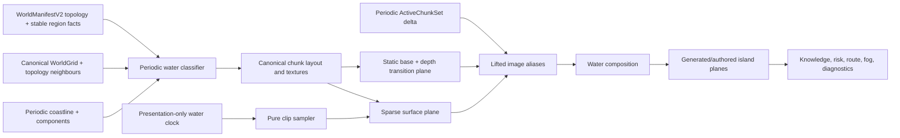

# Wayfinders water-system milestone design

This document retains detailed design and acceptance criteria for the water
system. The technical design owns current runtime truth and the roadmap archive
owns milestone completion evidence.

WTR-1 established the **Water** workspace visual direction. WTR-2 carried that
direction into generated-world layout, validated runtime assets, bounded
periodic-image rendering, island handoffs, animation, and fishing-ground
presentation.

## Outcome

WTR-1 used the branch Water workspace to establish visual direction. WTR-2
carried the reviewed result into a generated and canonical-chunk-addressable
production water system. Gameplay layout facts now join on the two-axis
wrapping topology while the Water workspace retains a deliberately bounded
inspection viewport. Both tracks are implemented; the technical design owns
current behavior and the roadmap archive owns completion evidence. The combined
design:

- visually belongs beside the current home island and island reference set;
- distinguishes deep, shallow, reef, lagoon, current, rough, and biome-specific
  water without inventing accidental gameplay rules;
- demonstrates judged-default wind and wave animation without a tuning-heavy UI;
- places representative authored and generated islands in irregular
  shore-following shallow-to-deep water;
- adds broken, non-uniform animated waves around island edges;
- introduces lean, steady, and rich fishing-ground strengths that match the
  existing shoal's player-scale surface-disturbance style and animates them in
  context;
- preserves terrain, collision, navigation, knowledge, provisions, and world
  generation as the only gameplay authorities; and
- keeps every preview decision visual-only and isolated from gameplay authority.

## Design inputs and current constraints

The design uses these current repository contracts and art references:

- `public/assets/gr1/images/home-island.png` is a tracked `480 x 480` RGBA runtime image
  aligned to a `15 x 15` navigation-cell package. It already includes turquoise
  shallows, an irregular shorewash/foam edge, harbor water, rocks, sand, and a
  transparent exterior.
- The retained `assets-src/gr1/water` pack contains the current water reference
  material and provenance notes. It remains source material only and must never
  be sampled, keyed, or loaded by the game.
- The art style uses dense but readable top-down pixel clusters, warm sand and
  foliage, broken rather than continuous highlights, organic scalloped
  coastlines, and a turquoise-to-navy depth ramp. Water must support the islands,
  not compete with their higher-contrast structures and vegetation.
- The current validated configuration uses a `32 px` navigation cell and a
  `16 px` presentation art cell. The water package consumes that configured
  `artTileSize`, so each current navigation cell contains a `2 x 2` visual
  lattice. The art lattice is presentation configuration, not gameplay
  authority, and must not be hard-coded. The separate `8 px` hybrid collision
  lattice is collision authoring only and is not a water-art grid.
- The current default world chunk is `32 x 32` navigation cells, but runtime
  code must read `WorldGrid.chunkSize` rather than encode that default.
  Neighbor classification must cross chunk boundaries; a seam at a chunk
  boundary is a correctness failure.
- `TerrainType` currently distinguishes `DeepOcean`, `ShallowOcean`, and
  blocking `Reef`. Currents, rough patches, lagoon calm, and glints are
  presentation variants, not new terrain. Brackish art remains prepared but
  unplaced because the current world has no matching biome context.
- `WaterRenderer` consumes the scene-owned periodic `ActiveChunkDelta`.
  Canonical chunks own one base and one surface canvas texture; periodic image
  aliases share them. Prefetched canonical owners remain static, each visible
  owner advances at most once per presentation frame, and aliases add no redraw.
  `WorldRenderer` no longer draws water or waves.
- Water is drawn beneath authored home and imported-island art. Coastal
  underpainting and mask-derived shelves prevent transparent shoreline pixels
  from exposing rectangular backdrop artifacts.
- WTR-1 used a workspace-local animation lifecycle. WTR-2 now uses
  presentation-time snapshots, discrete visible-only updates, pause, background
  recovery, and reduced-motion fallback without introducing simulation time.
- `WorldManifestV2` owns durable generated identity, including world topology,
  wrapped island footprints, and explicit water-ribbon image offsets.
  `WorldAnalysisIndex` owns shared periodic coastline and water-component facts.
  Water derives its exact local eight-neighbour visual mask through
  `WorldTopology`, reuses public analysis facts where they apply, and never adds
  another full-world coastline or connectivity pass.
- The asset library exposes Islands, Ships, Fishing shoals, Water, Icons, Great
  Hall, and Audio. Water uses the validated runtime package and real canonical
  generated layout while owning no gameplay or repository mutation authority.
  Its bounded fit/1:1 viewport derives shore and distance facts periodically so
  both sides of each seam remain inspectable.

## Visual language

### Palette handoff

Use the island shallows as the fixed handoff point. The water package may vary
within these bands, but the shoreline-facing pixels must converge on the same
turquoise/seafoam family.

| Role | Palette anchor | Rule |
| --- | --- | --- |
| Abyss | `#082f40` | Lowest contrast and least highlight density |
| Open deep water | `#12536a` | Default ocean body; sparse short blue-green glints |
| Lagoon/depth transition | `#2d858b` | Mid-tone bridge; never a hard cyan stripe |
| Coastal shelf | `#4aa1a0` | Turquoise island apron with warm sand influence |
| Shorewash | `#8bd0cf` | Broken, low-opacity edge and ripple accents |
| Pale foam | `#a9d6ad` | Rare brightest water mark; below sand/structure highlights |

Supported, Personal, and Unknown are knowledge states, not water types. Preserve
the Supported cue with a renderer tint/material parameter and preserve
Personal/Unknown through the knowledge overlay. Do not duplicate the entire art
pack for each knowledge state.

### Texture and motion rules

- Keep large areas quiet. Fine mottling may fill the surface, but bright marks
  should occupy only a small fraction of a cell.
- Prefer broken wavelets, short caustic arcs, and irregular reef shadows over
  uninterrupted parallel lines.
- Keep the islands as the focal plane. Deep water should be lower contrast than
  foliage, buildings, docks, rocks, and shoreline foam.
- Do not put a unique focal object in a repeatable base tile. Fish, debris,
  bubbles, birds, or a single large coral head belong in sparse detail overlays.
- Variants may change interior texture and highlight placement, but they must not
  change topology coverage at an edge.
- Motion should read at normal zoom without making the full map shimmer. Freeze
  the base plane by default and animate sparse overlays.
- No magenta key color, premultiplied fringe, opaque transparent RGB, watermark,
  text, horizon, perspective, or directional lighting belongs in runtime water.

## Water taxonomy

The classifier chooses one authoritative terrain class and then zero or more
presentation tags. The tags may change appearance only.

| Visual profile | Authority | Placement | Initial motion | Gameplay meaning |
| --- | --- | --- | --- | --- |
| Abyss | `DeepOcean` | Rare far-water or deliberately deep patches | 3 FPS sparse glint | Same passability/cost as its underlying terrain |
| Deep | `DeepOcean` | Default open ocean | Static base; 3–4 FPS ripple overlay | Existing deep-water behavior |
| Coastal | `ShallowOcean` | One or more cells around island land/reef and home art | Static base; 4–5 FPS caustic/shore accents | Existing shallow-water behavior |
| Lagoon | contextual `ShallowOcean` | Enclosed harbor, cove, atoll interior | Slow 2–4 FPS small reflections | No new rule |
| Reef | exactly `Reef` | Existing reef cells only | 3 FPS caustic/breaker accents | Remains blocking; must be visually unmistakable |
| Current | presentation tag on passable water | Seeded coherent ribbons, never isolated checkerboard cells | 4–7 FPS directional streak | Visual only in this milestone; no navigation current |
| Rough | presentation tag on passable water | Seeded exposed-looking patches | 5–7 FPS sparse whitecap | Visual only in this milestone; no weather authority |
| Brackish | prepared future profile | Deferred until a world contract supplies mangrove, marsh, or river-mouth context | 2–3 FPS subdued ripple | Not placed by WTR-1 |

Additional sparse overlay details can include seagrass shadow, coral glint, foam,
whitecap, bubbles, or floating debris. None may imply a collision or navigation
rule that the underlying terrain does not have. In particular, do not call a
passable decorative coral patch a reef while `TerrainType.Reef` blocks movement.
The brackish frames remain useful package inventory, but WTR-1 must not infer a
biome that the current manifest and terrain contracts do not describe.

### Classification priority

1. Use `WorldGrid` terrain as authority and `WorldManifestV2` for stable world
   and island identity.
2. For `Reef`, always choose the reef-readable base before contextual styling.
3. For `ShallowOcean`, select coastal or lagoon from island kind,
   enclosure/harbor context, and a namespaced deterministic value. Brackish
   remains unplaced until its context exists.
4. For `DeepOcean`, select deep by default and abyss only in coherent regions.
5. Apply current/rough/detail tags after the base profile. A tag cannot change
   terrain, cost, collision, or sight.
6. Reuse `WorldAnalysisIndex` coastline/component facts for eligibility and
   bounded queries. Derive only the exact local eight-neighbor mask that the
   index does not already provide; never rescan the full world.
7. Apply knowledge/risk/route/fog presentation in their existing layers after
   water composition.

## Grid, seams, and transitions

### Runtime cell contract

- The prepared package's general water frames display as exactly `32 x 32`
  world pixels. Package validation must reject a runtime configuration whose
  navigation tile size disagrees with the accepted water package.
- Compose features around the package's `16 px` internal art lattice: major caustic bends,
  reef clusters, and transition control points should cross the half-cell lines
  naturally instead of forming a second arbitrary grid. This is an art review
  rule, not a new logical coordinate system.
- Do not align water decoration to the `8 px` collision subgrid.
- Use integer source rectangles and stable sprite origins. Canonical texture
  placement is `tileX * 32`, `tileY * 32`; each active presentation image then
  adds its whole-world pixel offset before camera transformation.
- Runtime sheets use a `2 px` duplicated-edge margin and `4 px` spacing between
  frames. The loader must be extended to pass both values. This prevents adjacent
  frame bleed with antialiasing and fractional zoom.
- Validate at minimum zoom `0.65`, default zoom, and zoom `1.7` with the game's
  actual WebGL settings.

### Deep-to-shallow topology

Use a gated eight-neighbor blob mask rather than a four-neighbor-only shoreline.
Bits are:

```text
N=1, E=2, S=4, W=8, NE=16, SE=32, SW=64, NW=128
```

A diagonal bit is retained only if both adjacent cardinal bits are present. That
canonicalization produces 47 masks. The prepared transition sheet stores those
47 masks explicitly through `maskLookup` in `water-package.json`.

```text
canonical = mask & (N | E | S | W)
keep NE only when N and E are set
keep SE only when S and E are set
keep SW only when S and W are set
keep NW only when N and W are set
```

Classification needs a one-cell neighbour apron beyond each canonical chunk.
Build exact masks from authoritative terrain by canonicalizing every neighbour
through `WorldTopology`, including neighbours owned by another chunk or across
a world seam, then cache the mask with the canonical owner. Use existing
`WorldAnalysisIndex` facts to select coastline/component candidates; do not
recompute global coastline or connectivity. Knowledge changes and periodic
image activation must not recalculate topology or deterministic variants.

Depth transitions are a presentation plane between the deep and shallow bases.
Variants may alter interior water texture, but a given mask has fixed edge
coverage. This prevents variant choice from opening pinholes or tearing corners.

### Deterministic variation

Use a visual-only coordinate hash with a fixed namespace, for example:

```text
variant = hash(manifest.seed, tileX, tileY, "water-base-v1") % variantCount
phase   = hash(manifest.seed, tileX, tileY, "water-phase-v1") % phaseBucketCount
detail  = hash(manifest.seed, tileX, tileY, "water-detail-v1")
```

Do not consume `SeededRandom` calls from terrain/island/resource generation.
Changing a visual namespace must change pixels only; a serialized comparison of
terrain, island IDs, resources, collision, and navigation must remain identical.
Island- or region-phased effects use stable manifest island IDs or explicitly
derived presentation-region IDs, never array positions or activation order.
Coordinate hashes use canonical tiles. Ellipse regions measure minimum-image
distance; ribbon regions apply their manifest-recorded whole-world tile offset
before containment so an intentional winding replays exactly.

## Island blending contract

### Authored home island

The home composition has a better organic shore than a coarse tile mask can
produce. Treat it as an authored composition with a water handoff, not as a
rectangle that replaces the ocean.

1. Draw deep/coastal water throughout the home package footprint, including
   behind pixels that will later be covered by opaque island art.
2. Draw generic depth transitions, underwater details, and generic surface
   effects below the home composition.
3. Draw `home.island.primary` at its existing `15 x 15` grid position and depth.
4. Draw only the package-aligned `480 x 480` home shoreline/glint clip above the
   composition. Its top-left, scale, and frame origin must match the home image
   exactly.
5. Never draw coarse generic foam above the home island. Its square/cardinal
   geometry cannot match the baked organic foam edge.

The renderer does not need to sample PNG alpha to decide terrain. It simply
renders the water underlay first and the authored image afterward. Topology,
collision, dock return, and anchors continue to come from package metadata.

### Other authored islands

Adopt the same contract for future packages:

- declare a shared shore-handoff palette;
- provide clean RGBA runtime art rather than magenta-keyed RGB;
- allow water under transparent composition pixels;
- optionally provide a composition-aligned shoreline overlay clip; and
- keep collision/terrain metadata authoritative.

### Generated islands

Generated land, rock, and reef continue to use `WorldGrid` topology. The water
renderer supplies depth masks and generic foam below the terrain/coast plane.
Seam-crossing footprints, protected shallows, transition collars, and authored
shore overlays use the same periodic footprint pieces. Every visible image may
receive an aligned view, while canonical layout arrays, texture ownership, and
island identity remain singular.
Island kind may choose a contextual palette (high island, cay, atoll, skerry,
using only kinds present in the current manifest), but it cannot change
passability. Mangrove, marsh, and river-mouth styling is deferred until those
contexts exist in a world contract. Atoll entrances and minimum channel width
are regression cases because an attractive transition must never visually or
logically close a passable channel.

## Production render architecture

This architecture is the reference for WTR-2.2 through WTR-2.4. It is not part
of WTR-1.1 through WTR-1.5.



`WaterRenderer` is the dedicated production owner rather than a branch in the
developer-art loop. Its canonical resource and lifted view records are:

```ts
interface WaterCanonicalChunk {
  readonly coordinate: Readonly<GridPoint>;
  readonly baseTextureKey: string;
  readonly surfaceTextureKey: string;
  lastFrame: number;
  visible: boolean;
}

interface WaterImageView {
  readonly entry: Readonly<ActiveChunkEntry>;
  readonly canonicalKey: string;
  readonly base: Phaser.GameObjects.Image;
  readonly surface: Phaser.GameObjects.Image;
}
```

Canonical resources are Phaser canvas textures; each active alias uses two
Phaser image objects. Texture composition remains batched by plane and activates
through `ActiveChunkSet` deltas. The renderer creates no tween, animation, or
standalone game object per ocean tile.
`WayfindersScene` remains the only owner of chunk membership: water processes
deactivations first, activations in the supplied load-priority order, and band
updates for retained image entries. It does not compute a second viewport
region. Multiple entries may share one canonical owner. Prefetch entries retain
static resources; a canonical surface advances once only when at least one of
its images is `visible`. The constant ocean backdrop follows the lifted
viewport as the low-detail presentation for deferred visible images and
activation gaps.

### Layer order

| Relative order | Plane | Notes |
| ---: | --- | --- |
| 0 | Constant ocean backdrop | Covers lifted visible demand as the deferred/activation fallback |
| 0 | Detailed deep/static water base | Canonical texture with active periodic image views |
| 0.25 | Shallow/depth transitions | Cached topology |
| 0.5 | Reef/seagrass underwater detail | Terrain-readable; below foam |
| 1 | Generic ripple/current/whitecap overlays | Sparse and animation-capable |
| 2–3 | Generated terrain/coast | Existing terrain authority |
| 4.5 | Authored home island | Existing package depth |
| 4.6 | Authored home shoreline overlay | Same transform as home art |
| existing upper depths | Ship/wake, knowledge, risk, routes, fog, diagnostics | Preserve current ordering contracts |

Knowledge refreshes update a tint/uniform or the knowledge-specific presentation
batch for dirty chunks. They do not rebuild terrain masks, variants, phases, or
animation descriptors.

## Animation foundation

This section is the production design reference for WTR-2.4. WTR-1.1 does not
build this shared foundation; its animation remains local to the branch Water
workspace and may be replaced during runtime integration.

### Principles

- Animation is unsaved presentation state.
- Simulation fixed-step time remains authoritative for gameplay; water reads a
  presentation time only.
- `WayfindersScene` owns one rendering-layer presentation clock and supplies one
  time snapshot per rendered frame. The clock does not live in `core`,
  `GameSimulation`, or `SimulationClock`.
- A pure function resolves frame state from metadata, time, and a deterministic
  phase. This follows the same separation used by ship animation.
- Update a canonical surface only when its discrete frame advances and at least
  one of its image entries has the shared active-chunk band `visible`. Aliases
  never multiply redraw work.
- Pause, scene sleep, tab backgrounding, and resume cannot create gameplay work
  or an animation catch-up loop.
- The system must respond to live `prefers-reduced-motion` changes.
- Any later shared-animation work may migrate ship/wake sampling from direct
  `scene.time.now` reads to the same presentation-time input while preserving
  its current visual and gameplay behavior. This makes the foundation shared
  without adding another animation scheduler.

Proposed descriptor:

```ts
interface WaterClipDescriptor {
  readonly id: string;
  readonly imageId: string;
  readonly frameStart: number;
  readonly frameCount: number;
  readonly framesPerSecond: number;
  readonly loop: "loop" | "ping-pong";
  readonly phasePolicy: "tile" | "region" | "global";
  readonly phaseBucketCount: number;
  readonly reducedMotionFrame: number;
  readonly opacity: number;
  readonly validProfiles: readonly WaterProfileId[];
}
```

Frame resolution:

```text
tick  = floor(visualTimeMs * framesPerSecond / 1000)
frame = frameStart + ((tick + phaseBucket) mod frameCount)
```

Use tile phases for disconnected deep glints. Use one region/island phase for
connected surf so adjacent foam does not tear. The home-aligned clip is one
region and must advance as a single frame.

### Initial clip budget

| Clip | Frames | FPS | Phase policy | Default density |
| --- | ---: | ---: | --- | ---: |
| Open ripple/glint | 8 | 3–4 | tile, 4 buckets | 10–15% of visible deep cells |
| Shallow caustic | 8 | 4–5 | tile, 4 buckets | 20–30% of visible shallow cells |
| Current ribbon | 8 | 4–7 | region | Only classified current cells |
| Whitecap | 8 | 5–7 | region/tile | Rare exposed-water patches |
| Reef breaker | 4–8 | 3–5 | region | Reef perimeter only |
| Home shoreline | 8 | 5 | home region/global | One aligned composition clip |

The prepared current source reads west-to-east. Initial implementation may use
four cardinal orientations through 90-degree rotations. Diagonal flow requires
authored diagonal frames; do not rotate a square opaque tile by 45 degrees and
expose corners.

Reduced motion immediately selects each descriptor's representative static
frame, retains terrain/profile contrast, and stops frame updates. It must not
remove shallow/reef readability or alter simulation state.

## Retained water source package

The authoring source lives at `assets-src/gr1/water` and remains source-only.
WTR-2 materialized the validated production contract at
`src/wayfinders/assets/packages/water.json` and the runtime sheets under
`public/assets/gr1/water`; the game loads only that validated public handoff.
The standalone builder remains a deterministic source-preparation tool, not a
second production authority.

| Source file | Dimensions | Contents |
| --- | ---: | --- |
| `runtime/water-tiles.png` | 288 x 1152 | Eight profiles, four variants, eight frames, with gutters |
| `runtime/water-static.png` | 144 x 288 | Reduced-motion/static profile variants |
| `runtime/water-depth-transitions.png` | 1692 x 144 | 47 canonical masks x four phases, with gutters |
| `runtime/water-overlays.png` | 288 x 144 | Glint, caustic, current, and whitecap alpha clips |
| `runtime/water-home-shore-overlay.png` | 3872 x 484 | Eight guttered `480 x 480` home-aligned frames |
| `runtime/water-contact-sheet.png` | 512 x 256 | Profile review board |
| `runtime/water-home-island-preview.png` | 640 x 640 | Home/depth-handoff review composite |
| `water-package.json` | n/a | Source profile, sheet, mask, animation, and handoff metadata |
| `runtime/build-report.json` | n/a | Output dimensions and SHA-256 hashes |
| `validate-water-package.mjs` | n/a | Header, hash, frame geometry, mask, seam/loop-report validation |

The five runtime sheets occupy roughly `0.55 MiB` compressed and `9.6 MiB`
decoded RGBA. Source masters and previews are authoring/review files and must not
ship. `build-water-package.mjs` deterministically rebuilds the retained source
outputs without changing `public`, `dist`, or current source files.

The builder and retained `runtime` directory are source-preparation evidence,
not alternate production authority. Current runtime ownership belongs to the
validated public package and its repository check.

## WTR-1 asset-library playground (historical design)

This section records the completed branch prototype and does not describe the
current production Water workspace.

The Water tab is a deliberately rough development and feedback surface on a
prototype branch, not a gameplay simulation, a production asset tool, or a
second asset-production authority. Prefer the shortest change through the
existing asset-workspace shell. Do not build generalized workspace, package,
or rendering infrastructure for this prototype. Its implementation may be
replaced or discarded after the visual direction is understood.

The prototype presents three compact views:

1. **Tile gallery.** Display the different static candidate water profiles and
   variants with simple labels. A small repeat view should make obvious seams
   and repeated focal marks visible.
2. **Whole-world blending playground.** Display a fixed 96x96 world that places
   every water treatment, the player boat, three representative islands, and
   representative lean, steady, and rich fishing grounds in one coherent game-
   scale composition. Island transparency
   drives irregular depth masks; local wind, wave, shoreline, and shoal motion
   use judged defaults. This is a fixed fixture, not `GameSimulation` or a
   generated world.
3. **Shoal gallery.** Display the three gameplay-strength cues at their native
   96 x 64 scale while representative instances animate in different water
   profiles in the world.

The animation clock and canvas-mask work remain local to the Water workspace.
The prototype does not create a general clip sampler, reduced-motion system,
chunk lifecycle, production package contract, promotion flow, performance
telemetry, or runtime renderer. Controls are limited to whatever directly
speeds comparison: profile, variant, overlay visibility, world inspection
scale, and one shared motion pause.

WTR-1.0 does not prototype shoreline foam, the authored home-island overlay,
water beneath transparent island art, or generated-island handoffs. WTR-1.2
introduces the island depth handoff, and WTR-1.3 adds varied animated shoreline
waves after that base relationship is understood.

Manual visual review is the primary verification method. Do not build broad
unit, integration, browser, accessibility, lifecycle, or performance coverage
for WTR-1.0. A small test or diagnostic harness is appropriate only when it is
the fastest way to try an item repeatedly—for example, checking a mask resolver
while adjusting depth blends. Rendered preview pixels and fixture cells never
become collision, navigation, terrain, or package authority.

## Production package and pipeline design

This section is the design reference for WTR-2.0, WTR-2.2, and WTR-2.6. The
technical design owns implemented behavior and the roadmap archive owns
completion evidence.

Production semantic ID: `world.water.primary`.

Create a dedicated `WaterAssetContractV1`; water has different topology and clip
metadata from the three current pilot kinds. Add it as an explicit semantic
package and catalog/runtime union rather than turning the pilot contracts into a
speculative generic framework. The minimum owned changes are expected in a
parallel water contract/loader, the shared generated catalog and asset-library
entry, the production recipe/runtime-binding validator, and their focused tests.

Use the current authoritative lifecycle:

```text
selected water sources + versioned environment recipe
    -> deterministic preparation and fingerprint
    -> exact-fingerprint review
    -> promotion of the approved current package
    -> public runtime handoff and lineage report
```

The recipe uses the `environment` family and explicit empty/passable collision.
Promotion must reuse the repository transaction, stale-review, hash, orphan,
and lineage checks already owned by the asset pipeline. Water-specific mask and
clip validation extends that shared gate; it does not create an independent
promotion command or write path.

The accepted water manifest and Phaser loader path must support `frameWidth`,
`frameHeight`, `margin`, and `spacing`; current pilot animation metadata exposes
only frame dimensions. Promotion copies validated assets under
`public/assets/...`. Never author `dist` directly.

Validation must reject:

- a sheet whose dimensions do not match its frames, margin, and spacing;
- an unknown/missing profile, duplicate ID, invalid FPS, or out-of-range frame;
- transition lookup sets other than the declared 47 canonical masks;
- transparent sheets with nonzero RGB in fully transparent pixels;
- non-PNG, interlaced, non-8-bit RGB/RGBA, or over-4096-pixel-edge inputs;
- an authored overlay whose frame size/placement disagrees with its target
  island package; and
- any visual package field used as collision, passability, or resource authority.

## Implementation sequence

### WTR-1.0 — Rapid water-look prototype and feedback

Tasks:

- create a prototype branch and add a **Water** tab to the existing asset
  section with the least new structure practical;
- load the current candidate sheets for preview only, without adding a gameplay
  runtime package or production promotion path;
- display the different static base profiles and variants in a labelled gallery
  with one small repeated-tile view;
- show one fixed 96x96 world-scale composition containing every water treatment,
  broad multi-cell handoffs, and the player boat;
- add only the comparison controls that shorten the feedback loop;
- rebuild or replace candidate art manually as feedback arrives; and
- add a focused test or diagnostic only when it is faster than repeated manual
  inspection for the specific item under investigation.

Exit gate:

- the branch prototype opens from a Water tab and makes the available tile
  directions easy to compare;
- the whole-world composition makes every water treatment and its broad
  handoffs visible well enough to gather concrete product feedback;
- the feedback and preferred direction are recorded, including what should be
  changed in the next iteration; and
- no production readiness, exhaustive topology, animation, game integration,
  performance, accessibility, or automated-test gate is implied. The prototype
  can be revised or discarded.

### WTR-1.1 — Animated water playground

Tasks:

- add animation to the Water tab's world study without integrating it into the
  game or building a generalized animation framework;
- demonstrate at least two clearly readable motion families: repeating water
  waves and wind-driven surface movement;
- use judgement to add restrained supporting motion such as drifting glints,
  moving caustics, current streaks, or occasional whitecaps where it improves
  the water rather than making the whole surface busy;
- choose sensible default speed, density, direction, phase variation, and
  intensity values in code;
- keep the UI deliberately small: provide only the controls needed to view or
  pause the result, not a panel of tuning parameters; and
- use focused diagnostics only when they make visual iteration faster.

Exit gate:

- the Water tab visibly demonstrates both wave and wind motion at overview and
  1:1 game scale;
- the loops feel coherent, different water profiles retain their character,
  and the surface does not shimmer uniformly; and
- the product owner can give animation feedback without waiting for island or
  game integration.

### WTR-1.2 — Islands and irregular depth transitions

Tasks:

- place representative existing islands in the Water tab so their relationship
  with the animated water can be reviewed in context;
- continue water beneath transparent island edges and preserve the island art
  as the focal layer;
- derive shallow water from the actual shoreline shape, then transition through
  intermediate water into deep water as distance from land increases;
- vary transition width and contour around coves, points, channels, reefs, and
  exposed sides so the result never reads as a uniform circular band;
- keep the WTR-1.1 animation defaults active while judging the depth handoff;
  and
- add only lightweight island selection or comparison controls that directly
  shorten the feedback loop.

Exit gate:

- the Water tab can display representative islands inside the water world;
- each island has a readable shallow-to-deep handoff that follows its shoreline
  and varies organically rather than forming a large circle; and
- transparent edges, bays, narrow passages, and nearby reef shapes do not expose
  hard rectangles or abrupt depth steps.

### WTR-1.3 — Varied animated island-edge waves

Tasks:

- add animated shorewash and breaking-wave motion around island edges in the
  Water tab;
- make wave presence, length, intensity, and timing respond visually to local
  coastline shape and exposure rather than drawing a continuous uniform halo;
- keep protected coves and harbor-like recesses calmer while allowing more
  visible breaks on exposed points and open coasts;
- use broken segments and region-coherent phases so adjacent edge motion feels
  connected without moving in perfect lockstep;
- preserve island silhouettes, docks, reefs, channels, and the underlying
  shallow-to-deep read; and
- review the result across the representative islands introduced in WTR-1.2.

Exit gate:

- animated edge waves give islands a clear sense of contact with moving water;
- no island is surrounded by a uniform foam ring or synchronized circular wave;
  and
- exposed and protected shoreline areas read differently without requiring a
  tuning-heavy UI.

### WTR-1.4 — Water-specific fishing-shoal catalog

Tasks:

- create exactly three branch-local fishing-ground cues matching the existing
  gameplay qualities: lean, steady, and rich;
- use the existing 96 x 64 in-game fishing-shoal asset as the style and scale
  authority: broken glints, ripples, and water-colour disturbance with no
  individually visible fish at player scale;
- vary surface-activity density and brightness so strength is readable without
  introducing different visible species;
- place the strength cues across deep, coastal, lagoon, reef, current, rough,
  brackish, and abyss studies where useful;
- keep every new shoal visual-only and separate from fishing resources,
  collision, spawning, or gameplay identity;
- place representative shoals in appropriate regions of the Water-tab world;
- add a compact labelled shoal gallery to the Water tab for comparison; and
- keep these assets branch-local preview sources rather than promoting them or
  replacing the existing in-game fishing-shoal package.

Exit gate:

- the Water tab displays lean, steady, and rich fishing-ground strengths;
- every placed cue is visually compatible with its surrounding water profile;
- strength remains readable at overview and 1:1 game scale while individual
  fish remain invisible; and
- no game catalog, resource rule, or runtime renderer changes.

### WTR-1.5 — Animated fishing shoals

Tasks:

- animate the WTR-1.4 cues using restrained shimmer, tiny water-relative drift,
  and incomplete expanding ripple fragments rather than swimming fish;
- vary pulse speed, phase, ripple count, and intensity by strength and water
  context without adding a tuning-heavy UI;
- keep shoal motion legible beside wind, wave, current, and island-edge motion;
- ensure animation remains bounded to the preview lifecycle and stops when the
  Water workspace is destroyed; and
- provide a simple pause control shared with the water animation.

Exit gate:

- each strength has a recognizably different but coherent surface-activity
  character;
- shoals stay visually associated with their intended water regions and do not
  overpower islands or water texture;
- pausing motion produces a useful static comparison; and
- animation never enters gameplay, simulation, resource, or production-asset
  authority.

### WTR-2.0 — Production water contracts and extension seam

Status: implemented; completion evidence is in the roadmap archive.

Tasks:

- create a renderer-neutral, versioned `WaterTypeCatalogV1` in the world-
  generation owner whose stable type definitions declare:
  - a stable type ID;
  - whether the type is a base profile or a composable overlay;
  - whether placement comes directly from terrain, from generated context, or is
    visual-only;
  - eligible authoritative terrain classes and conflict priority;
  - a deterministic placement-strategy ID and validated parameters;
- create a versioned `WaterAssetContractV1` in the asset owner for static
  profiles, transition masks, overlays, clips, frame geometry, gutters,
  reduced-motion/static fallback, and authored-island handoff metadata, keyed by
  stable water type ID;
- validate the composition join between the renderer-neutral type catalog and
  presentation package so every generated type has exactly one compatible
  presentation mapping without making world generation import asset code;
- keep base-profile selection separate from overlay tags so a cell has one
  terrain-readable base and may have several visual-only details;
- define initial entries for deep, abyss, coastal, lagoon, reef, current, rough,
  and the existing sparse detail families. Keep brackish package inventory
  registered but ineligible for automatic placement until an authoritative
  world context exists;
- reject arbitrary executable placement logic in asset data. The catalog may
  select only a bounded, code-owned strategy with a versioned contract;
- compile stable type IDs to compact runtime indexes without making those
  indexes durable identity;
- extend the existing preparation, exact-fingerprint review, promotion, catalog,
  runtime loader, and lineage paths rather than creating a separate water asset
  authority;
- update the Water workspace to read the validated type catalog and prepared
  package contract, showing each type's role, eligible terrain, placement
  strategy, presentation mapping, animation availability, and static fallback;
  and
- keep those focused Water-workspace controls in its main view without restoring
  the general Production tooling sidebar.

Extension rule:

- a new visual type that fits an existing strategy requires a catalog entry,
  referenced package assets, and contract fixtures, but no renderer branch;
- a genuinely new placement shape adds one deterministic strategy in the world-
  generation owner with focused validation and equivalence coverage; and
- a type that changes passability, movement cost, sight, provisions, weather,
  resources, or another simulation rule is not a catalog extension. It requires
  an explicitly authorized terrain or gameplay contract change.

Exit gate:

- catalog and package validation reject duplicate IDs, unknown strategies,
  ineligible terrain mappings, missing or duplicate presentation mappings,
  missing assets, invalid clip references, and any attempt to derive gameplay
  authority from presentation metadata;
- initial types resolve entirely through contract data and strategy IDs rather
  than identity-specific renderer branches;
- a fixture-only additional visual type can be prepared and resolved by reusing
  an existing strategy without changing the runtime renderer contract;
- the milestone stops at versioned contracts and validated prepared candidates;
  promotion and renderer changes remain owned by WTR-2.2; and
- the Water workspace reports the same validation failures and resolved type-to-
  presentation mapping as the contract APIs, with no preview-only schema.

### WTR-2.1 — Deterministic generated-world water layout

Status: implemented.

Tasks:

- add a dedicated `WaterLayoutPlanner` to world generation after terrain
  rasterization and `WorldAnalysisIndex` construction;
- update the generated-world and versioned manifest contracts with a
  `GeneratedWaterLayout` handoff containing the water-layout algorithm version,
  water-type-catalog fingerprint, stable presentation-region facts, and chunk-
  addressable resolved layout data;
- derive reef only from authoritative `TerrainType.Reef`, derive coastal and
  lagoon bases from `ShallowOcean`, island kind, harbor/enclosure facts, and
  local periodic coastline queries, and use deep as the default `DeepOcean`
  base;
- generate coherent abyss, current, and rough regions through catalog-selected
  deterministic strategies. Do not scatter isolated per-cell noise or place
  brackish water without an approved contextual world fact;
- give every generated region a stable ID and seed derived from the world seed,
  catalog type ID, strategy namespace, and stable island or region facts, never
  traversal order, activation order, or array position;
- resolve cross-chunk and cross-world-seam classification through canonical
  topology neighbours so region and transition facts join on every boundary;
- keep the layout presentation-only: it must not mutate `WorldGrid`, terrain,
  island IDs, resources, collision, sight, path costs, provisions, or generated
  island placement;
- expose focused generator diagnostics for water-type area, region count,
  rejected placement attempts, and per-chunk profile distribution without
  introducing per-frame world scans; and
- replace the fixed fixture as the Water workspace's primary world view with a
  selectable seed and named-profile view of the real `GeneratedWaterLayout`,
  while retaining the old composition only as an explicitly labelled visual
  reference if it is still useful.

Exit gate:

- a fixed seed, settings profile, catalog fingerprint, and layout version produce
  identical base profiles, overlays, stable region IDs, variants, and phases
  independent of chunk traversal and query order;
- P0, P1, and P2 generation produce canonical chunk-addressable water layouts
  with no chunk or world-seam disagreement and no runtime full-world
  classification requirement;
- serialized terrain, collision, islands, resources, navigation, and feature
  definitions are unchanged except for the intentional versioned water-layout
  manifest addition;
- changing only the presentation namespace changes the water layout but not any
  gameplay-authoritative output;
- a fixture-only new type using an existing placement strategy flows through
  generation without editing `WaterLayoutPlanner` type-selection branches; and
- the Water workspace and game generation path produce the same manifest water
  facts, region IDs, per-chunk assignments, and diagnostics for the same seed,
  profile, catalog fingerprint, and layout version.

### WTR-2.2 — Promoted static water and active-chunk renderer

Status: implemented.

Tasks:

- prepare, review, and promote the approved static water package through the
  existing repository transaction and generated runtime catalog;
- add a dedicated `WaterRenderer` that consumes the generated water layout and
  the `ActiveChunkDelta` owned by `WayfindersScene`;
- build exactly one base and one surface canvas texture per referenced
  canonical chunk from catalog descriptors and compact type indexes, with
  periodic image views sharing those textures;
- resolve the declared canonical transition masks across chunk and world seams
  and retain the lifted constant-ocean backdrop for deferred images and
  activation gaps;
- cache topology, profile, variant, and phase independently of knowledge
  presentation and rebuild static resources only for world, terrain, layout,
  package, or catalog revision changes;
- migrate water and wave responsibility out of the developer-art path in
  `WorldRenderer` while leaving terrain, coast, structures, and islands with
  their existing owner; and
- replace the Water workspace's parallel DOM-canvas static drawing with an
  embedded production inspection scene that uses the same `WaterRenderer`,
  `GeneratedWaterLayout`, promoted package, type catalog, and active-chunk
  lifecycle as the game.

Exit gate:

- deep, coastal, lagoon, and blocking reef are readable at normal game zoom and
  in grayscale across representative generated seeds;
- active-image traversal creates and destroys only bounded water resources,
  reuses two textures per canonical owner, and performs no object or texture
  allocation per tile per frame;
- retained, prefetched, deferred, and deactivated chunk behavior follows the
  shared scene delta exactly and owns no second viewport policy;
- adding a catalog type that uses existing planes and strategies does not require
  a `WaterRenderer` identity switch;
- the promoted package has exact-fingerprint review, public runtime handoff, and
  lineage evidence; and
- the Water workspace can inspect fit, overview, and 1:1 game scale without
  producing pixels that differ from the same generated layout in the game.

### WTR-2.3 — Generated and authored island water handoffs

Status: implemented.

Tasks:

- derive generated-island depth transitions and generic shore details from
  `WorldGrid`, stable island facts, `WorldAnalysisIndex`, and the generated water
  layout rather than PNG pixels;
- render water throughout authored home and imported-island footprints before
  drawing their exact package-aligned images, allowing transparent composition
  pixels to reveal water without becoming collision authority;
- preserve exact authored transforms and support optional package-aligned
  shoreline overlays above authored art while keeping generic foam below it;
- make depth width, palette, and shore response depend on validated island kind,
  enclosure, local coastline, and exposure facts without closing passable
  channels or inventing biomes;
- cover home harbor, high island, low cay, atoll, rocky skerry, imported island,
  narrow channel, nearby-island, axis-seam, and corner-seam cases; and
- add focused Water-workspace selection for those real generated and authored
  island cases, using their production catalog entries, transforms, collision
  metadata, generated layout, and water renderer rather than copied preview
  placements.

Exit gate:

- every representative island has an irregular, shoreline-following depth handoff
  with no rectangular alpha boundary, uniform circular ring, or chunk seam;
- water appears beneath all transparent authored exterior pixels at the exact
  runtime transform;
- docks, reefs, coves, atoll entrances, minimum-width channels, and collision
  masks retain their authoritative behavior;
- the same fixed water and island inputs resolve identically regardless of active-
  chunk order; and
- each required island-handoff case is inspectable in the Water workspace at
  overview and 1:1 scale with the same output as the game.

### WTR-2.4 — Runtime water and shoreline animation

Status: implemented.

Tasks:

- give `WayfindersScene` one presentation-time snapshot per rendered frame and
  use a pure resolver for clip frame, deterministic phase, direction, and static
  fallback;
- animate wind, ripples, glints, currents, rough-water details, caustics, and
  broken shoreline waves through catalog clip metadata and generated region
  facts rather than per-type renderer branches;
- advance animation only when a discrete clip frame changes and only once per
  canonical owner with a shared `visible` image; prefetched owners retain static
  resources and aliases add no redraw;
- preserve region-coherent phases across chunk boundaries and use coastline
  exposure to vary shoreline presence, timing, length, and intensity;
- implement pause, scene sleep, background-tab recovery, and live reduced-motion
  changes without catch-up work;
- preserve the existing knowledge, live-sight, risk, route, fog, ship, wake, and
  diagnostic layer ordering so motion never reveals hidden terrain; and
- update the Water workspace to drive the production presentation clock and clip
  resolver, with focused pause, reduced-motion, overlay, and knowledge/fog
  comparison controls rather than a workspace-local animation loop.

Exit gate:

- connected water and shore regions animate without tearing, synchronized halos,
  uniform boiling, or first/last-frame pops;
- pause, resume, background recovery, and reduced motion are immediate and
  produce no simulation work or frame-time spike;
- Unknown fog cannot reveal profile, reef, island, current, rough, or shoal facts
  through moving pixels at its edge;
- animation time and catalog metadata cannot enter simulation or feature APIs;
  and
- animation frame, phase, pause, reduced-motion, and fog results match between
  the Water workspace and game for the same generated layout and time snapshot.

### WTR-2.5 — Knowledge-safe fishing-ground integration

Status: implemented.

Tasks:

- prepare, review, and promote the lean, steady, and rich surface-disturbance
  cues through the fishing-shoal package/catalog owner rather than registering
  them as terrain or water resources;
- update `FishingShoalRenderer` to consume the shared presentation clock and its
  existing chunk-activated view pool;
- use a neutral or clue-derived surface cue for `clue`, `sighted`, and `returned-
  lead` read models because those states structurally hide quality;
- select lean, steady, or rich only for `surveyed` and `returned-survey` records,
  preserving the existing home-connected presentation;
- allow restrained water-context tint, ripple, or phase choices without exposing
  species, changing the fishing definition, or allowing a water type to override
  the fog-filtered read model; and
- update the Water workspace to compare neutral `clue`, `sighted`, and `returned-
  lead` fixtures plus surveyed lean, steady, rich, returned-survey, and home-
  connected fixtures through the production `FishingShoalRenderer` and read-
  model contracts.

Exit gate:

- unsurveyed cues cannot be used to infer hidden quality in pixels, labels,
  animation speed, brightness, asset identity, or diagnostics;
- surveyed lean, steady, and rich grounds remain distinct at player scale with
  no individually visible fish;
- shoal activation, pooling, deactivation, pause, reduced motion, and fog behavior
  remain bounded by existing presentation contracts;
- fishing definitions, rewards, discovery, survey, return, and home-connection
  behavior are unchanged; and
- every allowed state displayed by the Water workspace matches the game renderer
  and no workspace control can construct an invalid quality-bearing hidden state.

### WTR-2.6 — Production hardening and runtime handoff

Status: implemented.

Tasks:

- record replayable P0, P1, and P2 presentation baselines before final runtime
  replacement, including water-attributable p50, p95, p99, maximum frame time,
  active/deferred chunks, resource objects, decoded texture bytes, and animation
  updates;
- close package, generator, manifest codec, transition-mask, determinism, chunk-
  lifecycle, island-handoff, animation, reduced-motion, knowledge/fog, shoal,
  repository-I/O, and production-bundle gates at their owning seams;
- demonstrate that new catalog types using existing strategies and planes remain
  data-driven, and document the bounded code change required for a genuinely new
  placement strategy;
- verify repeated camera traversal, regeneration, scene shutdown/restart, asset-
  workspace switching, and background recovery plateau without leaks;
- remove superseded developer-art water and duplicate preview-only production
  paths only after the promoted renderer meets the accepted fallback and
  rollback criteria; and
- retain the Water workspace as the focused production water inspection and
  regression surface, including seed/profile regeneration, type and island-case
  selection, overview/game-scale zoom, shoal state, overlay visibility, pause,
  and reduced motion, without restoring the general Production tooling sidebar.

Exit gate:

- every production criterion below is satisfied with durable evidence at its
  owning contract;
- named-profile measurements meet reviewed absolute and incremental budgets;
- world generation, collision, navigation, knowledge, islands, fishing, and
  replay outcomes remain unchanged except for the authorized visual water-layout
  manifest fields;
- the production asset lineage and generated catalog are current and reproducible;
- the game uses the promoted canonical-owner/periodic-image water path by
  default with the lifted constant-ocean fallback retained for deferred
  presentation and rollback; and
- the Water workspace contains no second water classifier, island-handoff
  resolver, animation scheduler, shoal renderer, or runtime asset mapping.

## Acceptance criteria

### WTR-1.0 prototype feedback gate

These criteria apply only to the branch prototype and are intentionally not a
production acceptance gate:

- [x] The Water tab shows the different static candidate tiles and one 96x96
      game-scale water world containing every treatment, broad multi-cell
      handoffs, and the player boat.
- [x] No authored or generated island blending is included in the WTR-1.0
      feedback snapshot; WTR-1.2 retains that
      scope.
- [x] The product owner can compare the useful directions and provide concrete
      feedback without waiting for animation or game integration.
- [x] Any prototype test or diagnostic exists because it shortens the current
      visual experiment, not to establish broad regression coverage.
- [x] Feedback and the preferred next direction are recorded before WTR-1.1 is
      separately authorized.

### WTR-1.1 animation feedback gate

- [x] The Water tab shows at least wave and wind-driven motion across the world
      study and at 1:1 game scale.
- [x] Motion uses coherent, restrained defaults and does not make every water
      cell animate in the same way or at the same phase.
- [x] Different water profiles remain readable while animated.
- [x] The UI exposes viewing and pause behavior only where useful; speed,
      density, phase, and intensity do not become a tuning dashboard.
- [x] No gameplay runtime, production package, or general animation system is
      implied by the prototype.

### WTR-1.2 island-depth feedback gate

- [x] Representative existing islands are displayed together inside the Water
      tab's animated world.
- [x] Shallow water follows real shoreline shape and transitions outward into
      intermediate and deep water.
- [x] Transition width varies around coves, points, channels, reefs, and exposed
      coasts rather than forming a uniform circular band.
- [x] Water continues beneath transparent island edges without exposing a
      rectangular footprint or abrupt depth step.

### WTR-1.3 island-edge wave feedback gate

- [x] Animated edge waves use broken, locally varied segments rather than a
      complete uniform ring.
- [x] Protected recesses read calmer than exposed points and open coasts.
- [x] Adjacent surf motion is coherent without moving in perfect lockstep.
- [x] Waves preserve island silhouettes, docks, reefs, channels, and the
      shallow-to-deep transition beneath them.

### WTR-1.4 fishing-shoal catalog feedback gate

- [x] The Water tab contains lean, steady, and rich 96 x 64 fishing-ground cues.
- [x] No individual fish is visible at overview or native player scale.
- [x] Strength is expressed through surface-activity density and brightness, and
      cues are placed only in visually suitable water profiles.
- [x] The Water tab includes a compact labelled comparison gallery.
- [x] New shoal assets remain branch-local preview assets and do not replace or
      register the current game package.

### WTR-1.5 fishing-shoal animation feedback gate

- [x] Every displayed cue has restrained surface shimmer and ripple motion.
- [x] Surface-activity character varies by strength without requiring exposed
      tuning controls.
- [x] Water, shoreline, and shoal motion can be paused together.
- [x] Leaving the Water workspace stops its animation lifecycle.

### WTR-2 production criteria

The following checklist records the original production acceptance model. The
roadmap archive owns delivered evidence and the technical design owns current
behavior; this list is not a second status authority.

### Generator and catalog extensibility

- `WorldGenerator` invokes the dedicated water-layout planner only after
      authoritative terrain rasterization and analysis are complete.
- The generated-world and manifest handoff records a layout version, catalog
      fingerprint, stable region IDs, and chunk-addressable resolved facts.
- Adding a visual type with an existing placement strategy requires catalog
      and package data but no planner or renderer identity branch.
- A new placement strategy is bounded, deterministic, versioned, and tested
      independently of terrain and feature generation.
- New presentation types cannot alter terrain, collision, movement, sight,
      provisions, resources, islands, fishing outcomes, or other simulation
      state.
- Brackish and future contextual types remain unplaced until the world
      contract supplies an eligible fact; package availability alone is never
      placement authority.

### Water workspace parity

- Every WTR-2 milestone exposes its new production behavior in the Water
      workspace before that milestone closes.
- Seed and named-profile regeneration use the same world generator, manifest,
      `GeneratedWaterLayout`, and diagnostics as the game.
- Static water, islands, transitions, animation, knowledge/fog comparisons,
      and fishing grounds use the same production renderers and read models as
      the game; the workspace owns no parallel classifier or renderer.
- The workspace retains focused type, island case, world profile, seed, zoom,
      overlay, shoal state, pause, and reduced-motion controls without restoring
      the general Production tooling sidebar.
- A given generated layout, package/catalog revision, read model, and
      presentation-time snapshot produce matching output in the workspace and
      game.
- The workspace keeps its bounded inspection camera while periodic shore and
      distance derivation makes both sides of every axis/corner seam inspectable
      at fit and 1:1 scale.
- The WTR-1 fixed fixture may remain only as a clearly labelled visual
      reference and cannot become a production asset, layout, or behavior source.

### Package and grid

- All runtime sheets are lowercase-safe, validated PNGs with declared sizes.
- Every general frame is `32 x 32`; authored home frames are `480 x 480`.
- Startup rejects a water package whose tile size disagrees with the
      validated runtime navigation tile size.
- Every sheet uses and loads with `margin: 2`, `spacing: 4` duplicated gutters.
- Internal composition respects the package's `16 px` authoring lattice and
      does not expose it as gameplay/configuration state or align to the
      collision-only `8 px` lattice.
- All 47 canonical masks resolve exactly once and all invalid diagonal masks
      canonicalize predictably.
- 2x2 and 3x3 repeats show no cracks, frame bleed, one-pixel grid, or obvious
      repeated focal object.

### Island and visual fit

- Deep, shallow, lagoon, and blocking reef are distinct at normal zoom and in
      grayscale.
- The home island has water beneath all transparent exterior pixels.
- The home-aligned overlay uses the exact island transform and never paints
      over land/structures with a visible classification error.
- Generic foam never appears above the authored home composition.
- High island, low cay, atoll, rocky skerry, home harbor, and narrow channel
      cases have intentional shore handoffs. No nonexistent biome is inferred.
- No source magenta, halo, opaque transparent RGB, or color-key fringe ships.

### Determinism and gameplay isolation

- A fixed world seed produces identical profile, mask, variant, direction,
      and phase data independent of chunk traversal and knowledge redraw order.
- Ellipse containment, protected shallows, transition collars, and masks use
      minimum-image/periodic neighbours; a ribbon's explicit manifest image
      offset preserves its declared winding.
- Stable manifest island IDs and presentation-region IDs, never array or
      activation order, determine region-phased effects.
- A visual namespace change alters no terrain, island ID, resource, collision,
      route, sight, provisions, discovery, dock return, or atoll connectivity data.
- Current, rough, lagoon, glint, and whitecap remain visual-only; brackish is
      not placed until an authoritative world context is separately approved.
- Reef art maps only to authoritative `TerrainType.Reef` where the visual
      promises blocking reef.

### Animation and accessibility

- First/last frames loop without a visible luminance, alpha, or position pop.
- Connected surf/current regions do not tear because of independent phases.
- Pause/resume and background-tab recovery cause no catch-up spike.
- Reduced motion freezes all water immediately on representative frames.
- Scene, ship/wake, and water consume the same rendering-layer presentation
      time snapshot; no presentation time enters simulation or feature APIs.
- Supported, Personal, Unknown, current sight, route, and risk overlays remain
      readable with animation on and off.
- Unknown fog does not reveal hidden terrain through motion at its edge.

### Performance

- No full-world scan, texture creation, or object allocation happens per
      rendered frame.
- Static topology rebuilds only on world/terrain/package changes.
- Knowledge changes retain dirty-chunk-local updates.
- Water consumes the shared `ActiveChunkDelta`; it owns no resources outside
      `delta.active`, creates no second viewport policy, and retains the lifted
      constant-ocean backdrop for visible deferred images.
- Every referenced canonical chunk owns exactly two canvas textures. Periodic
      base/surface image objects share them; aliases create zero redraws.
- Animation updates only when a clip advances, at most once per visible
      canonical owner per presentation frame; prefetched owners remain static.
- The aligned authored-home overlay may have one view per intersecting periodic
      image, shares package frames, and follows the active-image lifetime.
- Shipped water textures remain below `12 MiB` decoded RGBA and `2 MiB`
      compressed payload unless a later reviewed budget replaces these limits.
- Repeated camera traversal and circumnavigation plateau at the `25` active
      image-entry cap and approved canonical texture, object, and redraw counts
      with no activation/deactivation leak.
- Named-profile sailing and camera-movement measurements meet separately
      reviewed absolute and water-attributable p95/p99 regression budgets.

### Repository gate

- Water-specific validator, mask, deterministic-selection, animation,
      reduced-motion, and renderer lifecycle tests pass.
- Package preparation, exact-fingerprint review, promotion lineage, and
      generated catalog checks pass in the repository/I/O lane.
- Existing world generation, collision, navigation, knowledge, and authored
      home tests remain unchanged in outcome.
- `npm.cmd run assets:check`, both typechecks, relevant quick/contract/integration/
      I/O/performance lanes, and the production bundle pass.
- Runtime assets are promoted through `public`; generated `dist` is not
      hand-authored.

## Production performance budgets and fallbacks

Before WTR-2 changed runtime presentation, it recorded replayable
baselines for the named world profiles and representative viewport/zoom cases.
Each record includes seed, profile, viewport, p50/p95/p99 and maximum frame time,
active/deferred chunk counts, water resource objects, decoded texture bytes,
animation updates, and the approved absolute and incremental limits. A hard
frame-time value from this design must not replace that measured contract.

Default quality path:

- the existing constant ocean fallback for deferred presentation;
- one static base and one surface texture per referenced canonical chunk;
- translated periodic image views that share those textures;
- cached 47-mask transitions;
- sparse animated overlays;
- aligned home-overlay aliases for active footprint images, animated only when
  their shared band is `visible`; and
- discrete 3–7 FPS clip updates rather than continuous per-frame deformation.

Fallback order when profiling exceeds budget:

1. lower overlay density;
2. lower non-shore clip FPS;
3. reduce phase buckets and batch fragmentation;
4. freeze deep glints while retaining shallow/reef/home motion;
5. use `water-static.png` for all generic water while retaining terrain colors;
6. retain only the aligned home shore clip; then
7. use the complete reduced-motion path.

Do not solve performance by weakening fog, terrain readability, collision
authority, deterministic selection, the shared active-chunk cap, or its
deferred-placeholder behavior.

## Risks and mitigations

| Risk | Mitigation |
| --- | --- |
| Generic foam fights the baked home shoreline | Keep generic foam below authored art; use only the aligned home clip above it |
| Attractive decorative water implies mechanics | Map mechanics only from `TerrainType`; label visual-only profiles explicitly |
| Checkerboard/boiling motion | Use coherent regions, sparse density, low FPS, and limited phase buckets |
| A second presentation-lifetime policy | Consume only the scene-owned `ActiveChunkDelta`; retain the shared cap, priority, and deferred placeholder |
| Chunk/world seams or duplicate coastline work | Reuse periodic analysis facts, derive only the local topology-neighbour apron, and test chunk, axis, and corner seams directly |
| Atlas bleed at fractional zoom | Ship duplicated 2 px gutters and extend loader margin/spacing support |
| Knowledge redraw rerolls visuals | Cache topology/variant/phase independently of knowledge revisions |
| Animation affects simulation | Keep a pure presentation resolver and prohibit imports into simulation systems |
| Reef becomes hard to read under overlays | Give authoritative reef classification priority and enforce grayscale tests |
| Authored overlay aliases exceed budget | Activate only footprint-intersecting images, share package frames, animate visible aliases only, and retain a static representative frame fallback |
| Water tooling forks production authority | Extend the recipe/review/promotion gate narrowly; do not promote from the standalone candidate builder |
| World generation starts depending on asset/runtime code | Keep `WaterTypeCatalogV1` renderer-neutral; join it to `WaterAssetContractV1` only at composition |
| New visual types accumulate renderer branches | Resolve stable type IDs through catalog plane, priority, asset, clip, and fallback mappings |
| Water layout changes gameplay generation | Compare terrain, islands, collision, resources, navigation, and feature definitions before and after every visual namespace change |
| Prototype state becomes package or gameplay authority | Recreate accepted choices through WTR-2 contracts, generated layout, review, and promotion; never load prototype fixture state at runtime |
| Unmeasured baseline makes a frame target meaningless | Record named-profile absolute and incremental budgets before any runtime integration |
| AI source texture repeats or contains artifacts | Treat masters as source only; use contact/seam review and deterministic preparation before fingerprinted review and promotion |

## Out of scope

- currents changing ship speed, provisions, drift, or path cost;
- storms, tides, flooding, seasonal shorelines, or dynamic water depth;
- reflection, refraction, lighting simulation, shaders, normal maps, or PBR;
- water audio or particle spray;
- new terrain/collision types;
- new mangrove, marsh, river-mouth, weather, or current gameplay semantics;
- rewriting island generation or authored collision metadata;
- general-purpose atlas automation beyond the water package fields needed here;
- rewriting other roadmap or milestone documents to implement WTR-1; and
- hand-authoring generated `dist` output.

Any of those can consume this presentation foundation later, but each gameplay
change requires its own authority, tests, and milestone approval.

## Definition of done

WTR-1's definition of done was product review of judged-default motion, island
handoffs, shoreline waves, and fishing-ground cues without runtime integration.

WTR-2's definition of done was promoted assets, deterministic extensible layout,
shared active-chunk rendering, correct island handoffs, knowledge-safe fishing
grounds, and production handoff. The resulting layout is canonical and
periodic, renderer resources have canonical owners plus bounded image aliases,
and the bounded Water workspace inspects the same facts. Both tracks are
implemented; completion evidence is recorded in the roadmap archive.
