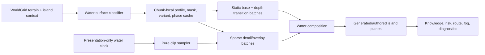

# Wayfinders water-system milestone proposal

Status: proposed standalone milestone. A reviewable source/runtime candidate pack
has been prepared under `assets-src/gr1/water`, but no water asset is registered
or loaded by the game yet. This proposal does not revise the roadmap, technical
design, implementation status, asset-pipeline document, or any other current
milestone document.

## Outcome

Implement a layered, grid-aligned water presentation system that:

- visually belongs beside the current home island and island reference set;
- distinguishes deep, shallow, reef, lagoon, current, rough, and biome-specific
  water without inventing accidental gameplay rules;
- blends continuously under authored and generated islands;
- provides a small presentation-animation foundation that later systems can
  reuse;
- remains deterministic across chunk loading, knowledge redraws, and reloads;
- preserves terrain, collision, navigation, knowledge, provisions, and world
  generation as the only gameplay authorities; and
- retains camera/chunk culling and the existing dirty-water-chunk behavior.

The milestone is complete only when the candidate art has been promoted through
a validated package, static water has replaced the developer fills, sparse
animation runs through a shared presentation clock, and the visual and
performance acceptance gates in this document pass.

## Evidence and current constraints

The proposal is based on the current repository and these art references:

- `dist/assets/gr1/images/home-island.png` is a `480 x 480` RGBA runtime image
  aligned to a `15 x 15` navigation-cell package. It already includes turquoise
  shallows, an irregular shorewash/foam edge, harbor water, rocks, sand, and a
  transparent exterior.
- `assets-src/gr1/island-examples` contains twenty `1254 x 1254` RGB style
  references. Their magenta backgrounds are generation/review aids, not a
  runtime transparency contract. They must never be sampled, keyed, or loaded by
  the game.
- The art style uses dense but readable top-down pixel clusters, warm sand and
  foliage, broken rather than continuous highlights, organic scalloped
  coastlines, and a turquoise-to-navy depth ramp. Water must support the islands,
  not compete with their higher-contrast structures and vegetation.
- `prototypeConfig` defines a `32 px` navigation cell and a `16 px` art cell. One
  navigation cell therefore contains a `2 x 2` art lattice. The separate `8 px`
  hybrid collision lattice is collision authoring only and is not a water-art
  grid.
- World chunks are `32 x 32` navigation cells. Neighbor classification must
  cross chunk boundaries; a seam at a chunk boundary is a correctness failure.
- `TerrainType` currently distinguishes `DeepOcean`, `ShallowOcean`, and
  blocking `Reef`. Currents, rough patches, lagoon calm, glints, and brackish
  color are initially presentation variants, not new terrain.
- `WorldRenderer` currently draws a full-ocean rectangle, per-cell shallow or
  Supported fills, and sparse wave strokes. It separates water and wave layers,
  camera-culls chunk graphics, and redraws only dirty knowledge chunks. The new
  system must preserve those performance properties.
- The authored-home path currently omits water/waves for the entire rectangular
  home footprint. That must be narrowed: water needs to continue behind
  transparent island pixels so the organic alpha edge never exposes a flat
  rectangle or empty background.
- The project has metadata-timed ship/wake presentation, but no shared general
  animation system. Water is the first consumer of the proposed presentation
  clock and clip sampler; it must not become a second simulation clock.

## Visual language

### Palette handoff

Use the island shallows as the fixed handoff point. The water package may vary
within these bands, but the shoreline-facing pixels must converge on the same
turquoise/seafoam family.

| Role | Palette anchor | Rule |
| --- | --- | --- |
| Abyss | `#082f40` | Lowest contrast and least highlight density |
| Open deep water | `#12536a` | Default ocean body; sparse short blue-green glints |
| Lagoon/depth transition | `#2d858b` | Mid-tone bridge; never a hard cyan stripe |
| Coastal shelf | `#4aa1a0` | Turquoise island apron with warm sand influence |
| Shorewash | `#8bd0cf` | Broken, low-opacity edge and ripple accents |
| Pale foam | `#a9d6ad` | Rare brightest water mark; below sand/structure highlights |

Supported, Personal, and Unknown are knowledge states, not water types. Preserve
the Supported cue with a renderer tint/material parameter and preserve
Personal/Unknown through the knowledge overlay. Do not duplicate the entire art
pack for each knowledge state.

### Texture and motion rules

- Keep large areas quiet. Fine mottling may fill the surface, but bright marks
  should occupy only a small fraction of a cell.
- Prefer broken wavelets, short caustic arcs, and irregular reef shadows over
  uninterrupted parallel lines.
- Keep the islands as the focal plane. Deep water should be lower contrast than
  foliage, buildings, docks, rocks, and shoreline foam.
- Do not put a unique focal object in a repeatable base tile. Fish, debris,
  bubbles, birds, or a single large coral head belong in sparse detail overlays.
- Variants may change interior texture and highlight placement, but they must not
  change topology coverage at an edge.
- Motion should read at normal zoom without making the full map shimmer. Freeze
  the base plane by default and animate sparse overlays.
- No magenta key color, premultiplied fringe, opaque transparent RGB, watermark,
  text, horizon, perspective, or directional lighting belongs in runtime water.

## Water taxonomy

The classifier chooses one authoritative terrain class and then zero or more
presentation tags. The tags may change appearance only.

| Visual profile | Authority | Placement | Initial motion | Gameplay meaning |
| --- | --- | --- | --- | --- |
| Abyss | `DeepOcean` | Rare far-water or deliberately deep patches | 3 FPS sparse glint | Same passability/cost as its underlying terrain |
| Deep | `DeepOcean` | Default open ocean | Static base; 3–4 FPS ripple overlay | Existing deep-water behavior |
| Coastal | `ShallowOcean` | One or more cells around island land/reef and home art | Static base; 4–5 FPS caustic/shore accents | Existing shallow-water behavior |
| Lagoon | contextual `ShallowOcean` | Enclosed harbor, cove, atoll interior | Slow 2–4 FPS small reflections | No new rule |
| Reef | exactly `Reef` | Existing reef cells only | 3 FPS caustic/breaker accents | Remains blocking; must be visually unmistakable |
| Current | presentation tag on passable water | Seeded coherent ribbons, never isolated checkerboard cells | 4–7 FPS directional streak | Visual only in this milestone |
| Rough | presentation/weather tag | Exposed or event-selected patches | 5–7 FPS sparse whitecap | Visual only in this milestone |
| Brackish | contextual `ShallowOcean` | Mangrove, marsh, and river-mouth adjacency | 2–3 FPS subdued ripple | No new rule |

Additional sparse overlay details can include seagrass shadow, coral glint, foam,
whitecap, bubbles, or floating debris. None may imply a collision or navigation
rule that the underlying terrain does not have. In particular, do not call a
passable decorative coral patch a reef while `TerrainType.Reef` blocks movement.

### Classification priority

1. Use `WorldGrid` terrain as authority.
2. For `Reef`, always choose the reef-readable base before contextual styling.
3. For `ShallowOcean`, select coastal, lagoon, or brackish from island kind,
   enclosure/harbor context, and a namespaced deterministic value.
4. For `DeepOcean`, select deep by default and abyss only in coherent regions.
5. Apply current/rough/detail tags after the base profile. A tag cannot change
   terrain, cost, collision, or sight.
6. Apply knowledge/risk/route/fog presentation in their existing layers after
   water composition.

## Grid, seams, and transitions

### Runtime cell contract

- Every general water frame displays as exactly `32 x 32` world pixels.
- Compose features around the `16 px` internal art lattice: major caustic bends,
  reef clusters, and transition control points should cross the half-cell lines
  naturally instead of forming a second arbitrary grid.
- Do not align water decoration to the `8 px` collision subgrid.
- Use integer source rectangles and stable sprite origins. Render placement is
  always `tileX * 32`, `tileY * 32` before camera transformation.
- Runtime sheets use a `2 px` duplicated-edge margin and `4 px` spacing between
  frames. The loader must be extended to pass both values. This prevents adjacent
  frame bleed with antialiasing and fractional zoom.
- Validate at minimum zoom `0.65`, default zoom, and zoom `1.7` with the game's
  actual WebGL settings.

### Deep-to-shallow topology

Use a gated eight-neighbor blob mask rather than a four-neighbor-only shoreline.
Bits are:

```text
N=1, E=2, S=4, W=8, NE=16, SE=32, SW=64, NW=128
```

A diagonal bit is retained only if both adjacent cardinal bits are present. That
canonicalization produces 47 masks. The prepared transition sheet stores those
47 masks explicitly through `maskLookup` in `water-package.json`.

```text
canonical = mask & (N | E | S | W)
keep NE only when N and E are set
keep SE only when S and E are set
keep SW only when S and W are set
keep NW only when N and W are set
```

Classification needs a one-cell neighbor apron beyond each chunk. Build masks
from authoritative neighboring terrain, including neighbors owned by another
chunk, then cache the mask. Knowledge changes must not recalculate it.

Depth transitions are a presentation plane between the deep and shallow bases.
Variants may alter interior water texture, but a given mask has fixed edge
coverage. This prevents variant choice from opening pinholes or tearing corners.

### Deterministic variation

Use a visual-only coordinate hash with a fixed namespace, for example:

```text
variant = hash(worldSeed, tileX, tileY, "water-base-v1") % variantCount
phase   = hash(worldSeed, tileX, tileY, "water-phase-v1") % phaseBucketCount
detail  = hash(worldSeed, tileX, tileY, "water-detail-v1")
```

Do not consume `SeededRandom` calls from terrain/island/resource generation.
Changing a visual namespace must change pixels only; a serialized comparison of
terrain, island IDs, resources, collision, and navigation must remain identical.

## Island blending contract

### Authored home island

The home composition has a better organic shore than a coarse tile mask can
produce. Treat it as an authored composition with a water handoff, not as a
rectangle that replaces the ocean.

1. Draw deep/coastal water throughout the home package footprint, including
   behind pixels that will later be covered by opaque island art.
2. Draw generic depth transitions, underwater details, and generic surface
   effects below the home composition.
3. Draw `home.island.primary` at its existing `15 x 15` grid position and depth.
4. Draw only the package-aligned `480 x 480` home shoreline/glint clip above the
   composition. Its top-left, scale, and frame origin must match the home image
   exactly.
5. Never draw coarse generic foam above the home island. Its square/cardinal
   geometry cannot match the baked organic foam edge.

The renderer does not need to sample PNG alpha to decide terrain. It simply
renders the water underlay first and the authored image afterward. Topology,
collision, dock return, and anchors continue to come from package metadata.

### Other authored islands

Adopt the same contract for future packages:

- declare a shared shore-handoff palette;
- provide clean RGBA runtime art rather than magenta-keyed RGB;
- allow water under transparent composition pixels;
- optionally provide a composition-aligned shoreline overlay clip; and
- keep collision/terrain metadata authoritative.

### Generated islands

Generated land, rock, and reef continue to use `WorldGrid` topology. The water
renderer supplies depth masks and generic foam below the terrain/coast plane.
Island kind may choose a contextual palette (high island, cay, atoll, skerry,
mangrove), but it cannot change passability. Atoll entrances and minimum channel
width are regression cases because an attractive transition must never visually
or logically close a passable channel.

## Proposed render architecture



Create a dedicated `WaterRenderer` rather than adding more branches to the
existing developer-art loop. A practical initial chunk record is:

```ts
interface WaterChunkView {
  readonly chunkX: number;
  readonly chunkY: number;
  readonly baseLayer: BatchedWaterLayer;
  readonly transitionLayer: BatchedWaterLayer;
  readonly underwaterLayer: BatchedWaterLayer;
  readonly surfaceLayer: BatchedWaterLayer;
  readonly instances: readonly WaterVisualInstance[];
  knowledgeRevision: number;
}
```

The exact Phaser primitive can be selected during WTR-1.2, but it must batch by
plane/texture and camera-cull by chunk. Do not create one tween, Phaser animation,
or standalone game object per ocean tile.

### Layer order

| Relative order | Plane | Notes |
| ---: | --- | --- |
| 0 | Deep/static water base | Covers the entire world |
| 0.25 | Shallow/depth transitions | Cached topology |
| 0.5 | Reef/seagrass underwater detail | Terrain-readable; below foam |
| 1 | Generic ripple/current/whitecap overlays | Sparse and animation-capable |
| 2–3 | Generated terrain/coast | Existing terrain authority |
| 4.5 | Authored home island | Existing package depth |
| 4.6 | Authored home shoreline overlay | Same transform as home art |
| existing upper depths | Ship/wake, knowledge, risk, routes, fog, diagnostics | Preserve current ordering contracts |

Knowledge refreshes update a tint/uniform or the knowledge-specific presentation
batch for dirty chunks. They do not rebuild terrain masks, variants, phases, or
animation descriptors.

## Animation foundation

### Principles

- Animation is unsaved presentation state.
- Simulation fixed-step time remains authoritative for gameplay; water reads a
  presentation time only.
- A pure function resolves frame state from metadata, time, and a deterministic
  phase. This follows the same separation used by ship animation.
- Update a layer only when its discrete frame advances and only while its chunk
  intersects a camera.
- Pause, scene sleep, tab backgrounding, and resume cannot create gameplay work
  or an animation catch-up loop.
- The system must respond to live `prefers-reduced-motion` changes.

Proposed descriptor:

```ts
interface WaterClipDescriptor {
  readonly id: string;
  readonly imageId: string;
  readonly frameStart: number;
  readonly frameCount: number;
  readonly framesPerSecond: number;
  readonly loop: "loop" | "ping-pong";
  readonly phasePolicy: "tile" | "region" | "global";
  readonly phaseBucketCount: number;
  readonly reducedMotionFrame: number;
  readonly opacity: number;
  readonly validProfiles: readonly WaterProfileId[];
}
```

Frame resolution:

```text
tick  = floor(visualTimeMs * framesPerSecond / 1000)
frame = frameStart + ((tick + phaseBucket) mod frameCount)
```

Use tile phases for disconnected deep glints. Use one region/island phase for
connected surf so adjacent foam does not tear. The home-aligned clip is one
region and must advance as a single frame.

### Initial clip budget

| Clip | Frames | FPS | Phase policy | Default density |
| --- | ---: | ---: | --- | ---: |
| Open ripple/glint | 8 | 3–4 | tile, 4 buckets | 10–15% of visible deep cells |
| Shallow caustic | 8 | 4–5 | tile, 4 buckets | 20–30% of visible shallow cells |
| Current ribbon | 8 | 4–7 | region | Only classified current cells |
| Whitecap | 8 | 5–7 | region/tile | Rare exposed-water patches |
| Reef breaker | 4–8 | 3–5 | region | Reef perimeter only |
| Home shoreline | 8 | 5 | home region/global | One aligned composition clip |

The prepared current source reads west-to-east. Initial implementation may use
four cardinal orientations through 90-degree rotations. Diagonal flow requires
authored diagonal frames; do not rotate a square opaque tile by 45 degrees and
expose corners.

Reduced motion immediately selects each descriptor's representative static
frame, retains terrain/profile contrast, and stops frame updates. It must not
remove shallow/reef readability or alter simulation state.

## Prepared candidate package

The candidate lives at `assets-src/gr1/water` and is intentionally outside the
live catalog until WTR-1.1 establishes validation and promotion rules.

| Candidate file | Dimensions | Contents |
| --- | ---: | --- |
| `runtime/water-tiles.png` | 288 x 1152 | Eight profiles, four variants, eight frames, with gutters |
| `runtime/water-static.png` | 144 x 288 | Reduced-motion/static profile variants |
| `runtime/water-depth-transitions.png` | 1692 x 144 | 47 canonical masks x four phases, with gutters |
| `runtime/water-overlays.png` | 288 x 144 | Glint, caustic, current, and whitecap alpha clips |
| `runtime/water-home-shore-overlay.png` | 3872 x 484 | Eight guttered `480 x 480` home-aligned frames |
| `runtime/water-contact-sheet.png` | 512 x 256 | Profile review board |
| `runtime/water-home-island-preview.png` | 640 x 640 | Home/depth-handoff review composite |
| `water-package.json` | n/a | Proposed profile, sheet, mask, animation, and handoff metadata |
| `runtime/build-report.json` | n/a | Output dimensions and SHA-256 hashes |
| `validate-water-package.mjs` | n/a | Header, hash, frame geometry, mask, seam/loop-report validation |

The five runtime sheets occupy roughly `0.55 MiB` compressed and `9.6 MiB`
decoded RGBA. Source masters and previews are authoring/review files and must not
ship. `build-water-package.mjs` deterministically rebuilds the candidate without
changing `public`, `dist`, or current source files.

The candidate is an art/contract starting point, not automatic approval. WTR-1.1
must review its palette at normal gameplay zoom, animation loops, alpha edges,
and terrain readability before promotion.

## Package and pipeline design

Production semantic ID: `world.water.primary`.

Create a dedicated `WaterAssetContractV1`; water has different topology and clip
metadata from the three current pilot kinds. Register it through the shared
catalog only after generalizing the hard-coded three-package assumptions in:

- `src/wayfinders/assets/AuthoredAssetContracts.ts` or a parallel water contract
  module with an explicit catalog union;
- `src/wayfinders/assets/PilotAssetRuntime.ts`;
- `src/wayfinders/assets/AssetLibraryCatalog.ts` and the viewer category;
- `src/wayfinders/assets/AssetCandidate.ts` image requirements;
- `scripts/asset-pipeline.mjs` package mapping and sheet validation; and
- the generated catalog and package/loader tests.

The accepted manifest must support `frameWidth`, `frameHeight`, `margin`, and
`spacing`; the current loader entry exposes only frame dimensions. Promotion
copies validated assets under `public/assets/...`. Never author `dist` directly.

Validation must reject:

- a sheet whose dimensions do not match its frames, margin, and spacing;
- an unknown/missing profile, duplicate ID, invalid FPS, or out-of-range frame;
- transition lookup sets other than the declared 47 canonical masks;
- transparent sheets with nonzero RGB in fully transparent pixels;
- non-PNG, interlaced, non-8-bit RGB/RGBA, or over-4096-pixel-edge inputs;
- an authored overlay whose frame size/placement disagrees with its target
  island package; and
- any visual package field used as collision, passability, or resource authority.

## Implementation sequence

### WTR-1.1 — Style lock, contract, and promotion gate

Tasks:

- review the candidate contact sheet and home preview at gameplay zoom;
- approve the taxonomy, palette handoff, 47-mask convention, render planes,
  static-base/sparse-overlay policy, clip rates, and budgets;
- add `WaterAssetContractV1`, manifest validation, margin/spacing loader support,
  candidate intake, catalog/viewer representation, and unit tests;
- validate the candidate files and promote the accepted runtime sheets to
  `public/assets/...`; and
- record art/source provenance without treating reference pixels as authority.

Exit gate:

- one accepted `world.water.primary` package loads in the asset viewer;
- every sheet/frame/mask validates; and
- no world renderer or gameplay behavior has changed yet.

### WTR-1.2 — Static chunked water renderer

Tasks:

- add `WaterSurfaceClassifier` and cached per-chunk profile/mask/variant data;
- add a camera-culled, batched `WaterRenderer` with static base, transition,
  underwater, and surface planes;
- use `water-static.png` initially;
- preserve Supported water via tint and preserve existing fog/knowledge layers;
- keep neighbor apron data available across chunk boundaries; and
- add a developer overlay for profile, mask, variant, and chunk inspection.

Exit gate:

- flat developer ocean/shallow fills and wave strokes are replaced;
- a fixed seed produces identical cached classifications on reload and traversal;
- terrain/collision/navigation snapshots remain byte-for-byte unchanged; and
- static rendering performs no full-world work per frame.

### WTR-1.3 — Island handoff and topology polish

Tasks:

- stop omitting water for the full authored-home rectangle;
- render coastal water under the complete home footprint, then draw the current
  island composition above it;
- render generic foam below authored art and the aligned home clip above it;
- integrate the 47-mask depth transitions for every generated island kind;
- verify reefs, atoll entrances, docks, and narrow channels; and
- add screenshot/contact harnesses for 2x2, 3x3, chunk-boundary, and island cases.

Exit gate:

- no rectangle, transparent gap, magenta fringe, generic-foam mismatch, depth
  step, or chunk seam is visible around the home or generated islands at the
  required zooms.

### WTR-1.4 — Shared presentation clock and water clips

Tasks:

- implement a pure water clip/frame resolver with fixed-time tests;
- add one presentation clock/controller owned by the scene;
- update only visible chunk overlay batches when a discrete frame advances;
- add deterministic tile/region/global phase policies;
- integrate glint, caustic, current, whitecap, reef, and home clips at the approved
  densities;
- handle pause, sleep, resume, teardown, world regeneration, and resize; and
- implement live reduced-motion behavior.

Exit gate:

- clips loop without luminance/alpha pops or connected-edge tearing;
- no per-tile tweens/animations or per-frame texture allocations exist;
- reduced motion freezes immediately and preserves readability; and
- animation values cannot reach simulation, collision, or navigation APIs.

### WTR-1.5 — Integration, accessibility, and performance acceptance

Tasks:

- test all knowledge, risk, route, fog, and sight combinations;
- review grayscale/low-saturation terrain readability;
- run the normal typecheck, tests, asset check, and build;
- profile representative sailing, camera movement, chunk boundaries, and tab
  resume; and
- tune densities/FPS only within the approved art and performance budgets.

Exit gate:

- every acceptance criterion below passes and the new package is the default
  runtime water path.

## Acceptance criteria

### Package and grid

- [ ] All runtime sheets are lowercase-safe, validated PNGs with declared sizes.
- [ ] Every general frame is `32 x 32`; authored home frames are `480 x 480`.
- [ ] Every sheet uses and loads with `margin: 2`, `spacing: 4` duplicated gutters.
- [ ] Internal composition respects the `16 px` art lattice and ignores the
      collision-only `8 px` lattice.
- [ ] All 47 canonical masks resolve exactly once and all invalid diagonal masks
      canonicalize predictably.
- [ ] 2x2 and 3x3 repeats show no cracks, frame bleed, one-pixel grid, or obvious
      repeated focal object.

### Island and visual fit

- [ ] Deep, shallow, lagoon, and blocking reef are distinct at normal zoom and in
      grayscale.
- [ ] The home island has water beneath all transparent exterior pixels.
- [ ] The home-aligned overlay uses the exact island transform and never paints
      over land/structures with a visible classification error.
- [ ] Generic foam never appears above the authored home composition.
- [ ] High island, low cay, atoll, rocky skerry, mangrove/marsh, harbor, and narrow
      channel cases have intentional shore handoffs.
- [ ] No source magenta, halo, opaque transparent RGB, or color-key fringe ships.

### Determinism and gameplay isolation

- [ ] A fixed world seed produces identical profile, mask, variant, direction,
      and phase data independent of chunk traversal and knowledge redraw order.
- [ ] A visual namespace change alters no terrain, island ID, resource, collision,
      route, sight, provisions, discovery, dock return, or atoll connectivity data.
- [ ] Current, rough, lagoon, brackish, glint, and whitecap remain visual-only.
- [ ] Reef art maps only to authoritative `TerrainType.Reef` where the visual
      promises blocking reef.

### Animation and accessibility

- [ ] First/last frames loop without a visible luminance, alpha, or position pop.
- [ ] Connected surf/current regions do not tear because of independent phases.
- [ ] Pause/resume and background-tab recovery cause no catch-up spike.
- [ ] Reduced motion freezes all water immediately on representative frames.
- [ ] Supported, Personal, Unknown, current sight, route, and risk overlays remain
      readable with animation on and off.
- [ ] Unknown fog does not reveal hidden terrain through motion at its edge.

### Performance

- [ ] No full-world scan, texture creation, or object allocation happens per
      rendered frame.
- [ ] Static topology rebuilds only on world/terrain/package changes.
- [ ] Knowledge changes retain dirty-chunk-local updates.
- [ ] Animation updates only when a clip advances and only for camera-visible
      chunks.
- [ ] Water uses no more than three normal batches per visible chunk, excluding
      the one authored-home overlay when visible.
- [ ] Shipped water textures remain below `12 MiB` decoded RGBA and `2 MiB`
      compressed payload unless a later reviewed budget replaces these limits.
- [ ] Representative sailing retains the project desktop target of rendered
      frame `p95 <= 20 ms`.

### Repository gate

- [ ] Water-specific validator, mask, deterministic-selection, animation,
      reduced-motion, and renderer lifecycle tests pass.
- [ ] Existing world generation, collision, navigation, knowledge, and authored
      home tests remain unchanged in outcome.
- [ ] `npm run assets:check`, typecheck, tests, and production build pass.
- [ ] Runtime assets are promoted through `public`; generated `dist` is not
      hand-authored.

## Performance budgets and fallbacks

Default quality path:

- static base water;
- cached 47-mask transitions;
- sparse animated overlays;
- one aligned home overlay only when its bounds intersect the camera; and
- discrete 3–7 FPS clip updates rather than continuous per-frame deformation.

Fallback order when profiling exceeds budget:

1. lower overlay density;
2. lower non-shore clip FPS;
3. reduce phase buckets and batch fragmentation;
4. freeze deep glints while retaining shallow/reef/home motion;
5. use `water-static.png` for all generic water while retaining terrain colors;
6. retain only the aligned home shore clip; then
7. use the complete reduced-motion path.

Do not solve performance by weakening fog, terrain readability, collision
authority, deterministic selection, or chunk culling.

## Risks and mitigations

| Risk | Mitigation |
| --- | --- |
| Generic foam fights the baked home shoreline | Keep generic foam below authored art; use only the aligned home clip above it |
| Attractive decorative water implies mechanics | Map mechanics only from `TerrainType`; label visual-only profiles explicitly |
| Checkerboard/boiling motion | Use coherent regions, sparse density, low FPS, and limited phase buckets |
| Chunk seams | Classify with a neighbor apron and test chunk edges directly |
| Atlas bleed at fractional zoom | Ship duplicated 2 px gutters and extend loader margin/spacing support |
| Knowledge redraw rerolls visuals | Cache topology/variant/phase independently of knowledge revisions |
| Animation affects simulation | Keep a pure presentation resolver and prohibit imports into simulation systems |
| Reef becomes hard to read under overlays | Give authoritative reef classification priority and enforce grayscale tests |
| Authored overlay texture exceeds budget | Cull as one home-bounds object; retain a static representative frame fallback |
| AI source texture repeats or contains artifacts | Treat masters as source only; use contact/seam review and deterministic local preparation before promotion |

## Out of scope

- currents changing ship speed, provisions, drift, or path cost;
- storms, tides, flooding, seasonal shorelines, or dynamic water depth;
- reflection, refraction, lighting simulation, shaders, normal maps, or PBR;
- water audio or particle spray;
- new terrain/collision types;
- rewriting island generation or authored collision metadata;
- general-purpose atlas automation beyond the water package fields needed here;
- editing existing roadmap or milestone documents; and
- hand-authoring generated `dist` output.

Any of those can consume this presentation foundation later, but each gameplay
change requires its own authority, tests, and milestone approval.

## Definition of done

The water milestone is done when the accepted package is loaded through the
validated catalog; the chunked renderer uses static grid-aligned base/transition
art; authored and generated islands have clean water handoffs; the shared
presentation clock drives only sparse visible effects and the aligned home clip;
reduced motion and knowledge overlays work; all visual, deterministic, gameplay,
pipeline, memory, and frame-time gates pass; and no existing milestone document
needed to be rewritten to describe the result.
